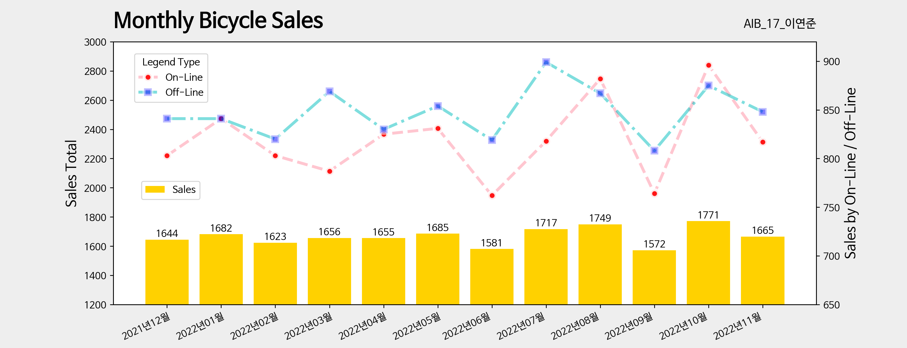

{: .align-center width="70%"}  


# [코드스테이츠](https://www.codestates.com/)와 함께하는 'AI 부프캠프' 1주차

## 전반적 회고

코드스테이스에서 AI 부트캠프 17기에 합류하여 첫주간을 보냈다.  
혼자서 2~3개월 코딩을 공부하며 느꼈던 <mark>혼란스러움을 부트캠프 안에서 정리</mark>할 수 있는 한 주였다.  

캠프에서는 첫 주를 Section 1, Sprint 1라고 불렀다.  
Section1은 개념학습 기간이다. 약4주 동안 데이터분석을 위한 주요개념을 학습하는 기간이다.  
Section 가운데 한 주간을 Sprint라고 부르는데, Section 1, Sprint 1은 '개념학습 기간의 첫 주간'을 의미한다.  

- Sprint 1 기간 : 2022.12.09.(금) ~ 15.(목)

첫 주간, 곧 Sprint 1에서는 데이터분석을 위한 주료 라이브러리(Pandas, Numpy, Matplotlib) 사용법을 중심으로 학습하였다.  
특히 본격적인 데이터분석에 들어가기에 앞서 `'탐색적 데이터 분석(Exploratory Data Analysis: EDA'`을 진행하는 이유와 방법에 대하여 중점적으로 학습하였다.  

## 학습내용
### 미니프로젝트 : 거래유형(온/오프라인)에 따른 자전거 거래량 변화

#### 월 : 범주형 데이터 만들기
거래 유형에 따른 월별 자전거 거래량변화를 알아보려고 한다.
먼저 주어진 데이터에서는 2000-00-00 이렇게 스트링으로 날짜 데이터가 주어져있다.  
이러한 스트링 날짜 데이터에서 월별 변수를 반드는 방법은 .to_datetime()를 이용하면 된다.  
```python
transaction['trans_month'] = pd.to_datetime(transaction['transaction_date'])
```
데이터 타입이 dtype: datetime64[ns] 으로 바뀌었다. 22-09-2022 하지만 아직 이러한 형태의 날짜데이터이다. 여기서 월을 추출하려면 .dt.month 메써드를 이용한다.
```python
transaction['trans_month'] = transaction['trans_month'].dt.month
```
이제 1~12 의 월로 바뀌었고, 데이터타입도 dtype: int64 로 바뀌었다.
하지만 주어진 데이터에서 월 데이터는 2021년 12월 부터 2022년 11월까지의 데이터이다. 그렇기 때문에 "20xx년11월" 이런 식으로 만들어줄 필요가 있다. 그래서 간단히 슬라이싱을 이용해서 스트링타입으로 만들어주는 것이 더 좋을 것 같다.
```python
transaction['transaction_month'] = transaction['transaction_date'].str.slice(6,11) + '년' + transaction['transaction_date'].str.slice(3, 5) + '월'
```
원래의 스트링에서 년도에 해당하는 스트링을 슬라이싱해주고, 월에 해당하는 스트링을 슬라이싱해주어 사이에 '년'과 '월'을 추가해주었다.
```python
transaction['transaction_month'].value_counts()
```
```
2022년10월    1771
2022년08월    1749
2022년07월    1717
2022년05월    1685
2022년01월    1682
2022년11월    1665
2022년03월    1656
2022년04월    1655
2021년12월    1644
2022년02월    1623
2022년06월    1581
2022년09월    1572
Name: transaction_month, dtype: int64
```
.sort_index()를 사용하면 인덱스가 정렬된다.
```python
transaction['transaction_month'].value_counts().sort_index()
```
```
2021년12월    1644
2022년01월    1682
2022년02월    1623
2022년03월    1656
2022년04월    1655
2022년05월    1685
2022년06월    1581
2022년07월    1717
2022년08월    1749
2022년09월    1572
2022년10월    1771
2022년11월    1665
Name: transaction_month, dtype: int64
```

#### 거래유형(온/오프라인)에 따른 월 별 자전거 거래량 변화 시각화

{: .align-center width="90%"} 


<br><br><br><br>  
<center>  
<h1>끝까지 읽어주셔서 감사합니다😉</h1>  
</center>  
<br><br><br><br>  