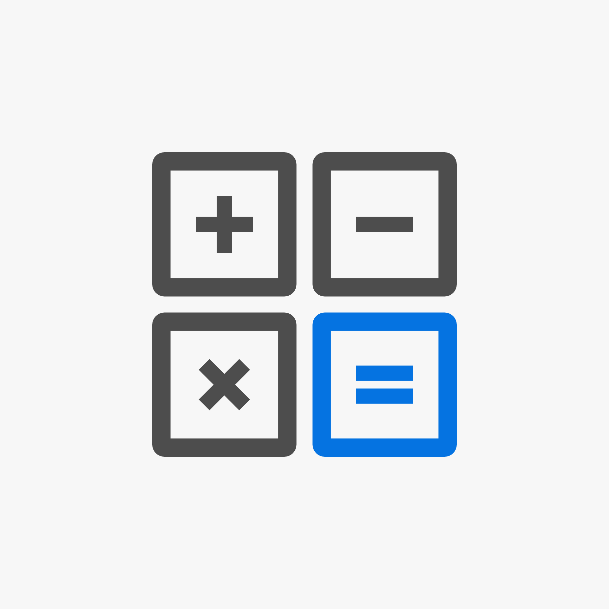
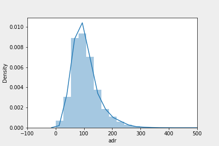
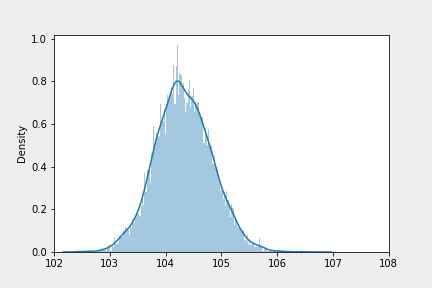

{: .align-center width="50%"} 


# [코드스테이츠](https://www.codestates.com/)와 함께하는 'AI 부프캠프' 2주차

## 전반적 회고
> 코드스테이츠 AI부트캠프 AIsection1 sprint2 과정에 참여하여 데이터분석을 위한 기초적인 학습, 곧 확률을 활용한 **기초적인 추리통계**를 공부하였다.  
이미 알고 있었던 통계의 개념을 다시 한번 정립하여 명확히 할 수 있어서 성취감을 느꼈고, 데이터분석을 위한 실무적인 연습도 할 수 있어서 뿌듯했다.  
또한 베이지안 정리를 통한 사후확률의 개선을 통하여 인공지능을 구현할 수 있을 것이라는 것에 <mark>도전의식과 더 공부해보고 싶다는 마음</mark>이 생겼다.  
공부를 할수록 모르는 것이 생기고, 또 모르는 것에 대한 도전의식이 생겨서 더 열심히 공부하게 되었다.  
어려워보이는 코드나 수식에 당황하지 말고 일단 `참여`해보자. 그러면 그제서야 내가 정말 모르는 부분이 보이고, 그 모르는 부분을 걷어내면서 공부할 수가 있다. 복잡한 코드, 수식, 영어 레퍼런스에 당황해하지 말고 일단 그것에 빠져보자.  

## 학습내용
### 학습 기간
- Sprint 2기간 : 2022.12.16.(금) ~ 22.(목)

### 확률과 베이지안 정리
#### 몬티홀 문제를 통한 사후확률 계산하기
- 진행자가 염소가 있는 문을 열었을 때, 우리가 먼저 선택했던 문 안에 자동차가 있을 확률
>P(H | E) = P(E ⋂ H) / P(E)  
&nbsp;&nbsp;　　　= P(E | H) * P(H) / P(E ⋂ H) + P(E ⋂ ^H)  
&nbsp;&nbsp;　　　= P(E | H) * P(H) / P(E | H) * P(H) + P(E | ^H) * P(^H)  
- 사전확률 : 선택한 문 뒤에 자동차가 있을 확률
  - P(H) = 1/3
- 데이터 : E = 진행자가 염소가 있는 3번째 문을 열어 보여줌
  - 먼저 선택했던 문 뒤에 자동차가 있는데, 진행자가 염소가 있는 문을 열어 보여줄 확률
    - P(E | H) = 1/2
  - 먼저 선택했던 문 뒤에 자동차가 없는데, 진행자가 염소가 있는 문을 열어 보여줄 확률
    - P(E | ^H) = 1/2
- 사후확률
  - P(E | H) * P(H) / P(E | H) * P(H) + P(E | ^H) * P
  - ( 1/2 * 1/3 ) / ( 1/2 * 1/3 + ( 1 - 1/3 ) * 1/2 )
  - = 0.333...
- 선택을 바꾸지 않으면 자동차를 받을 확률이 1/3이고, 선택을 바꾸면 3/2가 되어, 선택을 바꾸는 것이 더 유리하다

```python
def posterior(prio, pos_prob, nag_prob):
  """ 사후확률 계산 함수
  prio : 사전확률,
  pos_prob : 사전조건이 긍정일 때 확률,
  nag_prob : 사전조건이 부정일 때 확률
  """
  posterior = (pos_prob * prio) / (pos_prob * prio + (1 - prio) * nag_prob)
  return posterior
```

### 추리통계를 위한 주요개념들
#### 중심극한정리
- 모집단의 분포에 상관없이 임의의 분포에서 추출된 표본들의 평균 분포는 정규분포를 이룬다
> 한쪽으로 치우친, 정규분포가 아닌 모집단의 분포  
{: .align-center width="70%"}  

> 부트스트래핑으로 추출된 표본이 정규분포를 이루고 있는 모습  
{: .align-center width="70%"}  


### 가설검정
- 가설을 세우고, 가설에 적절한 테스트를 실행
#### 카이제곱검정
- 동질성 검정: '변인의 분포가 이항분포나 정규분포와 동일하다'라는 가설을 설정한다. 이는 어떤 모집단의 표본이 그 모집단을 대표하고 있는지를 검증하는 데 사용한다.(적합도 검정, one-way)
  - 하나의 범주형 변수
- 독립성 검정: 변인이 두 개 이상일 때 사용되며, 기대빈도는 '두 변인이 서로 상관이 없고 독립적'이라고 기대하는 것을 의미하며 관찰빈도와의 차이를 통해 기대빈도의 진위여부를 밝힌다.
  - 둘 이상의 범주형 변수
- 카이제곱 동질성 검정 예시
>H0 : City Hotel과 Resort Hotel의 예약 취소자 빈도는 동일하다.  
H1 : City Hotel과 Resort Hotel의 예약 취소자 빈도는 동일하지 않다.
```python
# City Hotel과 Resort Hotel의 예약 취소 데이터프레임 생성
cross_df = pd.crosstab(hotel.is_canceled, hotel.hotel,  margins=True)

# 기대빈도 생성
cross_df.loc['f_exp'] = [
    cross_df.loc[1, 'All'] * (cross_df.loc['All', 'City Hotel'] / cross_df.loc['All', 'All']),
    cross_df.loc[1, 'All'] * (cross_df.loc['All', 'Resort Hotel'] / cross_df.loc['All', 'All']),
    0
    ]
cross_df.drop(index=[0,'All'], columns='All',inplace=True) # 필요없는 행열 삭제
print(cross_df) # index=1 : 예약 취소 관측빈도 / index=f_exp : 예약 취소 기대빈도

chi_result = stats.chisquare(f_obs=cross_df.loc[1], f_exp=cross_df.loc['f_exp'])
print('chi_test : statistic=%.3f, pvalue=%.3f'%(chi_result))

# pvalue < 0.05 때문에 귀무가설 기각, 'City Hotel과 Resort Hotel의 예약 취소자 빈도는 동일하지 않다'는 대립가설 받아들임
```

#### z-test
- Z-테스트는 분산 σ2(또는 표준편차)를 이미 알고있는 모집단 분포의 평균과 샘플(표본)과의 두 평균을 테스트한다.
  - 이상변수 - 빈도
> 예시  
H0 : 높은 객실료 집단의 평균 취소율은 낮은 객실료 집단의 평균 취소율보다 더 낮거나 같다.
H0 : 높은 객실료 집단의 평균 취소율은 낮은 객실료 집단의 평균 취소율보다 더 높다.
```python
nobs_hi_adr = hi_adr.shape[0]
nobs_lo_adr = lo_adr.shape[0]

print('높은 객실료 집단의 평균 취소율 = %.3f'%(hi_adr.is_canceled.mean()))
print('낮은 객실료 집단의 평균 취소율 = %.3f'%(lo_adr.is_canceled.mean()))

count_hi_adr = hi_adr.is_canceled.sum()
count_lo_adr = lo_adr.is_canceled.sum()

z_stats = sm.stats.proportions_ztest([count_hi_adr, count_lo_adr], [nobs_hi_adr, nobs_lo_adr], alternative='larger')

print("""
H0 : 높은 객실료 집단의 평균 취소율은 낮은 객실료 집단의 평균 취소율보다 더 낮거나 같다.
H0 : 높은 객실료 집단의 평균 취소율은 낮은 객실료 집단의 평균 취소율보다 더 높다.
Z-score  = %.3f
P-value  = %.3f
"""%(z_stats))

if z_stats[1] < 0.05:
  print('pvalue < 0.05 이므로 대립가설을 받아들여, 높은 객실료 집단의 평균 취소율은 낮은 객실료 집단의 평균 취소율보다 더 높다고 볼 수 있다.')
else:
  print('pvalue >= 0.05 이므로 귀무가설을 받아들여, 높은 객실료 집단의 평균 취소율은 낮은 객실료 집단의 평균 취소율보다 더 낮거나 같다.')
```

#### t-test
- t-테스트를 사용하여 두 데이터 세트(집단)의 평균이 서로 유의하게 다른지 여부를 판별할 수 있다.
  - 두 집단의 평균 비교

#### ANOVA
- 두 개 이상 다수의 집단을 서로 비교
  - 둘 이상 집단의 평균 비교

### AB테스트
- A그룹과 B그룹의 차이를 데이터 중심의 통계적 방법을 통하여 검정

## 추가적으로 공부해야 할 내용
- 가설검정의 종류가 다양한데, 어떤 경우에 어떤 가설검정을 해야 하는지 알아보고, 충분한 연습이 필요
  - chi-squared test
    - 동질성 검정 : 변수의 분포가 모집단의 분포와 동일한지, 곧 표본이 모집단을 대표하는지를 검정
    - 독립성 검정 : 두 변인이 서로 독립적인지, 관찰빈도와 기대빈도를 통하여 검정
  - t-test
    - One sample
      - 이항변수 / 스칼라
      - ttest_1samp()
    - Two sample
      - 이항변수 / 연속변수
      - ttest_ind()
  - z-test
    - 이항변수 / 이항변수
  - f-test
    - 일원분산분석(One-way ANOVA)
      - 다항변수 / 연속변수
    - 이원분산분석(two-way ANOVA)
      - 다항변수*2 / 연속변수
- 충분한 표본이란?
  - [옵티마이즐리](https://www.optimizely.com/sample-size-calculator/?effect=20&significance=95#/?conversion=3&effect=20&significance=95)에서 계산할 수 있음
    - MDE(Minimum Detectable Effect)란?
      - 목표를 구현하기 위한 <mark>최소한의 효과크기</mark>
      - 감지할 수 있는 <mark>가장 작은 개선을 추정하는 계산</mark>
    - MDE구하는 예
      - 어떤 보험회사가 매년 730,000건의 예약을 받고, 매년 25,000건의 보험을 더 판매해야 손익분기점에 도달할 수 있다고 하자
      - 이때 매년 더 판매해야하는 25,000건은 전체730,000건의 3.4%이다.
      - 곧 **회사의 매출이 매 년 3.4% 성장해야 손익분기점**에 이를 수 있다는 것이다.
      - 이와 같은 상황일 때 **3.4% 가 MDE**가 될 수 있다.
- 자유도 ( Degree of Freedom, DoF)
  - 모집단의 정보를 주는 독립적인 표본 자료의 수

- DDOF (Delta Degree of Freedom, DDoF)
  - 자유도 = 표본의 수 (N) - DDOF 


<br><br><br><br>  
<center>  
<h1>끝까지 읽어주셔서 감사합니다😉</h1>  
</center>  
<br><br><br><br>  