{: .align-center width="50%"} 

# [코드스테이츠](https://www.codestates.com/)와 함께하는 'AI 부프캠프' 3주차

  

## 전반적 회고🎈
> 코드스테이츠 AI부트캠프 AIsection1 sprint3 과정에 참여하여 머신러닝을 위한 기초적인 공부(선형대수, 차원축소, 경사하강법)와 실습(PCA, 클러스터링)을 진행하였다.  
고등학교수학과정이 나와서 당황했다. 손으로 계산하는 것은 어느정도 할 수 있겠는데, 코드로 구현하려니 많이 어색했다. 하지만 꾸준하게 라이브러리를 활용하여 계산하니 많이 익숙해져서 편한느낌, <mark>내 것이 된 느낌</mark>이 들었다.  
고등학교 수학과정에서 배웠던 내용들이 많이 나왔다. 그리고 직접 수학공식을 활용하니 점점 익숙해지고, 수학공식이 내것이 된 느낌이었다. 아는 것에서 만족하지 않고 익숙해져서 내것으로 만들어야겠다.  
다양한 라이브러리들이 편리한 기능을 제공한다. 그 편리한 기능에 익숙해져야겠다. 어떤 라이브러리들이 있는지 살피고, 꾸준하게 실습하면서 익숙해지면, 비로소 그 기능들이 내것이 될 것이다.

  

## 학습내용📝
### 학습 기간
- Sprint 2기간 : 2022.12.23.(금) ~ 29.(목)

### Linear Algebra
- python의 list와 numpy의 array의 차이
  - list : 수치적 연산이 불가능
  - array : 수치적 연산이 가능

- Scalar : 숫자
- Vector : 순서를 갖는 1차원 형태의 배열
  - 벡터의 크기 : 벡터의 길이, Norm, length, Magnitude
  - 벡터의 내적 : Dot Product, 곱하고더하고
  - 벡터의 직교 : 내적이  0
  - 단위 벡터 : Unit Vector, 길이가 1인 벡터
- Matrix : 행과 열
  - 행렬의 전치 : Transpose
    - $A^T$
    - $(A^T)^T=A$ 
    - [`np.transpose()`](https://numpy.org/doc/stable/reference/generated/numpy.transpose.html)
  - 행렬곱(Matrix Multiplication)
    - [`np.matmul()`](https://numpy.org/doc/stable/reference/generated/numpy.matmul.html)
  - 정사각 행렬(Square Matrix)
    - 행과 열이ㅡ 수가 동일한 메트릭스
  - 대각 행렬(Diagonal Matrix)
    - 주 대각선(principal diagonal)을 제외한 모든 성분이  0 인 정사각 행렬
    > $D =
\begin{bmatrix}
a_{1,1} & 0 & 0 \\
0 & a_{2,2} & 0 \\
0 & 0 & a_{3,3} 
\end{bmatrix}$
  - 단위 행렬(Identity Matrix)
    - 대각 행렬 중에서 주 대각선 성분이 모두  1 인 매트릭스
    - [`np.identity()`](https://numpy.org/doc/stable/reference/generated/numpy.identity.html) 또는 [`np.eye()`](https://numpy.org/devdocs/reference/generated/numpy.eye.html)
  - 역행렬(Inverse)
    - 임의의 정사각 행렬에 대하여 곱했을 때 단위 행렬이 되도록 하는 행렬
    - $A^{-1}$
    - [`np.linalg.inv()`](https://numpy.org/doc/stable/reference/generated/numpy.linalg.inv.html)
  - 행렬식(Determinant)
    - 정사각 행렬 $A$에 대해서 det($A$) 또는 $|A|$로 표기
    - [`np.linalg.det()`](https://numpy.org/doc/stable/reference/generated/numpy.linalg.det.html)
    - 행렬식이  0 이면 역행렬이 존재하지 않음
- Span
  - 주어진 두 벡터의 조합으로 만들 수 있는 모든 가능한 벡터의 집합
  - 두 벡터가 선형 독립이면 2차원 span
  - 세 벡터가 선형 독립이면 3차원 span
  - 선형독립인 두 벡터(빨강, 초록)으로 만들 수 있는 벡터(파랑)들의 공간(연두)   
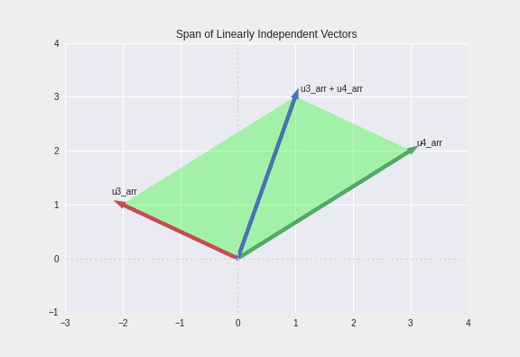{: .align-center width="70%"}  

- Rank  
  - 공간(span)의 차원  
  - 아래는 3개의 행벡터로 이루어져 있지만 하나의 벡터(보라)가 다른 두 벡터(초록, 파랑)의 span에 종속되어 있어서 결과적으로 rank는 2, 곧 3개의 벡터가 2차원 공간을 이루는 모습
  - 빨강, 초록, 파랑의 평면 삼각형을 이룸  
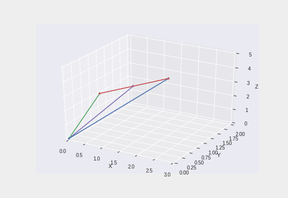{: .align-center width="70%"}  
  
 

### PCA

#### 공분산과 상관계수
- 분산(Variance)
    - 데이터가 흩어져 있는 정도를 하나의 값으로 나타낸 것  
    - 데이터가 서로 멀리 떨어져 있을수록 분산의 값이 커짐  
    - 편차 제곱의 평균  
  - > $\sigma^2 = \frac{\sum{(X_{i} - \overline{X})^{2} } }{N} $ where $\ $ $X_i$:관측값 , $\bar{X}$:평균 , $N$: 관측값 개수  

  - [df.var()](https://pandas.pydata.org/docs/reference/api/pandas.DataFrame.var.html) 또는 [`np.var()`](https://numpy.org/doc/stable/reference/generated/numpy.var.html)  
  - 편차 = (관측값) - (평균)  
  - 편차의 합은 항상  0 이기 때문에 편차의 평균도 항상  0  

- 공분산(Covariance)  
  - 공분산의 값이 크다면 두 변수 간의 연관성이 크다고 해석할 수 있다!  
  - 하지만 분산은 데이터의 스케일에 영향을 많이 받기 때문에 값이 크다고해서 무조건 연관성이 크다고 할 수 없다.  
  - <mark>연관성이 적더라도 큰 스케일을 가지고 있다면 연관성이 높지만 작은 스케일을 가진 변수들에 비해서 높은 공분산</mark> 값을 가지게 된다.

- 분산-공분산 행렬(variance-covariance matrix)
  - 모든 변수에 대하여 분산과 공분산 값을 나타내는 정사각 행렬
    - 주 대각선 성분은 자기 자신의 분산 값
    - 주 대각선 이외의 성분은 가능한 두 변수의 공분산 값
  - [`df.cov()`](https://pandas.pydata.org/docs/reference/api/pandas.DataFrame.cov.html) 또는 [`np.cov()`](https://numpy.org/doc/stable/reference/generated/numpy.cov.html)  

- 상관계수(Correlation coefficient)
  - 공분산을 두 변수의 표준편차로 나눠준 값
  > $r_{x, y} = \frac{cov(X,Y)}{\sigma_{X}\sigma_{Y} }$
  - 공분산의 스케일을 조정하는 효과
  - 변수의 스케일에 영향을 받지 않음
  - -1에서 1 사이의 값을 가짐
  - 상관계수가 1이라는 것은 한 변수가 다른 변수에 대해서 완벽한 양의 선형 관계를 갖고 있다는 것을 의미

  - [df.corr()](https://pandas.pydata.org/docs/reference/api/pandas.DataFrame.corr.html) 또는 [np.corrcoef()](https://numpy.org/doc/stable/reference/generated/numpy.corrcoef.html)  

  - numpy를 사용하는 경우 df를 transpose 한 이유 [[공식문서 numpy.corrcoef]](https://numpy.org/doc/stable/reference/generated/numpy.corrcoef.html)
    - numpy.corrcoef(x, y=None, rowvar=True, bias=<no value>, ddof=<no value>, *, dtype=None) 
      - Parameters
        - rowvarbool, optional
          - If rowvar is True (default), then each row represents a variable, with observations in the columns. Otherwise, the relationship is transposed: each column represents a variable, while the rows contain observations.
            - rowvar 파라미터는 기본값이 `True`로 되어있음
            - 곧, 각 행이 변수, 열이 관측값이라는 뜻
            - 반대(`False`)이면 전치(transpose) 됨

#### 선형대수(Linear Algebra)
- Vector Transformation
    - 벡터의 변환은 벡터와 행렬  T 의 곱
    - np.matmul(메트릭스, 벡터)  
- Eigenstuff
    - Eigenstuff는 np.linalg.eig()을 사용하여 구할 수 있음
    - np.linalg.eig() 으로 만들어진 eigenstuff는 2개의 배열을 갖음
    - 첫번째 배열은 Eigenvalue, 두번째 배열은 Eigenvector
    - Eigenvalue 의 인덱스, Eigenvector 의 column이 쌍을 이루는 eigenstuff 가 됨
    - eigenstuff 는 주어진 메트릭스의 column 갯수 만큼 생성 됨
- 고유벡터 Eigenvector
    - 주어진 transformation에 의해서 크기만 변하고 방향은 변하지 않는 벡터
    - 정방행렬 A에 대하여 Ax = λx  (상수 λ) 가 성립하는 0이 아닌 벡터 x가 존재할 때 상수 λ 를 행렬 A의 고유값 (eigenvalue), x 를 이에 대응하는 고유벡터 (eigenvector) 라고 함
    - Eigenvector 는 크기가 1인 단위벡터
- 고유값 Eigenvalue
    - Eigenvector의 변화한 크기 값

#### 주성분 분석(Principal Component Analysis, PCA)  
- 주성분분석
  - 원래 데이터의 정보(분산)를 최대한 보존하는 새로운 축을 찾고, 그 축에 데이터를 사영(Linear Projection)하여 고차원의 데이터를 저차원으로 변환하는 기법
  - 주성분(PC)은 기존 데이터의 분산을 최대한 보존하도록 데이터를 projection 하는 축
  - PC의 단위벡터는 데이터의 공분산 행렬에 대한 eigenvector
  - eigenvector에 projection한 데이터의 분산이 eigenvalue
  - Feature Extraction 방식 중 하나
  - 기존 변수의 선형결합으로 새로운 변수(PC)를 생성
- PCA가 필요한 이유
  - 고차원의 문제(The Curse of Dimensionality; 차원의 저주)
    - sns.pairplot()
  - 비효율성, Overfitting(과적합)
  - 차원 축소(Dimensionality Reduction)
  - Feature selection
    - 데이터셋에서 덜 중요한 feature는 제거하는 방법
    - 분석 목적에 적합한 소수의 기존 feature를 선택
    - feature의 해석이 쉽다는 장점 
    - feature 간 연관성을 직접 고려해야
  - Feature extraction
    - 기존 feature를 조합하여 사용
    - feature 간 상관관계를 고려하여 조합
    - 새로운 feature가 추출(생성)  
    - 원래 변수들의 선형결합으로 이루어짐
    ex) 집값 데이터셋에서 `집 면적`, `방 개수`, `화장실 개수`를 나타내는 변수를 조합하여 `크기`라는 하나의 변수를 사용 
    - feature의 해석이 어려움 
    - feature 수를 많이 줄일 수 있음   

#### PCA 순서
- EDA
- 데이터 표준화
- 공분산 행렬 구하기
- Eigensruff 구하기
- Projection Data to Eigenvector

#### sklearn 을 활용한 PCA

#### Scree Plots
- scree plots을 활용해 주성분의 갯수 결정
    - 아래 그림에서 주성분이 두개가 되었을 때 누적분산이 88.2%가 되어 적절한 값으로 보임
    - 일반적으로 누적분산이 70~80% 이상이면 적절하다고 여겨짐

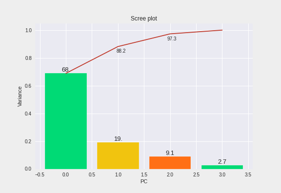{: .align-center width="70%"}  

- 두 개의 주성분으로 만든 산점도
    - X축은 첫번째 주성분, Y축은 두번째 주성분

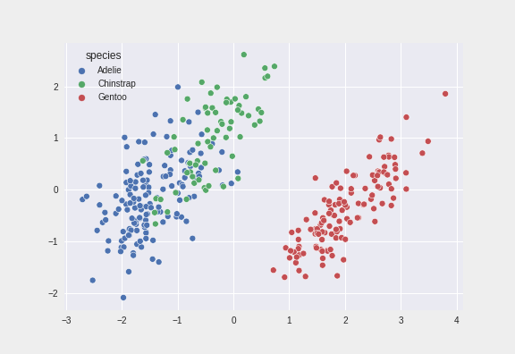{: .align-center width="70%"}  

- 세 개의 주성분으로 만든 산점도
    - 첫 번째 주성분(PC1), 두 번째 주성분(PC2), 세 번째 주성분(PC3)
    - 세 번째 주성분은, 2D로 표현한 좌표평면의 산점도보다, chinstrap 펭귄의 위치를 더욱 입체적으로 구분할 수 있게 해준다.

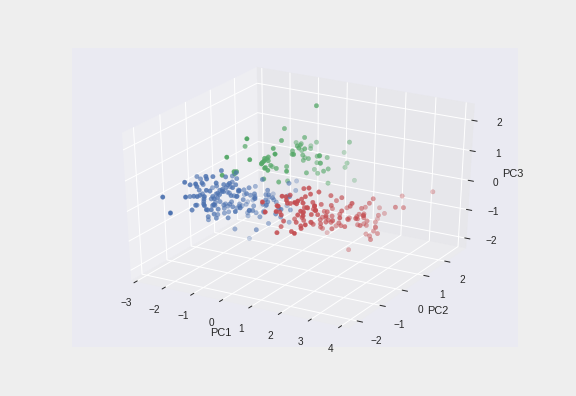{: .align-center width="70%"}  

 

### Clustering

- 데이터 사이의 거리 계산하는 방법들
   - [Euclidean Distance](https://www.cuemath.com/euclidean-distance-formula/)
   - [Cosine Similarity](https://www.learndatasci.com/glossary/cosine-similarity/)
   - [Jaccard Distance](https://www.statology.org/jaccard-similarity/)

- Hierarchical Clustering Dendrogram  
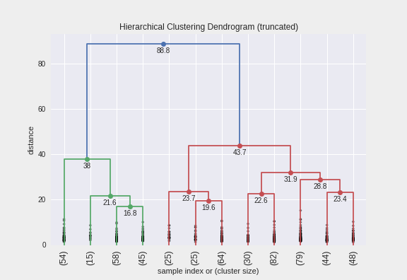{: .align-center width="70%"}  
   
- 실제자료, K-Means Clustering, Hierarchical Clustering 비교  
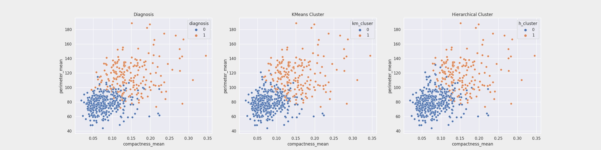{: .align-center width="90%"}  

- diagnosis - K Means cluser 결합 비율      = 93.5%
- diagnosis - Hierarchical cluser 결합 비율 = 91.9%
- K-Means Clustering이 근소하게 결합률이 높음

 

### 미분, 경사하강법(Gradient Descent)

- 일반적인 미분 공식  
$$f'(x) = {f(x + \Delta x) - f(x) \over \Delta x}, \Delta x \rightarrow 0$$

- $\Delta x$는 0이 올 수 없기 때문에 0에 매우 근접한 값을 사용하게 됨
- 보통 $\Delta x$는 $1e-5$가 자주 사용됨
- 이렇게 $\Delta x$로 0에 근접한 수 $(1e-5)$를 사용하는 경우 이를 `numerical method`라고 표현함
- `numerical method`에서는 조금 더 정확한 측정을 위해 다음과 같이 계산
$$f'(x) = {f(x + \Delta x) - f(x - \Delta x) \over 2\Delta x}$$

##### 미분공식
###### 기본 미분공식
-  $y = c$ (c는 상수) $ \rightarrow $ $  y' = 0$  
-  $y = x^n$ (n은 자연수) $ \Rightarrow $ $  y' = nx^{n-1}$  
-  $y = cf(x)$ (c는 상수) $ \Rightarrow $ $  y' = cf'(x)$  
-  $y = f(x) \pm g(x)$ $ \Rightarrow$ $  y' = f(x) \pm g(x)$ (복부호 동순)  
-  $y = f(x)g(x)$ $ \Rightarrow$ $  y' = f'(x)g(x) + f(x)g'(x)$ (곱셈법칙)  
-  $y = f(x)g(x)h(x)$ $ \Rightarrow$ $  y' = f'(x)g(x)h(x) + f(x)g'(x)h(x) + f(x)g(x)h'(x)$  
-  $y = f(g(x))$ $ \Rightarrow$ $  y' = f'(x)g'(x)$ (연쇄법칙)  

- 지수함수  
  - $y = e^x $ $\Rightarrow$ $  y' = e^x$  
  - $y = a^x $ $\Rightarrow$ $  y' = a^x \ln a$ $(단, a>0,\ a \neq 1)$  
- 로그함수  
  - $y = \log{x}$ $\Rightarrow$ $y' = { {1} \over {x} } $  

###### 선형조합법칙

- $y = cf(x) + cg(x)  ⇒  y' = cf'(x) + cg'(x)$

###### 곱셈법칙

- $y = f(x)g(x)  ⇒  y' = f(x)g'(x) + f'(x)g(x)$

- 예시 : $y = xe^x  ⇒  y' = xe^x + e^x$

###### 연쇄법칙 chain rule
- $y = f(g(x))$ $ \Rightarrow$ $  y' = f'(g)g'(x)$
- 예 : 정규분포의 확률밀도함수
  - $y = \exp { {(x - \mu)}^2 \over {\sigma}^2 }$
  - 위 함수는 다음과 같은 구조임
    - $y = f(g(h(x)))$
    - $f(g) = \exp(g)$
    - $g(h) = {h^2 \over {\sigma}^2}$
    - $h(x) = x - \mu$
  - 연쇄법칙을 적용하면 다음과 같음
    - $y' = f'(g)\cdot g'(h)\cdot h'(x)$
    - $f'(g) = \exp(g) = \exp { {(x - \mu)}^2 \over {\sigma}^2 }$
    - $g'(h) = {2h \over {\sigma}^2} = {2(x - \mu) \over {\sigma}^2}$
    - $h'(x) = 1$
    - $y' = \exp { {(x - \mu)}^2 \over {\sigma}^2}\cdot {2(x - \mu) \over {\sigma}^2}\cdot 1$

- 예 : 로그함수
  - $y = \log(x^2 - 3k)$
    - $y' = {1 \over (x^2 - 3k)} \cdot 2x = {2x \over (x^2 - 3k)}$

##### 2차 도함수
- 도함수를 한 번 더 미분하여 만들어진 함수를 **2차 도함수(second derivative)**라고 한다.

##### 편미분
- 만약 함수가 둘 이상의 독립변수를 가지는 다변수 함수인 경우에도 미분 즉, 기울기는 하나의 변수에 대해서만 구할 수 있다. 이를 **편미분(partial differentiation)**이라고 한다.
- 편미분을 하는 방법은 변수가 하나인 함수의 미분과 같다. 다만 어떤 하나의 독립 변수에 대해 미분할 때는 다른 독립 변수를 상수로 생각하면 된다.

##### 테일러 전개
- 함수의 기울기(1차 미분값)를 알고 있다면 함수의 모양을 다음처럼 근사화할 수 있다. x0는 함수값과 기울기를 구하는 x 위치이며 사용자가 마음대로 설정할 수 있다.  
  - $f(x) \approx f(x_0) + {df(x_0) \over dx}(x - x_0)$
- 이를 **테일러 전개(Taylor expansion)**라고 한다. 다변수 함수의 경우에는 다음처럼 테일러 전개를 한다.
  - $f(x,y) \approx f(x_0,y_0) + {\partial df(x_0,y_0) \over \partial dx}(x - x_0) + {\partial df(x_0,y_0) \over \partial dx}(y - y_0)$

##### 미분결과 시각화
- $f(x) = e^x$ 의 그래프  

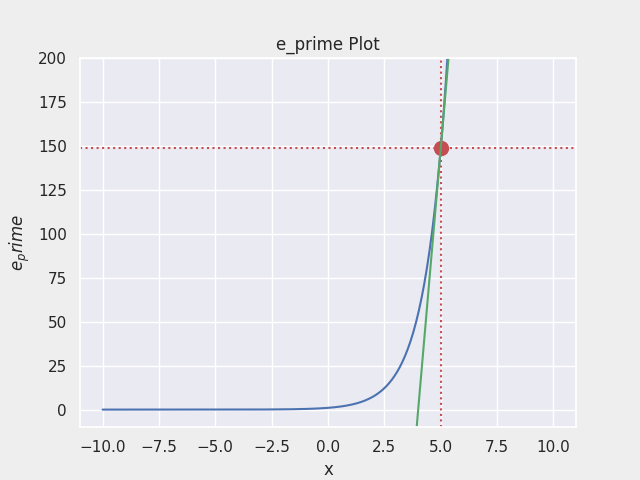{: .align-center width="70%"}  

- $f(x) = lnx$ 의 그래프  

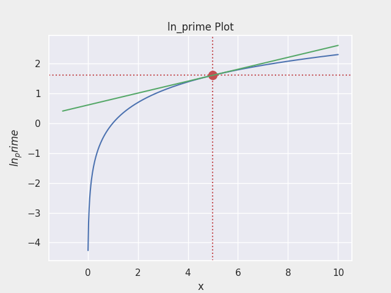{: .align-center width="70%"} 

- $f(x) = 2x^2 + 8x$ 의 그래프  

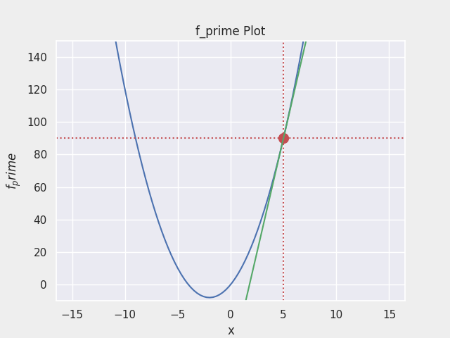{: .align-center width="70%"}  

- $\sigma(x) = { {1} \over {1 + e^{-x} } }$ 의 그래프  

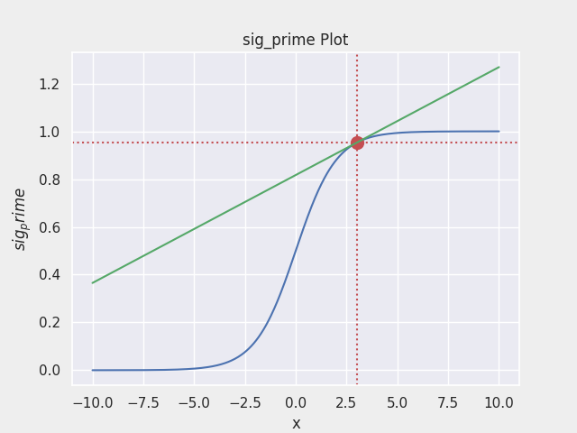{: .align-center width="70%"} 

 
### Gradient Descent
- 최적화 알고리즘의 대표  
- 독립변수 $\theta_1$과 $\theta_2$을 변형시켜가며 오차 함수 $J(\theta_1, \theta_2)$ 의 최소값을 찾는 알고리즘  
  - 오차 함수 $J(\theta_1, \theta_2)$ 의 최소값은 기울기가 0인 지점  
  - 기울기가 양수라는 것은 $\theta$ 값이 커질 수록 함수 값이 커진다는 것을 의미하고, 반대로 기울기가 음수라면 $\theta$값이 커질수록 함수의 값이 작아진다는 것을 의미  

- 오차함수
  - $Error Function = (ŷ^{(i)} - y^{(i)})^2$
    - $ŷ^{(i)}$ : i 번째 사례의 예측 값
    - $y^{(i)}$ : i 번째 사례의 라벨
- 비용함수
  - $MSE(θ,b) = {1 \over m}Σ(ŷ^{(i)} - y^{(i)})^2$  
  $   = {1 \over m}Σ(θx^{(i)}  + b - y^{(i)})^2$
    - $ŷ^{(i)}$ : i 번째 사례의 예측 값
    - $y^{(i)}$ : i 번째 사례의 라벨
    - $x^{(i)}$ : i 번째 입력 데이터 벡터
    - $θ$ : 가중치 벡터 (기울기)
    - $b$ : 편차 (y절편)
- 비용함수를 미분
  - $θ 편미분$
    - ${\partial \over \partial \theta}MSE(θ,b) = {1 \over m}Σ[(θx^{(i)}  + b - y^{(i)})^2]'$  
    $   = {2 \over m}Σ(θx^{(i)}  + b - y^{(i)})[(θx^{(i)}  + b - y^{(i)})]'$  
    $   = {2 \over m}Σ(θx^{(i)}  + b - y^{(i)})x^{(i)}$  
  - $b 편미분$
    - ${\partial \over \partial b}MSE(θ,b) = {1 \over m}Σ[(θx^{(i)}  + b - y^{(i)})^2]'$  
    $   = {2 \over m}Σ(θx^{(i)}  + b - y^{(i)})[(θx^{(i)}  + b - y^{(i)})]'$  
    $   = {2 \over m}Σ(θx^{(i)}  + b - y^{(i)})$  

- 경사하강 알고리즘 과정  
  1. 경사하강법은 임의의 $\theta_1, \theta_2$를 랜덤으로 선택 즉, random initialization을 실행
  2. 반복적으로 파라미터 $\theta_1, \theta_2$를 업데이트 해가며, 오차 함수 $J(\theta_1,\theta_2)$ 값이 낮아지는 방향으로 진행  
  3. 기울기가 커진다는 것은 오차함수 값이 커지는 방향이라는 것과 같기 때문에 경사하강법 알고리즘은 기울기의 반대 방향(기울기 $∇ J(\theta_1)$, $∇ J(\theta_2)$가 작아지는 방향)으로 이동  
  4. 그리고 기울기가 0이 되어 **`global minimum`**에 도달할 때까지 이동  
- 경사하강 알고리즘 수학적 공식
$$\theta_{n+1} = \theta_n - \eta ∇ J(\theta_n)$$
  - $\eta$는 학습률, $∇ J(\theta_n)$는 기울기를 의미

- 편미분 - 전미분의 차이
  - 편미분 : 하나의 변수를 고려한 하나의 접선의 기울기  
  - 전미분 : 다양한 변수에 대해 다양한 접선의 기울기  
    - 각각의 변수에 대한 편미분 뒤 모두 더하기 = 증분

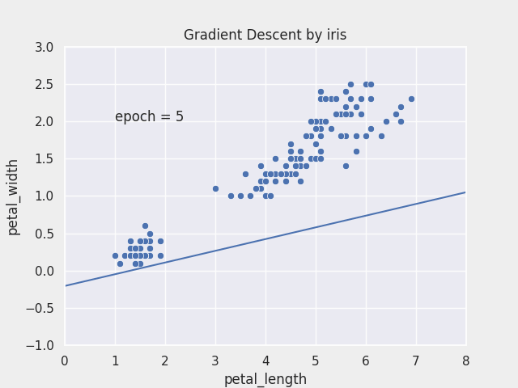{: .align-center width="70%"} 

      

  
<h1>끝까지 읽어주셔서 감사합니다😉</h1>  

  
      