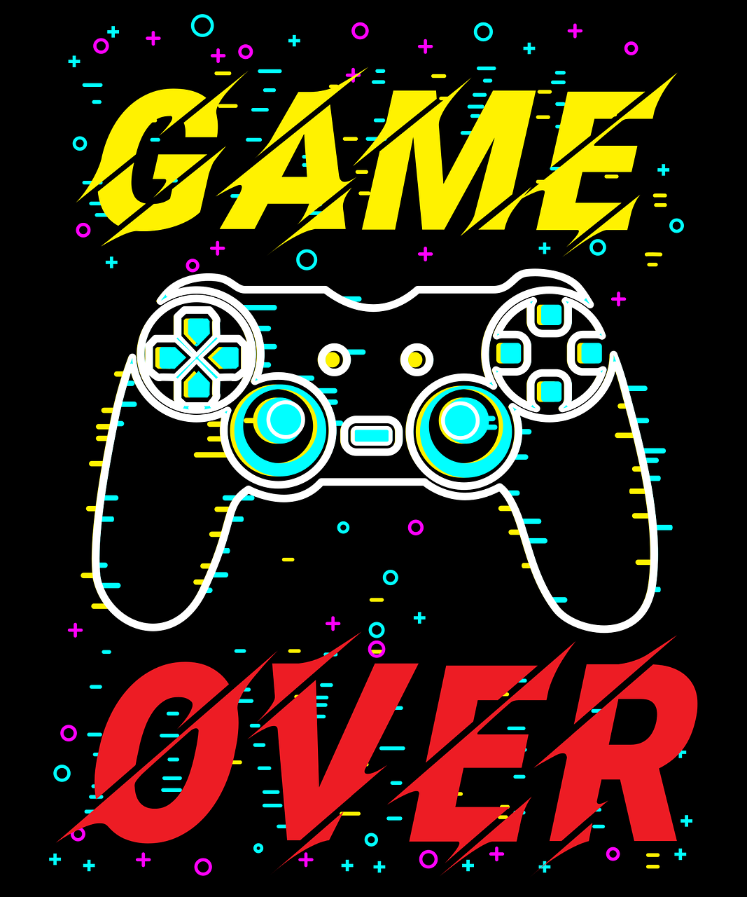
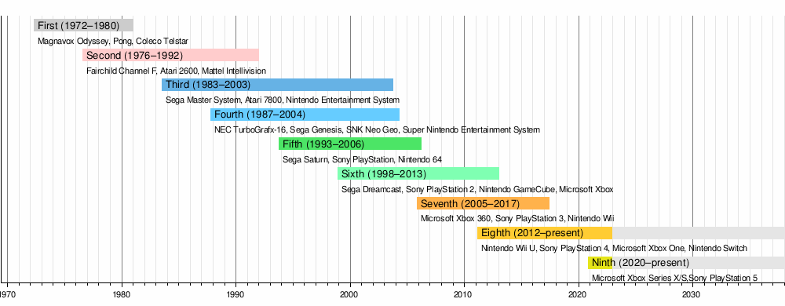
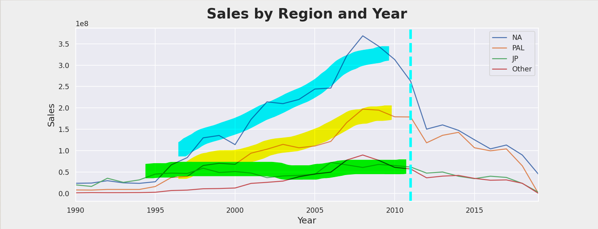
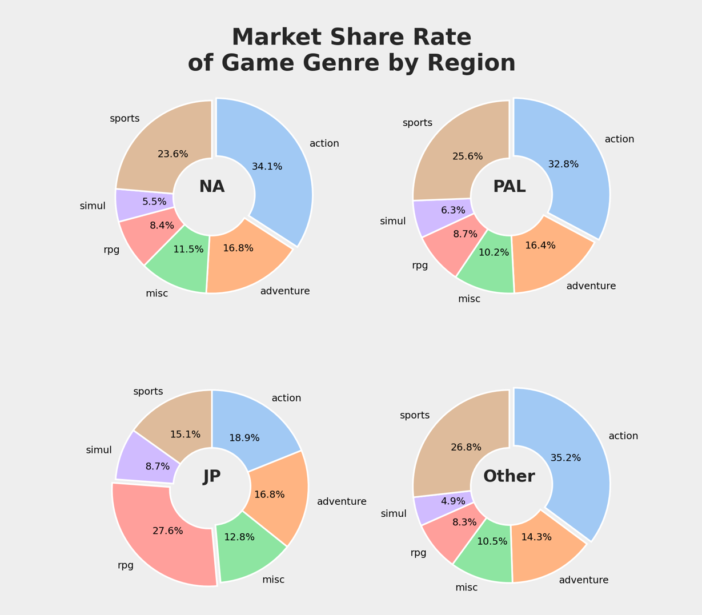
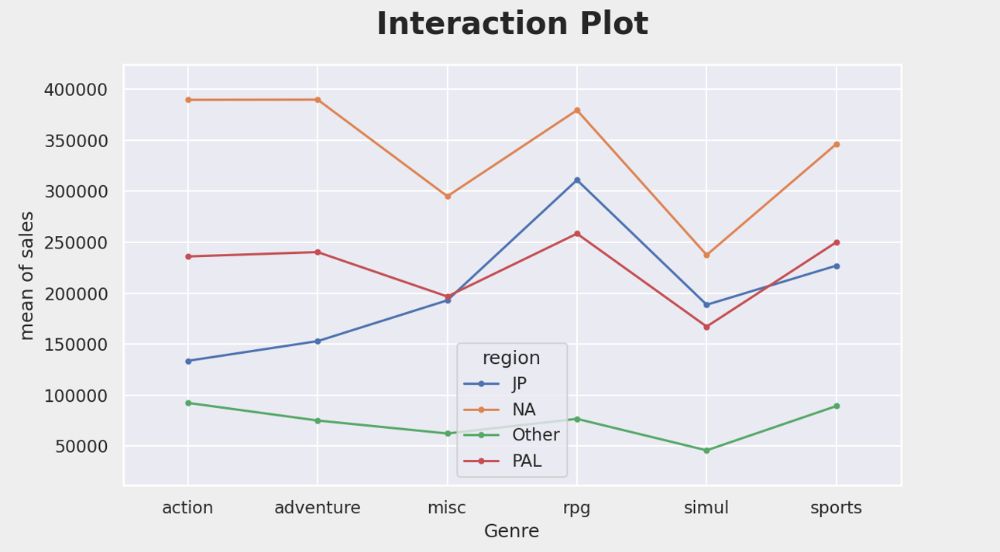

{: .align-center width="60%" loading="lazy"}  

 
 

# [코드스테이츠](https://www.codestates.com/)와 함께하는 'AI 부프캠프' 4주차

## 전반적 회고🎈
> 코드스테이츠 AI부트캠프 section1 project를 수행하였다.  
프로젝트 초기에는 자신감이 넘쳤다. 이것도 해보고 싶고, 저것도 해보고 싶은 마음이 들어서 그저 즐거웠다. 하지만 시간이 지날수록 완성해야 한다는 압박감 때문에 시간에 쫓기듯 재출해서 아쉽다.  
시간배분이 중요함을 느꼈다. 그리고 내가 하고싶은것과 할 수 있는 것을 나눠야겠다. 하고 싶은 것은 많은데 <mark>우선순위</mark>를 나눠서 해야지, 안그러면 시간에 쫓기어 정말 중요한 것을 놓치는 것 같다.  
하고 싶은 것, 해야 하는 것, 할 수 있는 것을 나눠서 우선순위를 정하여 계획을 만들어야겠다.

 
 

## 완성영상 보기



 
 

## 프로젝트 내용📚
### 프로젝트 주제📝
- 비디오게임 트랜드를 분석하고 미래 전망을 밝혀라!!📌

  - [VGCahrtz](https://www.vgchartz.com/) 에서 데이터 수집 후 데이터 분석
  - 지역에 따른 게임 트렌드 분석
  - 시간에 따른 게임 트렌드 분석
  - 게임 플렛폼 변화 분석

### 프로젝트 기간🚩
- 프로젝트기간 : 2022.12.20.(금) ~ 2023.01.4.(수)

### Time Table🌈  
<table class="table-success">
<tr class="table-primary">
  <th>날짜</th>
  <th>내용</th>
</tr>
<tr>
  <td>12/30 (금)</td>
  <td>프로젝트 시작🚀   - 시간계획 짜기   - Data Cleaning, Wrangling</td>
</tr>
<tr>
  <td>12/31 (토)</td>
  <td>- 게임관련 뉴스 & 트렌트 탐색</td>
</tr>
<tr>
  <td>1/1 (일)</td>
  <td>- 게임관련 데이터 & 아티클 탐색</td>
</tr>
<tr>
  <td>1/2 (월)</td>
  <td>- Feature Engineering   - 클러스터링 & 시각화</td>
</tr>
<tr>
  <td>1/3 (화)</td>
  <td>- 스크립트 작성   - 슬라이드 작성   - 영상촬영</td>
</tr>
<tr>
  <td>1/4 (수)</td>
  <td>- 최종 점검 및 제출🚩</td>
</tr>
</table>

 

 

## Data Analysis📖

### 데이터 수집과 정제
- [VGCahrtz](https://www.vgchartz.com/) 에서 웹스크래핑
- BeautifulSoup 이용
- 웹스크래핑 과정
  1. Genre 리스트 웹스크랩핑
    - 'Action', 'Action-Adventure', 'Adventure', 'Board Game', 'Education', 'Fighting', 'Misc', 'MMO', 'Music', 'Party', 'Platform', 'Puzzle', 'Racing', 'Role-Playing', 'Sandbox', 'Shooter', 'Simulation', 'Sports', 'Strategy', 'Visual Novel'
  1. Genre 마다 페이지를 계산
    - 페이지 수 = 해당 장르 전체 게임 수 / 한페이지 출력 게임 수
  1. Genre 마다 페이지를 순회하며 데이터 스크래핑
- 최종 수집 된 데이터
  - row : 62434, column : 14
- EDA
  - Platform
    - 약어로 기록된 플랫폼이름을 풀네임으로 변경  
    <table>  
    <tr><td>PS2</td><td>PlayStation 2</td></tr>  
    <tr><td>DS</td><td>Nintendo DS</td></tr>  
    <tr><td>NS</td><td>Nintendo Switch</td></tr>  
    <tr><td>GB</td><td>Game Boy</td></tr>  
    <tr><td>PS4</td><td>PlayStation 4</td></tr>  
    <tr><td>···</td><td>···</td></tr>  
    </table>  
    
    - [비디오 게임의 역사](https://ko.wikipedia.org/wiki/%EB%B9%84%EB%94%94%EC%98%A4_%EA%B2%8C%EC%9E%84%EC%9D%98_%EC%97%AD%EC%82%AC#1%EC%84%B8%EB%8C%80_%EA%B0%80%EC%A0%95%EC%9A%A9_%EA%B2%8C%EC%9E%84_%EC%BD%98%EC%86%94%EA%B3%BC_%ED%90%81_%EB%B3%B5%EC%A0%9C_%EA%B2%8C%EC%9E%84_(1972~1980%EB%85%84)) 참고하여 플랫폼세대 파악  
    - 비디오게임 플랫폼의 세대 변화

    {: .align-center width="90%" loading="lazy"} 
  
  
  - 장르를 6가지 범주로 축소
    - Action : 'Action', 'Fighting', 'Shooter'
    - RPG : 'MMO', 'Party', 'Role-Playing', 'Sandbox'
    - Adventure : 'Action-Adventure', 'Adventure', 'Platform', 'Visual Novel'
    - Simulation : 'Simulation', 'Strategy'
    - Sports : 'Racing', 'Sports'
    - Misc : 'Board Game', 'Education', 'Misc', 'Music', 'Puzzle'
  - VGC Score, Critic Score, User Score 의 평균값을 'Score'변수로 생성
  - NA지역, PAL지역, JP지역, Other지역의 각각 판매량 데이터
    - 4개 지역 모두 결측인 경우 해당 케이스 제거 (42,141 케이스 제거)
    - 4개 지역별 판매량 데이터를 ‘지역’(region)과 ‘판매량’(sales)으로 재구조화(wide → long)

 

 

### 분석1. 지역에 따라 평균 비디오게임 판매량에 차이가 있는가?
#### 4개 지역의 비디오게임 판매량

<table>
<tr><th>region</th><th>Count</th><th>Total</th><th>Mean</th><th>S_Dev</th></tr>
<tr><td>일본지역</td><td>7,248</td><td>1,395,489,996</td><td>192,534.49</td><td>458,343.73</td></tr>
<tr><td>북미지역</td><td>13,370</td><td>4,719,459,978</td><td>352,988.78</td><td>913,467.25</td></tr>
<tr><td>기타지역</td><td>10,989</td><td>876,399,999</td><td>79,752.48</td><td>234,582.74</td></tr>
<tr><td>PAL지역</td><td>11,701</td><td>2,703,569,989</td><td>231,054.61</td><td>633,098.41</td></tr>
</table>

- 일원분산분석
  - 귀무가설 : 지역간의 평균 비디오게임 판매량은 같다.
  - F = 368.546, p = 0.000

- 사후검정(tukey HSD)  
  - 귀무가설 : 각 지역마다 평균 비디오게임 판매량은 같다.  

  <table>
  <tr><th>group1</th><th>group2</th><th>meandiff</th><th>p-adj</th><th>lower</th><th>upper</th><th>reject</th></tr>
  <tr><td>JP</td><td>NA</td><td>160454.29</td><td>0.00</td><td>136312.66</td><td>184595.92</td><td>True</td></tr>
  <tr><td>JP</td><td>Other</td><td>-112782.01</td><td>0.00</td><td>-137826.18</td><td>-87737.84</td><td>True</td></tr>
  <tr><td>JP</td><td>PAL</td><td>38520.12</td><td>0.00</td><td>13780.63</td><td>63259.61</td><td>True</td></tr>
  <tr><td>NA</td><td>Other</td><td>-273236.30</td><td>0.00</td><td>-294547.26</td><td>-251925.34</td><td>True</td></tr>
  <tr><td>NA</td><td>PAL</td><td>-121934.17</td><td>0.00</td><td>-142886.23</td><td>-100982.11</td><td>True</td></tr>
  <tr><td>Other</td><td>PAL</td><td>151302.13</td><td>0.00</td><td>129316.20</td><td>173288.06</td><td>True</td></tr>
  </table>  
  
  - 모든 지역에서 지역간의 평균 비디오게임 판매량은 같지 않다.  
  - 북미지역 > PAL 지역 > 일본 지역 > 기타지역 순서로 평균 비디오 게임 판매량이 많다.

#### 시간에 따른 4개 지역의 비디오게임 판매량

{: .align-center width="80%" loading="lazy"} 

- 북미지역(파랑), PAL지역(빨강)은 시간에 따라 판매량이 변하였음  
- 일본지역(초록)은 시간에 따라 판매량이 변하지 않았음  
- 2011년 이후 북미지역과 PAL지역의 판매량이 비슷해지고, 일본지역과 기타지역의 판매량이 비슷해보임

  - 2011년 이후로 한정 하면...  

  <table>
  <tr><th>group1</th><th>group2</th><th>meandiff</th><th>p-adj</th><th>lower</th><th>upper</th><th>reject</th></tr>
  <tr><td>JP</td><td>NA</td><td>206541.79</td><td>0.00</td><td>168467.11</td><td>244616.48</td><td>True</td></tr>
  <tr><td>JP</td><td>Other</td><td>-20990.33</td><td>0.51</td><td>-59828.84</td><td>17848.17</td><td>False</td></tr>
  <tr><td>JP</td><td>PAL</td><td>185771.76</td><td>0.00</td><td>146999.51</td><td>224544.02</td><td>True</td></tr>
  <tr><td>NA</td><td>Other</td><td>-227532.13</td><td>0.00</td><td>-265060.18</td><td>-190004.07</td><td>True</td></tr>
  <tr><td>NA</td><td>PAL</td><td>-20770.03</td><td>0.48</td><td>-58229.52</td><td>16689.46</td><td>False</td></tr>
  <tr><td>Other</td><td>PAL</td><td>206762.09</td><td>0.00</td><td>168526.50</td><td>244997.69</td><td>True</td></tr>
  </table>  

  - 2011년 이후에는 북미지역 = PAL 지역 > 일본 지역 = 기타지역  
  - PAL 지역에는 중국이 포함되어있는데, <mark>중국 비디오 게임시장이 크게 성장</mark>한 것에서 그 이유를 찾을 수 있음  
  - 2011년 이후에는 북미시장과 중국시장이 BIG2 시장으로 평가 됨  

 

 

### 분석2. 지역에 따라 선호하는 비디오게임의 장르가 다른가?

{: .align-center width="70%" loading="lazy"} 

- 이원분산분석
  - 귀무가설 : 지역에 따라 장르별 평균 비디오게임 판매량은 같다.

  <table>
  <tr><th></th><th>sum_sq</th><th>df</th><th>F</th><th>PR(>F)</th></tr>
  <tr><td>Intercept</td><td>35282080892038.41</td><td>1.00</td><td>85.30</td><td>0.00</td></tr>
  <tr><td>C(region)</td><td>186714193183639.09</td><td>3.00</td><td>150.46</td><td>0.00</td></tr>
  <tr><td>C(gen_6)</td><td>27726563563959.32</td><td>5.00</td><td>13.41</td><td>0.00</td></tr>
  <tr><td>C(region):C(gen_6)</td><td>37261038338771.63</td><td>15.00</td><td>6.01</td><td>0.00</td></tr>
  </table>  

  - 지역과 장르의 상호작용항의 F값이 커서 '지역에 따라 장르별 평균 비디오게임 판매량은 같지 않다'라고 결론

{: .align-center width="70%" loading="lazy"} 

  - 지역과 장르의 상호작용 그래프를 통해서도 북미지역(초록)과 PAL지역(보라)의 분포는 비슷하지만, 일본지경(파랑)과 기타지역(빨강)의 분포는 전혀 다름을 볼 수 있음

 

 

### 분석3. 시간에따라 비디오게임 트렌드는 변화하였는가?

{: .align-center width="90%" loading="lazy"} 

- 2000년 이전에는 5세대 플랫폼
  - 5세대 플랫폼 가운데 1~5위게임은 모두 "Game Boy"
- 2000년대 중반에는 6세대 플랫폼
  - 6세대 플랫폼 가운데 1~3위, 5위 게임은 모두 "Nintendo DS"
- 2010년 즈음에는 7세대 플렛폼
  - 7세대 플랫폼 가운데 1~5위 게임은 모두 "Wii"
- 2010년 중반에는 8세대 플렛폼
  - 8세대 플랫폼 가운데 1~4위 게임은 모두 "PlayStation 4"

- 세대가 바뀜에 따라서 비디오 게임 매출도 함께 변하였음
- 각 플랫폼 세대마다 그 세대를 지배하는 플랫폼이 있었음

### 결론
- 지역에 따라 평균 비디오게임 판매량에 차이가 있음
  - PAL지역 게임 매출이 증가하였음 👉 PAL에는 중국이 포함
  - <mark>중국, 인도, 남미 등 새로운 시장의 성장 가능성 👍</mark>
- 지역에 따라 선호하는 비디오게임의 장르가 다름
  - 하지만 <mark>Action, Adventure, RPG</mark>, Sports 장르는 평균적으로 잘 팔림
  - 일본과 같은 특수한 지역은 문화적 특성을 고려해야 함
- 시간에따라 플랫폼의 변화를 중심으로 비디오게임의 트랜드가 변화하였음
  - 플랫폼은 게임 매출에 직접적인 영향
  - 새로운 플랫폼, 특히 <mark>모바일 중심</mark>📌의 크로스플랫폼을 적극 시도해야 함

 

 

## 비디오게임 관련 참고자료✨
### 비디오게임 관련 아티클
- 세계 게임시장 트렌드
  - 비디오 게임 시장은 2030년까지 5,836억 9천만 달러에 달할 것
  - AR 및 VR 비디오 게임 시장은 2026년까지 110억 달러에 달할 것
  - 2021년부터 2026년까지 18.5% 성장
  - 2023년까지 인게임 구매에 2,000억 달러를 지출할 것
  - e스포츠 게임 시장은 2023년까지 21억 7,480만 달러로 성장할 것
  - 메타버스 비디오 게임 시장은 2027년까지 7,102억 1,000만 개에 달할 것

- 국내 게임산업 트렌드
  - 최근 10년간 국내 게임 산업은 꾸준히 성장
  - 특히 2020년은 21.3%라는 높은 성장
  - [[산업계 2023 전망] 게임업계 대세는 'PC·콘솔'...'신작 러시'로 수익성 개선 기대](https://www.newspim.com/news/view/20221214000799)

- 게임시장
  - 2023년 경기 침체에 대한 우려로 국내 산업계의 비상경영 시작
  - 국내 게임사 대부분이 내년에는 매출과 영업이익이 증가하는 성장기를 맞이할 것
  - 코로나19 기간 호황을 누린 게임산업은 2022년 초 대형 M&A를 잇달아 발표하며 절정기에 도달
  - '팬데믹 부스트' 잃기 시작한 게임업계
  - 하지만, 2022년 2분기 미국인들이 게임에 지출한 금액이 전년동기대비 13% 감소
  - 미국뿐만 아니라 전 세계적으로 게임시장 매출 감소가 포착
  - 2022년 2분기 엑스박스(Xbox)의 매출은 작년동기대비 7% 하락, 하드웨어 매출은 11% 하락
  - PS 중심의 소니 게임 사업 실적은 전년동기대비 매출은 2.4% 감소
  - 닌텐도는 전년동기대비 매출과 영업이익이 4.7%, 15.1% 감소
  - 텐센트(Tencent)의 2022년 2분기 매출은 3%, 영업이익은 43% 하락
  - 중국 게임산업의 이용자 수가 2008년 집계 이후 처음으로 감소

- [PAL 지역](https://ko.wikipedia.org/wiki/PAL_%EC%A7%80%EC%97%AD)(PAL region) 은 아시아, 아프리카, 유럽, 남아메리카, 오세아니아 대부분에 해당하는 텔레비전 방송 영토이다. 전통적으로 해당 지역에 사용되는 [PAL](https://ko.wikipedia.org/wiki/PAL)(Phase Alternating Line) 텔레비전 표준이기 때문에 그렇게 이름이 불린다. 이는 한국, 일본 및 북아메리카 지역 거의 대부분에서 사용되는 NTSC 표준과 대비된다.

- [비디오 게임의 역사](https://ko.wikipedia.org/wiki/%EB%B9%84%EB%94%94%EC%98%A4_%EA%B2%8C%EC%9E%84%EC%9D%98_%EC%97%AD%EC%82%AC#1%EC%84%B8%EB%8C%80_%EA%B0%80%EC%A0%95%EC%9A%A9_%EA%B2%8C%EC%9E%84_%EC%BD%98%EC%86%94%EA%B3%BC_%ED%90%81_%EB%B3%B5%EC%A0%9C_%EA%B2%8C%EC%9E%84_(1972~1980%EB%85%84))

- [위키백과:클라우드 게임](https://ko.wikipedia.org/wiki/%ED%81%B4%EB%9D%BC%EC%9A%B0%EB%93%9C_%EA%B2%8C%EC%9E%84)
- [조선일보:10대 파파고, 20대 토스, 30~60대는…](https://www.chosun.com/economy/tech_it/2022/12/30/FVJ3EDQYVREEBBJ2BLYBLIGW7E/)
- [7 Huge Gaming Industry Trends 2022-2025](https://explodingtopics.com/blog/gaming-trends)
- [국내 게임 산업 동향](https://koreancontent.kr/3832)
- [Gaming Trends 2023 - Top 10 Trends that Will Rule Industry](https://www.ediiie.com/blog/gaming-trends/)
- [게임 기획자로 사는 지혜](http://makhunta.blogspot.com/2015/07/1.html)  
- [2022 유니티 게임 업계 보고서: 다섯 가지 트렌드를 통한 게임 업계 분석](https://blog.unity.com/kr/games/unity-gaming-report-2022-five-insights-on-the-gaming-industry-today)
- [미리보는 2022년 게임 트렌드, 세대 변화에 주목하라](https://www.khgames.co.kr/news/articleView.html?idxno=131367)
- [Future of Video Games: Trends, Technology, and Types](https://online.maryville.edu/blog/future-of-video-games/)
- [Gaming Trends 2023 - Top 10 Trends that Will Rule Industry](https://www.ediiie.com/blog/gaming-trends/)

 

 

### VGCartz 에 나오는 게임 플렛폼 종류🔥

##### PC
  - [PC game](https://en.wikipedia.org/wiki/PC_game)

    

##### PS2
  - [PlayStation 2](https://en.wikipedia.org/wiki/PlayStation_2)  

    

##### DS
  - [Nintendo DS](https://en.wikipedia.org/wiki/Nintendo_DS)

    

##### PS
  - [PlayStation (console)](https://en.wikipedia.org/wiki/PlayStation_(console))

    

##### PS4
  - [PlayStation 4](https://en.wikipedia.org/wiki/PlayStation_4)

    

##### XBL
  - [Xbox network](https://en.wikipedia.org/wiki/Xbox_network)

    

##### NS
  - [Nintendo Switch](https://en.wikipedia.org/wiki/Nintendo_Switch)

    

##### PSN
  - [PlayStation Network](https://en.wikipedia.org/wiki/PlayStation_Network)

    

##### PS3
  - [PlayStation 3](https://en.wikipedia.org/wiki/PlayStation_3)

    

##### PSP
  - [PlayStation Portable](https://en.wikipedia.org/wiki/PlayStation_Portable)

    

##### XOne
  - [Xbox One](https://en.wikipedia.org/wiki/Xbox_One)

    

##### X360
  - [Xbox 360](https://en.wikipedia.org/wiki/Xbox_360)

    

##### Wii
  - [Wii](https://en.wikipedia.org/wiki/Wii)

    

##### GBA
  - [Game Boy Advance](https://en.wikipedia.org/wiki/Game_Boy_Advance)

    

##### GB
  - [Game Boy](https://en.wikipedia.org/wiki/Game_Boy)

    

##### SNES
  - [Super Nintendo Entertainment System](https://en.wikipedia.org/wiki/Super_Nintendo_Entertainment_System)

    

##### 3DS
  - [Nintendo 3DS](https://en.wikipedia.org/wiki/Nintendo_3DS)

    

##### NES
  - [Nintendo Entertainment System](https://en.wikipedia.org/wiki/Nintendo_Entertainment_System)

    

##### PSV
  - [PlayStation Vita](https://en.wikipedia.org/wiki/PlayStation_Vita)

    

##### And
  - [Android (operating system)](https://en.wikipedia.org/wiki/Android_(operating_system))

    

##### XB
  - [Xbox (console)](https://en.wikipedia.org/wiki/Xbox_(console))

    

##### GEN
  - [Sega Genesis](https://en.wikipedia.org/wiki/Sega_Genesis)

    

##### DSiW
  - [List of DSiWare games and applications](https://en.wikipedia.org/wiki/List_of_DSiWare_games_and_applications)

    

##### SAT
  - [Sega Saturn](https://en.wikipedia.org/wiki/Sega_Saturn)

    

##### OSX
  - [macOS](https://en.wikipedia.org/wiki/MacOS)

    

##### VC
  - [Virtual Console](https://en.wikipedia.org/wiki/Virtual_Console)

    

##### GC
  - [GameCube](https://en.wikipedia.org/wiki/GameCube)

    

##### DC
  - [Dreamcast](https://en.wikipedia.org/wiki/Dreamcast)

    

##### WiiU
  - [Wii U](https://en.wikipedia.org/wiki/Wii_U)

    

##### 2600
  - [Atari 2600](https://en.wikipedia.org/wiki/Atari_2600)

    

##### WW
  - [WiiWare](https://en.wikipedia.org/wiki/WiiWare)

    

##### PCE
  - [TurboGrafx-16/PC Engine](https://en.wikipedia.org/wiki/TurboGrafx-16)

    

##### Series
  - 

    

##### XS
  - [Xbox Series X and Series S](https://en.wikipedia.org/wiki/Xbox_Series_X_and_Series_S)

    

##### PS5
  - [PlayStation 5](https://en.wikipedia.org/wiki/PlayStation_5)

    

##### N64
  - [Nintendo 64](https://en.wikipedia.org/wiki/Nintendo_64)

    

##### Linux
  - 

    

##### MS
  - [Master System](https://en.wikipedia.org/wiki/Master_System)

    

##### GG
  - [Game Gear](https://en.wikipedia.org/wiki/Game_Gear)

    

##### 3DO
  - [3DO Interactive Multiplayer](https://en.wikipedia.org/wiki/3DO_Interactive_Multiplayer)

    

##### SCD
  - [Sega CD](https://en.wikipedia.org/wiki/Sega_CD)

    

##### WS
  - [WonderSwan](https://en.wikipedia.org/wiki/WonderSwan)

    

##### NG
  - [Neo Geo](https://en.wikipedia.org/wiki/Neo_Geo)

    

##### iOS
  - 

    

##### Int
  - [Intellivision](https://en.wikipedia.org/wiki/Intellivision)

    

##### Lynx
  - [Atari Lynx](https://en.wikipedia.org/wiki/Atari_Lynx)

    

##### DSi
  - [List of DSiWare games and applications](https://en.wikipedia.org/wiki/List_of_DSiWare_games_and_applications)

    

##### AJ
  - [Atari Jaguar](https://en.wikipedia.org/wiki/Atari_Jaguar)

    

##### 5200
  - [Atari 5200](https://en.wikipedia.org/wiki/Atari_5200)

    

##### WinP
  - [Windows Phone](https://en.wikipedia.org/wiki/Windows_Phone)

    

##### PCFX
  - [PC-FX](https://en.wikipedia.org/wiki/PC-FX)

    

##### BRW
  - [Browser game](https://en.wikipedia.org/wiki/Browser_game)

    

##### NGage
  - [N-Gage (device)](https://en.wikipedia.org/wiki/N-Gage_(device))

    

##### 7800
  - [Atari 7800](https://en.wikipedia.org/wiki/Atari_7800)

    

##### GIZ
  - [Gizmondo](https://en.wikipedia.org/wiki/Gizmondo)

    

##### Arc
  - [Arcade game](https://en.wikipedia.org/wiki/Arcade_game)

    

##### CV
  - [ColecoVision](https://en.wikipedia.org/wiki/ColecoVision)

    

##### C64
  - [Commodore 64](https://en.wikipedia.org/wiki/Commodore_64)

    

##### OR
  - [Oculus Rift](https://en.wikipedia.org/wiki/Oculus_Rift)

    

##### Amig
  - [Amiga](https://en.wikipedia.org/wiki/Amiga)

    

##### MSD
  - [MS-DOS](https://en.wikipedia.org/wiki/MS-DOS)

    

##### Ouya
  - [Ouya](https://en.wikipedia.org/wiki/Ouya)

    

##### VB
  - [Virtual Boy](https://en.wikipedia.org/wiki/Virtual_Boy)

    

##### ACPC
  - [Amstrad CPC](https://en.wikipedia.org/wiki/Amstrad_CPC)

    

##### Mob
  - 

    

##### ZXS
  - [ZX Spectrum](https://en.wikipedia.org/wiki/ZX_Spectrum)

    

##### AST
  - [Atari ST](https://en.wikipedia.org/wiki/Atari_ST)

    

##### iQue
  - [iQue Player](https://en.wikipedia.org/wiki/IQue_Player)

    

##### GBC
  - [Game Boy Color](https://en.wikipedia.org/wiki/Game_Boy_Color)

    

##### MSX
  - [MSX](https://en.wikipedia.org/wiki/MSX)

    

##### CDi
  - [CD-i](https://en.wikipedia.org/wiki/CD-i)

    

##### ApII
  - [Apple II](https://en.wikipedia.org/wiki/Apple_II)

    

##### S32X
  - [32X](https://en.wikipedia.org/wiki/32X)

    

##### CD32
  - [Amiga CD32](Amiga CD32)

    

##### FMT
  - [FM Towns Marty](https://en.wikipedia.org/wiki/FM_Towns_Marty)

    

##### TG16
  - [TurboGrafx-16](https://en.wikipedia.org/wiki/TurboGrafx-16)

    

##### C128
  - [Commodore 128](https://en.wikipedia.org/wiki/Commodore_128)

    

##### Aco
  - [Acorn Electron](https://en.wikipedia.org/wiki/Acorn_Electron)

    

##### BBCM
  - [BBC Micro](https://en.wikipedia.org/wiki/BBC_Micro)

    

  

  
<h1>끝까지 읽어주셔서 감사합니다😉</h1>  

  
  