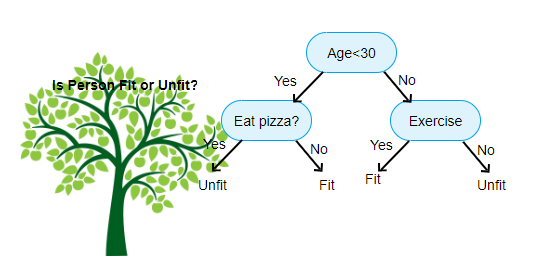

# 코드스테이츠와 함께하는 'AI 부트캠프' 6주차

    

{: .align-center width="60%"}  

    

## 주간회고

    

### 더 공부가 필요한 부분
> 선형모델보다 나무모델이 적어도 분류문제에서는 성능이 뛰어난것 같다.  
하지만 선형모델과 달리 전처리를 할 수록 성능이 떨어지는 아이러니가 발생한다.  
나무모델의 전처리방법에 대하여 더 학습해야겠다.

### 5F 회고
- 사실(Fact)  
나무모델의 개념에 대하여 배우고, 나무모델의 대표적인 기법들의 사용법에 대하여 학습하였다.
- 느낌(Feeling)  
수많은 메써드와 파라미터의 숲속을 헤매다가 우연하게 좋은 성능을 발견하면 기쁘지만, 성능이 떨어지면 아쉽다.
- 교훈(Finding)  
나무모델은 다양한 기법과 하이퍼파라미터들이 성능에 영향을 미친다. 하지만 전처리를 많이한다고 해서, 다양한 하이퍼파라미터를 조작한다고 해서, 많은 특성을 사용한다고해서 성능이 높게나오는 것은 아닌것 같다. 특성에 대한 적절한 선택, 올바른 하이퍼파라미터의 사용이 더 중요한 것 같다.
- 향후 행동(Future action)  
다양한 메써드와 하이퍼파라미터의 <mark>정확한 동작원리와 올바른 사용</mark>법에 대하여 더 알아볼 것이다. 다시한번 느끼지만... 공식문서의 메써드와 파라미터에 대한 설명을 꼭 보도록 하자!
- 피드백(Feedback) 

    

## N221 : Tree Based Model  

    

### 학습 목표🚩
- 🌱 Level 1 : Lecture Note 에 있는 주요 개념을 설명할 수 있으며 예제 코드를 이해하고 응용하여 과제를 수행할 수 있다.
    - 결정트리
        - 결정트리 알고리즘이 데이터를 학습하여 타겟값을 예측하는 과정을 이해할 수 있다.
        - 결정트리의 비용함수로 사용되는 지니불순도와 엔트로피에 대해 이해할 수 있다.
        - 결정트리의 장점 및 단점에 대해 설명할 수 있다.
    - 랜덤포레스트
        - 앙상블 학습에 대하여 이해하고, 배깅을 통해 랜덤포레스트가 결정트리의 한계점을 어떻게 극복하는지 설명할 수 있다.
    - 모델 학습 및 해석
        - scikit-learn의 파이프라인을 사용하여 모델을 학습할 수 있다.
        - 하이퍼파라미터를 조정하여 트리의 복잡도를 줄임으로써 과적합을 해소하는 과정을 이해할 수 있다.
        - 시각화 및 특성중요도를 나타내어 모델을 해석할 수 있다.
 
- 🔝 Level 2 : Lecture Note 에 있는 개념 중 자신이 모르는 것을 구분해 낼 수 있으며 메타인지를 기반으로 자기 학습 계획을 세울 수 있다.
    - 오늘 배운 내용 중 아는 개념과 모르는 개념을 구분해서 readme.md 에 기록할 수 있다.  
    → N221 노트 마무리 학습 후 아래 질문에 답해보세요의 질문에 답을 해보고 추가 학습이 필요한 질문을 기록할 수 있다.
    - 이후에 모르는 개념을 학습하기 위해 추가 학습 계획을 스스로 세우고 실행할 수 있다.

- 🔥 Level 3 : Lecture Note에 있는 주요 개념과 코드를 연결하여 설명할 수 있으며, 이를 바탕으로 코드를 구현하고 도전 과제를 수행할 수 있다.
    - 하이퍼파라미터들의 역할에 대해서 이해하고, 이를 조정하여 모델의 성능을 향상시킬 수 있다.

### 키워드🔑
- 결정나무
- 지니불순도
- 엔트로피
- 배깅
- RandomForest

### 새로 배운 개념📑
#### 결정나무(Decision Tree)
- 비용함수를 최소로 하는 특성과 그 값에 대한 <mark>Yes/No Question</mark>의 대답으로 타겟 데이터를 분할하는 알고리즘

{: .align-center width="70%"}  

- 노드(node) : 질문이나 정답을 담고 있는 결과
    - Root node(root) : 처음으로 분기되는 노드
    - Internal node(internal, inner, branch) : 중간 가지들
    - Leaf node(outer, terminal, leaf) : 말단 잎사귀
- 엣지(edge) : 노드를 연결하는 선
- 결정트리는 회귀, 분류 문제에 모두 가능
    - 회귀 : 리프노드 타겟값들의 평균
    - 분류 : 리프노드 타겟값들의 최빈값
- 결정트리의 비용함수
    - 지니불순도(Gini Impurity)
        - 비슷한 비율의 클래스가 섞여있는 상태 = 높은 불순도
        - 순수도(purity)의 반대
    - 엔트로피(Entropy)
        - ❓❓정보획득 = 부모 엔트로피 - 자식 엔트로피❓❓
- 장점
    - 분할 과정을 직관적으로 시각화 가능
    - 해석 용이
    - 특성 간 상호작용 자연스럽게 포착
- 단점
    - 과적합 될 위험
    - 작은 데이터 변동으로도 모델이 변함
    - ❓❓각 노드에 대해 국소적으로 최적의 의사 결정이 이루어지는 탐욕 알고리즘(greedy algoritm)을 기반으로 하기 때문에 전체적으로 최적인 의사결정트리를 반환한다고 보장할 수 없음❓❓
    - 외삽이 어려움

#### 앙상블
- 여러 기본 모델을 학습하고 모델들의 예측을 합하여 최종 예측을 내는 방식
- 성능이 뛰어나고 강력한 단일 모델을 구축하기 위해 노력하는 대신 약한 모델들을 학습하고 지혜롭게 조합하는 것
- 대표적인 앙상블 기법으로 Bagging과 Boosting이 있음

#### 배깅(Bagging, Bootstrap Aggregating)
- 부트스트랩으로 만들어진 기본모델을 모아서 만드는 모델

#### RandomForest
- 결정트리르 기본모델로 사용하는 앙상블 기법
- 앙상블 기법 중 배깅을 대표하는 모델

    

## N222 : Boosting  

    

### 학습 목표🚩
- 🌱 Level 1 : Lecture Note 에 있는 주요 개념을 설명할 수 있으며 예제 코드를 이해하고 응용하여 과제를 수행할 수 있다.
    - Boosting에 대하여 이해하고, Bagging과의 차이점을 설명할 수 있다.
    - Boosting 알고리즘인 AdaBoost와 Gradient Boosting의 학습 과정을 이해할 수 있다.
    - XGBoost 라이브러리를 사용하여 Gradient Boosting을 구현할 수 있다.
 

- 🔝 Level 2 : Lecture Note 에 있는 개념 중 자신이 모르는 것을 구분해 낼 수 있으며 메타인지를 기반으로 자기 학습 계획을 세울 수 있다.
    - 오늘 배운 내용 중 아는 개념과 모르는 개념을 구분해서 readme.md 에 기록할 수 있다.
  → N222 노트 마무리 학습 후 아래 질문에 답해보세요의 질문에 답을 해보고 추가 학습이 필요한 질문을 기록할 수 있다.
    - 이후에 모르는 개념을 학습하기 위해 추가 학습 계획을 스스로 세우고 실행할 수 있다.

 

- 🔥 Level 3 : Lecture Note에 있는 주요 개념과 코드를 연결하여 설명할 수 있으며, 이를 바탕으로 코드를 구현하고 도전 과제를 수행할 수 있다.
    - GBDT의 하이퍼파라미터들에 대하여 살펴보고, 이를 조정하여 모델의 성능을 향상시킬 수 있다.

 

- 🚀 Level 4 : Reference 내용을 설명할 수 있고 심화 내용을 이해하기 위해 추가 학습을 진행할 수 있다.
    - AdaBoost, Gradient Boosting 모델이 작동하는 구체적인 알고리즘을 설명할 수 있다.

### 키워드🔑
- Bagging
- Boosting
- AdaBoost
- Gradient Boosting

### 새로 배운 개념📑
#### Bagging vs Boosting
- 배깅
    - 복원추출 - 기본 모델(weak learner) 학습 - 기본 모델(weak learner)들의 예측값을 평등하게 합치기의 과정
    - 기본 모델(weak learner)들을 병렬로 학습하고 평등하게 예측값을 합치는 과정
    - 대표적으로 Random Forest 모델이 있음
    - 낮은 분산, 과적합해결

- 부스팅
    - 모델들이 순차적으로 학습
    - 대표적으로 AdaBoost, Gradient Boosting 모델
    - 낮은 편향, 과소적합 해결

|    | Bagging | Boosting |
|:--:|:-------:|:--------:|
|**학습**|각 모델이 독립적이고 병렬적으로 학습됨 | 이전 모델의 오류를 고려하여 다음 모델이 순차적으로 학습됨|
|**목적**|Variance 감소, 과적합 해결 | Bias 감소, 과소적합 해결 |
|**예시**| Random Forest | AdaBoost, Gradient Boosting|

#### AdaBoost
- 분류 문제에 적합
- 타겟예측을 위한 관측치에 가중치를 업데이트하여 부여하는 방식
    - 가중샘플링

#### Gradient Boosting
- 회귀, 분류 모두 적합
- 잔차를 학습
- 라이브러리
    - scikit-learn Gradient Tree Boosting
    - xgboost
    - LightGBM
    - CatBoost

    

## N223 : Preprocessing  

    

### 학습 목표🚩
- 🌱 Level 1 : Lecture Note 에 있는 주요 개념을 설명할 수 있으며 예제 코드를 이해하고 응용하여 과제를 수행할 수 있다.
    - 모델의 특성과 전처리의 관계
        - 선형모델 / 비선형모델이 가지는 특징에 따라 필요한 전처리를 구분하고 설명할 수 있다.
    - 결측치를 처리하는 방법들
        - 결측치의 발생 원인을 파악하고 그에 맞는 처리 방법을 사용할 수 있다.
        - 선형/비선형 모델의 특징에 맞게 결측치를 처리할 수 있다.
    - 수치형 변수의 전처리 방법
        - 스케일을 변화시켜주는 Min-Max Scaler와 StandardScaler의 차이를 이해하고 예시를 들어 설명할 수 있다.
        - 상황에 맞게 분포 변화가 필요한 전처리 방법을 이해하고 사용할 수 있다.
    - 범주형 변수의 전처리 방법
        - 범주형 변수의 여러 전처리 방법들을 이해하고 목적에 맞게 적절히 활용할 수 있다.

- 🔝 Level 2 : Lecture Note 에 있는 개념 중 자신이 모르는 것을 구분해 낼 수 있으며 메타인지를 기반으로 자기 학습 계획을 세울 수 있다.
    - 오늘 배운 내용 중 아는 개념과 모르는 개념을 구분해서 readme.md 에 기록할 수 있다.
  → N223 노트 마무리 학습 후 아래 질문에 답해보세요의 질문에 답을 해보고 추가 학습이 필요한 질문을 기록할 수 있다.
    - 이후에 모르는 개념을 학습하기 위해 추가 학습 계획을 스스로 세우고 실행할 수 있다.

- 🔥 Level 3 : Lecture Note에 있는 주요 개념과 코드를 연결하여 설명할 수 있으며, 이를 바탕으로 코드를 구현하고 도전 과제를 수행할 수 있다.
    - 모델 성능을 올려보세요!
  1. 어떤 전처리 과정이 필요할까요?
  2. 어떤 특성 공학이 필요할까요?

### 키워드🔑
- 전처리, 표준화, 결측치

### 새로 배운 개념📑
#### 선형모델과 나무모델의 전처리 차이
- 선형모델
    - 입력 특성들의 크기 / 범위 / 분포에 영향을 받음
        - 표준화 등의 각종 scaling으로 성능을 높이는 노력이 필요함
    - 결측치를 반드시 채워야 함
    - 비선형적 특성이나 특성 간 상호작용 등을 고려해야 함

- 나무모델
    - 입력 특성들의 크기 / 범위 / 분포에 영향을 받지 않음
        - 나무 모델은 입력특성의 대소관계에만 영향을 받
    - 결측치를 반드시 채울 필요는 없음
    - 특성과 타겟 간의 비선형적 관계나 특성 간 상호작용이 자동으로 반영

#### 결측치 처리 방법
- 결측치를 그대로 두는 경우
    - 선형모델 : 학습 불가능
    - 나무모델 : 학습 가능
        - xgboost 결측치에 대하여 자동으로 처리

- 단일 대표값으로 채우는 방법
    - sklearn.SimpleImputer()
        - strategy 파라미터를 mean, median, most_frequent, constant 으로 설정하여 쉽게 수행할 수 있음

- 다른 특성들로부터 조건부로 채우기
    - 데이터가 부족할 경우 결측치가 있는 데이터를 제거하는 것보다 다른 특성들로부터 조건부로 대체하면 데이터를 더 많이 확보할 수 있는 장점이 있음

#### 스케일링
- Min-Max Scaling
    - 0과 1 사이의 값으로 변환
    - 나이, 이미지픽셀값
    - 이상치의 영향을 크게 받음
- Standardization
    - 평균을 0, 표준편차를 1로 변환
- Clipping
    - 경계값으로 변환
    - 이상치를 범주안으로 포함하는 변환
- 로그 변환
    - 왜도가 큰 분포를 정규분포화
    - 인터넷 기사의 댓글, 경제학에서의 파레토 분포
    - 음수는 변환 불가능
- Bucketing
    - 수치형 변수를 범주화
    - quantile, uniform 등의 메써드 활용
    - 데이터에 대한 사전지식이 있을 경우 효과적
- Rank
    - rank, percentile 변환
    - 균등 분포(Uniform Distribution)로 변환됨

#### 범주형 변수
- One-Hot Encoding
- Ordinal Encodin
- Count Encoding(Frequency Encoding)
- Target Encoding(Mean Encoding)

    

## N224 : Model Tuning  

    

### 학습 목표🚩
- 🌱 Level 1 : Lecture Note 에 있는 주요 개념을 설명할 수 있으며 예제 코드를 이해하고 응용하여 과제를 수행할 수 있다.
    - 하이퍼파라미터 튜닝
        - 하이퍼파라미터를 직접 튜닝해보고 모델별로 자주 사용하는 하이퍼파라미터의 특징을 파악할 수 있다.
        - GridSearchCV, RandomizedSearchCV, Bayesian Search의 차이점을 이해하고 상황에 따라 유연하게 사용할 수 있다.
    - 특성 선택
        - 선형/비선형 모델을 학습한 후 각각의 특성 중요도를 확인하고 중요도가 낮은 특성을 제거할 수 있다.
        - 특성들과 타겟값 간의 통계량을 확인하여 낮은 영향력을 갖는 특성을 제거할 수 있다.

- 🔝 Level 2 : Lecture Note 에 있는 개념 중 자신이 모르는 것을 구분해 낼 수 있으며 메타인지를 기반으로 자기 학습 계획을 세울 수 있다.
    - 오늘 배운 내용 중 아는 개념과 모르는 개념을 구분해서 readme.md 에 기록할 수 있다.
  → N224 노트 마무리 학습 후 아래 질문에 답해보세요의 질문에 답을 해보고 추가 학습이 필요한 질문을 기록할 수 있다.
    - 이후에 모르는 개념을 학습하기 위해 추가 학습 계획을 스스로 세우고 실행할 수 있다.

- 🔥 Level 3 : Lecture Note에 있는 주요 개념과 코드를 연결하여 설명할 수 있으며, 이를 바탕으로 코드를 구현하고 도전 과제를 수행할 수 있다.
    - hyperopt 라이브러리를 사용하여 Bayesian Search를 수행할 수 있다.

### 키워드🔑
- Exhaustive Grid Search
- Randomizse Search
- Bayesian Search

### 새로 배운 개념📑
- Exhaustive Grid Search
    - 검증하고자 하는 하이퍼파라미터의 범위 내에서 모든 조합에 대해 모델을 학습
    - 하이퍼파라미터의 수가 많을 때는 효율이 떨어짐
- Randomizse Search
    - 랜덤으로 몇 개의 조합을 선택하여 학습
    - 탐색의 횟수를 지정하기 때문에 모든 조합에 대해 학습하지 않음
- Bayesian Search
    - 검증하고자 하는 하이퍼파라미터의 범위 내에서, 이전에 탐색한 조합들의 성능을 기반으로 성능이 잘 나오는 조합들을 중심으로 확률적으로 탐색
    - 한정된 자원 내에서 좋은 하이퍼파라미터 조합을 발견할 가능성이 더 높음

#### [scipy.stats.randint](https://docs.scipy.org/doc/scipy/reference/generated/scipy.stats.randint.html)

#### [scipy.stats.uniform](https://docs.scipy.org/doc/scipy/reference/generated/scipy.stats.uniform.html)

#### [xgboost.XGBClassifier()](https://xgboost.readthedocs.io/en/stable/python/python_api.html)

#### [sklearn.model_selection.GridSearchCV](https://scikit-learn.org/stable/modules/generated/sklearn.model_selection.GridSearchCV.html)

#### [sklearn.model_selection.RandomizedSearchCV](https://scikit-learn.org/stable/modules/generated/sklearn.model_selection.RandomizedSearchCV.html#sklearn.model_selection.RandomizedSearchCV)

#### [sklearn.model_selection.cross_val_score](https://scikit-learn.org/stable/modules/generated/sklearn.model_selection.cross_val_score.html#sklearn.model_selection.cross_val_score)

#### [Hyperopt](http://hyperopt.github.io/hyperopt/)

- [Algorithms for Hyper-Parameter Optimization](https://proceedings.neurips.cc/paper/2011/file/86e8f7ab32cfd12577bc2619bc635690-Paper.pdf)

      

  
<h1>끝까지 읽어주셔서 감사합니다😉</h1>  

  
      

