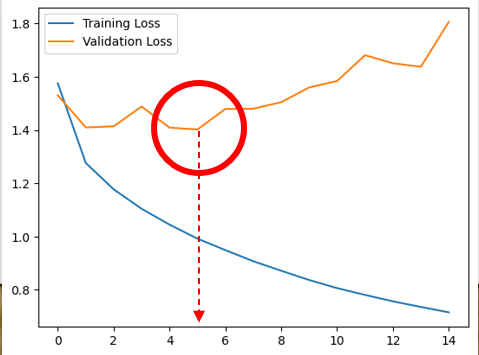

---

title: "AI 부트캠프 16주"

excerpt: "코드스테이츠와 함께하는 'AI 부트캠프' 16주차 회고"

categories:
    - AIB Log

tags:
    - 개발일지
    - 코딩
    - AI 부트캠프
    - 코드스테이츠

header:
    teaser: /assets/images/aib/codestates-ci.png

last_modified_at: 2023-04-12

---


<br><br><br><br>


{: .align-center width="70%"}  


<br><br><br><br>


# 코드스테이츠와 함께하는 'AI 부트캠프' 16주차  

> S4-Week4 : Project  


<br><br><br><br>


## 주간 회고
### 더 공부가 필요한 부분  
- Docker를 활용한 프론트엔드와 백엔드 환경 동기화
- 프론트엔드와 백엔드 사이의 데이터 파이프라인 연결
- 각종 대시보드 작성
{: .notice--danger}


<br><br>


### 5F 회고  

- **사실(Fact)**  
데이터수집, 모델 구성, 대시보드 분석, 웹페이지 배포 기술을 집약시켜 섹션 프로젝트를 진행하였다.  

- **느낌(Feeling)**  
그래서 나는 영끌한 느낌이 들었다.  

- **교훈(Finding)**  
하나의 서비스제공을 위해서는 정말 다양한 기술이 총동원되어야 한다. 하나의 서비스를 전체적으로 기획하고 만들고 배포해보니깐 어디가 부족한지 보인다.  

- **향후 행동(Future action)**  
다양한 프로젝트를 진행하며 부족한 부분을 채워 나가겠다. 팀 프로젝트를 경험하면 더욱 도움이 될 것 같다.  

- **피드백(Feedback)**  
피드백을 해 주세요😀
{: .notice--primary}


<br><br><br><br>


## 도입
> Section4에서는 정말 다양한 것을 배웠다.  
데이터 엔지니어링을 위한 **데이터베이스 활용**방법 뿐만이 아니라, 데이터 수집을 위한 **스크래핑과 API** 사용 방법, **Docker**를 활용한 가상환경 사용법, 데이터를 효과적으로 제공하기 위한 **대시보드** 작성법과 **프론트엔드** 구현까지 매일 새로운 것을 배웠다.  
이 모든 것을 집약시킨 프로젝트를 수행하려고 한다.  

- 사용한 기술
  - 사용 언어 : Python
  - 웹 프레임 워크 : Django
  - 감성대화 말뭉치 : AI Hub , JSON
  - 감정분류 모델 : Tensorflow, Transformer
  - AIB_17 주간회고 : Selenium
  - 데이터베이스 : MongoDB  
  - 대시보드 : Looker Studio
  - 배포 : AWS, Gabia
{: .notice--danger}


<br><br>


### 프로젝트 계획  

<table style="width : 80%; margin : auto;">
  <tbody style="width : 100%; display : table;">
    <tr style="border-bottom : 3px solid gray; background-color : #88bb88;">
      <th style="width : 40%; text-align : center;">날짜</th>
      <th style="width : 60%; text-align : center;">내용</th>
    </tr>
    <tr>
      <td style="width : 40%; text-align : center;">4/7 (금)</td>
      <td>• 프로젝트 START🚀 <br> • 프로젝트 계획 <br> • 주제선정</td>
    </tr>
    <tr>
      <td style="width : 40%; text-align : center;">4/8 (토)</td>
      <td>• 데이터 선정 <br> • 데이터 수집 <br> • 데이터 전처리 </td>
    </tr>
    <tr>
      <td style="width : 40%; text-align : center;">4/9 (일)</td>
      <td>• 모델링 </td>
    </tr>
    <tr>
      <td style="width : 40%; text-align : center;">4/10 (월)</td>
      <td>• 모델 해석 <br> • 대시보드 작성 </td>
    </tr>
    <tr>
      <td style="width : 40%; text-align : center;">4/11 (화)</td>
      <td>•프론트엔드 구현 <br> • 배포</td>
    </tr>
    <tr>
      <td style="width : 40%; text-align : center;">4/12 (수)</td>
      <td>• PPT 슬라이드 작성 <br> • 스크립트 작성 <br> • 영상촬영 <br> • 최종 제출🚩</td>
    </tr>
    <tr>
      <td style="width : 40%; text-align : center;">4/13 (목)</td>
      <td>• 피드백 <br> • 프로젝트 수정 및 보완</td>
    </tr>
  </tbody>
</table>


<br><br>


### 서비스 개발 취지  
- 거의 매일 **감정**을 요청받음  

{: .align-center width="70%"}  

- 하지만 감정에 서툰 사람들 ~~필자와 같은 T들~~ 에게는 매일 감정을 살피는 것이 어려움  
- 만약 AI가 대신 우리의 감정을 알려줄 수 있다면 참 편리할 것임

{: .align-center width="50%"}  

- 그래서 **'AI감정분류, 감정 모니터링 서비스'**를 만들기로 함  

<br>

#### 완성된 '감정분류, 모닝터링' 서비스 미리 보기

- ['감정분류, 모닝터링' 바로가기](http://leeyj85.shop/emochat/){:target="_blank"}  

<div style="width : 80%; margin : auto;">
  <a href="http://leeyj85.shop/emochat/" target="_blank">
    
  </a>
</div>  

<br>

#### 프로젝트 발표 영상 보기




<br><br><br><br>


## 개발 과정  
### 준비  
- 프로젝트 시작 하루 전, 지난 기수의 프로젝트 가운데 미리 생각하고 준비하던 프로젝트 발견함!!(~~레시피 추천 서비스~~)😲😱

{: .align-center width="40%"}  

- 급하게 프로젝트 주제를 다시 선정하기로 함😭  
- 지난 섹션3 프로젝트에서 만든 [**'나만의 AI 챗봇'**](https://leeyeonjun85.github.io/home/aib%20log/AIB_12week/){:target="_blank"}  을 발전시켜 이번 프로젝트를 진행하기로 결정🐤  

<br>

#### 서비스 개발 과정

{: .align-center width="90%"}  


<br><br>


### 데이터 수집 및 모델링  
#### 감성대화 말뭉치 데이터  
- 지난 섹션3 프로젝트와 동일한 AI Hub의 `감성대화말뭉치`를 사용
- 이미 다루어본 데이터여서 쉽게 전처리 진행😁
    - 전처리 함수  

    ```python
    def parsing_corpus(js):
        """
        JSON 파일에서 감정상태, 질문과 답변 데이터를 추출하여
        판다스 데이터프레임 형태로 반환하는 함수

        PARAMS :
            js : JSON 파일 이름
        RETURN :
            df_data : 판다스 데이터프레임
        """
        KEY_NAME = ["분노","슬픔","불안","상처","당황","기쁨"]
        E_list  = [ int(js[x]["profile"]["emotion"]["type"][1:]) for x in range(len(js)) ]
        Q1_list = [ js[x]["talk"]["content"]["HS01"] for x in range(len(js)) ]
        Q2_list = [ js[x]["talk"]["content"]["HS02"] for x in range(len(js)) ]
        Q3_list = [ js[x]["talk"]["content"]["HS03"] for x in range(len(js)) ]
        A1_list = [ js[x]["talk"]["content"]["SS01"] for x in range(len(js)) ]
        A2_list = [ js[x]["talk"]["content"]["SS02"] for x in range(len(js)) ]
        A3_list = [ js[x]["talk"]["content"]["SS03"] for x in range(len(js)) ]
        EC_list = [ x//10 - 1 for x in E_list ]
        ECK_list = [ KEY_NAME[x] for x in EC_list ]

        df_data = pd.DataFrame( {"E"    : E_list ,
                                "EC"   : EC_list ,
                                "ECK"  : ECK_list , 
                                "Q1"   : Q1_list ,
                                "A1"   : A1_list ,
                                "Q2"   : Q2_list ,
                                "A2"   : A2_list ,
                                "Q3"   : Q3_list ,
                                "A3"   : A3_list} )

        return df_data

    def load_json(path):
        """
        입력받은 경로에어 JSON파일을 읽고, 데이터를 JSON 형태로 반환하는 함수
        """
        JSON_FILE = open(path)
        JSON_DATA = json.loads(JSON_FILE.read())
        JSON_FILE.close()
        return JSON_DATA
    ```  

    - Train Data : 51,628개
        - 불안 : 9,319 개
        - 분노 : 9,160 개
        - 상처 : 9,142 개
        - 슬픔 : 9,125 개
        - 당황 : 8,756 개
        - 기쁨 : 6,126 개
    - Test Data : 6,640개

- KoElectra Tokenizer 활용하여 빠르게 토큰화 벡터화 진행

<br>

#### 트랜스포머 분류모델  
- 원래 트랜스포머 모델은 인코더와 디코더가 결합된 언어모델이지만, `인코더만 활용하여 분류모델로도 사용`할 수 있음  
- Tensorflow 라이브러리를 적극 활용하여 간단하게 모델 구성  
    - 트랜스포머 인코더 블럭  
    ```python
    class TransformerBlock(layers.Layer):
        def __init__(self, embed_dim, num_heads, ff_dim, rate=0.1):
            super(TransformerBlock, self).__init__()
            self.att = layers.MultiHeadAttention(num_heads=num_heads, key_dim=embed_dim)
            self.ffn = keras.Sequential(
                [layers.Dense(ff_dim, activation="relu"), layers.Dense(embed_dim),]
            )
            self.layernorm1 = layers.LayerNormalization(epsilon=1e-6)
            self.layernorm2 = layers.LayerNormalization(epsilon=1e-6)
            self.dropout1 = layers.Dropout(rate)
            self.dropout2 = layers.Dropout(rate)

        def call(self, inputs, training):
            attn_output = self.att(inputs, inputs)  
            attn_output = self.dropout1(attn_output, training=training)
            out1 = self.layernorm1(inputs + attn_output)  
            ffn_output = self.ffn(out1)  
            ffn_output = self.dropout2(ffn_output, training=training)
            return self.layernorm2(out1 + ffn_output)  
    ```  

    - 포지션 임베딩  
    ```python
    class TokenAndPositionEmbedding(layers.Layer):
        def __init__(self, maxlen, vocab_size, embed_dim):
            super(TokenAndPositionEmbedding, self).__init__()
            self.token_emb = layers.Embedding(input_dim=vocab_size, output_dim=embed_dim)
            self.pos_emb = layers.Embedding(input_dim=maxlen, output_dim=embed_dim)

        def call(self, x):
            maxlen = tf.shape(x)[-1]
            positions = tf.range(start=0, limit=maxlen, delta=1)
            positions = self.pos_emb(positions)
            x = self.token_emb(x)
            return x + positions
    ```  

    - 학습률 조정  

    ```python
    class CustomSchedule(tf.keras.optimizers.schedules.LearningRateSchedule):
    def __init__(self, d_model, warmup_steps=3000):
        super().__init__()

        self.d_model = d_model
        self.d_model = tf.cast(self.d_model, tf.float32)

        self.warmup_steps = warmup_steps

    def __call__(self, step):
        step = tf.cast(step, dtype=tf.float32)
        arg1 = tf.math.rsqrt(step)
        arg2 = step * (self.warmup_steps ** -1.4)

        return tf.math.rsqrt(self.d_model) * tf.math.minimum(arg1, arg2)
    ```  

    - 다음과 같은 분류 모델 생성

{: .align-center width="70%"}  

- 모델 학습
    - EarlyStopping()으로 14epoch에서 학습 종료  
    {: .align-center width="70%"}   

    - ModelCheckpoint()메소드로 학습된 모델 저장  
    - Test loss, acc : [0.95, 0.67]  


<br><br>


### 스크래핑, 데이터 적제  
- 학습된 모델에 적용시킬 분석데이터를 스크래핑

<br>

#### 디스코드 주간회고 데이터 스크래핑
- 디스코드의 AIB_17 주간회고는 다음과 같음  
{: .align-center width="90%"}  

- Reflection 채널에서 스크롤로 올라가며 스크래핑을 해야 하기 때문에 동적 스크래핑을 할 수 있는 Selenium 사용  
- 조금 스크롤해 올라가서 데이터를 수집하고, 또 조금 올라가서 데이터를 수집하는 방식으로 데이터가 중복되더라도 일단 수집한 다음, 중복데이터를 처리하는 방식🚗  

<br>

#### MonggoDB로 데이터 적제
- 처음에는 PostgreSQL로 적제하였으나, ASW서버의 우분투 환경에 psycopg2 패키지가 설치되지 않아서, MongoDB로 변경함  
  - AWS서버의 우분투 환경에 SQL관련 서비스를 설치하기 위해서는 따로 작업이 필요한 것 같음
- 4월12일 수집된 데이터가 1,551개로 나오지만, 스크랩 사이트이름, 시간 등의 메타데이터 1개가 추가된 개수이기 때문에 실재 수집된 데이터는 1550개  
- 사용자 인증에 사용하기 위하여 회원명단을 따로 데이터베이스화 하였음  
- "AI_emotion_log"은 웹서비스 API를 사용한 로그기록을 남기기 위한 콜랙션임  

{: .align-center width="90%"}  

<br>

#### 데이터 파싱, 모델 적용
- 정규표현식을 이용하여 데이터 파싱
- 파싱한 데이터를 트랜스포머 분류모델에 적용하여 감정 점수 추출
- Looker Studio와 MongoDB의 직접 연결이 어려워 감정점수가 추가 된 데이터를 CSV로 변환하여 Looker Studio로 데이터 추가
  - 구글스프래드시트를 중간에 연결고리로 활용하여 MongoDB와 Looker Studio의 파이프라인 연결이 가능할 것으로 보임(연구 중🔥)


<br><br>


### 대시보드 적용과 프론트엔드 작업
#### Looker Studio 활용 대시보드 만들기
- MS에서 만들어서 믿음이 가고, 웹에서 자유롭게 대시보드 작성이 가능한 Looker Studio를 대시보드 툴로 선택📌
  - 웹에서 대시보드를 만든다는 것이 이렇게 에러가 많을 줄 몰랐음😭
  - 밤새워 Looker Studio로 만든게 아까워서 바꾸지 않음  
  - ~~다음에는 태블로 할거야!!~~
  - PostgreSQL을 연결하려 하였으나 데이터 추가에 실패함(~~모두 다 Looker의 에러 때문~~)
- 대시보드를 `<iframe>`으로 추가할 때 사이즈가 고정되고, 반응형 적용이 안되는 문제가 발생함
  - 부트스트랩 `.continer`에 사이즈가 자동으로 반응하지 않음

<br>

#### Django 프레임워크 활용하여 배포
- 이미 Django를 활용하여 배포한 홈페이지에 간단히 어플만 추가하여 프론트엔드 페이지 구성
- AWS 우분투에 `tensorflow`라이브러리 설치하니깐 tensorflow 2.6 이 설치가 됨😧
  - tenforflow는 최소 2.7이상 필요하고, 2.12이 최신임
  - 기존 AWS 서버가 우분투 18에 파이썬 3.6이 설치되어있었기 때문...
  - 파이선 버전이 낮아서 tenfowflow 2.6이 설치된 것임

{: .align-center width="40%"}  

- 결국 AWS EC2 서버를 통째로 교채함😭
  - 기존 서버 반납하고, 새로 받으니 우분투 22.04가 깔려있음
  - 파이썬 설치하니깐 3.10.6으로 깔림
  - 다행히 나는 git을 통해서 홈페이지 소스를 받기 때문에 git clone으로 간단히 복구완료😎
  - 온갖 라이브러리 최신으로 교체완료🎉
  - 종종 이렇게 서버 교채해주면 좋을 것 같음👍


<br><br><br><br>


## 개발 후기🌈
- 하나의 서비스를 완성하기 위하여 정말 많은 기술이 필요함을 느꼈음  
  - 데이터 수집을 위한 스크래핑, API 사용법
  - 데이터 가공과 적제를 위한 데이터베이스 사용법
  - 데이터 분석을 위한 모델링(머신러닝, 딥러닝) 기술
  - 분석 결과를 효과적으로 전달하기 위한 시각화, 대시보드 사용법
  - 웹페이지 서비스 배포를 위한 기본적인 프론트엔드, 백엔드 기술
- 시간적인 제약, 역량의 한계로 타협해야하는 순간이 많았음
  - 트랜스포머 모델의 성능을 더 올리고 싶지만 타협
  - 대시보드와 웹페이지를 더 다양하게 꾸미고 싶지만 타협
- 문제가 생기면 문제를 해결하는 것이 가장 좋겠지만, 다른 가능한 방법으로 대체하는 것도 좋음
  - AWS에서 RDB를 사용하는 것이 여의치 않아서 바로 MongoDB로 전환


<br><br><br><br>  


- 분류 모델의 성능은... ~~정확하다~~ 😁

{: .align-center width="90%"}  


<br><br><br><br>  
<center>  
<h1>끝까지 읽어주셔서 감사합니다😉</h1>  
</center>  
<br><br><br><br>  


