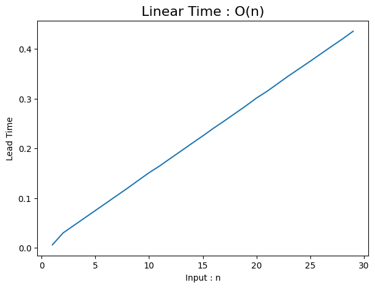

---

title: "AI 부트캠프 17주"

excerpt: "코드스테이츠와 함께하는 'AI 부트캠프' 17주차 회고"

categories:
    - AIB Log

tags:
    - 개발일지
    - 코딩
    - AI 부트캠프
    - 코드스테이츠

header:
    teaser: /assets/images/aib/codestates-ci.png

last_modified_at: 2023-04-24

---


<br><br><br><br>


{: .align-center width="70%"}  


<br><br><br><br>


# 코드스테이츠와 함께하는 'AI 부트캠프' 17주차  

## Section 5 : 컴퓨터 공학 기본 (Computer Science)  
> S5-Week 1 : Python and Problem Solving


<br><br><br><br>


## 주간 회고
### 더 공부가 필요한 부분  
- 시간복잡도를 효율적으로 관리하는 리팩토링을 해보고, 실제로 어느 정도 효율이 생기는지 확인해보고싶다.
{: .notice--danger}


<br><br>


### 5F 회고  

- **사실(Fact)**  
프로그래밍을 통한 문제해결 과정, 이에 필요한 다양한 메소드 사용법과 효율적인 코드 작성법에 대하여 학습하였다.  

- **느낌(Feeling)**  
시간복잡성에 대하여 학습하면서 그동안 추상적 개념으로만 가지고 있던 '효율성'을 구체적 개념으로 가져올 수 있어서 좋았다.  

- **교훈(Finding)**  
학습한 개념을 코드로 구체화 하면서 학습하니깐 이해가 더 잘 된다.  

- **향후 행동(Future action)**  
개념으로 정리하고 코드로 구체화하는 과정을 블로깅하면서 연습하겠다.  

- **피드백(Feedback)**  
피드백을 해 주세요😀
{: .notice--primary}


<br><br><br><br>

## N511 : Python Programming
{: style="text-align: center;"}

<br><br><br><br>


### Daily Reflection : 3L 회고
#### 배운 것(Learned)
깊은 복사(`copy.deepcopy()`)는 완전히 새로운 객체를 만드는 것이고, 약은 복사(`copy()`)는 수정하면 영향을 받는다.
{: .notice--success}

#### 아쉬웠던 점(Lacked)
lambda가 익숙치 않아서 어떠한 상황에서 효과적인지 잘 모르겠다. lambda의 다양한 예시를 찾아보아야 겠다.
{: .notice--danger}

#### 좋았던 점(Liked)
동료의 코드를 참조하며 다양한 문제해결 방법을 배울 수 있어서 좋았다. 오랜만에 동기들 목소리 들을 수 있어서 좋았다.
{: .notice--primary}


<br><br>

### 개요  
#### 🏆 학습 목표  
- **문제해결**을 위해 파이썬을 활용하고, `함수`, `반복`과 `조건`개념에 익숙해지기
- 파이썬 다양한 `메소드`에 대해 **내부로직**을 생각하면서 어떤 상황에서 활용되는지 익히기
- 다양한 코드를 활용하여 컬렉션 자료형(`리스트, 튜플, 셋, 딕셔너리`)에 대해 익히기
- 현실상황을 수학적 기초개념(사칙연산)으로 프로그래밍하는데 익숙해지기
- `자료구조`와 `알고리즘`을 이해하며 프로그래밍하기
- 문제해결과 `컴퓨팅 사고력` 기르기

<br>

#### 키워드
반복문과 조건문, 내장 메소드, 프로그래밍


<br><br>


### 학습

#### 반복문과 조건문
- `if()` 의 주요 형태  

```python
def ageis(age):
    if age >= 20:
        print("성인입니다.")
    elif age < 14:
        print("어린이입니다.")
    else:
        print("청소년입니다.")

ageis(16)   # 청소년입니다.
ageis(3)    # 어린이입니다.
ageis(38)   # 성인입니다.
```

- `for문`

```python
# 리스트 for
test_list = ['one', 2, 'three']
for i in test_list: 
    print(i)

# 튜플 for
test_tup = [(1,2), (3,4), (5,6)]
for (first, last) in test_tup:
    print(first + last)

# 딕셔너리 for
test_dict = {"이름":"이연준", "나이":39}
for val in test_dict:
    print(val)
for val in test_dict.keys():
    print(val)
for val in test_dict.values():
    print(val)
for key, val in test_dict.items():
    print(key, val)
```

```cmd
✅ 출력결과
one
2
three
3
7
11
이름
나이
이름
나이
이연준
39
이름 이연준
나이 39
```

- 리스트 컴프리헨션(List Comprehension)

```python
# for 반복문으로 리스트 만들기
numbers = []
for n in range(0, 10):
    numbers.append(n)
print(numbers)

# 리스트 컴프리헨션
numbers = [x for x in range(10)]
print(numbers)

# ✅ 출력결과
# [0, 1, 2, 3, 4, 5, 6, 7, 8, 9]
# [0, 1, 2, 3, 4, 5, 6, 7, 8, 9]
```

- 리스트 컴프리헨션의 작동 순서  
    - 앞 리스트부터 실행  

```python
[ f"{x}을 {z}! 후식은 {y}~" for x in ['쌈밥', '치킨'] for y in ['사과', '아이스크림', '커피'] for z in ['배달 시키기', '가서 먹기'] ]

# ✅ 출력결과
# ['쌈밥을 배달 시키기! 후식은 사과~',
#  '쌈밥을 가서 먹기! 후식은 사과~',
#  '쌈밥을 배달 시키기! 후식은 아이스크림~',
#  '쌈밥을 가서 먹기! 후식은 아이스크림~',
#  '쌈밥을 배달 시키기! 후식은 커피~',
#  '쌈밥을 가서 먹기! 후식은 커피~',
#  '치킨을 배달 시키기! 후식은 사과~',
#  '치킨을 가서 먹기! 후식은 사과~',
#  '치킨을 배달 시키기! 후식은 아이스크림~',
#  '치킨을 가서 먹기! 후식은 아이스크림~',
#  '치킨을 배달 시키기! 후식은 커피~',
#  '치킨을 가서 먹기! 후식은 커피~']
```

<br>

#### 정규표현식

- 자주 사용하는 문자 클래스

| 문자 규칙 |     의미       |     설명       |
|:---------:|:-------------:|:-------------:|
| \d | 숫자와 매치 | [0-9]와 동일한 표현식이다. |
| \D | 숫자가 아닌 것과 매치 | [^0-9]와 동일한 표현식이다. |
| \s | whitespace 문자와 매치 | [ \t\n\r\f\v]와 동일한 표현식이다. 맨 앞의 빈 칸은 공백문자(space)를 의미한다. |
| \S | whitespace 문자가 아닌 것과 매치 | [^ \t\n\r\f\v]와 동일한 표현식이다. |
| \w | 문자+숫자(alphanumeric)와 매치 | [a-zA-Z0-9_]와 동일한 표현식이다. |
| \W | 문자+숫자(alphanumeric)가 아닌 문자와 매치 | [^a-zA-Z0-9_]와 동일한 표현식이다. |


- 자주 사용되는 정규표현식의 메소드

| 모듈 함수          |     설명       |
|:---------:|:-------------:|
| re.compile()	    | 정규표현식을 컴파일하는 함수입니다. 다시 말해, 파이썬에게 전해주는 역할을 합니다. 찾고자 하는 패턴이 빈번한 경우에는 미리 컴파일해놓고 사용하면 속도와 편의성면에서 유리합니다. |
| re.search()	    | 문자열 전체에 대해서 정규표현식과 매치되는지를 검색합니다. |
| re.match()	    | 문자열의 처음이 정규표현식과 매치되는지를 검색합니다. |
| re.split()	    | 정규 표현식을 기준으로 문자열을 분리하여 리스트로 리턴합니다. |
| re.findall()	    | 문자열에서 정규 표현식과 매치되는 모든 경우의 문자열을 찾아서 리스트로 리턴합니다. 만약, 매치되는 문자열이 없다면 빈 리스트가 리턴됩니다. |
| re.finditer()	    | 문자열에서 정규 표현식과 매치되는 모든 경우의 문자열에 대한 이터레이터 객체를 리턴합니다. |
| re.sub()	        | 문자열에서 정규 표현식과 일치하는 부분에 대해서 다른 문자열로 대체합니다. |


- 복잡한 정규식은 써 놓고 나중에 보면 한 줄밖에 안 되는 주제에 읽기 힘들다.  
  그래서 정규식 내부에 주석을 넣는 기능이 있다.  
  옵션 중 하나인 re.VERBOSE 옵션을 사용하기만 하면 된다.  
  약자는 re.X이다.

```python
import re

# 읽기 힘든 정규식
charref = re.compile(r'&[#](0[0-7]+|[0-9]+|x[0-9a-fA-F]+);')

# 주석을 달아준 정규식
charref = re.compile(r"""
 &[#]                # Start of a numeric entity reference
 (
     0[0-7]+         # Octal form
   | [0-9]+          # Decimal form
   | x[0-9a-fA-F]+   # Hexadecimal form
 )
 ;                   # Trailing semicolon
""", re.VERBOSE)
```


<br><br><br><br>

## N512 : Problem Solving
{: style="text-align: center;"}

<br><br><br><br>


### Daily Reflection : 3L 회고
#### 배운 것(Learned)
의사코드를 통하여 알고리즘을 미리 준비할 수 있고, 협업에도 도움이 될 수 있다.
{: .notice--success}

#### 아쉬웠던 점(Lacked)
가위바위보 게임 만드는 것에 푹 빠져서 학습에 소흘했던 것 같다.
{: .notice--danger}

#### 좋았던 점(Liked)
동료들과 가벼운 마음으로 코드를 함께 작성하는 과정이 재미있었다.
{: .notice--primary}


<br><br>


### 개요  
#### 🏆 학습 목표  
- 프로그래밍 진행과정
- 파이썬을 활용한 실습 및 `예외처리`
- `알고리즘`을 위한 논리적 방법
- `자료구조`와 `알고리즘`을 이해하며 프로그래밍하기
- 문제해결과 `컴퓨팅 사고력` 기르기

<br>

#### 키워드

문제해결
의사코드
컴프리헨션


<br><br>


### 학습

#### 의사코드(pseudocode, 슈도코드)

```bash
# 의사코드 예시

function div
For반복문 (i = 1부터 i<=10까지, 반복할때마다 i값 1씩 증가) 
{
    If i가 3으로 나눠지는 경우,
        print 3으로 나눠진다.
    If i is divisible by 5
        print 5로 나눠진다.
    If print_number, print i.
    print 줄바꿈.
}
```

```python
# 실제 코드

def div():
  for i in range(1,11):
    if i % 3 == 0: # i를 3으로 나눴을 때 나머지가 0인 경우
      print('숫자',i, '=>','3으로 나눠짐')
    elif i % 5 == 0: # i를 5로 나눴을 때 나머지가 0인 경우
      print('숫자',i, '=>','5로 나눠짐')
    else: 
      print('그외',i, '=>','숫자 3과 5로 나눠지지 않음')
    
div()
```

- 의사코드를 쓰면 좋은점
  - 코드 작성 시간 단축
  - 디버깅에 용이
  - 프로그래밍 언어가 다른 사람, 모르는 사람과 소통할 수 있음

<br>

#### 예외처리

- `for ~ else ~`

```python
for i in range(3):
    print('loop : ', i) # 1) 루프반복수행
    if i == 1:
        break     # break는 어떤 영향을 줄 것인가?
else: 
    print('break가 실행되지 않았습니다.') # 2) else 구문 추가수행
```

<br>

#### 가위바위보 게임 만들기

- `rsp_class.py` 만들기
    ```python
    # rsp_class.py
    import random
    import time

    class RockScissorPaper:
        def __init__(self):
            self.choice_options = {
                "1" : "가위",
                "2" : "바위",
                "3" : "보",
                "0" : "게임종료"
            }
            self.score = {
            "사용자승": 0,
            "무승부": 0,
            "사용자패": 0
            }
            
            time.sleep(0.2)
            self.user_name = input("사용자 이름을 입력해주세요 : ")
            self.game_main()

        def game_main(self):
            main_message = f"""😄 {self.user_name}님~! 환영합니다~🎉"""
            print(main_message)
            
            main_choice = input(f"😄 숫자를 입력하세요. ([0] 게임종료  [1] 게임시작) 😉 : ")
            if main_choice == '0':
                self.game_end()
            elif main_choice == '1':
                self.game_start()
            else:
                self.game_main()
        
        def game_end(self):
            print(f"\n{'='*10} 😎 게임을 종료합니다 🚀 {'='*10}\n최종 스코어 : {self.score}")
            
        def game_start(self):
            print(f"{'='*10} 🚀 게임시작 🚀 {'='*10}")
            user_choice = self.get_user()
            
            while user_choice != "게임종료":
                time.sleep(0.2)
                computer_choice = self.choice_options[str(random.randint(1, 3))]
                time.sleep(0.2)
                result = self.compare_choices_and_get_result(user_choice, computer_choice)
                time.sleep(0.2)
                self.display_result_message_and_update_score(result)
                time.sleep(0.2)
                user_choice = self.get_user()
            
            self.game_end()
            
        def get_user(self):
            choice = input(f"😄 [1] 가위   [2] 바위   [3] 보 ([0] 게임종료) : ")
            if choice in ['1', '2', '3', '0']:
                return self.choice_options[choice]
            else:
                self.get_user()
        
        def compare_choices_and_get_result(self, user, computer):
            print(f"{self.user_name:<10s} : {user}\n{'컴퓨터':<10s} : {computer}")
            if user == computer:
                return "무승부"
            elif (user == "바위" and computer == "가위") or (user == "보" and computer == "바위") or (user == "가위" and computer == "보"):
                return "사용자승"
            else:
                return "사용자패"
        
        def display_result_message_and_update_score(self, result):
            win_message = f"결과 : 🎉 {self.user_name} 승 🎉"
            loss_message = f"결과 : 😭 {self.user_name} 패 😭"
            tie_message = "결과 : 😵 무승부 😵"

            if result == "무승부":
                print(tie_message)
                self.score["무승부"] += 1
            elif result == "사용자승":
                print(win_message)
                self.score["사용자승"] += 1
            else:
                print(loss_message)
                self.score["사용자패"] += 1
            
            print(f"{self.score}\n{'='*50}\n")

    ```

- `rsp_class.py`가 있는 폴더에서 gitbash로 실행
    ```bash
    # ./rsp_class.py
    $ python
    >>> from rsp_class import RockScissorPaper
    >>> game_start = RockScissorPaper()
    ```

- 게임 실행 결과  
    ```cmd
    사용자 이름을 입력해주세요 : 이연준
    😄 이연준님~! 환영합니다~🎉
    😄 숫자를 입력하세요. ([0] 게임종료  [1] 게임시작) 😉 : 1
    ========== 🚀 게임시작 🚀 ==========
    😄 [1] 가위   [2] 바위   [3] 보 ([0] 게임종료) : 1
    이연준        : 가위
    컴퓨터        : 바위
    결과 : 😭 이연준 패 😭
    {'사용자승': 0, '무승부': 0, '사용자패': 1}
    ==================================================

    😄 [1] 가위   [2] 바위   [3] 보 ([0] 게임종료) : 2
    이연준        : 바위
    컴퓨터        : 가위
    결과 : 🎉 이연준 승 🎉
    {'사용자승': 1, '무승부': 0, '사용자패': 1}
    ==================================================

    😄 [1] 가위   [2] 바위   [3] 보 ([0] 게임종료) : 3
    컴퓨터        : 가위
    결과 : 😭 이연준 패 😭
    {'사용자승': 1, '무승부': 0, '사용자패': 2}
    ==================================================

    😄 [1] 가위   [2] 바위   [3] 보 ([0] 게임종료) : 0

    ========== 😎 게임을 종료합니다 🚀 ==========
    최종 스코어 : {'사용자승': 1, '무승부': 0, '사용자패': 2}
    ```


<br><br><br><br>

## N513 : Python with OOP
{: style="text-align: center;"}

<br><br><br><br>


### Daily Reflection : 3L 회고
#### 배운 것(Learned)
OOP를 잘하기 위해서는 Class의 각종 기능에 익숙해야 한다.
{: .notice--success}

#### 아쉬웠던 점(Lacked)
OOP의 주요개념, 캡슐화, 다형성, 추상화, 상속에 대한 개념이 아직 부족한 것 같다.
{: .notice--danger}

#### 좋았던 점(Liked)
그냥 가져다쓰던 각종 라이브러리도 결국 Class로 이루어져있음을 소스코드로 확인하니 더욱 라이브러리에 가까워진 느낌이어서 좋았다.
{: .notice--primary}


<br><br>


### 개요  
#### 🏆 학습 목표  
- `OOP`에 대한 기본개념을 숙지
- 소스코드를 통해 OOP의 기본개념을 파악
- OOP와 다른 프로그래밍 패러다임의 차이
- `자료구조`와 `알고리즘`을 이해하며 프로그래밍하기
- 문제해결과 `컴퓨팅 사고력` 기르기

<br>

#### 키워드
OOP 기본컨셉, 클래스 설계


<br><br>


### 학습

#### OOP(Object-Oriented Programming)

- 내가 생각하는 OOP의 핵심 = <mark>재사용</mark>
- 단, 무분별하게 재사용하면 유지보수가 어려워질 수 있기 때문에 효율성과 유지보수를 함께 생각하면서 프로그래밍을 하자

#### 캡슐화, 다형성, 추상화, 상속

{: .align-center width="90%"} 

- 캡슐화 : 속성과 변수, 함수를 클래스로 묶는 것
- 상속(Inheritance)
  - 상위 클래스의 모든 기능(함수+변수)을 재사용할 수 있음
- 포함(Composition)
  - 다른 클래스의 일부 기능(함수)만을 재사용
- 추상화 : 기능이 없는 상위클래스
  - 추상클래스를 생성하여 의사코드와 비슷한 역할을 할 수 있음
- 다형성 : 오버라이딩과 같은 경우


<br><br><br><br>

## N514 : DataStructure Essential
{: style="text-align: center;"}

<br><br><br><br>


### Daily Reflection : 3L 회고
#### 배운 것(Learned)
파이써닉한 코딩을 하기 위해서는 복잡성을 고려해야 한다.
{: .notice--success}

#### 아쉬웠던 점(Lacked)
복잡도의 개념 학습에서 용어가 정리되지 않아서 힘들었다. 조금 더 쉬운 단어로 학습할 수 있는 컨텐츠가 있으면 좋겠다.
{: .notice--danger}

#### 좋았던 점(Liked)
자료구조와 복잡성을 고려하며 코딩을 하니깐 조금 더 파이썬 개발자에 가까워진 느낌이 들어서 좋았다.
{: .notice--primary}


<br><br>


### 개요  
#### 🏆 학습 목표  
- `데이터를 활용하는 입장`과 `컴퓨터 내부`동작
- 알고리즘 효율성에 대한 내용인 자료구조의 `Big O` 및 `복잡도` 개념에 대해 배운다.
- `알고리즘`을 위한 논리적 방법
- `자료구조`와 `알고리즘`을 이해하며 프로그래밍하기
- 문제해결과 `컴퓨팅 사고력` 기르기

<br>

#### 키워드
참조와 할당, 성능, 빅오표기법(시간복잡도, 공간복잡도)


https://pythontutor.com/


### 학습

#### Big O 표기법

- 알고리즘 실행 효율성에 대해 측정하는 방법
- 데이터 입력값 크기에 따라 알고리즘 실행 속도의 변화를 설명

{: .align-center width="70%"}  

- Contanst Time(상수시간) : O(1)  
    ```python
    def print_one_item(items):
        print(items[1])       # 상수시간(단순하게 하나의 출력)

    print_one_item([0,1,2])
    ```

- Linear Time(선형시간) : O(n) 
    ```python
    total_time = time.time()

    def linear_time_test(n):
        time_check = time.time()
        
        for _ in range(n):  # 하나의 반복문
            time.sleep(0.001)
        
        time_check = time.time() - time_check
        return time_check

    test_n = 30
    y = [linear_time_test(x) for x in range(1, test_n)]
    x = range(1, test_n)

    print(f"전체소요시간 {(time.time() - total_time):.2f}초")
    fig = plt.figure(figsize=(7, 5))
    plt.plot(x, y)
    plt.title(f"Linear Time : O(n)", fontsize = 16, y = 1)
    plt.xlabel("Input : n")
    plt.ylabel("Lead Time")
    plt.show()
    # 전체소요시간 6.52초
    ```  
    {: .align-center width="60%"}  

- Quadratic Time(제곱시간) : O(n^2)  
    ```python
    # Quadratic Time(제곱시간) : O(n^2)
    total_time = time.time()

    def quadratic_time_test(n):
        time_check = time.time()
        
        for i in range(n):      # 중첩반복문
            for j in range(n):
                time.sleep(0.001)
        
        time_check = time.time() - time_check
        return time_check

    test_n = 30
    y = [quadratic_time_test(x) for x in range(1, test_n)]
    x = range(1, test_n)

    print(f"전체소요시간 {(time.time() - total_time):.2f}초")
    fig = plt.figure(figsize=(7, 5))
    plt.plot(x, y)
    plt.title(f"Quadratic Time : O(n^2)", fontsize = 16, y = 1)
    plt.xlabel("Input : n")
    plt.ylabel("Lead Time")
    plt.show()
    # 전체소요시간 128.53초
    ```  
    {: .align-center width="60%"}  

- Log Time : O(logn)
    ```python
    # 로그 시간 : O(logn)
        # 입력값인 n에 따라 출력값인 i의 증가율이 동일하지 않기 때문

    total_time = time.time()

    def log_time_test(n):
        time_check = time.time()
        
        i = 1
        while i < n:    # 반복문
            time.sleep(0.01)
            i *= 2      # i가 두배로 증가(1, 2, 4, 8, 16, 32 ...)
            
        time_check = time.time() - time_check
        return time_check

    test_n = 1000
    y = [log_time_test(x) for x in range(1, test_n)]
    x = range(1, test_n)

    print(f"전체소요시간 {(time.time() - total_time):.2f}초")
    fig = plt.figure(figsize=(7, 5))
    plt.plot(x, y)
    plt.title(f"Log Time : O(n)", fontsize = 16, y = 1)
    plt.xlabel("Input : n")
    plt.ylabel("Lead Time")
    plt.show()
    # 전체소요시간 134.65초
    ```
    {: .align-center width="60%"}  

<br>

#### 이진탐색
- 이진탐색(Binary Search)은 순차탐색(Linear Search)에 비하여 시간효율성이 좋음
- 순차탐색은 O(n), 이진탐색은 O(logn)

{: .align-center width="80%"} 

```python
def binarySearch(array, value, low, high):
	if low > high:
		return -1
	mid = int((low+high) / 2)	# 가운데 인덱스
	if array[mid] > value:		# 가운데 인덱스가 더 크면...
		return binarySearch(array, value, low, mid-1)	# 가운데 인덱스를 최대인덱스로 하여 다시 이진탐색
	elif array[mid] < value:	# 가운데 인덱스가 더 작으면...
		return binarySearch(array, value, mid+1, high)	# 가운데 인덱스를 최소인덱스로 하여 다시 이진탐색
	else:
		return mid

def find_num(input_list, value_to_search):
	answer = []
	for idx, arr in enumerate(input_list):
		arr.sort()		# 이진탐색은 정렬이 되어야 한다
		num_idx = binarySearch(arr, value_to_search, 0, len(arr)-1)	# 이진탐색 후 인덱스 반환
		if num_idx != -1:
			answer.append((idx, num_idx))
	return answer

random.seed(83)		# 랜덤시드 고정
input_list = [random.sample(range(1,11),10) for _ in range(10)]	# 랜덤 정수 리스트 생성
pprint(input_list)	# 생성된 랜덤 정수 리스트 확인
print(find_num(input_list, 7))	# 생성된 리스트에서 7이 있는 인덱스 반환
```

```cmd
✅ 출력결과
[[8, 10, 2, 9, 4, 1, 5, 3, 6, 7],
 [3, 5, 2, 7, 1, 4, 8, 9, 10, 6],
 [8, 4, 10, 2, 1, 6, 5, 7, 3, 9],
 [10, 3, 6, 4, 7, 5, 9, 2, 1, 8],
 [7, 9, 3, 5, 2, 1, 8, 6, 10, 4],
 [10, 1, 2, 4, 5, 6, 7, 9, 3, 8],
 [5, 2, 6, 1, 9, 7, 4, 3, 10, 8],
 [5, 8, 10, 3, 6, 4, 9, 1, 2, 7],
 [9, 5, 1, 10, 4, 6, 7, 3, 8, 2],
 [8, 2, 10, 9, 1, 4, 3, 7, 6, 5]]
[(0, 6), (1, 6), (2, 6), (3, 6), (4, 6), (5, 6), (6, 6), (7, 6), (8, 6), (9, 6)]
```

<br>

#### 삽입정렬(Insertion Sort)  
- 데이터를 하나씩 확인하며 정렬

{: .align-center width="60%"} 

```python
def insertion_sort(arr):
    for end in range(1, len(arr)):  # 입력된 리스트의 길이만큼 반복하며 하나씩 확인
        for i in range(end, 0, -1): # end부터 처음까지 뒤로 하나씩 이동하며 확인
            if arr[i - 1] > arr[i]: # i-1이 i보다 더 크면...
                arr[i - 1], arr[i] = arr[i], arr[i - 1] # 둘의 자리를 바꿔라
    
    return arr

random.seed(83)     # 랜덤 정수 리스트 생성
rand_arr = [random.sample(range(1,101),10) for _ in range(5)]
rand_arr_back = copy.deepcopy(rand_arr)     # 랜덤 정수 리스트 딥카피
sorted_arr = [insertion_sort(arr) for arr in rand_arr]

for i in range(len(rand_arr)):
    print(rand_arr_back[i])     # 랜덤 정수 리스트
    print(sorted_arr[i])        # 정렬 된 리스트
    print('='*50)
```

```cmd
✅ 출력결과
[64, 59, 12, 17, 49, 5, 7, 84, 28, 25]
[5, 7, 12, 17, 25, 28, 49, 59, 64, 84]
==================================================
[23, 40, 11, 7, 53, 20, 46, 39, 72, 26]
[7, 11, 20, 23, 26, 39, 40, 46, 53, 72]
==================================================
[61, 81, 91, 30, 58, 22, 6, 4, 3, 97]
[3, 4, 6, 22, 30, 58, 61, 81, 91, 97]
==================================================
[60, 45, 50, 74, 93, 24, 71, 41, 62, 59]
[24, 41, 45, 50, 59, 60, 62, 71, 74, 93]
==================================================
[77, 42, 57, 30, 18, 97, 92, 53, 81, 66]
[18, 30, 42, 53, 57, 66, 77, 81, 92, 97]
==================================================
```


<br><br><br><br>  
<center>  
<h1>끝까지 읽어주셔서 감사합니다😉</h1>  
</center>  
<br><br><br><br>  


