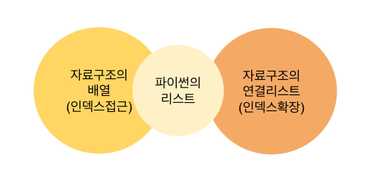
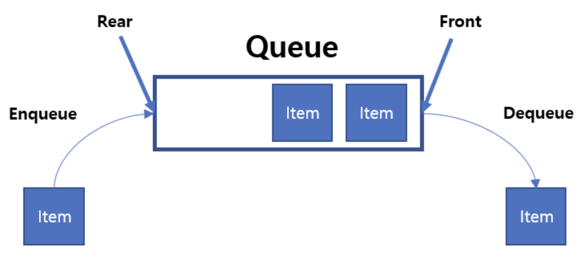
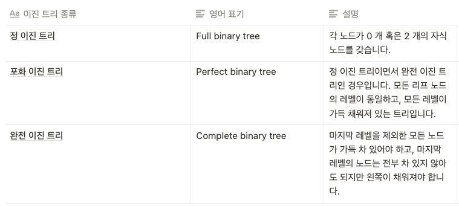

---

title: "AI 부트캠프 18주"

excerpt: "코드스테이츠와 함께하는 'AI 부트캠프' 18주차 회고"

categories:
    - AIB Log

tags:
    - 개발일지
    - 코딩
    - AI 부트캠프
    - 코드스테이츠

header:
    teaser: /assets/images/aib/codestates-ci.png

last_modified_at: 2023-05-01

---


<br><br><br><br>


{: .align-center width="70%"}  


<br><br><br><br>


# 코드스테이츠와 함께하는 'AI 부트캠프' 18주차  

## Section 5 : 컴퓨터 공학 기본 (Computer Science)  
> S5-Week 2 : Data Structure and Algorithm Core


<br><br><br><br>


## 주간 회고
### 더 공부가 필요한 부분  
- 알고리즘의 다양한 응용
{: .notice--danger}


<br><br>


### 5F 회고  

- **사실(Fact)**  
파이썬의 자료구조와 알고리즘에 대하여 학습하였다.  

- **느낌(Feeling)**  
개념을 이해하고 코드를 따라할 수는 있지만 아직 낯설다. 그래서 아직 코딩테스트가 두렵고, 면접때 관련된 질문을 받으면 당황할 것 같다.  

- **교훈(Finding)**  
'학습', 學習 명사 1. 배워서 익히는 일. 익히는 과정이 아직 부족하다.  

- **향후 행동(Future action)**  
다양한 코딩테스트 문제를 풀어보면서 자료구조와 알고리즘에 대하여 익숙해지겠다.  

- **피드백(Feedback)**  
피드백을 해 주세요😀
{: .notice--primary}


<br><br><br><br>

## N521 : DataStructure Fundamental
{: style="text-align: center;"}

<br><br><br><br>


### Daily Reflection : 3L 회고
#### 배운 것(Learned)
큐 == fifo, 스택 == lifo
{: .notice--success}

#### 아쉬웠던 점(Lacked)
자료구조에 대한 이해가 부족한 상태에서 용어의 홍수에서 허우적대서 힘들었다.
{: .notice--danger}

#### 좋았던 점(Liked)
머리는 많이 힘들었지만 가슴은 뿌듯하다.
{: .notice--primary}


<br><br>

### 개요  
#### 🏆 학습 목표  
- 프로그램의 기반이 되는 자료구조와 알고리즘을 반복해서 학습
- 자료구조의 코어가 되는 추상자료형(ADT)과 함께 연결리스트, 큐, 스택의 설계에 대해 익힌다.
- `자료구조`와 `알고리즘`을 이해하며 프로그래밍하기
- 문제해결과 `컴퓨팅 사고력` 기르기

<br>

#### 키워드  
- 추상자료형, 파이썬 내장함수, Data Structure


<br><br>


### 학습

#### 추상자료형(ADT : Abstract Data Type)

- ADT는 추상적으로 필요한 기능을 나열한 일종의 명세서(로직)

<br>

#### 연결리스트(Linked List)

{: .align-center width="70%"}  

- 연결리스트는 참조(또는 포인트)로 구현
- 연결리스트는 길이를 별도로 지정해줄 필요가 없음
- 연결리스트의 각 요소는 참조하는 노드에 저장
  - 여기서 노드는 `컴퓨터의 메모리`라고 이해하면 될 것 같음
  - 여기서 참조는 `연결(next)`이라고 이해하면 될 것 같음

<br>

#### 큐(Queue)

- 선입선출 , FIFO : First In First Out

{: .align-center width="70%"} 

- enqueu : 넣기
- dequeue : 빼기

{: .align-center width="60%"} 


<br>

#### 스택(Stack)

- 후입선출 , LIFO : Last In First Out

{: .align-center width="50%"} 


<br><br><br><br>

## N512 : ataStructure Intermediate
{: style="text-align: center;"}

<br><br><br><br>


### Daily Reflection : 3L 회고
#### 배운 것(Learned)
재귀는 자기자신을 호출한다.
{: .notice--success}

#### 아쉬웠던 점(Lacked)
자습자료는 아직 읽지 못했는데, 주말에 시간내서 공부해보고 싶다.
{: .notice--danger}

#### 좋았던 점(Liked)
디버깅하면서 재귀함수의 동작을 확인하며 이해해서 좋았다.
{: .notice--primary}


<br><br>


### 개요  
#### 🏆 학습 목표  
- 자료구조의 핵심개념인 `검색`과 `재귀`에 대해 익힌다.
- `트리`의 기본을 익힌다.
- `알고리즘`을 위한 논리적 방법
- `자료구조`와 `알고리즘`을 이해하며 프로그래밍하기
- 문제해결과 `컴퓨팅 사고력` 기르기

<br>

#### 키워드
- 검색과 재귀, 트리


<br><br>


### 학습

#### 검색(Searching)  
- 검색하는 컬렉션이 무작위이고 정렬되지 않은 경우, 선형검색이 기본적인 검색방법  
- 반복문, 조건문을 이용한 선형 검색
    ```python
    def linear_search(arr, target):
        for idx in range(len(arr)):
            if arr[idx] == target:
                return idx

        return -1

    print(linear_search([0, 1, 2], 2))
    print(linear_search([0, 1, 2], 3))
    ```

#### 재귀(Recursion)  

- 재귀의 조건
  1. base case(기본 케이스 또는 조건)가 있어야 된다.
  2. 추가 조건과 기본 케이스의 차이를 확인한다.
  3. 반드시 자기 자신(함수)를 호출해야 한다.

- 단점 : 재귀를 사용하면 함수를 반복적으로 호출되는 상황이 벌어지므로, 메모리를 더 많이 사용

- 재귀의 예시 : 1. 일반 선형리스트 방법
    ```python
    # 일반 선형 리스트
    my_list = [1,2,3,4,5]
    def sum_list(items):
        sum = 0
        for i in items:
            sum = sum + i
        return sum

    sum_list(my_list)
    # 1+2+3+4+5 = 15
    ```

- 재귀의 예시 : 2. 위 문제를 하위 문제로 분리  
>1 + 2 + 3 + 4 + 5  
>(1 + (2 + 3 + 4 + 5))  
>(1 + (2 + (3 + 4 + 5)))  
>(1 + (2 + (3 + (4 + 5))))  
>(1 + (2 + (3 + (4 + (5)))))  

- 재귀의 예시 : 3. 재귀함수를 만들기 위한 의사코드를 작성  

    ```cmd
    - 1단계
    sum_list(items)
        if the length of items is 1
            return the 1 item in the list
        
    - 2단계
    sum_list(items)
        if the length of items is 1
            return the 1 item in the list
        otherwise
            return the first item from the list + sum_list(the rest of the items)   
    ```

- 재귀의 예시 : 4. 실재 코드로 작성  
    ```python
    def sum_list(items):
        print("items:", items)
        if len(items) == 1: # Base Case(항목이 1개인 경우가 기본 케이스)
            return items[0] # 재귀하지 않고 출력하고 끝남
        else:
            return items[0] + sum_list(items[1:])  # items[:]는 한 항목씩 감소한다.

    print("sum_list:", sum_list([2, 3, 4, 5]))  # 반복적으로 자기자신을 호출한다.
    ```

- 재귀의 예시 : 5. 재귀함수 해석  
> 1. `sum_list()`함수에 `[2, 3, 4, 5]` 입력되어, 출력은 `items[0] + sum_list(items[1:])`, 곧, `2 + sum_list([3, 4, 5])`가 출력
> 2. "1"에서 출력 된 `2 + sum_list([3, 4, 5])`에서 `sum_list()`함수가 다시 작동, 곧, 재귀하여 `sum_list([3, 4, 5])`가 `3 + sum_list([4, 5])`로 출력되어, `2 + 3 + sum_list([4, 5])`로 됨
> 3. "2"에서 출력 된 것에서, `sum_list([4, 5])`가 재귀하여 `4 + sum_list([5])`로 출력되어, `2 + 3 + 4 + sum_list([5])`가 됨
> 4. "3"에서 출력 된 것에서, `sum_list([5])`는 길이가 1이기 때문에 `5`만 출력되어, 최종 출력은 `2 + 3 + 4 + 5` 가 됨

<br>

#### 재귀함수 예 : 피보나치수열
- 첫째 및 둘째 항이 1이며 그 뒤의 모든 항은 바로 앞 두 항의 합인 수열([위키백과](https://ko.wikipedia.org/wiki/%ED%94%BC%EB%B3%B4%EB%82%98%EC%B9%98_%EC%88%98){:target="_blank"})  

{: .align-center width="50%"} 

- 피보나치수열을 함수식으로 표현하면...  
> $f(1) = 1$  
> $f(2) = 1$  
> $f(3) = 2$  
> $f(4) = 3$  
> $f(5) = 5$  
> $f(6) = 8$  
> $f(7) = 13$  
> 　　······  
> $f(n) = f(n-2) + f(n-1)$

- 의사코드  
    ```cmd
    if
        n이 1 또는 2이면 1을 반환하고 끝
    else
        f(n-2) + f(n-1)을 수행
    ```

- 코드실현  
    ```python
    def fib(n):
        if n == 1 or n == 2:
            return 1
        else:
            return fibo(n-2) + fibo(n-1)

    print(fibo(4))      # f(4) = 3
    print(fibo(6))      # f(6) = 8
    print(fibo(10))     # f(10) = 55
    ```

- 코드해석 : $f(4) = 3$
> - `fib(4)`는 n이 1또는 2가 아니기 때문에 `fib(2) + fib(3)`을 반환
>   - `fib(2)`은 n이 2이기 때문에 <mark>1</mark>을 반환
>   - `fib(3)`은 `fib(1) + fib(2)`를 반환
>       - `fib(1)`은 <mark>1</mark>을 반환
>       - `fib(2)`는 <mark>1</mark>을 반환
> - 최종 <mark>1 + 1 + 1</mark> = 3


- 참고
  
  - [Fibonacci sequence : 위키백과](https://en.wikipedia.org/wiki/Fibonacci_sequence){:target="_blank"}  
  - [[python] 피보나치 수열 만들기 (점프투파이썬 종합문제 5번)](https://velog.io/@cha-suyeon/python-%ED%94%BC%EB%B3%B4%EB%82%98%EC%B9%98-%EC%88%98%EC%97%B4-%EB%A7%8C%EB%93%A4%EA%B8%B0-%EC%A0%90%ED%94%84%ED%88%AC%ED%8C%8C%EC%9D%B4%EC%8D%AC-%EC%A2%85%ED%95%A9%EB%AC%B8%EC%A0%9C-5%EB%B2%88){:target="_blank"}  


#### 재귀함수 예 : 최대공약수(유클리드 호제법)  
- 최대 공약수의 일반의미 : 두 수의 공약수 가운데 가장 큰 것
- 유클리드 호제법을 이용한 최대공약수
  - 2개의 자연수(또는 정식) a, b에 대해서 a를 b로 나눈 나머지를 r이라 하면(단, a>b), a와 b의 최대공약수는 b와 r의 최대공약수와 같다
  - $GCD(x, y) = GCD(y, x \% y)$, $(단, x > y)$

- 의사코드  
    ```cmd
    x > y 일 때,
    if
        x % y == 0 이면 y를 최대공약수로 반환하고 끝
    else
        나머지 = x % y, 함수(y, 나머지) 재귀
    ```

- 실현코드  
    ```python
    def gcd(x, y):
        if x < y : x, y = y, x          # y가 x보다 더 크면 자리 바꿔
        rem = x % y                     # x 나누기 y의 나머지 구하기
        if rem == 0:                    # 나머지가 0이면
            return y                    # y를 최대공약수로 반환하고 끝
        else:                           # 아니면
            return gcd(y, rem)          # x자리에 y를 넣고, y자리에 나머지를 넣어서 재귀

    print(gcd(1071, 1029))      # 21
    print(gcd(78696, 19332))    # 36
    ```

- 참고
  - [위키백과 : 유클리드 호제법](https://ko.wikipedia.org/wiki/%EC%9C%A0%ED%81%B4%EB%A6%AC%EB%93%9C_%ED%98%B8%EC%A0%9C%EB%B2%95){:target="_blank"}  
  - [재귀호출로 최대공약수 구하기 - 유클리드 호제법 이용](https://selfimprove39.tistory.com/entry/python-%EC%9E%AC%EA%B7%80%ED%98%B8%EC%B6%9C%EB%A1%9C-%EC%B5%9C%EB%8C%80%EA%B3%B5%EC%95%BD%EC%88%98-%EA%B5%AC%ED%95%98%EA%B8%B0-%EC%9C%A0%ED%81%B4%EB%A6%AC%EB%93%9C-%ED%98%B8%EC%A0%9C%EB%B2%95-%EC%9D%B4%EC%9A%A9){:target="_blank"}  

<br>

#### 트리

- 트리 순회 방법
    - 전위 순회(pre-order traverse): 루트를 먼저 방문합니다.
    - 중위 순회(in-order traverse): 왼쪽 자신을 방문한 뒤에 루트를 방문합니다.
    - 후위 순회(post-order traverse): 오른쪽 자식을 방문한 뒤에 루트를 방문합니다.


- 깊이(depth) : 트리에서 깊이(depth)는 각 노드의 루트노드로부터의 거리를 의미
- 차수(degree) : 각 노드에 연결되어있는 간선 개수

- 트리의 종류  
{: .align-center width="90%"} 


<br><br><br><br>

## N523 : Algorithm Fundamental
{: style="text-align: center;"}

<br><br><br><br>


### Daily Reflection : 3L 회고
#### 배운 것(Learned)
선형검색의 시간복잡도는 O(n), 이진검색의 시간복잡도는 O(logn)
{: .notice--success}

#### 아쉬웠던 점(Lacked)
여러 알고리즘을 배웠는데, 구체적으로 어떻게 써야할지를 모르겠다.
{: .notice--danger}

#### 좋았던 점(Liked)
알고리즘을 이해한 것으로 만족하자
{: .notice--primary}


<br><br>


### 개요  
#### 🏆 학습 목표  
- `알고리즘 개념을 적용하여 프로그래밍`하는데 익숙해지기
- 알고리즘의 `기본정렬`에 대해 배운다.
- OOP와 다른 프로그래밍 패러다임의 차이
- `자료구조`와 `알고리즘`을 이해하며 프로그래밍하기
- 문제해결과 `컴퓨팅 사고력` 기르기

<br>

#### 키워드
교환개념, 정렬


<br><br>


### 학습

#### 팩토리얼

- 재귀함수1  
    ```python
    def factorial1(n):
        if n < 0:       # 음수는 에러메시지 출력
            return '음수는 입력될 수 없습니다.'
        elif n == 0 :   # 0이면 1을 출력하고 끝
            return 1
        else :          # n x 재귀
            return n * factorial1(n - 1)

    print(factorial1(8))    # 40320
    ```

- 재귀함수2  
    ```python
    factoral2 = lambda n : 1 if n == 1 else n * factoral2(n - 1)
    print(factoral2(8))    # 40320
    ```

<br>

#### 이진검색

- 반복을 통해 숫자를 반으로 줄이면서 검색을 진행하기 때문에 선형보다 속도가 더 빠름
- 데이터가 이미 정렬된 경우에만 작동
  - [AI 부트캠프 17주 - 이진탐색 참조](https://leeyeonjun85.github.io/home/aib%20log/AIB_17week/){:target="_blank"} 

- 선형검색과 이진검색 속도차이 비교  
    ```python
    # 테스트 리스트 만들기
    rand_int = list(range(0,100000000)) # 리스트 1억!!
    search_number = rand_int[-2]        # 찾아야 하는 숫자는 하필 99,999,998

    # 선형검색
    @check_time
    def linear_search(linear_arr, search_number):
        for i in range(len(linear_arr)):
            if linear_arr[i] == search_number:
                return i
    print(f'Search index : {linear_search(rand_int, search_number)}')
    # ⌛ linear_search : 7.17179704 초

    # 이진검색
    @check_time
    def test_binary_search(binary_arr, search_number):
        low, high = 0, len(binary_arr) - 1

        while low <= high:
            middle = (low + high) // 2
            mid_value = binary_arr[middle]

            if mid_value < search_number:       # 가운데 값이 찾는 값보다 작으면
                low = middle                    # 가운데 인덱스를 최소인덱스로 변경
            elif mid_value > search_number:     # 가운데 값이 찾는 값보다 크면
                high = middle                   # 가운데 인덱스를 최대인덱스로 변경
            else:                               # 가운데 값이 찾는 값이면
                return middle                   # 가운데 값을 반환하고 종료

        return '인덱스를 찾지 못함'        # 값을 찾지 못하는 경우

    print(f'Search index : {test_binary_search(rand_int, search_number)}')
    # ⌛ test_binary_search : 0.00000000 초
    ```
    
<br>

#### Iterative Sorting(반복 정렬)

- Selection Sort(선택정렬)
  - 가장 작은 노드(최소값)를 선택하고, 왼쪽부터 정렬을 하기 위해, 알맞은 위치와 교환하는 작업을 반복
  - 서로 이웃하지 않은 노드를 교환하기 때문에 안정성이 떨어짐
  - 최선, 최악 모두 $O(n^2)$
  - 평균 : $O(n^2)$

  - 소스코드  
    ```python
    # 선택정렬
    def selection_sort(li):
        length = len(li)
        for i in range(length-1):           # 외부 반복문 : 처음부터 n-1까지 도는 반복문
            min_index = i                   # 일단 i를 최소값이 있는 인덱스라 지정
            for j in range(i+1, length):    # 내부 반복문 : 최소값 인덱스를 찾는 반복문
                if li[j] < li[min_index]:   # 더작은게 나타나면
                    min_index = j           # 최소인덱스를 j로 바꿔
                    
            li[min_index], li[i] = li[i], li[min_index] # swap
        return li

    # 테스트를 위한 랜덤 정수 리스트 만들기
    import random
    import copy
    random.seed(83)
    rand_arr = [random.sample(range(1,101), 10) for _ in range(3)]  # 범위, 요소개수, 리스트개수
    rand_arr_back = copy.deepcopy(rand_arr)                         # 랜덤 정수 리스트 딥카피
    sorted_arr = [selection_sort(arr) for arr in rand_arr]

    for i in range(len(rand_arr)):
        print(f'✅ Test {i+1}')
        print(f'{"Unsorted List":<15} : {rand_arr_back[i]}')    # 랜덤 정수 리스트
        print(f'{"Sorted List":<15} : {sorted_arr[i]}')         # 정렬 된 리스트
        print('='*60)   
    ```

  - 출력결과  
    ```cmd
    ✅ Test 1
    Unsorted List   : [64, 59, 12, 17, 49, 5, 7, 84, 28, 25]
    Sorted List     : [5, 7, 12, 17, 25, 28, 49, 59, 64, 84]
    ============================================================
    ✅ Test 2
    Unsorted List   : [23, 40, 11, 7, 53, 20, 46, 39, 72, 26]
    Sorted List     : [7, 11, 20, 23, 26, 39, 40, 46, 53, 72]
    ============================================================
    ✅ Test 3
    Unsorted List   : [61, 81, 91, 30, 58, 22, 6, 4, 3, 97]
    Sorted List     : [3, 4, 6, 22, 30, 58, 61, 81, 91, 97]
    ============================================================
    ```

- Insertion Sort(삽입정렬)
  - 아직 정렬되지 않은 특정 노드와 정렬된 노드들의 값을 비교하고 값이 더 큰 것의 인덱스보다 작은 인덱스에 삽입하며 정렬
  - 소량의 데이터 정렬에 효율적
  - 최선(오름차순 → 오름차순) : $O(n)$
  - 최악(오름차순 → 내림차순) : $O(n^2)$
  - 평균 : $O(n^2)$

  - 소스코드  
    ```python
    # 삽입정렬
    def insertion_sort(li):
        for end in range(1, len(li)):                   # 외부 반복문
            for i in range(end, 0, -1):                 # 내부 반복문
                if li[i - 1] > li[i]:                   # 앞이 뒤보다 크면...
                    li[i - 1], li[i] = li[i], li[i - 1] # 둘의 자리를 바꿔라
        return li


    # 테스트를 위한 랜덤 정수 리스트 만들기
    import random
    import copy
    random.seed(83)
    rand_arr = [random.sample(range(1,101), 10) for _ in range(3)]  # 범위, 요소개수, 리스트개수
    rand_arr_back = copy.deepcopy(rand_arr)                         # 랜덤 정수 리스트 딥카피
    sorted_arr = [insertion_sort(arr) for arr in rand_arr]

    for i in range(len(rand_arr)):
        print(f'✅ Test {i+1}')
        print(f'{"Unsorted List":<15} : {rand_arr_back[i]}')    # 랜덤 정수 리스트
        print(f'{"Sorted List":<15} : {sorted_arr[i]}')         # 정렬 된 리스트
        print('='*60)                                           # 구분선
    ```

  - 출력결과  
    ```cmd
    ✅ Test 1
    Unsorted List   : [64, 59, 12, 17, 49, 5, 7, 84, 28, 25]
    Sorted List     : [5, 7, 12, 17, 25, 28, 49, 59, 64, 84]
    ============================================================
    ✅ Test 2
    Unsorted List   : [23, 40, 11, 7, 53, 20, 46, 39, 72, 26]
    Sorted List     : [7, 11, 20, 23, 26, 39, 40, 46, 53, 72]
    ============================================================
    ✅ Test 3
    Unsorted List   : [61, 81, 91, 30, 58, 22, 6, 4, 3, 97]
    Sorted List     : [3, 4, 6, 22, 30, 58, 61, 81, 91, 97]
    ============================================================
    ```

- Bubble Sort(버블정렬)
  - 서로 이웃한 두 원소의 크기를 비교한 결과에 따라 교환을 반복
  - 이웃노드만 교환하므로 안정적
  - 최선(오름차순 → 오름차순) : $O(n)$
  - 최악(오름차순 → 내림차순) : $O(n^2)$
  - 평균 : $O(n^2)$

  - 소스코드  
    ```python
    # 버블정렬
    def bubble_sort(li):
        length = len(li)-1
        for i in range(length):                         # 외부 반복문
            for j in range(length - i):                 # 내부 반복문
                if li[j] > li[j+1]:                     # 앞이 뒤보다 크면...
                    li[j+1], li[j] = li[j], li[j+1]     # swap
        return li


    # 테스트를 위한 랜덤 정수 리스트 만들기
    import random
    import copy
    random.seed(83)
    rand_arr = [random.sample(range(1,101), 10) for _ in range(3)]  # 범위, 요소개수, 리스트개수
    rand_arr_back = copy.deepcopy(rand_arr)                         # 랜덤 정수 리스트 딥카피
    sorted_arr = [bubble_sort(arr) for arr in rand_arr]

    for i in range(len(rand_arr)):
        print(f'✅ Test {i+1}')
        print(f'{"Unsorted List":<15} : {rand_arr_back[i]}')    # 랜덤 정수 리스트
        print(f'{"Sorted List":<15} : {sorted_arr[i]}')         # 정렬 된 리스트
        print('='*60)                                           # 구분선
    ```

  - 출력결과  
    ```cmd
    ✅ Test 1
    Unsorted List   : [64, 59, 12, 17, 49, 5, 7, 84, 28, 25]
    Sorted List     : [5, 7, 12, 17, 25, 28, 49, 59, 64, 84]
    ============================================================
    ✅ Test 2
    Unsorted List   : [23, 40, 11, 7, 53, 20, 46, 39, 72, 26]
    Sorted List     : [7, 11, 20, 23, 26, 39, 40, 46, 53, 72]
    ============================================================
    ✅ Test 3
    Unsorted List   : [61, 81, 91, 30, 58, 22, 6, 4, 3, 97]
    Sorted List     : [3, 4, 6, 22, 30, 58, 61, 81, 91, 97]
    ============================================================
    ```

<br>

#### 정렬에 도움을 주는 메소드 itemgetter()
- [공식문서 `operator.itemgetter()`](https://python.flowdas.com/library/operator.html#operator.itemgetter){:target='_blank'}

- 튜플로 구성된 리스트 정렬하기  
    ```python
    from operator import itemgetter

    ex_arr = [('sera', 'A', 15), ('dave', 'B', 10), ('ann', 'C', 10)]

    sorted_1 = sorted(ex_arr, key=itemgetter(2))
    print(sorted_1)
    # [('dave', 'B', 10), ('ann', 'C', 10), ('sera', 'A', 15)]

    sorted_2 = sorted(ex_arr, key=itemgetter(2,0))
    print(sorted_2)
    # [('ann', 'C', 10), ('dave', 'B', 10), ('sera', 'A', 15)]
    ```

- 딕셔너리로 구성된 리스트 정렬하기  
    ```python
    from operator import itemgetter

    ex_dict = [
                {'name':'sera', 'grade':'A', 'age':15},
                {'name':'dave', 'grade':'B', 'age':10},
                {'name':'ann', 'grade':'C', 'age':10}
                ]

    sorted_3 = sorted(ex_dict, key=itemgetter('age'))
    print(sorted_3)
    # [{'name': 'dave', 'grade': 'B', 'age': 10}, {'name': 'ann', 'grade': 'C', 'age': 10}, {'name': 'sera', 'grade': 'A', 'age': 15}]

    sorted_4 = sorted(ex_dict, key=itemgetter('age','name'))
    print(sorted_4)
    # [{'name': 'ann', 'grade': 'C', 'age': 10}, {'name': 'dave', 'grade': 'B', 'age': 10}, {'name': 'sera', 'grade': 'A', 'age': 15}]
    ```

- 클래스로 구성된 리스트 정렬하기
    ```python
    from operator import attrgetter

    class Student:
        def __init__(self, name, grade, age):
            self.name = name
            self.grade = grade
            self.age = age

    children = [
        Student('sera', 'A', 15),
        Student('dave', 'B', 10),
        Student('ann', 'C', 10),
    ]

    sorted_5 = sorted(children, key=attrgetter('age'))
    print([(x.name, x.grade, x.age) for x in sorted_5])
    # [('dave', 'B', 10), ('ann', 'C', 10), ('sera', 'A', 15)]

    sorted_6 = sorted(children, key=attrgetter('age','name'))
    print([(x.name, x.grade, x.age) for x in sorted_6])
    # [('ann', 'C', 10), ('dave', 'B', 10), ('sera', 'A', 15)]
    ```

- `sorted_5`를 SQL문으로 구현하기
    ```sql
    SELECT name, grade, age
    FROM Children
    ORDER BY 3;
    ```

    | name|grade| age |
    |:---:|:---:|:---:|
    |dave|B|10|
    |ann|C|10|
    |sera|A|15|

- `sorted_6`를 SQL문으로 구현하기
    ```sql
    SELECT name, grade, age
    FROM Children
    ORDER BY 3, 1;
    ```

    | name|grade| age |
    |:---:|:---:|:---:|
    |ann|C|10|
    |dave|B|10|
    |sera|A|15|


<br><br><br><br>

## N524 : Algorithm Intermediate
{: style="text-align: center;"}

<br><br><br><br>


### Daily Reflection : 3L 회고
#### 배운 것(Learned)
분할정복의 예로 퀵정렬과 병합정렬이 있다.
{: .notice--success}

#### 아쉬웠던 점(Lacked)
퀵정렬이 생각보다 퀵하지 않다. 이걸 왜 퀵정렬이라고 하는건지 모르겠다.
{: .notice--danger}

#### 좋았던 점(Liked)
파이썬의 특징을 살려 퀵정렬 코드를 간단하게 만들수 있어서 좋았다.
{: .notice--primary}


<br><br>


### 개요  
#### 🏆 학습 목표  
- 프로그래밍과 코드분석에 익숙해지기
- 알고리즘을 활용한 프로그래밍
- `분할정복`을 기반으로 `퀵정렬`, `병합정렬`에 대해 배운다.
- `알고리즘`을 위한 논리적 방법
- `자료구조`와 `알고리즘`을 이해하며 프로그래밍하기
- 문제해결과 `컴퓨팅 사고력` 기르기

<br>

#### 키워드
분할정복과 재귀, 퀵정렬과 병합정렬


<br><br>


### 학습

#### 분할정복(Divide and Conquer)
- 분할 정복 알고리즘(Divide and conquer algorithm)은 그대로 해결할 수 없는 문제를 작은 문제로 분할하여 문제를 해결하는 방법이나 알고리즘이다.[[위키백과]](https://ko.wikipedia.org/wiki/%EB%B6%84%ED%95%A0_%EC%A0%95%EB%B3%B5_%EC%95%8C%EA%B3%A0%EB%A6%AC%EC%A6%98)


- 재귀의 예 : 1부터 n까지의 합
    ```python
    # 재귀: 1부터 n까지의 합
    def func(n):
        if n < 1:                   # 1보다 작으면 0을 반환하고 끝
            return 0
        else:
            return n + func(n-1)    # 더하고 n-1을 재귀

    n = 10
    print(f'1부터 {n}까지의 합 : {func(n)}')
    # 1부터 10까지의 합 : 55
    ```

- 분할정복의 예 : 1부터 n까지의 합
    ```python
    # 분할정복: 1부터 n까지의 합
    def func(n):
        if n == 1:                  # n이 1이면 1을 반환하고 끝
            return 1
        elif n % 2 == 1:            # n이 홀수이면...
            return func(n - 1) + n  # n을 더하고 n-1을 재귀
        else:                       # n이 짝수이면... n*(n+2)/4 (짝수합)
            return func(n / 2) * 2 + (n / 2) * (n / 2) 

    n = 10
    print(f'1부터 {n}까지의 합 : {func(n)}')
    # 1부터 10까지의 합 : 55.0
    ```  
  - 참고
    - [1부터 n까지 정수의 합 구하는 방법](https://ko.wikihow.com/1%EB%B6%80%ED%84%B0-n%EA%B9%8C%EC%A7%80-%EC%A0%95%EC%88%98%EC%9D%98-%ED%95%A9-%EA%B5%AC%ED%95%98%EB%8A%94-%EB%B0%A9%EB%B2%95){:target='_black'}  
    - [홀수 연속 수의 합과 짝수 연속 수의 합](https://m.cafe.daum.net/jaimiro/5OXt/1){:target='_blank'}

<br>

#### 퀵정렬(Quick Sort)  
- 시간복잡도  
  - 최악 : $O(n^2)$  
    - 피벗에 의한 원소들의 부분집합이 1개와 n-1개로 분할되는 경우가 반복되는 경우  
    - 이미 정렬되어있는 것을 또 정렬하는 경우  
  - 평균 : $O(nlogn)$  
- 불안전 정렬  
- 퀵정렬의 장점  
  - 퀵 정렬은 피벗이라는 별도의 노드를 지정해두고 재귀적으로 수행을 하기 때문에 통상적으로 병합정렬보다 더 빠르다.  
  - 또한 한정적인 범위에서 데이터를 정렬하기 때문에 캐시를 덜 활용하고, 하드웨어적으로 효율적이다.  

- 퀵정렬 : 코드1
    ```python
    def quick_sort(node, first, last):
        def partition(first, last):
            pivot = node[last]
            left = first

            for right in range(first, last):
                if node[right] < pivot:
                    node[left], node[right] = node[right], node[left]
                    left += 1
            node[left], node[last] = node[last], node[left]

            return left

        if first < last:
            pivot = partition(first, last)
            quick_sort(node, first, pivot - 1)
            quick_sort(node, pivot + 1, last)

    # 테스트
    test_arr = copy.deepcopy(rand_arr)
    print(f'{"Test Array Length":<18s} : {len(test_arr):,}')
    start_time = time.time()
    print(f'{"Usorted Array":<18s} : {test_arr[:5]}...')
    quick_sort(test_arr, 0, len(test_arr)-1)
    print(f'{"Sorted Array":<18s} : {test_arr[:5]}...')
    print(f'{"Running Time":<18s} : {time.time() - start_time}')
    # Test Array Length  : 10,000
    # Usorted Array      : [1296, 5499, 1445, 7033, 435]...
    # Sorted Array       : [0, 1, 2, 3, 4]...
    # Running Time       : 0.03899860382080078
    ```

- 퀵정렬 : 코드2
    ```python
    def quick_sort(arr):
        if len(arr) <= 1:           # 리스트의 길이가 하나 이하라면 반환하고 종료
            return arr
        
        else:
            pivot = arr[0]          # 첫번째 인덱스를 피봇으로 지정
            left = [x for x in arr[1:] if x <= pivot]   # 왼쪽 = 피봇보다 작거나 같은 것
            right = [x for x in arr[1:] if x > pivot]   # 오른쪽 = 피봇보다 큰 것
            
            # 왼쪽리트스와 오른쪽리스트에서 재귀 반복
            return quick_sort(left) + [pivot] + quick_sort(right)

    # 테스트
    test_arr = copy.deepcopy(rand_arr)
    print(f'{"Test Array Length":<18s} : {len(test_arr):,}')
    start_time = time.time()
    print(f'{"Usorted Array":<18s} : {test_arr[:5]}...')
    test_arr = quick_sort(test_arr)
    print(f'{"Sorted Array":<18s} : {test_arr[:5]}...')
    print(f'{"Running Time":<18s} : {time.time() - start_time}')
    # Test Array Length  : 10,000
    # Usorted Array      : [1296, 5499, 1445, 7033, 435]...
    # Sorted Array       : [0, 1, 2, 3, 4]...
    # Running Time       : 0.031996726989746094
    ```

- 퀵정렬 : 코드3
    ```python
    def quick_sort(array, start, end):
        if start >= end:           # 원소길이가 1개 이하면 종료
            return
        
        # pivot을 중심으로 left와 right를 나누는 과정
        pivot = start
        left = start + 1
        right = end
        
        while left <= right:    # left와 right의 위치가 같거나 역전될 때까지 반복
            # left는 왼쪽에서 오른쪽으로 이동하며 pivot보다 큰 데이터를 찾음
            while left <= end and array[left] <= array[pivot]:
                left += 1
            # right는 오른쪽에서 왼쪽으로 이동하며 pivot보다 작은 데이터를 찾음
            while right > start and array[right] >= array[pivot]:
                right -= 1
            if left > right:
                array[right], array[pivot] = array[pivot], array[right]
            else:
                array[left], array[right] = array[right], array[left]
        
        # 재귀
        quick_sort(array, start, right-1)
        quick_sort(array, right+1, end)

    # 테스트
    test_arr = copy.deepcopy(rand_arr)
    print(f'{"Test Array Length":<18s} : {len(test_arr):,}')
    start_time = time.time()
    print(f'{"Usorted Array":<18s} : {test_arr[:5]}...')
    quick_sort(test_arr, 0, len(test_arr)-1)
    print(f'{"Sorted Array":<18s} : {test_arr[:5]}...')
    print(f'{"Running Time":<18s} : {time.time() - start_time}')
    # Test Array Length  : 10,000
    # Usorted Array      : [1296, 5499, 1445, 7033, 435]...
    # Sorted Array       : [0, 1, 2, 3, 4]...
    # Running Time       : 0.042000532150268555
    ```

<br>

#### 병합정렬(Merge Sort)  
- 시간복잡도  
  - 항상 : $O(nlogn)$  
- 안정 정렬  
  - 동일한 값에 대해 기존의 순서가 유지  
- 병합정렬 장점  
  - 병합 정렬은 전체 데이터를 기준으로 처음과 끝을 계속해서 탐색하기 때문에 퀵소트에 비해 느리다.
  퀵 정렬보다 빠르지는 않지만, 안정(stable) 정렬이기 때문에 데이터가 중복되었더라도 영향을 덜 받기 때문이다.  
  - 퀵 정렬은 비교적 빠르지만 상황에 따라 편차가 크고, 피벗(노드) 설정 등의 다루기 어려운 점이 존재하기 때문에 실무에서는 활용되기가 어렵지만, 병합정렬은 상황에 상관없이 일정한 성능을 보이고, 퀵정렬에 비해 단순한 구조를 지닌다.

- 병합정렬 : 코드  
    ```python
    def ms_divide(array):
        """
        병합정렬에서 주어진 배열을 분할하는 함수
        """
        length = len(array)
        
        if length == 1:     # 배열의 길이가 1이 되면 재귀 종료
            return array

        mid = length // 2   # 배열의 중간

        # 재귀 gogo
        left = ms_divide(array[:mid])
        right = ms_divide(array[mid:])

        return ms_merge(left, right)

    def ms_merge(left, right):
        """
        입력된 두 배열을 오름차순으로 병합하는 함수
        """
        i, j, output = 0, 0, []

        while i < len(left) and j < len(right):
            if left[i] < right[j]:  # left가 작으면...
                output.append(left[i])
                i += 1
            else:                   # right가 작으면...
                output.append(right[j])
                j += 1

        output.extend(left[i:])
        output.extend(right[j:])

        return output

    # 테스트
    test_arr = copy.deepcopy(rand_arr)
    print(f'{"Test Array Length":<18s} : {len(test_arr):,}')
    start_time = time.time()
    print(f'{"Usorted Array":<18s} : {test_arr[:5]}...')
    test_arr = ms_divide(test_arr)
    print(f'{"Sorted Array":<18s} : {test_arr[:5]}...')
    print(f'{"Running Time":<18s} : {time.time() - start_time}')
    # Test Array Length  : 10,000
    # Usorted Array      : [1296, 5499, 1445, 7033, 435]...
    # Sorted Array       : [0, 1, 2, 3, 4]...
    # Running Time       : 0.06399893760681152
    ```


## Link  
- [https://pythontutor.com/](https://pythontutor.com/){:target="_blank"}  
  - 디버깅 하듯이 코드를 한줄한줄 실행하며 각종 객체의 변화를 확인할 수 있음
- [https://visualgo.net/en/bst](https://visualgo.net/en/bst)  
  - 트리그래프, 정렬 등을 시각화하면서 코드의 실행과정을 그림으로 확인할 수 있음

- [Quick Sort (퀵 정렬) python으로 구현하기](https://luz0911.tistory.com/92){:target='_blank'}
- [반복문으로 퀵 정렬 구현하기](https://yeojin-dev.github.io/blog/iterative-quick-sort/){:target='_blank'}


<br><br><br><br>  
<center>  
<h1>끝까지 읽어주셔서 감사합니다😉</h1>  
</center>  
<br><br><br><br>  


