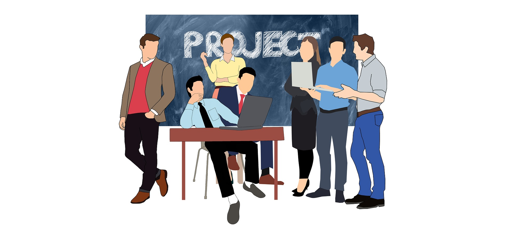
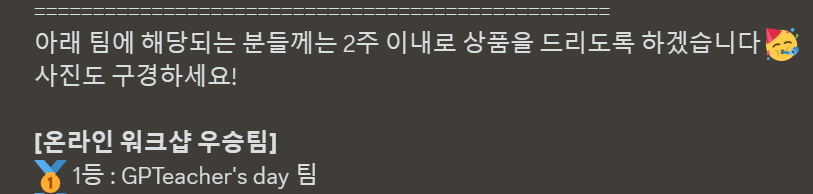

---

title: "AI 부트캠프 : 팀프로젝트1"

excerpt: "코드스테이츠와 함께하는 'AI 부트캠프' 팀프로젝트1 회고"

categories:
    - AIB Log

tags:
    - 개발일지
    - 코딩
    - AI 부트캠프
    - 코드스테이츠

header:
    teaser: /assets/images/aib/codestates-ci.png

last_modified_at: 2023-05-26

---


<br><br><br><br>


{: .align-center width="70%"}  


<br><br><br><br>


# 코드스테이츠와 함께하는 'AI 부트캠프' : 팀프로젝트1  

## Section6 : Team Project 1
> 섹션6 : 팀프로젝트1


<br><br><br><br>


### 5F 회고  

- **사실(Fact)**  
처음으로 팀을 이루어 프로젝트를 수행하였다.

- **느낌(Feeling)**  
이미 여러번의 프로젝트를 수행하였지만 팀프로젝트는 처음이기 때문에 낯설고 설레였지만, 협업과정을 새롭게 배울 수 있어서 뿌듯하다.

- **교훈(Finding)**  
1+1+1+1을 했는데 5의 결과가 나오는 것이 팀프로젝트구나!

- **향후 행동(Future action)**  
개인프로젝트도 좋지만 팀프로젝트를 할 기회가 있으면 주저하지 말고 참여해야겠다.

- **피드백(Feedback)**  
피드백을 해 주세요😀
{: .notice--primary}


<br><br><br><br>


### 프로젝트 일정  

<table style="width : 80%; margin : auto;">
  <tbody style="width : 100%; display : table;">
    <tr style="border-bottom : 3px solid gray; background-color : #88bb88;">
      <th style="width : 40%; text-align : center;">날짜</th>
      <th style="width : 60%; text-align : center;">내용</th>
    </tr>
    <tr>
      <td style="width : 40%; text-align : center;">5/15 (월)</td>
      <td> • 프로젝트 START🚀 <br> • 팀 첫만남 : 팀장선출 <br> • 주제선정 : AI 소프트웨어 업그레이드 프로젝트 <br> • GitHub 환경 구축 </td>
    </tr>
    <tr>
      <td style="width : 40%; text-align : center;">5/16 (화)</td>
      <td> • 레거시코드 분석 <br> • EDA <br> • 웹페이지 초안 작성 </td>
    </tr>
    <tr>
      <td style="width : 40%; text-align : center;">5/17 (수)</td>
      <td> • 레거시코드 분석 <br> • EDA <br> • 오피스 아워 </td>
    </tr>
    <tr>
      <td style="width : 40%; text-align : center;">5/18 (목)</td>
      <td> • 레거시코드 분석 <br> • EDA <br> • DL Modeling <br> • 팀커피챗 </td>
    </tr>
    <tr>
      <td style="width : 40%; text-align : center;">5/19 (금)</td>
      <td> • EDA <br> • DL Modeling </td>
    </tr>
    <tr>
      <td style="width : 40%; text-align : center;">5/20 (토)</td>
      <td> • DL Modeling </td>
    </tr>
    <tr>
      <td style="width : 40%; text-align : center;">5/21 (일)</td>
      <td> • DL Modeling </td>
    </tr>
    <tr>
      <td style="width : 40%; text-align : center;">5/22 (월)</td>
      <td> • DL Modeling <br> • 모델1 완성 <br> • PPT 초안작성 </td>
    </tr>
    <tr>
      <td style="width : 40%; text-align : center;">5/23 (화)</td>
      <td> • DL Modeling <br> • 모델2 완성 <br> • 오피스 아워 </td>
    </tr>
    <tr>
      <td style="width : 40%; text-align : center;">5/24 (수)</td>
      <td> • DL Modeling <br> • 모델3 완성 <br> • 발표자료 작성 </td>
    </tr>
    <tr>
      <td style="width : 40%; text-align : center;">5/25 (목)</td>
      <td> • 발표자료 녹화 <br> • 최종 제출🚩</td>
    </tr>
    <tr>
      <td style="width : 40%; text-align : center;">5/26 (금)</td>
      <td> • 피드백 <br> • 프로젝트 수정 및 보완</td>
    </tr>
  </tbody>
</table>


<br><br>


### 완성 된 프로젝트 미리보기  
#### EDA를 통한 데이터 분석과 인사이트, 제언 도출
- [전복 관련 데이터 탐색적 데이터 분석 보러가기🔎](https://github.com/GPTeachersDay/TeamProject1/blob/main/leeyeonjun/EDA/eda_abalone.ipynb)
- [맥동성 관련 데이터 탐색적 데이터 분석 보러가기⭐](https://github.com/GPTeachersDay/TeamProject1/blob/main/leeyeonjun/EDA/eda_star.ipynb)
- [강철판 관련 데이터 탐색적 데이터 분석 보러가기🚗](https://github.com/GPTeachersDay/TeamProject1/blob/main/leeyeonjun/EDA/eda_steel.ipynb)

<br>

#### 리팩터링을 통한 AI Model Upgrade
- 기존 AI 모델에 비하여 **10~95% 성능 향상** 시킴
- [모델1 SOTA 코드 보기](https://github.com/GPTeachersDay/TeamProject1/tree/main/leeyeonjun/model/model1_sota)
  - Test Loss : 5.975 / Accuracy : 0.929
  - 기존모델 Test Accuracy : 0.827 대비 **12% 성능 증가**
- [모델2 SOTA 코드 보기](https://github.com/GPTeachersDay/TeamProject1/blob/main/leeyeonjun/model/model2_sota/test2.ipynb)
  - Test Loss : 0.075 / Recall : 0.871
  - 기존모델 Test Recall = 0.789 대비 **10.3% 성능 증가**
- [모델3 SOTA 코드 보기](https://github.com/GPTeachersDay/TeamProject1/blob/main/KDH/Steel_plate_Faults/base_model_classify.ipynb)
  - Test Loss : 0.964 / Accuracy : 0.807
  - 기존모델 Test Accuracy : 0.412 대비 **95.8% 성능 증가**

<br>

#### 사용자 친화적으로 UIUX 개선
- [개발된 AI 서비스 바로가기](http://leeyj85.shop/GPTeachersDay/model/#Steel_AI)

<br>

#### 팀프로젝트 GitHub
- GitHub Organization : ["https://github.com/GPTeachersDay"](https://github.com/GPTeachersDay)


<br><br><br><br>

## 프로젝트 1일차(15, 월) : 프로젝트 시작
{: style="text-align: center;"}

<br><br><br><br>


### Daily Reflection : 3L 회고
#### 배운 것(Learned)
처음으로 팀모임을 할 때 MBTI로 대화를 하니깐 서로에 대하여 파악하고 알아갈 수 있는데 도움이 많이 되었다.  
{: .notice--success}

#### 아쉬웠던 점(Lacked)
레거시코드에 대한 이해가 너무 부족해서 어려웠다.  
{: .notice--danger}

#### 좋았던 점(Liked)
새로운 팀과 새로운 방식으로 프로젝트를 시작 할 수 있어서 기대된다.  
{: .notice--primary}


<br><br>


### 오늘 진행 한 내용  
#### 첫 팀미팅
- **MBTI를 소재**로 첫미팅을 진행하니깐 `서로에 대하여 파악하는데 도움`이 되었음
- Notion에 첫미팅때 해야할 과업들이 질문 형식으로 정리되어있어서 과제를 수행하면서 첫 미팅을 진행하니깐 <mark>가이드</mark>가 되어서 좋았음

#### 팀장 선출
- 서로의 MBTI를 소개하는데, 나는 ISTP였고, INTP, ISTJ, ENFJ가 있었음
- [ENFJ가 선도자라는 선행연구](https://www.16personalities.com/ko/%EC%84%B1%EA%B2%A9%EC%9C%A0%ED%98%95-enfj)에 근거하여 <mark>ENFJ를 팀장</mark>으로 강력 추대
- 프로젝트가 끝나고 느끼는 것이지만 **정말 좋은 선택**이었음
- ~~MBTI는 과학~~

<br>

#### 주제선정
- 선택할 수 있는 주제는 "여행 경비 예측 서비스", "AI 소프트웨어 업그레이드" 둘 가운데 하나
- 팀원 두 명은 아무 주제나 해도 상관없음, 1명은 "AI 소프트웨어 업그레이드" 가 조금 관심이 있는데 다른 것도 상관없음
- 나는 강하게 "AI 소프트웨어 업그레이드"가 하고싶다고 하였음
  - 처음으로 팀프로젝트를 하기 때문에 좁은 범위의 주제를 **완성도**있게 수행하기 위하여
- 나의 의견이 받아들여서서 우리팀의 주제는 "<mark>AI 소프트웨어 업그레이드</mark>"로 결정
- **GitHub를 적극적으로 이용**하며 팀프로젝트 가운데 협업을 연습하자는 목적도 있음

<br>

#### 협업을 위한 GitHub 준비
- 협업을 위한 GitHub Repository를 생성하는 방법은 크게 두 가지가 있음
  1. 개인이 레포지토리를 생성하여 팀원을 초대하는 방식
  2. GitHub Organization을 만들어 그 조직에 팀원을 초대하고, 레포지토리를 생성하는 방식
- 새로운 팀이 만들어진 것이기 때문에 `2번`으로 진행하기로 결정
- 새롭게 만든 GitHub Organization : ["https://github.com/GPTeachersDay"](https://github.com/GPTeachersDay)


<br><br><br><br>

## 프로젝트 2일차(16, 화) : 탐색적 데이터 분석
{: style="text-align: center;"}

<br><br><br><br>


### Daily Reflection : 3L 회고
#### 배운 것(Learned)
데이터에 대한 이해가 있어야 분석을 잘 할 수 있다.  
{: .notice--success}

#### 아쉬웠던 점(Lacked)
전복, 맥동성, 강철판에 대한 사전지식이 전혀 없어서 데이터를 이해하는데 어려웠다.  
{: .notice--danger}

#### 좋았던 점(Liked)
여럿이 함께 EDA를 진행하면서 데이터에 대하여 더욱 넓고, 빠르게 이해 할 수 있었다.  
{: .notice--primary}


<br><br>


### 오늘 진행 한 내용  
#### "AI 소프트웨어 업그레이드" 프로젝트 내용 파악
- 📜 스토리
  - 우리 회사 `AI R&D 그룹`은 다양한 인공지능 모델을 개발하여 필요한 회사에 제공하는 회사임
  - 최근 AI R&D 그룹은 **3가지 인공지능 모델 업그레이드** 업무를 수주하였음
  - 기존에 사용하던 **Legacy AI Model**이 있지만 이는 오래된 방식으로 개발된 모델이기 때문에 `리펙토링`, `AI 성능 고도화`, `UIUX 개선`이 필요함

<br>

#### 탐색적 데이터 분석
- 3가지 인공지능 모델
  1. 전복 연령 예측 모델
  2. 맥동성(Pulsar Star) 여부 예측 모델
  3. 강철판 결함 종류 예측 모델

- 3가지 인공지능 모델을 개발하기 위하여 제공받은 데이터
  - [전복 관련 데이터](https://www.kaggle.com/datasets/rodolfomendes/abalone-dataset)
  - [맥동성 관련 데이터](https://www.kaggle.com/datasets/colearninglounge/predicting-pulsar-starintermediate)
  - [강철판 관련 데이터](https://www.kaggle.com/datasets/uciml/faulty-steel-plates)

<br>

#### 레거시 코드 분석
- VSCode 활용하여 디버깅하며 코드 작동원리 파악
- 탐색적 데이터분석이 완료되지 않아서 레거시코드를 이해할 수 없음
- 일단 탐색적 데이터분석에 중심을 두고, 2~3일 안으로 레거시 코드를 이해해 보기로 함


<br><br><br><br>

## 프로젝트 3일차(17, 수) : 탐색적 데이터 분석, 레거시 모델 분석
{: style="text-align: center;"}

<br><br><br><br>


### Daily Reflection : 3L 회고
#### 배운 것(Learned)
Numpy 기반의 레거시코드를 Tensorflow 기반으로 리팩터링하여 코드를 간소화 할 수 있다.  
{: .notice--success}

#### 아쉬웠던 점(Lacked)
레거시모델에 대한 이해가 부족하여 리팩터링이 어려웠다.  
{: .notice--danger}

#### 좋았던 점(Liked)
오피스아워를 통하여 프로젝트의 방향성을 가다듬을 수 있었다.  
{: .notice--primary}


<br><br>


### 오늘 진행 한 내용  
#### 탐색적 데이터 분석 마무리
- [전복 관련 데이터 탐색적 데이터 분석](https://github.com/GPTeachersDay/TeamProject1/blob/main/leeyeonjun/EDA/eda_abalone.ipynb)
- [맥동성 관련 데이터 탐색적 데이터 분석](https://github.com/GPTeachersDay/TeamProject1/blob/main/leeyeonjun/EDA/eda_star.ipynb)
- [강철판 관련 데이터 탐색적 데이터 분석](https://github.com/GPTeachersDay/TeamProject1/blob/main/leeyeonjun/EDA/eda_steel.ipynb)

<br>

#### 오피스 아워
- 데이터에 대한 정밀한 분석이 많이 필요함
- 레거시코델은 특별한 기능이 없기 때문에 성능을 올릴 수 있는 기능이 추가 되어야 함
- 데이터 불균형 문제를 해결해야 성능을 올릴 수 있을 것임

<br>

#### 레거시모델 리펙터링을 위한 평가지표 구현
- 모델1(전복)의 경우 전복의 나이를 예측하는 회귀모형이지만 분류문제에 사용되는 Custom Accuracy가 사용되었음
- tensorflow를 활용하여 ``Custom Accuracy`` 구현
  ```python
  class EvalAccuracy(tf.keras.metrics.Metric):
      """
      사용자 정의 평가지표 : Accuracy
      """
      def __init__(self, name="accuracy", **kwargs):
          super(EvalAccuracy, self).__init__(name=name, **kwargs)
          self.correct = self.add_weight(name=name, initializer="zeros")

      def update_state(self, y_true, y_predict, sample_weight=None):
          value = tf.abs((y_predict - y_true) / y_true)
          self.correct.assign(tf.reduce_mean(value))

      def result(self):
          return 1 - self.correct

      def reset_state(self):
          self.correct.assign(0.)
  ```


<br><br><br><br>

## 프로젝트 4일차(18, 목) : 레거시 모델 분석, 리팩터링
{: style="text-align: center;"}

<br><br><br><br>


### Daily Reflection : 3L 회고
#### 배운 것(Learned)
무조건적으로 라이브러리를 사용하기보다 작동원리를 이해하고 모델을 만들어야 정확한 정능 향상이 있다.  
{: .notice--success}

#### 아쉬웠던 점(Lacked)
라이브러리 메소드의 이해가 부족하여 다양한 모델링을 해보지 못하였다.  
{: .notice--danger}

#### 좋았던 점(Liked)
팀커피챗을 통하여 팀동료에 대하여 더욱 가까워진 듯 하다.  
{: .notice--primary}


<br><br>


### 오늘 진행 한 내용  
#### 팀커피챗
- 커리어코치님과 함께 팀원들과 함께 커피챗 시간
- 팀원 서로에 대하여 더욱 잘 알게되는 시간이 되었음
- 서로의 장점에 대하여 이야기 나누면서 **서로를 이해**할 수 있었음

<br>

#### GitHub를 중심으로 모델 성능 개선
- 모델의 은닉층을 늘리거나, 노드를 늘리는 **각종 실험** 진행
- 옵티마이저의 종류를 변화시켜가며 학습을 진행하고 **모델 성능 비교**
- 뚜렸한 성능향상이 나오지는 않지만 **계속해서 모델을 개선**해 나가기로 함


<br><br><br><br>

## 프로젝트 5일차(19, 금) : 레거시 모델 분석, 리팩터링
{: style="text-align: center;"}

<br><br><br><br>


### Daily Reflection : 3L 회고
#### 배운 것(Learned)
모델에 대하여 여러가지로 실험을 진행하고, 기록하여 함께 나누면서 조금씩 모델의 성능을 개선해 나갈 수 있다.   
{: .notice--success}

#### 아쉬웠던 점(Lacked)
GPU가 안되는 경우 학습속도가 너무 느려서 어려움이 있다.  
{: .notice--danger}

#### 좋았던 점(Liked)
팀원이 역할을 나누어서 잘 할 수 있는 부분에 집중할 수 있었다.  
{: .notice--primary}


<br><br>


### 오늘 진행 한 내용  
#### 팀원 사이에 집중해야 할 역할을 분배
- 3개 모델을 **팀원들이 적절히 나누어 모델링**을 하면서 성능향상에 집중
  - 과적합 방지대책(드롭아웃, L1L2 패널티, 조기종료), 배치정규화 등 실험
- 모델링과 함께 **웹페이지구현도 동시에 진행**하여 프로젝트 시간을 효율적으로 사용


<br><br><br><br>

## 프로젝트 6일차(22, 월) : 모델1 완성, 발표준비 시작
{: style="text-align: center;"}

<br><br><br><br>


### Daily Reflection : 3L 회고
#### 배운 것(Learned)
프로젝트 기간 적절히 시간을 분배하여 단게를 넘겨야 프로젝트를 완성할 수 있다.   
{: .notice--success}

#### 아쉬웠던 점(Lacked)
조금 더 데이터를 분석하면, 조금 더 모델을 실험해보면 성능을 올릴 수 있을 것 같은데 다음 단계로 넘어가야 하니깐 아쉬웠다.  
{: .notice--danger}

#### 좋았던 점(Liked)
팀장님이 팀을 잘 이끌어주는 것 같다.  
{: .notice--primary}


<br><br>


### 오늘 진행 한 내용  
#### 모델1 완성
- 여러가지 실험을 통하여 모델1 SOTA 달성
  - [모델1 SOTA 코드 보기](https://github.com/GPTeachersDay/TeamProject1/tree/main/leeyeonjun/model/model1_sota)
  - Test Loss : 5.975 / Accuracy : 0.929
  - 기존모델 Test Accuracy : 0.827 대비 **12% 성능 증가**

<br>

#### 발표 PPT 준비
- 적당한 템플릿을 찾아보고 초안 작성 시작

<br>

#### 모델2와 모델3에 대한 계속된 모델링


<br><br><br><br>

## 프로젝트 7일차(23, 화) : 모델2 완성
{: style="text-align: center;"}

<br><br><br><br>


### Daily Reflection : 3L 회고
#### 배운 것(Learned)
프로젝트는 얼마나 열심히했느냐가 아니라 결과물을 얼마나 잘 만들었냐로 평가 받는다는 것을 배웠다.   
{: .notice--success}

#### 아쉬웠던 점(Lacked)
성능 향상에만 급급해서 진짜 프로젝트의 목표가 무엇인지 잊고있었다.  
{: .notice--danger}

#### 좋았던 점(Liked)
오피스아워를 통하여 이제 마무리 해야 할 때라는 것을 알았고, 마무리할 때 어디에 집중해야 하는지를 점검받을 수 있었다.  
{: .notice--primary}


<br><br>


### 오늘 진행 한 내용  
#### 모델2 완성
- 여러가지 실험을 통하여 모델2 SOTA 달성
  - [모델2 SOTA 코드 보기](https://github.com/GPTeachersDay/TeamProject1/blob/main/leeyeonjun/model/model2_sota/test2.ipynb)
  - Test Loss : 0.075 / Recall : 0.871
  - 기존모델 Test Recall = 0.789 대비 **10.3% 성능 증가**

<br>

#### 발표 PPT 준비
- 3명이 모델을 하나씩 나눠서 발표하고, 팀장이 전체를 정리하는 방식으로 발표하기로 결정
- 목표를 중심으로 발표 준비
  - 목표1
  >제공받은 세 가지 데이터에 대하여 탐색적 데이터 분석을 수행합니다.  
  >분석 이후, 각 데이터에 대한 AI Model 성능 향상을 목적으로 ‘인사이트 도출’, ‘지금 바로 적용 가능한 제언’ 과 ‘추후 적용 가능한 제언’ 을 제공합니다.
  - 목표2
  >제공받은 세 가지 데이터에 대하여 사전에 구축된 AI Model의 성능 고도화 실험 및 적용 작업을 진행합니다.  
  - 목표3
  >AI Model 은 프로그램화 하여 유저 친화적으로 사용될 수 있도록 로직을 수정합니다.  


<br><br><br><br>

## 프로젝트 8일차(24, 수) : 모델3 완성, PPT 작성
{: style="text-align: center;"}

<br><br><br><br>


### Daily Reflection : 3L 회고
#### 배운 것(Learned)
Canva를 통하여 함께 PPT를 작성하니깐 바로 피드백을 할 수 있어서 좋다.  
{: .notice--success}

#### 아쉬웠던 점(Lacked)
각자 맡은 모델에만 집중해서 다른 사람의 모델에 적절한 피드백을 하기 힘들었다.  
{: .notice--danger}

#### 좋았던 점(Liked)
함께 협업할 수 있는 툴(Canva, GitHub)을 잘 사용하는 것이 팀프로젝트에서 정말 중요한것 같다.  
{: .notice--primary}


<br><br>


### 오늘 진행 한 내용  
#### 모델3 완성
- 여러가지 실험을 통하여 모델3 SOTA 달성
  - [모델3 SOTA 코드 보기](https://github.com/GPTeachersDay/TeamProject1/blob/main/KDH/Steel_plate_Faults/base_model_classify.ipynb)
  - Test Loss : 0.964 / Accuracy : 0.807
  - 기존모델 Test Accuracy : 0.412 대비 **95.8% 성능 증가**

<br>

#### Canva를 통하여 PPT 공동 작성
- 마치 Notion에서 공동 기록하듯이 PPT도 **Canva에서 공동으로 작업**하니 피드백이 빠르게 이루어졌음
- 팀원 가운데 한명이 미리 PPT초안을 만들어서 손쉽게 작성할 수 있었음


<br><br><br><br>

## 프로젝트 9일차(25, 목) : 발표영상 제작, 프로젝트 제출
{: style="text-align: center;"}

<br><br><br><br>


### Daily Reflection : 3L 회고
#### 배운 것(Learned)
녹화할 때도 환경을 맞춰주어야 동영상을 합칠 때 이질감이 줄어든다.  
{: .notice--success}

#### 아쉬웠던 점(Lacked)
데이터에 대한 새로운 인사이트를 얻고, 더 성능좋은 모델이 개발되었지만 이미 모델을 바꾸기에는 시간이 없었다.  
{: .notice--danger}

#### 좋았던 점(Liked)
프로젝트를 2시간정도 일찍 제출하고 서로 잡담하며 자연스럽게 회고를 해서 좋았다.  
{: .notice--primary}


<br><br>


### 오늘 진행 한 내용  
#### 발표영상 제작
- 각자 역할을 나누어 발표영상을 녹화하고 제출영상으로 결합
- 발표영상을 제작할 때도 사운드 크기, 모니터 해상도 등에 따라서 각자 녹화한 영상이 조금씩 다르기 때문에 **컴퓨터 환경을 일치**시키는 것도 중요함

#### 최종 마무리 된 결과
- EDA를 통한 데이터 분석과 **인사이트, 제언을 도출**하였음
  - [전복 관련 데이터 탐색적 데이터 분석](https://github.com/GPTeachersDay/TeamProject1/blob/main/leeyeonjun/EDA/eda_abalone.ipynb)
  - [맥동성 관련 데이터 탐색적 데이터 분석](https://github.com/GPTeachersDay/TeamProject1/blob/main/leeyeonjun/EDA/eda_star.ipynb)
  - [강철판 관련 데이터 탐색적 데이터 분석](https://github.com/GPTeachersDay/TeamProject1/blob/main/leeyeonjun/EDA/eda_steel.ipynb)

- 리팩터링을 통한 AI Model Upgrade
  - 기존 AI 모델에 비하여 **10~95% 성능 향상** 시킴

- 사용자 친화적으로 UIUX 개선
  - Django를 활용하여 웹서비스로 AI 서비스 제공
  - [개발된 AI 서비스 바로가기](http://leeyj85.shop/GPTeachersDay/model/#Steel_AI)


<br><br><br><br>

## 프로젝트 10일차(26, 금) : 피드백, 프로젝트 평가
{: style="text-align: center;"}

<br><br><br><br>


### Daily Reflection : 3L 회고
#### 배운 것(Learned)
다른팀의 프로젝트를 보면서 다양한 접근을 할 수 있다는 점을 배웠다.  
{: .notice--success}

#### 아쉬웠던 점(Lacked)
오늘과 같은 날이 별로 없다는 것이 아쉽다.  
{: .notice--danger}

#### 좋았던 점(Liked)
가벼운 마음으로 프로젝트 회고를 진행하고, 무엇보다 우리팀이 우승해서 좋았다.  
{: .notice--primary}


<br><br>


### 오늘 진행 한 내용  
#### 피드백
- 코치님에게 피드백을 받았음
  - 옵티마이저(Adam)에 대한 설명이 추가되면 좋겠음
  - 코스트 센서티브 러닝 방식을 사용하면 불균형 타겟에 대한 가중치를 적용할 수 있음
  - 데이터가 부족하면 과적합이 발생함  

<br>

#### 온라인 워크샵
- 재미없게 피드백만 하는 것이 아니라 워크샵 형식으로 게임도 하였음

  <h1 style="font-size:4rem">우리팀 우승!!<h1>  

{: .align-center width="70%"}  

- **상품**이 기대 됨


<br><br><br><br>

## 프로젝트 후기
{: style="text-align: center;"}

<br><br><br><br>


### 처음으로 팀프로젝트를 하였음
- 첫 팀프로젝트 너무 좋은 경험이었음
- 혼자하면 내가 알아서 결정해서 내 마음대로 하면 되는데, 팀프로젝트는 팀이 함께 해야하기 때문에 불편한 점도 분명 있음
- 하지만 함께 협업하여 힘을 모으고, 서로의 부족한점을 매울 수 있다면 시너지가 발휘되어 1+1+1+1=5의 결과를 가져올 수 있음

<br>

### 협업툴에 대한 연습
- 팀프로젝트이기 때문에 처음부터 협업툴을 사용해보는 것이 추가적인 목표였음
- GitHub Repository를 중심으로 브랜치를 만들어 PR을 날려보기도 하였음
  - 익숙치 않아서 PR을 적극적으로 활용하지는 못하고, GitHub를 공동 코드 저장소로 사용하였음
- Google Meet를 통하여 회의하고, Notion으로 필기하고, 디스코드로 소통하고, Canva로 PPT를 만드는 등 모두 협업에 필요한 중요한 도구들을 경험할 수 있어서 좋았음

<br>

### 모델 개선에 대한 아쉬움
- 8일차 이후에서야 데이터가 이미 스케일링된 데이터라는 사실을 알게 됨
- 더욱 평가지표가 좋은 모델도 있지만 프로젝트 제출 마감시간을 맞춰야 하기 때문에 적당한 수준에서 마무리해야 했음
- 시간만 넉넉하다면 얼마든지 성능을 더 올릴 수 있을 것 같음


<br><br><br><br>  
<center>  
<h1>끝까지 읽어주셔서 감사합니다😉</h1>  
</center>  
<br><br><br><br>  


