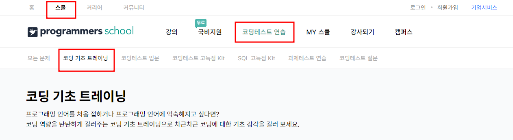

---

title: "AI 부트캠프를 마치고..."

excerpt: "코드스테이츠와 함께했던 AI 부트캠프 회고"

categories:
    - AIB Log

tags:
    - 개발일지
    - 코딩
    - AI 부트캠프
    - 코드스테이츠

header:
    teaser: /assets/images/aib/codestates-ci.png

last_modified_at: 2023-07-14

---

    

{: .align-center width="70%"}  

    

# 코드스테이츠와 함께했던 AI 부트캠프 회고  
> 2022년 12월 시작된 AI 부트캠프를 마쳤다.  
> 약 7개월의 부트캠프를 전반적으로 돌아보자  

    

## Total Reflection : 3L 회고
### 배운 것(Learned)
데이터분석을 위한 기초적인 통계, 데이터분석 시각화, 머신러닝 분석, 딥러닝 분석, 데이터엔지니어링을 위한 가상환경과 데이터베이스 활용 등 너무 많은 것들을 배웠다.
{: .notice--success}

 

### 아쉬웠던 점(Lacked)
짧은 기간에 너무 많은 것들을 배워서 모든 것을 이해하지는 못했던 것 같다.  
직장생활 하면서 부족한 부분을 채워야겟다.
{: .notice--danger}

 

### 좋았던 점(Liked)
취업을 위한 **'비기너' 단계의 개발자**가 된 것 같다.  
스스로 찾아서 공부하는 방법을 배워서 **무엇이든지 할 수 있다는 자신감**이 생겼다.
{: .notice--warning}

    

## AI부트캠프 일정  
- 전체 학습 기간 : 2022.12.9. - 2023.7.7.
  - Section1 : 데이터분석 입문
  - Section2 : 머신러닝
  - Section3 : 딥러닝
  - Section4 : 데이터 엔지니어링
  - Section5 : 컴퓨터 공학 기본
  - Section6 : 팀프로젝트1, 팀프로젝트2
  - Section7 : 커리어 섹션
- Section1 ~ Section5 : 약 5개월 동안 `학습위주`📚
- Section6 ~ Section7 : 약 2개월 동안 `팀프로젝트 & 취업 준비`🚀

  

### 부트캠프 준비
- 공식 일정은 2022.12.9에 시작하였지만, 부트캠프를 준비하는 기간이 꼭 필요하다.
- 사실 나는 코드스테이츠 부트캠프 16기에 지원하였지만 탈락하였고😥, 약 한달간 준비 후에 다시 지원하여 17기에 합격하였다.🥳
- 16기에 탈락하고 17기를 `준비하는 약 한 달의 시간이 정말 중요`하고, 꼭 필요한 시간이었다고 생각한다.
- 내가 생각하는 부트캠프를 위한 준비를 정리해보았다.

 

#### AI 부트캠프 프리코스
- Python 기초를 공부하기 위한 [[AI 부트캠프 프리코스]](https://aib.oopy.io/aibprecourse?_gl=1*1v72jtt*_ga*MjEzODY1MzEyMC4xNjg2MDQ2NTk3*_ga_SMZR7SG3VX*MTY4OTM4NzM1NS42LjEuMTY4OTM4ODg1MC45LjAuMA..){:target="_blank"}  
- 이 밖에도 [[생활코딩 : WEB2-Python]](https://www.youtube.com/watch?v=kN6mlybyTdA&list=PLuHgQVnccGMDMxfZEpLbzHPZUEwObEaZq){:target="_blank"}  , [[점프 투 파이썬]](https://wikidocs.net/book/1){:target="_blank"}   등 파이썬 기초공부를 할 수 있는 컨텐츠가 많이 있다.
- 파이썬 기초를 하지 않고 부트캠프를 시작하면 학습 내용을 따라가기 힘들기 때문에, 파이썬 기초지식은 꼭 준비하고 시작하자😎

 

#### 코딩테스트 준비 시작
- 취업을 위한 중요한 관문가운데 코딩테스트가 있다.
- 코딩테스트를 준비하기 위한 많은 사이트가 있는데, 기초단계부터 준비할 수 있는 [[프로그래머스]](https://school.programmers.co.kr/learn/challenges/training?order=acceptance_desc){:target="_blank"}  , [[백준]](https://www.acmicpc.net/step){:target="_blank"}  을 추천한다.
- 부트캠프를 준비하면서 코딩 실력은 프로그래머스 기준으로 `코딩 기초 트레이닝`을 풀 수 있을 정도의 실력을 갖추면 된다.
{: .align-center width="90%"}  
- 그리고 부트캠프 Section1 ~ Section3에서는 `코딩테스트 입문`, Section4 ~ Section7은 `코딩테스트 고득점 Kit`, Section4에 데이터베이스를 배우기 시작하면 `SQL 고득점 Kit`을 단계적으로 풀어보면 좋을 것 같다.
- 백준도 비슷하게 단계별로 코딩테스트를 풀어볼 수 있어서, 프로그래머스가 부족하다면 백준도 함께 풀어보면 좋다.

 

#### 개인 블로그 만들기
- 개발일지는 많은 사람이 추천하지만 막상 꾸준하게 작성하기 힘든 것 같다.
- 하지만 나는 부트캠프가 끝난 지금 `가장 잘한 것이 개발일지 작성`이라고 생각한다.
- 특히 <mark>GitHub를 통하여 개발블로그 만들기</mark>를 추천한다.
  - 이유 1 : `GitHub는 모든 개발자가 거쳐야 하는 관문`이다. 미리 GitHub에서 개발블로그를 만들며 익숙해지자.
  - 이유 2 : 일주일에 한번정도 개발일지를 작성하면, 7개월 후 프로폴리오로 활용할 수 있다. `인사 담당자에게 나의 성실함을 입증할 수 있는 주요 자산`이다.
  - 이유 3 : `부트캠프 후 남는 것은 나의 개발일지`이다. 부트캠프 기간 많은 내용을 학습하다보니 잊어버리기 쉽다. 기록하지 않으면 내가 무엇을 배웠는지 허탈할 수 있는데, 개발일지를 작성하면 허탈감을 방지 할 수 있다.
- **매일 공부한 내용을 md 파일로 정리**하고, **한 주간이 끝난 다음 작성한 md 파일을 블로그에 올리는 방식**으로 한 주간의 학습을 정리하여 <mark>1주 1글 올리기</mark>를 실천하면 좋다.
- 그 밖에 부트캠프를 준비하는 과정에서 작성한 [[나의 블로그 글]](https://leeyeonjun85.github.io/aib%20log/AI-bootcamp/){:target="_blank"}  을 보면 구체적으로 무엇을 준비했는지 볼 수 있다.

  

### Section1 : 데이터분석 입문
#### Sprint1 ~ Sprint3
- 부트캠프 첫 주를 마치고 작성한 [[블로그 글]](https://leeyeonjun85.github.io/aib%20log/AIB_1week/){:target="_blank"}  을 보면 처음에는 정말 미숙했다는 느낌이 든다.
- 물론 지금도 부족하지만 그때는 정말 그래프 하나 그리는 것도 정말 어려운 일이었다.
- 부트캠프를 시작하고 몇주간 나의 감정은 <mark>낮설음</mark> 이었다.
- 그래서 조언하자면, **모든 학습 내용을 완벽히 이해하려 하지 말고, 주어지는 과제도 너무 완벽하게 수행하려고 하지 않았으면** 좋겠다.
- 섹션1에서는 기초통계와 선형대수를 배우는데 기초통계가 어렵다면, **가설을 만들고, 가설을 검증하는 정도**의 과정만 익히면 될 것 같다.
- 그리고 선형대수에서 배우는 **행렬과 벡터에 대한 개념**이 익숙해져야 나중에 머신러닝과 딥러닝에 쉽게 접근할 수 있으니 충분히 익숙해지도록 연습해야 한다.

 

#### Sprint4 : 섹션1 프로젝트
- 섹션1~섹션4까지의 학습섹션은 섹션 마지막에 작은 프로젝트를 수행한다.
- 섹션1 프로젝트는 주제와 데이터가 주어지기 때문에, 이미 주어진 **데이터를 잘 가공하고, 분석하여 인사이트를 얻어내는 것이 목적**이다.
- 처음으로 수행하는 프로젝트이기 때문에 너무 많은 것을 욕심내지 않기를 바란다.
- 그리고 <mark>꼭 정해진 시간에 제출 할 수 있도록 시간계획을 잘 세우는 것</mark>이 좋다.
- 프로젝트를 제출해야하는 <mark>마지막 날에는 영상촬영 & 제출만</mark> 하고, 그 전에 모든 것을 마칠 수 있어야 한다.
- [[나의 섹션1 프로젝트 블로그 글 보기]](https://leeyeonjun85.github.io/aib%20log/AIB_4week/){:target="_blank"}  

  

### Section2 : 머신러닝
#### Sprint1 ~ Sprint3
- Section2에서는 머신러닝에 사용되는 여러가지 알고리즘을 배운다.
- 단순 선형모델부터 시작하여, 트리모델, 앙상블, 배깅과 부스팅 등 다양한 머신러닝 모델 기법을 학습한다.
- 너무 많은 내용을 학습하다보니 따라가기가 쉽지 않았다.
- 그래서 어떻게 파이썬 코드로 구현하는지, 특히 `scikit-learn` 라이브러리를 활용한 머신러닝 구현에 초점을 맞추어 학습하였다.
- 머신러닝의 많은 내용을 학습하기 때문에 모든 것을 이해하려고 하기보다는 <mark>주제별로 정리하여 기록하는 것에 초점</mark>을 맞추어 학습하길 추천한다.

 

#### Sprint4 : 섹션2 프로젝트
- 섹션2 프로젝트의 가장 큰 특징은 스스로 주제와 데이터를 정해야 한다는 것이다.
- 스스로 주제와 데이터를 정해본 경험이 없기 때문에 막막한 느낌이 많이 들 것이다.
- 하지만 <mark>주어진 프로젝트 기간동안 완성</mark>하는 것이 학습섹션 가운데 진행하는 프로젝트의 1차 목적이라는 것을 꼭 명심해야 한다.
- 팁1 : 프로젝트 시작날짜 전까지 주제와 데이터를 정해야 한다.
  - 프로젝트 시작이 된 후에 주제와 데이터를 정하려고 하면 시간에 쫓겨 프로젝트를 완성하지 못할 수 있다.
  - 그래서 본인이 관심있는 주제를 정하고, 관련 데이터를 정해야 한다.
  - 주제를 정할 때는 다른 선배 학습자들이 어떠한 주제를 정했는지 살펴보는 것을 추천한다.
  - 데이터를 구할 때는 코치의 도움을 받아, 어디에서 데이터를 구해야하는지 알고, 데이터 찾아보기를 추천한다.
- [[나의 섹션2 프로젝트 블로그 글 보기]](https://leeyeonjun85.github.io/aib%20log/AIB_8week/){:target="_blank"}  

  

### Section3 : 딥러닝
#### Sprint1 ~ Sprint3
- Section3에서는 딥러닝의 개념과 관련 알고리즘을 배운다.
- 인공신경망의 개념과 역전파를 통한 학습원리를 배우고, 자연어처리와 컴퓨터비전을 중심으로 딥러닝을 학습한다.
- 딥러닝을 계속 공부하고자 한다면 <mark>역전파 과정</mark>을 충분하게 익혀야 한다.
- 그리고 자연어처리와 컴퓨터비전에서 배우는 딥러닝 과정은 `Tensorflow` 라이브러리를 중심으로 구현하는 방법을 학습하면 효율적이다.

 

#### Sprint4 : 섹션3 프로젝트
- 섹션3를 공부했던 2023년 초는 전세계적으로 ChatGPT가 열풍을 일으킨 시기였다.
- 그래서 나도 섹션3를 공부하면서 "나도 ChatGPT"를 만드는 개발자가 되고 싶다."는 꿈을 꾸었다.
- 그래서 나는 ChatGPT의 핵심 알고리즘인 트랜스포머 모델을 적용하여 **나만의 챗봇**을 만들고자 하였다.
- [[나의 섹션3 프로젝트 블로그 글 보기]](https://leeyeonjun85.github.io/aib%20log/AIB_12week/){:target="_blank"}  
- 프로젝트를 수행하면서 딥러닝의 무한한 가능성을 체험할 수 있었다.

  

### Section4 : 데이터 엔지니어링
#### Sprint1 ~ Sprint3
- Section4에서는 데이터 엔지니어링을 위하여 필요한 개념을 배운다.
- Git을 통한 버전관리, Docker와 같은 가상환경, Looker Studio와 같은 대시보드, 그리고 섹션4에서 가장 중요한 데이터베이스를 학습한다.
- 모든 현업에서 데이터베이스는 반드시 필요한 기술이기 때문에 다양한 데이터베이스를 다루어보길 권장한다.
- <mark>특히 SQL은 많은 현장에서 사용하는 데이터베이스이기 때문에 SQL 작성과 어떻게 CRUD를 하는지 꼭 정리</mark>해야 한다.

 

#### Sprint4 : 섹션4 프로젝트
- 섹션4는 정말 다양한 기술을 배운다.
- 데이터베이스 활용, 데이터 수집을 위한 스크래핑, Docker를 이용한 가상환경, 데이터를 시각화하는 대시보드 등 섹션4에서 배운 내용을 모두 모아서 프로젝트를 수행해야 한다.
- [[나의 섹션4 프로젝트 블로그 글 보기]](https://leeyeonjun85.github.io/aib%20log/AIB_16week/){:target="_blank"}  
- 프로젝트 기획부터 웹서비스 배포까지 모든 것을 처음으로 나 스스로, 부트캠프 기간 배운 것으로 토대로 만든 첫 번째 프로젝트라 `특별히 애착이 가는 프로젝트`였다.
- 참고로 이번 프로젝트는 AI 부트캠프 17기에 참여한 학습자들의 감정을 분석하였기 때문에 일부 개인정보가 포함되어있어서 개인정보 보호를 위하여 로그인을 하도록 하였다.
- AI부트캠프 17기에 참여한 학습자들은 내가 디스코드로 공유한 아이디로 로그인 할 수 있다.

  

### Section5 : 컴퓨터 공학
#### Sprint1 ~ Sprint3
- 섹션5에서는 컴퓨터 공학의 기본지식에 대하여 학습한다.
- 구체적으로 자료구조, 탐색알고리즘 등을 배운다.
- 나는 코딩테스트를 준비하고 있지 않다가 섹션5에서 처음으로 코딩테스트를 준비하기 시작하였다.
  - 나의 이러한 실수를 반복하지 말고, 꼭 코딩테스트 기초문제는 부트캠프 시작부터 꾸준하게 풀어보고, 섹션5에서는 **각종 자료구조와 알고리즘을 활용한 코딩테스트 문제**를 풀어보길 바란다.
- 취업하고 난 후 C#을 공부하면서 알게 된 사실은 파이썬의 자료구조는 정말 간단하고 배우기 쉽다는 것이다.
  - 그래서 파이썬으로 코딩테스트를 본다면 코딩테스트에 매우 유리할 수 있다.
  - 일단 **파이썬을 중심으로 코딩테스트를 통과**하고 **취업 후에 필요한 언어(JAVA, C++, C# 등)를 추가적으로 공부**하는 방식을 추천한다.
- 섹션5는 섹션을 마치고 프로젝트를 하지 않고, 곧바로 섹션6의 팀프로젝트에 들어간다.

  

### Section6 : 팀프로젝트
- 섹션5까지 학습을 마치면 약5개월의 학습기간이 끝난다.
- 부트캠프 나머지 2달은 섹션6와 섹션7을 함께 진행하는데, 섹션6는 팀프로젝트, 섹션7은 커리어 섹션이다.
- **섹션6의 팀프로젝트는 포트폴리오로 활용**하고, **섹션7을 통하여 구체적으로 취업을 준비**한다.

 

#### 팀프로젝트1
- 처음으로 팀을 이루어 팀프로젝트를 수행한다.
- 주제와 데이터는 대략적으로 정해지지만, 구체화하는 것은 팀의 재량이다.
- [[나의 팀프로젝트1 블로그 글 보기]](https://leeyeonjun85.github.io/aib%20log/AIB_TP1/){:target="_blank"}  
- 팀프로젝트에서 가장 중요한 것은 <mark>역할 분배와 커뮤니케이션</mark>이다.
- 프로젝트 초기에 적절하게 역할을 분배하고, 상황에 따라서 다시 역할을 조정해야 할 때 커뮤니케이션이 필요하다.
- **팀장 선출 팁** : MBTI의 도움을 받아 ENFJ인 팀원을 팀장으로 선출하니 매우 만족스러운 결과를 얻은것 같다.
- GitHub, Google Meet, 카톡, 디스코드, Canva 등 협업 툴을 적극적으로 활용하면 팁협업 효율이 올라간다.
  - 특히 GitHub은 코드 공유를 위하여, Canva는 팀원이 함께 PPT를 만들 수 있기 때문에 매우 만족도가 높은 툴이었다.
- 팀프로젝트를 수행하면서 활기찬 분위기, 적극적인 분위기를 유지하는 것이 중요하다.
  - 팀프로젝트 마지막에 간단한 온라인 워크샵을 진행하였는데, 적극적인 우리팀이 우승하여 치킨을 상품으로 받았다!!🐔🍗

  

### Section7 : 커리어 섹션
- 나는 조기 취업으로 커리어 섹션을 일부만 학습하였다.
- 나중에 취업 후에 커리어 섹션에서 활용한 자료를 봤는데 취업에 도움이 되는 좋은 내용이 정말 많았다.
- 취업 전에 이러한 내용을 미리 알았더라면 취업에 도움이 많이 되었을텐데하는 아쉬움이 많이 남는다.
- 나처럼 취업이 급하지 않다면 꼭 커리어섹션의 <mark>커리어 코치의 도움을 충분히 받기를 추천</mark>한다.

    

## 조기수료와 취업
### Section4 이후 취업 준비
- 나는 30대 후반으로 나이가 많고, 이미 아이가 있기 때문에 빠른 취업이 필요했다.
- 그래서 섹션4를 끝내고 취업준비를 미리 시작했다.
- 각종 취업사이트에 프로필을 작성하고, 포트폴리오와 이력서를 등록하였다.
- 포트폴리오와 이력서는 나름대로 인터넷을 뒤져서 나만의 방식으로 작성하였다.
- 지금 보면 많이 부족하지만 그때 만든 나의 포트폴리오와 이력서를 공유하니 참조만 하세요😅
  - [이연준의 포트폴리오](http://54.180.116.56/portfolio/){:target="_blank"}  
  - [이연준의 이력서](http://54.180.116.56/aboutme/){:target="_blank"}  
- 포트폴리오, 이력서와 함께 취업을 위하여 준비한 것이 나의 **개발일지**와 **GitHub 프로필**이다.
  - [[개발일지는 지금의 블로그]](https://leeyeonjun85.github.io/){:target="_blank"}  이고, 입사지원을 할 때 나의 블로그 링크를 첨부하였다.
  - [[GitHub 프로필]](https://github.com/leeyeonjun85){:target="_blank"}  은 이력서와 함께 나의 성실함을 어필하기 위하여 입사지원을 할 때 첨부하였다.
- 지금은 개인정보 보호를 위하여 사진을 모두 교체하였지만, 입사지원을 할 시기에는 증명사진을 첨부하였다.

  

### 취업과 조기수료
- 준비한 이력서와 포트폴리오를 중심으로 약50개 기업에 입사지원을 하였고, 딱 두 군데에서 연락을 받았다.
- 그 가운데 하나에 취직하였고, 코드스테이츠에 문의하여 전체과정 가운데 80%를 마쳤기 때문에 조기수료 조건에 해당되어 조기수료 할 수 있었다.
- 하지만 나처럼 급하게 취업해야 할 상황이 아니라면 꼭 <mark>부트캠프 과정을 100%마치고 취업하는 것을 추천</mark>한다.
- 나 혼자서 급하게 취업준비를 하다보니 너무 힘들었는데, 섹션7 커리어 코칭의 도움을 받는다면 더욱 좋은 상황에서 취업할 수 있을 것이다.

      

  
<h1>부트캠프 완주해서 꼭 원하는 것을 이루시길 바래요🌈</h1> 
<h1>끝까지 읽어주셔서 감사합니다😉</h1>  

  
      

