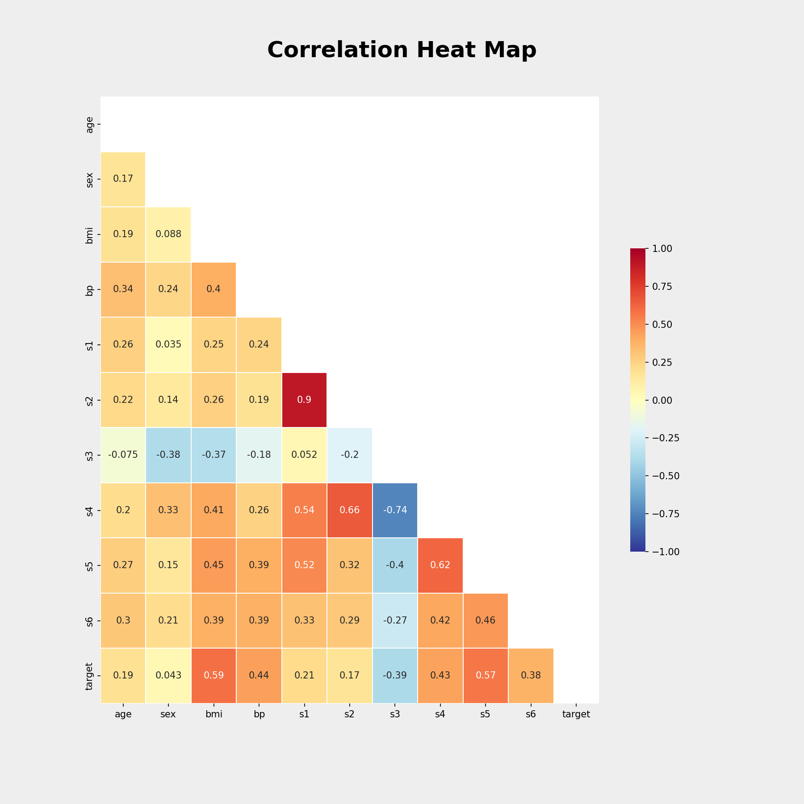
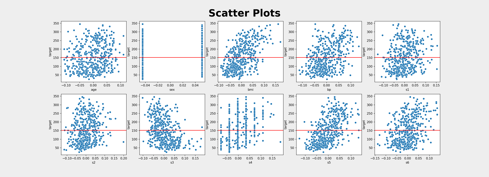

{: .align-center width="60%"} 
  


# Scikit-Learn 의 Diabetes 데이터셋

- 사이킷런에서 제공하는 여러 토이데이터셋 가운데 diabetes (당뇨병) 살펴보기


>- schikit learn 의 diabetes 데이터
>- [사이킷런 제공 연습데이터셋 리스트](https://scikit-learn.org/stable/modules/classes.html#module-sklearn.datasets)  
>- [diabetes 공식문서](https://scikit-learn.org/stable/modules/generated/sklearn.datasets.load_diabetes.html#sklearn.datasets.load_diabetes)

<br><br>

## 데이터 확인
### 불러오기
- 기본적인 방법으로 데이터 불러오기   

```python
# 라이브러리 임포트
from sklearn import datasets

# 당뇨병데이터 불러오기
diabetes = datasets.load_diabetes()
```  

<br><br>

### 데이터 확인
- sklearn 에서 제공하는 토이데이터는 딕셔너리형태로 제공
  - 딕셔너리 형태는 {key : value}
  - 예  
  {'이름' : '홍길동',   
  '사는곳' : '아산시 탕정면',  
  'age' : 38}  
- 데이터 딕셔너리가 가지고 있는 key 가 무엇이 있는지 확인
  ```python
  diabetes.keys()
  ```
  >dict_keys(['data', 'target', 'frame', 'DESCR', 'feature_names', 'data_filename', 'target_filename', 'data_module'])
  - key를 하나하나 확인하여 key에 있는 value를 확인해보자  

- data  

  ```python
  diabetes.data
  ```  

  >array([[ 0.03807591,  0.05068012,  0.06169621, ..., -0.00259226,
         0.01990842, -0.01764613],
       [-0.00188202, -0.04464164, -0.05147406, ..., -0.03949338,
        -0.06832974, -0.09220405],
       [ 0.08529891,  0.05068012,  0.04445121, ..., -0.00259226,
         0.00286377, -0.02593034],
       ...,
       [ 0.04170844,  0.05068012, -0.01590626, ..., -0.01107952,
        -0.04687948,  0.01549073],
       [-0.04547248, -0.04464164,  0.03906215, ...,  0.02655962,
         0.04452837, -0.02593034],
       [-0.04547248, -0.04464164, -0.0730303 , ..., -0.03949338,
        -0.00421986,  0.00306441]])
  - 흔히 독립변수, 피쳐라고 부르는 데이터들이 나온다
  - 행과 열이 있는 2차원 배열이다

- target  

  ```python
  diabetes.target
  ```  

  >array([151.,  75., 141., 206., 135.,  97., 138.,  63., 110., 310., 101.,
        69., 179., 185., 118., 171., 166., 144.,  97., 168.,  68.,  49.,
        68., 245., 184., 202., 137.,  85., 131., 283., 129.,  59., 341.,
        87.,  65., 102., 265., 276., 252.,  90., 100.,  55.,  61.,  92.,
       259.,  53., 190., 142.,  75., 142., 155., 225.,  59., 104., 182.,
       128.,  52.,  37., 170., 170.,  61., 144.,  52., 128.,  71., 163.,
       150.,  97., 160., 178.,  48., 270., 202., 111.,  85.,  42., 170.,
       200., 252., 113., 143.,  51.,  52., 210.,  65., 141.,  55., 134.,
        42., 111.,  98., 164.,  48.,  96.,  90., 162., 150., 279.,  92.,
        83., 128., 102., 302., 198.,  95.,  53., 134., 144., 232.,  81., ...
        ...
  - 종속변수, 타겟이라고 부르는 데이터
  - 1차원 배열  

- DESCR  
  ```python
  print(diabetes.DESCR)
  ```  

  ```
  Diabetes dataset
  ----------------
  Ten baseline variables, age, sex, body mass index, average blood
  pressure, and six blood serum measurements were obtained for each of n =
  442 diabetes patients, as well as the response of interest, a
  quantitative measure of disease progression one year after baseline.

  **Data Set Characteristics:**

    :Number of Instances: 442

    :Number of Attributes: First 10 columns are numeric predictive values

    :Target: Column 11 is a quantitative measure of disease progression one year after baseline

    :Attribute Information:
        - age     age in years
        - sex
        - bmi     body mass index
        - bp      average blood pressure
        - s1      tc, total serum cholesterol
        - s2      ldl, low-density lipoproteins
        - s3      hdl, high-density lipoproteins
        - s4      tch, total cholesterol / HDL
        - s5      ltg, possibly log of serum triglycerides level
        - s6      glu, blood sugar level

  Note: Each of these 10 feature variables have been mean centered and scaled by the standard deviation times `n_samples` (i.e. the sum of squares of each column totals 1).

  Source URL:
  https://www4.stat.ncsu.edu/~boos/var.select/diabetes.html

  For more information see:
  Bradley Efron, Trevor Hastie, Iain Johnstone and Robert Tibshirani (2004) "Least Angle Regression," Annals of Statistics (with discussion), 407-499.
  (https://web.stanford.edu/~hastie/Papers/LARS/LeastAngle_2002.pdf)
  ```  

  - 데이터에 대한 소개를 볼 수 있는 key
  - 혈액정보가 포함되어있는 10개의 당뇨병과 관련된 변수
  - 각 변수는 442개 측정값
  - 종속변수는 1년 후의 병의 경과에 대한 양적인 측정값
  - 각 변수는 평균중심화하고, 표준편차와 샘플 수의 곱으로 나누었음  
    - 평균은 0, 합은 1로 변형

- feature_names  

  ```python
  diabetes.feature_names
  ```  

  - 각 독립변수(=피쳐)의 이름  

- data_filename, target_filename  

  ```python
  print(diabetes.data_filename)
  print(diabetes.target_filename)
  ```  

  - 데이터파일 이름과, 타겟파일 이름

<br><br>

### 데이터 준비

- pandas 데이터프레임
  ```python
  import pandas as pd

  df = pd.DataFrame(diabetes.data, columns=diabetes.feature_names)
  df['target'] = diabetes.target
  df
  ```
  - diabetes.data 을 데이터프레임 df로 지정
  - df에 target 추가

- df 정보
  ```python
  df.info()
  ```  

  ```
  <class 'pandas.core.frame.DataFrame'>
  RangeIndex: 442 entries, 0 to 441
  Data columns (total 11 columns):
  #   Column  Non-Null Count  Dtype  
  ---  ------  --------------  -----  
  0   age     442 non-null    float64
  1   sex     442 non-null    float64
  2   bmi     442 non-null    float64
  3   bp      442 non-null    float64
  4   s1      442 non-null    float64
  5   s2      442 non-null    float64
  6   s3      442 non-null    float64
  7   s4      442 non-null    float64
  8   s5      442 non-null    float64
  9   s6      442 non-null    float64
  10  target  442 non-null    float64
  dtypes: float64(11)
  memory usage: 38.1 KB
  ```  

  - 테이터타입은 판다스 데이터프레임
  - 442개 인덱스
  - 11개 컬럼
  - 11개 컬럼 모두 float(소수형) 타입

- 기술통계
  ```python
  df.describe()
  ```

  ||age |sex |bmi |bp |s1 |s2 |s3 |s4 |s5 |s6 |target |
  |:---:|:---:|:---:|:---:|:---:|:---:|:---:|:---:|:---:|:---:|:---:|:---:|
  | count |442.000 |442.000 |442.000 |442.000 |442.000 |442.000 |442.000 |442.000 |442.000 |442.000 |442.000 |
  | mean |-0.000 |0.000 |-0.000 |0.000 |-0.000 |0.000 |-0.000 |0.000 |-0.000 |-0.000 |152.133 |
  | std |0.048 |0.048 |0.048 |0.048 |0.048 |0.048 |0.048 |0.048 |0.048 |0.048 |77.093 |
  | min |-0.107 |-0.045 |-0.090 |-0.112 |-0.127 |-0.116 |-0.102 |-0.076 |-0.126 |-0.138 |25.000 |
  | 25% |-0.037 |-0.045 |-0.034 |-0.037 |-0.034 |-0.030 |-0.035 |-0.039 |-0.033 |-0.033 |87.000 |
  | 50% |0.005 |-0.045 |-0.007 |-0.006 |-0.004 |-0.004 |-0.007 |-0.003 |-0.002 |-0.001 |140.500 |
  | 75% |0.038 |0.051 |0.031 |0.036 |0.028 |0.030 |0.029 |0.034 |0.032 |0.028 |211.500 |
  | max |0.111 |0.051 |0.171 |0.132 |0.154 |0.199 |0.181 |0.185 |0.134 |0.136 |346.000 |
  
  - 10개 피쳐들의 평균이 0이다.


  ```python
  df.describe()
  ```  

  ||sum |
  |:---:|:---:|
  | age |-0.000 |
  | sex |0.000 |
  | bmi |-0.000 |
  | bp |0.000 |
  | s1 |-0.000 |
  | s2 |0.000 |
  | s3 |-0.000 |
  | s4 |0.000 |
  | s5 |-0.000 |
  | s6 |-0.000 |
  | target |67243.000 |
  - 10개 변수들의 합계는 0이다.


  ```python
  df.isna().sum()
  ```  

  ||0 |
  |:---:|:---:|
  | age |0.000 |
  | sex |0.000 |
  | bmi |0.000 |
  | bp |0.000 |
  | s1 |0.000 |
  | s2 |0.000 |
  | s3 |0.000 |
  | s4 |0.000 |
  | s5 |0.000 |
  | s6 |0.000 |
  | target |0.000 |
  - 혹시나 해서 결측값을 찾아보았지만, 결측값은 없다.


  ```python
  df.duplicated().sum()
  ```  

  - 중복값도 없다.

- 상관관계

  ```python
  df.corr()
  ```

  ||age |sex |bmi |bp |s1 |s2 |s3 |s4 |s5 |s6 |target |
  |:---:|:---:|:---:|:---:|:---:|:---:|:---:|:---:|:---:|:---:|:---:|:---:|
  | age |1.000 |0.174 |0.185 |0.335 |0.260 |0.219 |-0.075 |0.204 |0.271 |0.302 |0.188 |
  | sex |0.174 |1.000 |0.088 |0.241 |0.035 |0.143 |-0.379 |0.332 |0.150 |0.208 |0.043 |
  | bmi |0.185 |0.088 |1.000 |0.395 |0.250 |0.261 |-0.367 |0.414 |0.446 |0.389 |0.586 |
  | bp |0.335 |0.241 |0.395 |1.000 |0.242 |0.186 |-0.179 |0.258 |0.393 |0.390 |0.441 |
  | s1 |0.260 |0.035 |0.250 |0.242 |1.000 |0.897 |0.052 |0.542 |0.516 |0.326 |0.212 |
  | s2 |0.219 |0.143 |0.261 |0.186 |0.897 |1.000 |-0.196 |0.660 |0.318 |0.291 |0.174 |
  | s3 |-0.075 |-0.379 |-0.367 |-0.179 |0.052 |-0.196 |1.000 |-0.738 |-0.399 |-0.274 |-0.395 |
  | s4 |0.204 |0.332 |0.414 |0.258 |0.542 |0.660 |-0.738 |1.000 |0.618 |0.417 |0.430 |
  | s5 |0.271 |0.150 |0.446 |0.393 |0.516 |0.318 |-0.399 |0.618 |1.000 |0.465 |0.566 |
  | s6 |0.302 |0.208 |0.389 |0.390 |0.326 |0.291 |-0.274 |0.417 |0.465 |1.000 |0.382 |
  | target |0.188 |0.043 |0.586 |0.441 |0.212 |0.174 |-0.395 |0.430 |0.566 |0.382 |1.000 |

- 가장 마지막 행이 타겟이기 때문에, 타겟행만 보면...
  - 체질량지수(bmi)와 혈청 트리글리세리드 수치(s5)가 상관관계가 높다.


- 상관관계 표 보기좋게 그리기
  ```python
  import numpy as np
  import matplotlib.pyplot as plt
  import seaborn as sns

  # 상관관계 히트맵 그리기
  coff_df = df.corr()

  # 그림 사이즈 지정
  fig, ax = plt.subplots( figsize=(12,12) )
  fig.suptitle('Correlation Heat Map', fontsize = 24, fontweight = 'bold', y = 0.95)

  # 삼각형 마스크를 만든다(위 쪽 삼각형에 True, 아래 삼각형에 False)
  mask = np.zeros_like(coff_df, dtype=np.bool)
  mask[np.triu_indices_from(mask)] = True

  # 히트맵을 그린다
  sns.heatmap(coff_df, 
              cmap = 'RdYlBu_r', 
              annot = True,             # 실제 값을 표시한다
              mask=mask,                # 표시하지 않을 마스크 부분을 지정한다
              linewidths=.5,            # 경계면 실선으로 구분하기
              cbar_kws={"shrink": .5},  # 컬러바 크기 절반으로 줄이기
              vmin = -1,vmax = 1        # 컬러바 범위 -1 ~ 1
            )  
  plt.show()
  ```

  {: .align-center width="90%"}  
  

- 데이터 분포 시각화
  ```python
  fig, ax = plt.subplots(nrows=2, ncols=5, figsize=(22,8))
  fig.suptitle('Scatter Plots', fontsize = 32, fontweight = 'bold', y = 0.95)

  cols = diabetes.feature_names

  for i in range(0, 2):
    for j in range(0, 5):
      sns.scatterplot(x = df[cols[i*5 + j]], y = df['target'], ax = ax[i][j])
      ax[i][j].axhline(df['target'].mean(), c='r', label = 'Base of Mean')

  plt.show()

  # 분석결과 저장
  file_name = 'sklearn_diabetes_scatterPlots'
  fig.savefig(path_results + file_name, dpi=150, facecolor='#eeeeee')
  ```  

  {: .align-center width="90%"}  


<br><br><br><br>  
<center>  
<h1>끝까지 읽어주셔서 감사합니다😉</h1>  
</center>  
<br><br><br><br>  