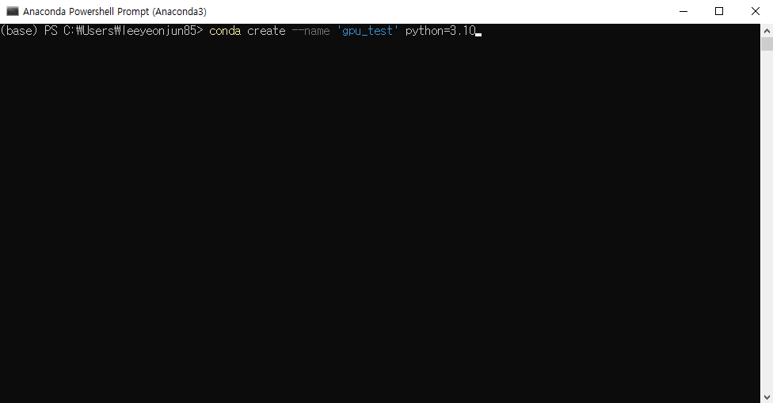
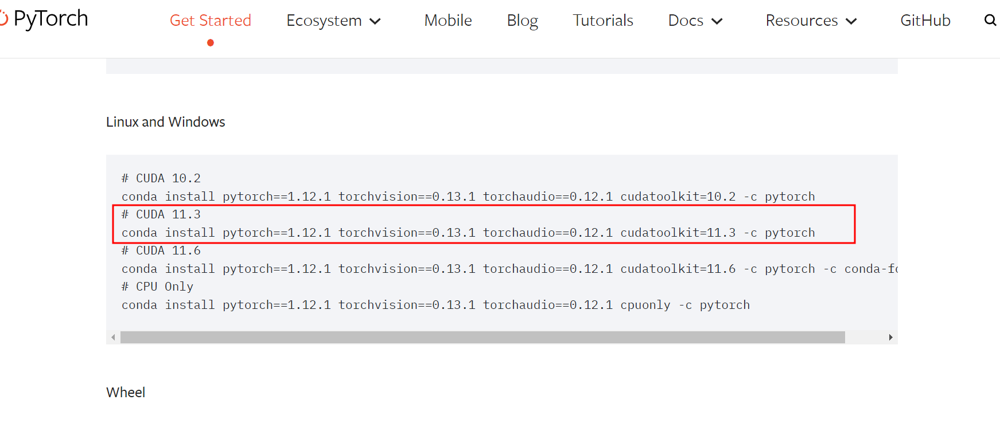
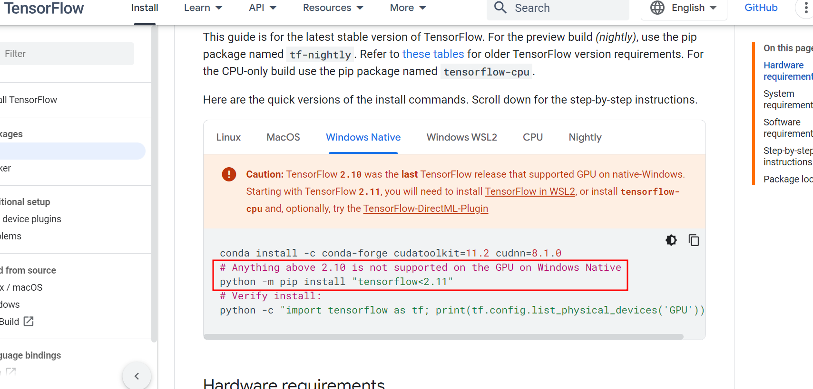

 

<br><br>


{: .align-center width="70%"}  


<br><br>


# Tensorflow, Pytorch 윈도우 VSCode에서 GPU사용하기


<br><br>


## 딥러닝에서 CPU와 GPU의 차이란?




<br><br>


## 윈도우에서 GPU 딥러닝을 하기 위해서는...
- 크게 두가지 방법이 있음  
  1. Docker 활용방법  
  2. Anaconda 가상환경 활용방법  
  - 오늘은 `2번` 방법을 사용할 것임

- Nvidia 그래픽드라이버 최신으로 설치
- 아나콘다 설치하고 Anaconda Powershell Prompt를 열어서 `conda create --name 'gpu_test' python=3.10`로 가상환경 만들기

{: .align-center width="80%"}  

- VSCode 열어서 Gitbash 터미널 열어서 `source C:/ProgramData/Anaconda3/Scripts/activate gpu_test`로 가상환경 실행
- 이후로 라이브러리는 VSCode 에서 Gitbash 터미널에서 가상환경이 실행된 상태에서 설치하면 됨

- 필요한 라이브러리 설치 `pip install ipykernel pandas matplotlib`


<br><br>


## Pytorch

- Pytorch Version : 1.12.1

### Pytorch CPU Test

- Version 확인  

```python
import torch
print(f"✅ Pytorch Version Check\nPytorch Ver. : {torch.__version__} / GPU : {torch.cuda.is_available()}")
```

```markdown
✅ Pytorch Version Check
Pytorch Ver. : 1.12.1+cpu / GPU : False
```

- 모델에 대한 자세한 설명은 링크 참조
  - [Pytorch Transformer 모델 설명](https://wikidocs.net/156986)

```markdown
------------------------- Epoch 1 -------------------------
Training loss: 0.6040
Validation loss: 0.4020

------------------------- Epoch 2 -------------------------
Training loss: 0.4080
Validation loss: 0.3719

------------------------- Epoch 3 -------------------------
Training loss: 0.3710
Validation loss: 0.3171

...
Training loss: 0.2258
Validation loss: 0.1535

✅ 소요시간 : 750초
```

- GPU가 없으면 간단한 실험 모델도 10분 이상 걸림  

<br>

### Pytorch GPU 설치하기


- 현시점(2023-04-15)에서 Pytorch의 최신버전은 2.0
  - [Pytorch 공식홈피](https://pytorch.org/)
  - 하지만 Pytorch2.0과 Tensorflow를 함께 설치하면 에러가 발생하여 낮은 버전으로 설치할 것임
  - [Pytorch 공식홈피 버전안내](https://pytorch.org/get-started/previous-versions/) 여기 들어가서 아래 그림에 나오는 버전을 확인하여 Ctrl+C 복사

{: .align-center width="70%"}  

```bash
conda install pytorch==1.12.1 torchvision==0.13.1 torchaudio==0.12.1 cudatoolkit=11.3 -c pytorch
```


- Pytorch Version, GPU 확인

```python
import torch
print(f"✅ Pytorch Version Check\nPytorch Ver. : {torch.__version__} / GPU : {torch.cuda.is_available()}")
```

```markdown
✅ Pytorch Version Check
Pytorch Ver. : 1.12.1 / GPU : True
```

- GPU가 `True`라고 나옴

- 위와 똑같은 모델을 학습하면

```markdown
------------------------- Epoch 1 -------------------------
Training loss: 0.6845
Validation loss: 0.4024

------------------------- Epoch 2 -------------------------
Training loss: 0.4001
Validation loss: 0.3279

------------------------- Epoch 3 -------------------------
Training loss: 0.3337
Validation loss: 0.2547

...
Training loss: 0.2192
Validation loss: 0.1445

✅ 소요시간 : 146초
```

- 소요시간이 약 1/5로 줄어듦🎉


<br><br>


## Tensorflow  

- Tensorflow Version : 2.10.1

### Pytorch CPU 실험 모델 : IMDB 감정분류 모델  

- 데이터, 라이브러리 불러오기  

```python 
import tensorflow as tf
from tensorflow import keras
from keras.datasets import imdb
from keras import Model, layers, losses
from keras.layers import Input, Dense, Dropout, Embedding, LSTM
import time

print(f"Loading Data...")
rand_seed = 83
num_words = 10000
(X_train_raw, y_train_raw), (X_test_raw, y_test_raw) = imdb.load_data(num_words=num_words)
print(f"🎬 {X_train_raw.shape}, {y_train_raw.shape}, {X_test_raw.shape}, {y_test_raw.shape}")
maxlen=256
X_train = tf.keras.preprocessing.sequence.pad_sequences(X_train_raw, maxlen=maxlen)
X_test = tf.keras.preprocessing.sequence.pad_sequences(X_test_raw, maxlen=maxlen)
y_train = y_train_raw
y_test = y_test_raw
print(X_train.shape, X_test.shape)
```

```markdown
Loading Data...
🎬 (25000,), (25000,), (25000,), (25000,)
(25000, 256) (25000, 256)
```

- 임베딩, LSTM 사용한 분류모델 생성  

```python
rand_seed=83
layer_Input       = Input(shape=[maxlen])
layer_Embedding   = Embedding(input_dim=num_words
                              , output_dim=300
                              , input_length=maxlen
                              )(layer_Input)
layer_LSTM        = LSTM(units=64)(layer_Embedding)
layer_Hidden      = Dense(units=120
                          , activation='relu'
                          , kernel_initializer='he_uniform'
                          )(layer_LSTM)
layer_Dropout     = Dropout(0.2, seed=rand_seed)(layer_Hidden)
layer_Output      = Dense(1, activation='sigmoid')(layer_Dropout)
model             = Model(inputs=layer_Input, outputs=layer_Output)

model.summary()
```

```markdown
Model: "model"
_________________________________________________________________
 Layer (type)                Output Shape              Param #   
=================================================================
 input_1 (InputLayer)        [(None, 256)]             0         
                                                                 
 embedding (Embedding)       (None, 256, 300)          3000000   
                                                                 
 lstm (LSTM)                 (None, 64)                93440     
                                                                 
 dense_3 (Dense)             (None, 120)               7800      
                                                                 
 dropout (Dropout)           (None, 120)               0         
                                                                 
 dense_4 (Dense)             (None, 1)                 121       
                                                                 
=================================================================
Total params: 3,101,361
Trainable params: 3,101,361
Non-trainable params: 0
_________________________________________________________________
```

- 모델 학습  

```python
time_check = time.time()
EPOCHS = 3
model.compile(loss='binary_crossentropy'
          , optimizer='adam'
          , metrics=['accuracy']
          )

model.fit(X_train, y_train
          , batch_size=32
          , epochs=EPOCHS
          , validation_split=0.2
          )

accr = model.evaluate(X_test, y_test)
print(f"Test set Loss & Accuracy : ({accr[0]:0.3f}, {accr[1]:0.3f})")
time_check = int(time.time() - time_check)
print(f"✅ 소요시간 : {time_check}초")
```

```markdown
Epoch 1/3
625/625 [==============================] - 85s 133ms/step - loss: 0.3897 - accuracy: 0.8342 - val_loss: 0.3263 - val_accuracy: 0.8630
Epoch 2/3
625/625 [==============================] - 83s 132ms/step - loss: 0.2264 - accuracy: 0.9121 - val_loss: 0.3236 - val_accuracy: 0.8642
Epoch 3/3
625/625 [==============================] - 82s 132ms/step - loss: 0.1521 - accuracy: 0.9428 - val_loss: 0.3914 - val_accuracy: 0.8650
782/782 [==============================] - 35s 44ms/step - loss: 0.4106 - accuracy: 0.8604
Test set Loss & Accuracy : (0.411, 0.860)
✅ 소요시간 : 284초
```

- GPU가 없으면 이렇게 간단한 모델도 5분정도 걸림

<br>

### Tensorflow GPU 설치
- [Tensorflow 공식홈피 설치안내](https://www.tensorflow.org/install/pip?hl=en#windows-native)를 보면, 윈도우에서의 GPU지원은 tensorflow 2.10이 마지막 버전이라고 함😱

{: .align-center width="80%"}  

- 아나콘다에 tensorflow 2.10 GPU 설치하기

```bash
conda install -c conda-forge cudatoolkit=11.3 cudnn=8.2.1
python -m pip install "tensorflow<2.11"
```

- tensorflow GPU 확인하기

```python
# Tensorflow Version Check
import tensorflow as tf
from tensorflow.python.client import device_lib
print(f"✅ Tensorflow Version Check\n{device_lib.list_local_devices()[1]}\n{'='*100}")
```

```markdown
✅ Tensorflow Version Check
name: "/device:GPU:0"
device_type: "GPU"
memory_limit: 6277824512
locality {
  bus_id: 1
  links {
  }
}
incarnation: 8804705358063827956
physical_device_desc: "device: 0, name: NVIDIA GeForce RTX 2070, pci bus id: 0000:08:00.0, compute capability: 7.5"
xla_global_id: 416903419
```

- GPU 환경에서 위와 똑같은 모델 학습

```markdown
Epoch 1/3
625/625 [==============================] - 16s 20ms/step - loss: 0.4446 - accuracy: 0.7944 - val_loss: 0.4100 - val_accuracy: 0.8078
Epoch 2/3
625/625 [==============================] - 11s 18ms/step - loss: 0.2603 - accuracy: 0.8982 - val_loss: 0.3496 - val_accuracy: 0.8644
Epoch 3/3
625/625 [==============================] - 12s 19ms/step - loss: 0.1782 - accuracy: 0.9337 - val_loss: 0.3541 - val_accuracy: 0.8636
782/782 [==============================] - 7s 8ms/step - loss: 0.3811 - accuracy: 0.8484
Test set Loss & Accuracy : (0.381, 0.848)
✅ 소요시간 : 46초
```

- 역시 1/5 이상 소요시간이 줄어들었다🎊


<br><br>


## 후기
- 딥러닝 모델에서 GPU를 쓰는 것과 안쓰는 것은 위 영상에서처럼 속도 차이가 많이 남
- 다른 여러가지 방법이 있지만 Anaconda 가상환경으로 GPU를 사용하는 것이 가장 간단한 방법이라 생각 됨
- 장점
  - 간단한 설치와 관리
  - 다양하게 가상환경 관리 가능
- 단점
  - 최신버전 활용하기가 불편함
  - 가상환경을 바꿔가며 사용해야 할 수도 있음


<br>
<br>
<br>
<br>


<center>
<h1>끝까지 읽어주셔서 감사합니다😉</h1>
</center>


<br>
<br>
<br>
<br>


