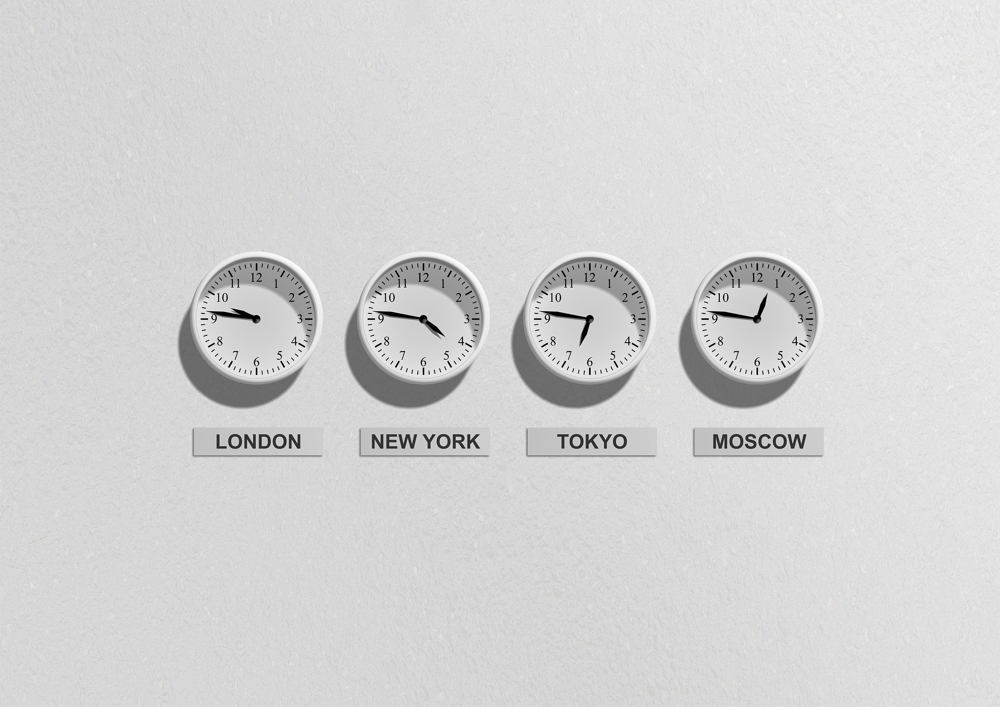
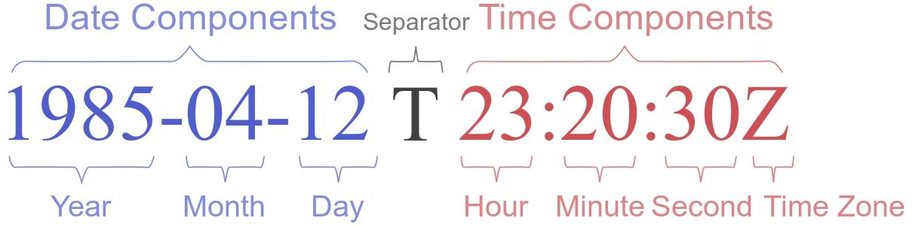

 


<br><br><br><br>


{: .align-center width="70%"}  


<br><br><br><br>


# Python에서 시간 사용하기  
> 내장함수 time(), datetime()으로 다양하게 시간 사용하기  
> [관련 소스코드 보기](https://github.com/leeyeonjun85/leeyeonjun85/blob/main/study/python/time_datetime.ipynb)


<br><br><br><br>


## 컴퓨터에서 시간을 표기하는 방법

{: .align-center width="90%"}  

- 협정 세계시(UTC : Coordinated Universal Time, Universal Time Coordinated)
  - 1972년 1월 1일부터 시행된 국제 표준시
  - 1970년 1월 1일 자정을 0 밀리초로 설정하여 기준을 삼아 그 후로 시간의 흐름을 밀리초로 계산
  - UTC는 간단하게 영국의 표준시간으로 이해할 수 있음
  - UTC는 영국 그리니치 천문대의 시간을 기준으로 하기 때문에, 그리니치 평균 시라고 하는 GMT(Greenwich Mean Time)로도 자주 표기 됨

- 한국 표준시 (KST : Korea Standard Time)

- Time Stamp
  - 타임스탬프는 특정한 시각을 나타내거나 기록하는 문자형식
  - 타임스탬프의 예
    - Sun 04-16-2023 13:42
    - 2005-10-30 T 10:45 UTC
    - 2007-11-09 T 11:20 UTC
    - Sat Jul 23 02:16:57 2005
    - 1256953732 (유닉스 시간)
    - (1969-07-21 T 02:56 UTC) –
    - 07:38, 11 December 2012 (UTC)

- ISO 8601
  - 날짜와 시간과 관련된 데이터 교환을 다루는 국제 표준
  - ISO 8601에 따라 UTC 시간 표현하기
    - 2016-10-27T17:13:40+00:00
    - 2016-10-27T17:13:40Z
    - 20161027T171340Z
  - ISO 8601에 따라 KST 시간 표현하기
    - 2016-10-27T17:13:40+09:00

{: .align-center width="70%"}  

- Unix Time
  - 1970년 1월 1일 00:00:00 협정 세계시(UTC) 부터의 경과 시간을 초로 환산하여 정수로 나타낸 것
  - POSIX 시간, Epoch 시간 으로도 불림
  - 주로 특정 시간 t1 과 특정 시간 t2 의 차이를 표현하려고 할 때 사용
  - Git bash에서 다음과 같은 명령어로 Unix Time을 쉽게 얻을 수 있음  

```bash
date +%s
# 출력 : 1681620255
```


<br><br><br><br>


## Python에서의 시간

- 파이썬의 내장함수 time(), datetime()은 시간과 관련된 대표적인 모듈임
- [`time()`공식문서](https://docs.python.org/ko/3/library/time.html#time.gmtime)
- [`datetime()`공식문서](https://docs.python.org/ko/3/library/datetime.html)


<br><br>


### 내장함수로 UTC, KST 시간객체 얻기  

- 파이썬 내장함수로 반환되는 시간은 `time.struct_time` 타입과 `datetime.datetime` 타입이 있음

```python
print(f"""✅ UTC
{time.gmtime()}
{datetime.datetime.utcnow().utctimetuple()}
{type(time.gmtime())}

{datetime.datetime.utcnow()}
{type(datetime.datetime.utcnow())}

✅ KST
{time.localtime()}
{datetime.datetime.now().timetuple()}
{type(datetime.datetime.now().timetuple())}

{datetime.datetime.now()}
{datetime.datetime.today()}
{type(datetime.datetime.today())}
""")
```

```cmd
==========    📌출력    ==========
✅ UTC
time.struct_time(tm_year=2023, tm_mon=4, tm_mday=16, tm_hour=5, tm_min=31, tm_sec=3, tm_wday=6, tm_yday=106, tm_isdst=0)
time.struct_time(tm_year=2023, tm_mon=4, tm_mday=16, tm_hour=5, tm_min=31, tm_sec=3, tm_wday=6, tm_yday=106, tm_isdst=0)
<class 'time.struct_time'>

2023-04-16 05:31:03.290045
<class 'datetime.datetime'>

✅ KST
time.struct_time(tm_year=2023, tm_mon=4, tm_mday=16, tm_hour=14, tm_min=31, tm_sec=3, tm_wday=6, tm_yday=106, tm_isdst=0)
time.struct_time(tm_year=2023, tm_mon=4, tm_mday=16, tm_hour=14, tm_min=31, tm_sec=3, tm_wday=6, tm_yday=106, tm_isdst=-1)
<class 'time.struct_time'>

2023-04-16 14:31:03.290045
2023-04-16 14:31:03.290046
<class 'datetime.datetime'>
```


<br><br>


### 내장함수로 ISO 8601 형식 얻기

- `time.struct_time` 타입은 `time.strftime()` 메소드로 변환
- `datetime.datetime` 타입은 `datetime` 모듈의 `strftime()` 메소드로 변환

```python
print(f"""✅ ISO UTC
{time.strftime('%Y-%m-%dT%H:%M:%S+00:00', time.gmtime())}
{datetime.datetime.utcfromtimestamp(datetime.datetime.now().timestamp()).strftime('%Y-%m-%dT%H:%M:%S+00:00')}

✅ ISO KST
{time.strftime('%Y-%m-%dT%H:%M:%S+00:00')}
{datetime.datetime.fromtimestamp(datetime.datetime.now().timestamp()).strftime('%Y-%m-%dT%H:%M:%S+09:00')}
""")
```

```cmd
==========    📌출력    ==========
✅ ISO UTC
2023-04-16T05:40:37+00:00
2023-04-16T05:40:37+00:00

✅ ISO KST
2023-04-16T14:40:37+09:00
2023-04-16T14:40:37+09:00
```


<br><br>


### 내장함수로 Unix Time 얻기

```python
print(f"""✅ UTC Unix Time
{time.mktime(time.gmtime())}
{datetime.datetime.utcnow().timestamp()}
{datetime.datetime.timestamp(datetime.datetime.utcnow())}

✅ KST Unix Time
{time.time()}
{time.mktime(time.localtime())}
{datetime.datetime.now().timestamp()}
""")
```

```cmd
==========    📌출력    ==========
✅ UTC Unix Time
1681591537.0
1681591537.282041
1681591537.282041

✅ KST Unix Time
1681623937.282041
1681623937.0
1681623937.282041
```


<br><br>


### 기타 유용한 메소드

- Unix Time을 datetime 타입으로 변환
- 문자열을 struct_time 타입으로 변환

```python
unix_utc = time.mktime(time.gmtime())
unix_kst = time.mktime(time.localtime())
print(f"""Unix UTC : {unix_utc}, Unix KST : {unix_kst}
✅ Unix KST   →   UTC datetime
{datetime.datetime.utcfromtimestamp(unix_kst)}
✅ Unix UTC   →   UTC datetime
{datetime.datetime.fromtimestamp(unix_utc)}
✅ Unix KST   →   KST datetime
{datetime.datetime.fromtimestamp(unix_kst)}

✅ String Date, Time   →   struct_time
{time.strptime("16 Apr 2023 15:02:12", "%d %b %Y %H:%M:%S")}
{time.strptime("1919.03.01", "%Y.%m.%d")}
""")
```

```cmd
==========    📌출력    ==========
Unix UTC : 1681592497.0, Unix KST : 1681624897.0
✅ Unix KST   →   UTC datetime
2023-04-16 06:01:37
✅ Unix UTC   →   UTC datetime
2023-04-16 06:01:37
✅ Unix KST   →   KST datetime
2023-04-16 15:01:37

✅ String Date, Time   →   struct_time
time.struct_time(tm_year=2023, tm_mon=4, tm_mday=16, tm_hour=15, tm_min=2, tm_sec=12, tm_wday=6, tm_yday=106, tm_isdst=-1)
time.struct_time(tm_year=1919, tm_mon=3, tm_mday=1, tm_hour=0, tm_min=0, tm_sec=0, tm_wday=5, tm_yday=60, tm_isdst=-1)
```

- time.sleep(초) : 지정한 시간만큼 대기

```python
time_check = time.time()
time.sleep(1.5)
time_check -= time.time()
print(f"소요시간 : {-time_check}")
```

```cmd
==========    📌출력    ==========
소요시간 : 1.5117628574371338
```


<br><br><br><br>
<center>
<h1>끝까지 읽어주셔서 감사합니다😉</h1>
</center>
<br><br><br><br>


