<br><br><br><br>

{: .align-center width="50%"}  

<br><br><br><br>


# CV - 합성곱 신경망(CNN)  
> 컴퓨터 비전 : 합성곱 신경망(Convolutional Neural Network, CNN)  

- AI를 공부하면서 내가 좋아하는 NLP쪽만 공부하다보니 CV분야의 학습이 부족한것 같음  
- 컴퓨터 비전 분야를 체계적으로 정리해 보자  
{: .notice--success}


<br><br><br><br>


## 합성곱 신경망(Convolutional Neural Network, CNN)의 구조
- 합성곱 신경망은 `특징 추출 부분`, `분류를 위한 신경망` 두 가지 구조로 구성  
  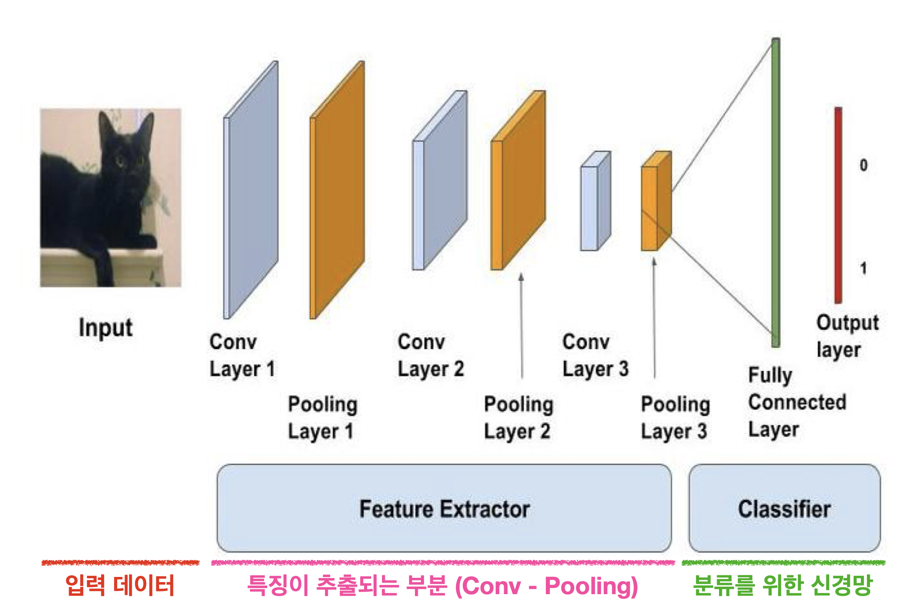{: .align-center width="80%"}  

- 특징 추출 부분
  - `합성곱` 층(Convolution Layer)과 `풀링` 층(Pooling Layer)으로 구성
  - 합성곱 신경망은 합성곱 층의 `Filter의 가중치`를 학습
- 분류를 위한 신경망
  - 일반적 인공신경망의 `다층 퍼셉트론` 신경망으로 구성하면 됨
  - `완전 연결 신경망`(Fully Connected Layer)이라고 불림


<br><br>


### 특징 추출 부분
#### 합성곱(Convolution Layer)
- 합성곱 층에서는 `합성곱 필터`(Convolution Filter)가 슬라이딩(Sliding)하며 이미지 부분부분의 `특징을 추출`  
  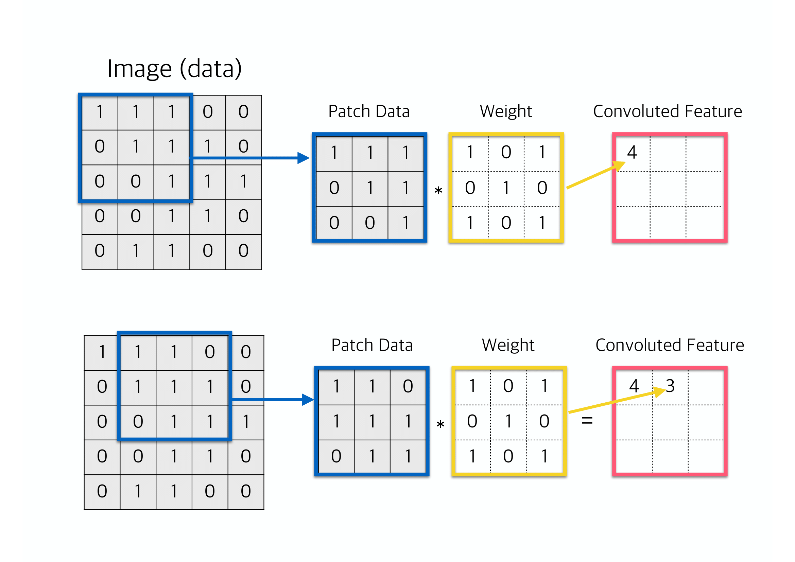{: .align-center width="70%"} 

<br>

#### 패딩(Padding)
- 연산되어 나오는 Output, 즉 Feature map 의 크기를 조절하고 실제 이미지 값을 충분히 활용하기 위해, 이미지 외부를 특정한 값으로 둘러싸는 방법
- 주로 '0'으로 둘러싸주는 제로패딩(Zero-Padding)이 가장 많이 사용됨  
  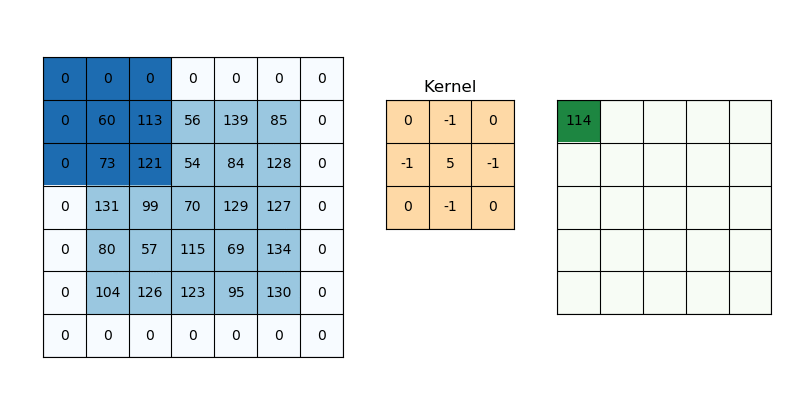{: .align-center width="70%"} 

<br>

#### 스트라이드(Stride)
- 슬라이딩(Sliding)시에 몇 칸 씩 건너뛸지 결정
  - 필터가 한 칸씩 슬라이딩하려면 `Stride=1` 로 설정
  - 두 칸씩 슬라이딩하려면 `Stride=2` 로 설정

- 필터 크기(Filter size), 패딩(Padding), 스트라이드(Stride)에 따른 Feature map 크기 변화  
  <center style="font-size:1.5em;">  
  $N_{\text{out}} = \bigg[\frac{N_{\text{in}} + 2p - k}{s}\bigg] + 1$
  </center>  
  - $N_{\text{in}}$ : 입력되는 이미지의 크기(=피처 수) <br/>
  - $N_{\text{out}}$ : 출력되는 이미지의 크기(=피처 수) <br/>
  - $k$ : 합성곱에 사용되는 커널(=필터)의 크기 <br/>
  - $p$ : 합성곱에 적용한 패딩 값 <br/>
  - $s$ : 합성곱에 적용한 스트라이드 값

<br>

#### 풀링(Pooling)
- 풀링(Pooling) : 가로, 세로 크기를 줄이고, 일정 공간을 대표하는 특징을 추출
- 최대 풀링(Max pooling)
  - 정해진 범위 내에서 가장 큰 값을 꺼내오는 방식
- 평균 풀링(Average pooling)
  - 정해진 범위 내에 있는 모든 요소의 평균을 가져오는 방식


<br><br>


### 분류를 위한 신경망
- 분류를 위한 신경망은 일반적인 다층 퍼셉트론 신경망으로 구성
- 분류를 위한 완전 연결 신경망(Fully Connected Layer)은 풀어야 하는 문제에 따라서, 곧 Class의 개수에 따라서(2개, 10개 분류 등) 출력층을 설계해야 함


<br><br><br><br>


## 합성곱 신경망 예제 : Cifar10
- 예제 환경
  ```python
  Python     : 3.10.11
  Tensorflow : 2.10.1
  TF GPU     : True
  ```

- 필요한 라이브러리 불러오기
  ```python
  # Library Import
  import tensorflow as tf
  from tensorflow import keras
  from keras.models import Model, Sequential
  from keras.layers import Dense, Conv2D, MaxPooling2D, Flatten
  from keras.applications.vgg16 import VGG16
  from keras.applications.mobilenet_v2 import MobileNetV2
  from keras.applications.resnet_v2 import ResNet50V2

  from sklearn.model_selection import train_test_split
  import numpy as np
  import matplotlib.pyplot as plt
  ```

- 각종 파라미터 설정
  ```python
  CONFIG = dict(
      # Dataset
      test_size = .2,
      idx = 200,
      label_names = ['Airplane', 'Automobile', 'Bird', 'Cat', 'Deer', 'Dog', 'Frog', 'Horse', 'Ship', 'Truck'],
      
      # Model
      model = None,
      history = None,
      optimizer = 'adam',
      loss = 'sparse_categorical_crossentropy',
      metrics = ['accuracy'],
      batch_size = 128,
      epochs = 20,
      input_shape = (32, 32, 3),
      shape = (None, 32, 32, 3),
      
      # Misc
      seed = 83,
      save_img = 'D:/이미지 저장 경로',
      )

  np.random.seed(CONFIG['seed'])
  tf.random.set_seed(CONFIG['seed'])
  ```


<br><br>


### 데이터 전처리
- [CIFAR-10 dataset](https://www.cs.toronto.edu/~kriz/cifar.html)
  - 10개의 클래스
    - airplane, automobile, bird, cat, deer, dog, frog, horse, ship, truck
    - 클래스당 약 6,000개 이미지
  - 32x32 사이즈, 컬러 이미지
  - 60,000개
    - 훈련용 50,000개
    - 평가용 10,000개

- 데이터 불러오기
  ```python
  (X_train, y_train), (X_test, y_test) = keras.datasets.cifar10.load_data()
  # Normalization
  X_train = X_train.astype('float32') / 255.
  X_test = X_test.astype('float32') / 255.
  # Validation Data Split
  X_train, X_val, y_train, y_val = train_test_split(X_train, y_train, test_size=CONFIG['test_size'], random_state=CONFIG['seed'])
  ```

- 일부 이미지 확인
  ```python
  fig, ax = plt.subplots(figsize=(10,10))

  for i, val in enumerate(range(CONFIG['idx']-10,CONFIG['idx']+10)):
      plt.subplot(5,5,i+1)
      plt.xticks([])
      plt.yticks([])
      plt.grid(False)
      plt.imshow(X_train[val])
      plt.xlabel(CONFIG['label_names'][y_train[val][0]])
  plt.show()

  fig.savefig(CONFIG['save_img']+'cifar_10_images.png', dpi=60, bbox_inches='tight')
  ```

  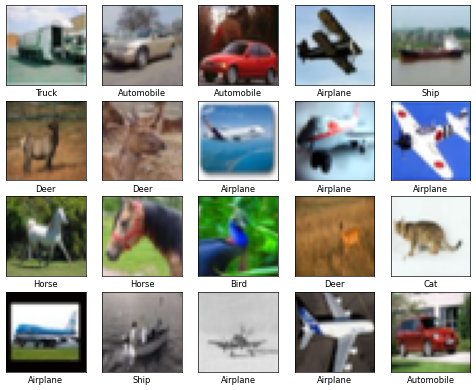{: .align-center width="50%"} 


<br><br>


### Sequential, Functional API, Sub Classing 비교
- 기본적인 합성곱 신경망 모델을 Sequential, Functional API, Sub Classing 방식으로 만들어 비교해보자

```cmd
🩺 의사코드 💉
- 인풋 = shape(32, 32, 3) 이미지
  - shape : 가로, 세로, RGB
- 합성곱 : Conv2D(필터=32, 필터사이즈=(3,3), 패딩=일정하게, 활성함수=렐루)
- 풀링 : MaxPooling(풀링사이즈=(2,2))
- 합성곱 : Conv2D(필터=64, 필터사이즈=(3,3), 패딩=일정하게, 활성함수=렐루)
- 풀링 : MaxPooling(풀링사이즈=(2,2))
- 합성곱 : Conv2D(필터=64, 필터사이즈=(3,3), 패딩=일정하게, 활성함수=렐루)
- shape(32, 32, 3) 3차원을 1차원으로 flatten
- 다층신경망 : Dense(노드=128, 활성함수=렐루)
- 출력 : Dense(출력=10, 활성함수=소프트맥스)
```

<br>

#### Sequential 방식의 합성곱 신경망
```python
def get_cnn_seq(input_shape, classes):
    model = Sequential(name='Sequential_Model')
    model.add(Conv2D(32, (3, 3)
                    , padding='same'
                    , input_shape=input_shape
                    , activation='relu'))
    model.add(MaxPooling2D(2, 2))
    model.add(Conv2D(64, (3, 3)
                    , padding='same'
                    , activation='relu'))
    model.add(MaxPooling2D(2, 2))
    model.add(Conv2D(64, (3, 3)
                    , padding='same'
                    , activation='relu'))
    model.add(Flatten())
    model.add(Dense(128, activation='relu'))
    model.add(Dense(classes, activation='softmax'))
    return model

CONFIG['model'] = get_cnn_seq(CONFIG['input_shape'], len(CONFIG['label_names']))
print(CONFIG['model'].summary())
```

```cmd
Model: "Sequential_Model"
_________________________________________________________________
Layer (type)                Output Shape              Param #   
=================================================================
conv2d (Conv2D)             (None, 32, 32, 32)        896       
                                                                
max_pooling2d (MaxPooling2D  (None, 16, 16, 32)       0         
)                                                               
                                                                
conv2d_1 (Conv2D)           (None, 16, 16, 64)        18496     
                                                                
max_pooling2d_1 (MaxPooling  (None, 8, 8, 64)         0         
2D)                                                             
                                                                
conv2d_2 (Conv2D)           (None, 8, 8, 64)          36928     
                                                                
flatten (Flatten)           (None, 4096)              0         
                                                                
dense (Dense)               (None, 128)               524416    
                                                                
dense_1 (Dense)             (None, 10)                1290      
                                                                
=================================================================
Total params: 582,026
Trainable params: 582,026
Non-trainable params: 0
_________________________________________________________________
None
```

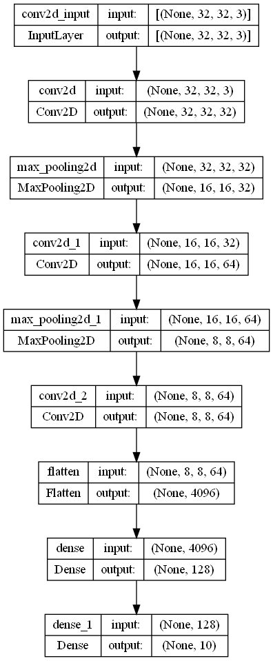{: .align-center width="50%"} 

```python
CONFIG['model'].compile(optimizer=CONFIG['optimizer'],
              loss=CONFIG['loss'],
              metrics=CONFIG['metrics'])

CONFIG['history'] = CONFIG['model'].fit(X_train, y_train,
          batch_size=CONFIG['batch_size'],
          validation_data=(X_val, y_val),
          epochs=CONFIG['epochs'])

CONFIG['model'].evaluate(X_test, y_test)
# loss: 1.5397 - accuracy: 0.7020
```

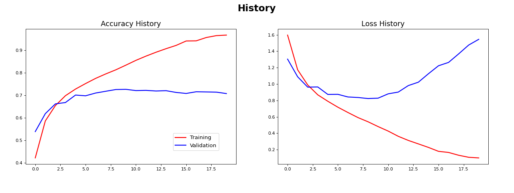{: .align-center width="80%"} 

<br>

#### Functional API 방식의 합성곱 신경망
```python
def get_cnn_fnc(shape, classes):
	inputs  = keras.Input(shape=shape)
	x       = Conv2D(32, (3,3), padding='same', activation='relu')(inputs)
	x       = MaxPooling2D(2,2)(x)
	x       = Conv2D(64, (3,3), padding='same', activation='relu')(x)
	x       = MaxPooling2D(2,2)(x)
	x       = Conv2D(64, (3,3), padding='same', activation='relu')(x)
	x       = Flatten()(x)
	x       = Dense(128, activation='relu')(x)
	outputs = Dense(classes, activation='softmax')(x)
	model   = keras.Model(inputs, outputs, name='Functional_Model')
	return model

CONFIG['model'] = get_cnn_fnc(CONFIG['input_shape'], len(CONFIG['label_names']))
print(CONFIG['model'].summary())
```

```cmd
Model: "Functional_Model"
_________________________________________________________________
 Layer (type)                Output Shape              Param #   
=================================================================
 input_1 (InputLayer)        [(None, 32, 32, 3)]       0         
                                                                 
 conv2d_3 (Conv2D)           (None, 32, 32, 32)        896       
                                                                 
 max_pooling2d_2 (MaxPooling  (None, 16, 16, 32)       0         
 2D)                                                             
                                                                 
 conv2d_4 (Conv2D)           (None, 16, 16, 64)        18496     
                                                                 
 max_pooling2d_3 (MaxPooling  (None, 8, 8, 64)         0         
 2D)                                                             
                                                                 
 conv2d_5 (Conv2D)           (None, 8, 8, 64)          36928     
                                                                 
 flatten_1 (Flatten)         (None, 4096)              0         
                                                                 
 dense_2 (Dense)             (None, 128)               524416    
                                                                 
 dense_3 (Dense)             (None, 10)                1290      
                                                                 
=================================================================
Total params: 582,026
Trainable params: 582,026
Non-trainable params: 0
_________________________________________________________________
```

```python
CONFIG['model'].compile(optimizer=CONFIG['optimizer'],
              loss=CONFIG['loss'],
              metrics=CONFIG['metrics'])

CONFIG['history'] = CONFIG['model'].fit(X_train, y_train,
          batch_size=CONFIG['batch_size'],
          validation_data=(X_val, y_val),
          epochs=CONFIG['epochs'])

CONFIG['model'].evaluate(X_test, y_test)
# loss: 1.7000 - accuracy: 0.7008
```

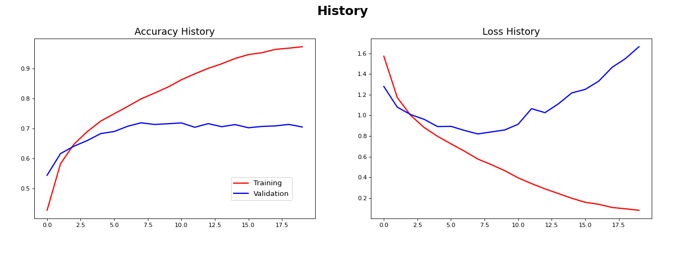{: .align-center width="80%"} 

<br>

#### Sub Classing 방식의 합성곱 신경망
```python
class GetCnnCLS(Model):
    def __init__(self, classes):
        super(GetCnnCLS, self).__init__(name='Sub_Classing_Model')
        self.conv1 = Conv2D(32, (3,3), padding='same', activation='relu')
        self.pool1 = MaxPooling2D(2,2)
        self.conv2 = Conv2D(64, (3,3), padding='same', activation='relu')
        self.pool2 = MaxPooling2D(2,2)
        self.conv3 = Conv2D(64, (3,3), padding='same', activation='relu')
        self.flat = Flatten()
        self.dense1 = Dense(128, activation='relu')
        self.dense2 = Dense(classes, activation='softmax')

    def call(self, inputs):
        x = self.conv1(inputs)
        x = self.pool1(x)
        x = self.conv2(x)
        x = self.pool2(x)
        x = self.conv3(x)
        x = self.flat(x)
        x = self.dense1(x)
        outputs = self.dense2(x)
        return outputs

CONFIG['model'] = GetCnnCLS(len(CONFIG['label_names']))
CONFIG['model'].build(CONFIG['shape'])
print(CONFIG['model'].summary())
```

```cmd
Model: "Sub_Classing_Model"
_________________________________________________________________
 Layer (type)                Output Shape              Param #   
=================================================================
 conv2d_6 (Conv2D)           multiple                  896       
                                                                 
 max_pooling2d_4 (MaxPooling  multiple                 0         
 2D)                                                             
                                                                 
 conv2d_7 (Conv2D)           multiple                  18496     
                                                                 
 max_pooling2d_5 (MaxPooling  multiple                 0         
 2D)                                                             
                                                                 
 conv2d_8 (Conv2D)           multiple                  36928     
                                                                 
 flatten_2 (Flatten)         multiple                  0         
                                                                 
 dense_4 (Dense)             multiple                  524416    
                                                                 
 dense_5 (Dense)             multiple                  1290      
                                                                 
=================================================================
Total params: 582,026
Trainable params: 582,026
Non-trainable params: 0
_________________________________________________________________
```

```python
CONFIG['model'].compile(optimizer=CONFIG['optimizer'],
              loss=CONFIG['loss'],
              metrics=CONFIG['metrics'])

CONFIG['history'] = CONFIG['model'].fit(X_train, y_train,
          batch_size=CONFIG['batch_size'],
          validation_data=(X_val, y_val),
          epochs=CONFIG['epochs'])

CONFIG['model'].evaluate(X_test, y_test)
# loss: 1.6596 - accuracy: 0.7104
```

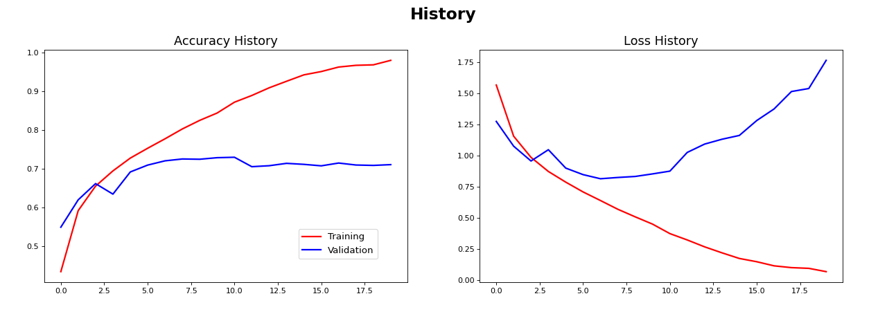{: .align-center width="80%"} 

<br>

#### 비교 결과
- 모델 구성방법만 바뀐 것이기 때문에 evaluate결과와 학습곡선이 3가지 모두 비슷하게 나타남
  - Pytorch와의 연계, 복잡한 모델 구성을 위하여 Sub Classing 방식에 익숙해지는 것이 좋을 것 같음
- 간단한 합성곱 신경망은 다층퍼셉트론과 성능상 차이가 없어 보임


<br><br>


### 전이학습 (Transfer Learning)
- 전이학습(Transfer Learning)이란 기존에 사전학습된(pre trained) 모델을 가져와 사용하고자 하는 학습 데이터를 최소학습시켜(Fine-tuning) 이용하는 방법
- 대표적인 전이학습 모델인 [VGG16](https://www.tensorflow.org/api_docs/python/tf/keras/applications/vgg16/VGG16), [MobileNetV2](https://www.tensorflow.org/api_docs/python/tf/keras/applications/mobilenet_v2/MobileNetV2), [ResNet50V2](https://www.tensorflow.org/api_docs/python/tf/keras/applications/resnet_v2/ResNet50V2)을 비교해 보자

<br>

#### [전이학습 : VGG16](https://www.tensorflow.org/api_docs/python/tf/keras/applications/vgg16/VGG16)
```python
class VGG16_model(Model):
    def __init__(self, classes):
        super(VGG16_model, self).__init__(name='VGG_Model')
        self.vgg = VGG16(weights='imagenet', include_top=False)
        for layer in self.vgg.layers:
            layer.trainable = False
        self.flat = Flatten()
        self.dense1 = Dense(128, activation='relu')
        self.dense2 = Dense(64, activation='relu')
        self.dense3 = Dense(classes, activation='softmax')

    def call(self, inputs):
        x = self.vgg(inputs)
        x = self.flat(x)
        x = self.dense1(x)
        x = self.dense2(x)
        outputs = self.dense3(x)
        return outputs

CONFIG['model'] = VGG16_model(len(CONFIG['label_names']))
CONFIG['model'].build(CONFIG['shape'])
print(CONFIG['model'].summary())
```

```cmd
Model: "VGG_Model"
_________________________________________________________________
 Layer (type)                Output Shape              Param #   
=================================================================
 vgg16 (Functional)          (None, None, None, 512)   14714688  
                                                                 
 flatten_6 (Flatten)         multiple                  0         
                                                                 
 dense_12 (Dense)            multiple                  65664     
                                                                 
 dense_13 (Dense)            multiple                  8256      
                                                                 
 dense_14 (Dense)            multiple                  650       
                                                                 
=================================================================
Total params: 14,789,258
Trainable params: 74,570
Non-trainable params: 14,714,688
_________________________________________________________________
```

```python
CONFIG['model'].compile(optimizer=CONFIG['optimizer'],
              loss=CONFIG['loss'],
              metrics=CONFIG['metrics'])

CONFIG['history'] = CONFIG['model'].fit(X_train, y_train,
          batch_size=CONFIG['batch_size'],
          validation_data=(X_val, y_val),
          epochs=CONFIG['epochs'])

CONFIG['model'].evaluate(X_test, y_test)
# loss: 1.1999 - accuracy: 0.6037
```

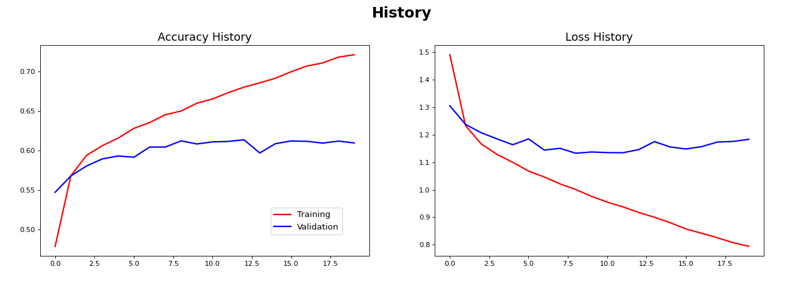{: .align-center width="80%"}

<br>

#### [전이학습 : MobileNetV2](https://www.tensorflow.org/api_docs/python/tf/keras/applications/mobilenet_v2/MobileNetV2)
```python
class MobileNet_model(Model):
    def __init__(self, classes):
        super(MobileNet_model, self).__init__(name='MobileNet_Model')
        self.mobilenet = MobileNetV2(weights='imagenet'
                                    , include_top=False)
        for layer in self.mobilenet.layers:
            layer.trainable = False
        self.flat = Flatten()
        self.dense1 = Dense(128, activation='relu')
        self.dense2 = Dense(64, activation='relu')
        self.dense3 = Dense(classes, activation='softmax')

    def call(self, inputs):
        x = self.mobilenet(inputs)
        x = self.flat(x)
        x = self.dense1(x)
        x = self.dense2(x)
        outputs = self.dense3(x)
        return outputs

CONFIG['model'] = MobileNet_model(len(CONFIG['label_names']))
CONFIG['model'].build(CONFIG['shape'])
print(CONFIG['model'].summary())
```

```cmd
Model: "MobileNet_Model"
_________________________________________________________________
 Layer (type)                Output Shape              Param #   
=================================================================
 mobilenetv2_1.00_224 (Funct  (None, None, None, 1280)  2257984  
 ional)                                                          
                                                                 
 flatten_9 (Flatten)         multiple                  0         
                                                                 
 dense_21 (Dense)            multiple                  163968    
                                                                 
 dense_22 (Dense)            multiple                  8256      
                                                                 
 dense_23 (Dense)            multiple                  650       
                                                                 
=================================================================
Total params: 2,430,858
Trainable params: 172,874
Non-trainable params: 2,257,984
_________________________________________________________________
```

```python
CONFIG['model'].compile(optimizer=CONFIG['optimizer'],
              loss=CONFIG['loss'],
              metrics=CONFIG['metrics'])

CONFIG['history'] = CONFIG['model'].fit(X_train, y_train,
          batch_size=CONFIG['batch_size'],
          validation_data=(X_val, y_val),
          epochs=CONFIG['epochs'])

CONFIG['model'].evaluate(X_test, y_test)
# loss: 1.8455 - accuracy: 0.3470
```

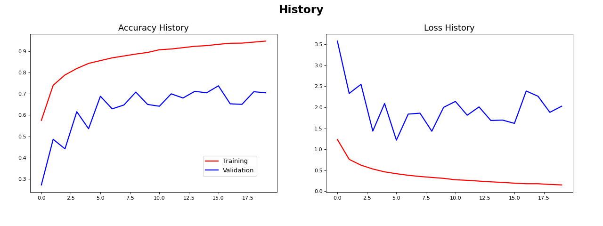{: .align-center width="80%"}

<br>

#### [전이학습 : ResNet50V2](https://www.tensorflow.org/api_docs/python/tf/keras/applications/resnet_v2/ResNet50V2)
```python
class ResNet_model(Model):
    def __init__(self, classes):
        super(ResNet_model, self).__init__(name='ResNet_Model')
        self.resnet = ResNet50V2(weights='imagenet'
                                    , include_top=False
                                    , input_shape=(32, 32, 3))
        for layer in self.resnet.layers:
            layer.trainable = False
        self.flat = Flatten()
        self.dense1 = Dense(128, activation='relu')
        self.dense2 = Dense(64, activation='relu')
        self.dense3 = Dense(classes, activation='softmax')

    def call(self, inputs):
        x = self.resnet(inputs)
        x = self.flat(x)
        x = self.dense1(x)
        x = self.dense2(x)
        outputs = self.dense3(x)
        return outputs

CONFIG['model'] = ResNet_model(len(CONFIG['label_names']))
CONFIG['model'].build(CONFIG['shape'])
print(CONFIG['model'].summary())
```

```cmd
Model: "ResNet_Model"
_________________________________________________________________
 Layer (type)                Output Shape              Param #   
=================================================================
 resnet50v2 (Functional)     (None, 1, 1, 2048)        23564800  
                                                                 
 flatten_10 (Flatten)        multiple                  0         
                                                                 
 dense_24 (Dense)            multiple                  262272    
                                                                 
 dense_25 (Dense)            multiple                  8256      
                                                                 
 dense_26 (Dense)            multiple                  650       
                                                                 
=================================================================
Total params: 23,835,978
Trainable params: 271,178
Non-trainable params: 23,564,800
_________________________________________________________________
```

```python
CONFIG['model'].compile(optimizer=CONFIG['optimizer'],
              loss=CONFIG['loss'],
              metrics=CONFIG['metrics'])

CONFIG['history'] = CONFIG['model'].fit(X_train, y_train,
          batch_size=CONFIG['batch_size'],
          validation_data=(X_val, y_val),
          epochs=CONFIG['epochs'])

CONFIG['model'].evaluate(X_test, y_test)
# loss: 2.8342 - accuracy: 0.3629
```

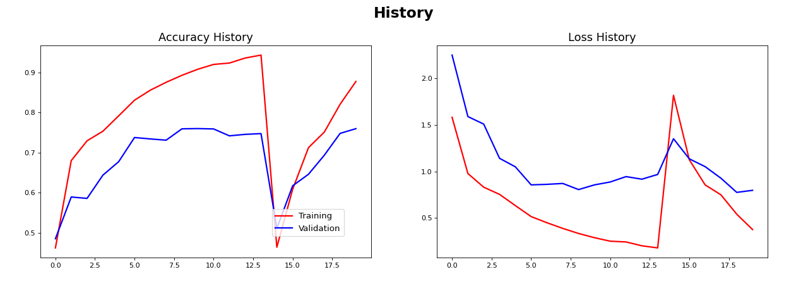{: .align-center width="80%"}

<br>

#### 3가지 전이학습 모델, [VGG16](https://www.tensorflow.org/api_docs/python/tf/keras/applications/vgg16/VGG16), [MobileNetV2](https://www.tensorflow.org/api_docs/python/tf/keras/applications/mobilenet_v2/MobileNetV2), [ResNet50V2](https://www.tensorflow.org/api_docs/python/tf/keras/applications/resnet_v2/ResNet50V2)들의 비교 결과
- VGG16은 좋은 성능이 나왔지만 MobileNetV2, ResNet50V2은 성능이 떨어졌음
  - 과제에 따라서 적절한 전이학습 모델이 있음
- 단지 전이학습 모델을 사용하는 것이 높은 성능을 보장하는 것이 아님
  - 전이학습 모델에 따른 적절한 튜닝이 있어야 높은 성능을 기대 할 수 있음


<br><br><br><br>
<center>
<h1>끝까지 읽어주셔서 감사합니다😉</h1>
</center>
<br><br><br><br>


