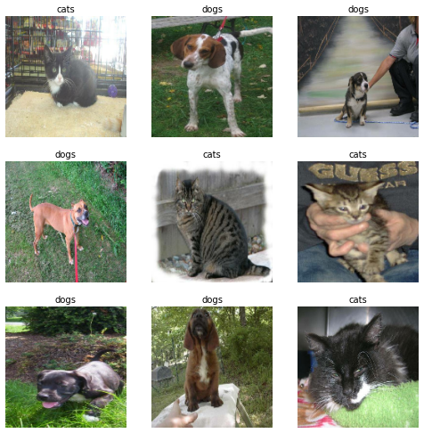
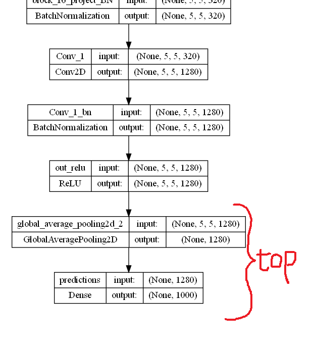
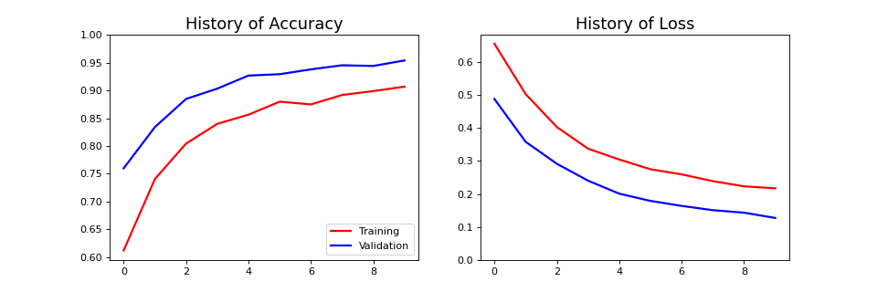

<br><br><br><br>

{: .align-center width="60%"}  

<br><br><br><br>


# CV - 전이학습(Tranfer Learning)  
> 컴퓨터 비전 : 전이학습을 통한 성능 높이기  

- 거인의 어깨에 오르면 더 멀리 볼 수 있듯이, 이미 학습된 모델을 가져와 성능을 높여보자  
- [Tensorflow 공식문서의 전이학습](https://www.tensorflow.org/tutorials/images/transfer_learning)을 통하여 공부하기  
- 사전학습 된 합성곱 신경망 모델로 `전이학습`을 사용하여 `고양이와 개`이미지 분류하기
- 파인튜닝으로 성능 향상시키기
{: .notice--success}


<br><br><br><br>


## 개요
- 사전학습 모델 : [MobileNetV2](https://www.tensorflow.org/api_docs/python/tf/keras/applications/mobilenet_v2/MobileNetV2)
- 데이터셋 : [개 vs 고양이](https://www.kaggle.com/competitions/dogs-vs-cats/data)


- 필요한 라이브러리 불러오기  
  ```python
  # Library Import
  import tensorflow as tf
  from tensorflow import keras

  import matplotlib.pyplot as plt
  import numpy as np
  import os
  ```

- 각종 파라미터 설정
  ```python
  CONFIG = dict(
      # Dataset
      batch = 32,
      img_size = (160, 160),
      labels_n = 1,
      
      # Model
      model_name = 'MobileNetV2',
      batch_size = 128,
      input_shape = (160, 160, 3),
      shape = (None, 160, 160, 3),
      lr = 0.0001,
      initial_epochs = 10,
      fine_tune_epochs = 10,
      
      # Misc
      seed = 83,
      save_img = 'D:이미지 저장 경로',
      data_path = 'D:데이터 저장 경로',
      data_url = 'https://storage.googleapis.com/mledu-datasets/cats_and_dogs_filtered.zip',
      )

  np.random.seed(CONFIG['seed'])
  tf.random.set_seed(CONFIG['seed'])
  ```


<br><br>


## 데이터 전처리
- 데이터 불러오기
  ```python
  if os.path.isdir(CONFIG['data_path']):
      print('✅ 있어요')
      PATH = CONFIG['data_path']
      train_dir = os.path.join(PATH, 'train')
      validation_dir = os.path.join(PATH, 'validation')
  else:
      print('⛔ 없어요')
      path_to_zip = keras.utils.get_file('cats_and_dogs.zip', origin=CONFIG['data_url'], extract=True)
      PATH = os.path.join(os.path.dirname(path_to_zip), 'cats_and_dogs_filtered')
      train_dir = os.path.join(PATH, 'train')
      validation_dir = os.path.join(PATH, 'validation')

  train_dataset = keras.utils.image_dataset_from_directory(train_dir,
                                                      seed=CONFIG['seed'],
                                                      shuffle=True,
                                                      batch_size=CONFIG['batch'],
                                                      image_size=CONFIG['img_size'])

  validation_dataset = keras.utils.image_dataset_from_directory(validation_dir,
                                                      seed=CONFIG['seed'],
                                                      shuffle=True,
                                                      batch_size=CONFIG['batch'],
                                                      image_size=CONFIG['img_size'])

  # Split Validation - Test
  val_batches = tf.data.experimental.cardinality(validation_dataset)
  test_dataset = validation_dataset.take(val_batches // 5)
  validation_dataset = validation_dataset.skip(val_batches // 5)

  print(f'Train Batches      : {tf.data.experimental.cardinality(train_dataset)}')
  print(f'Validation Batches : {tf.data.experimental.cardinality(validation_dataset)}')
  print(f'Test Batches       : {tf.data.experimental.cardinality(test_dataset)}')
  # ✅ 있어요
  # Found 2000 files belonging to 2 classes.
  # Found 1000 files belonging to 2 classes.
  # Train Batches      : 63
  # Validation Batches : 26
  # Test Batches       : 6
  ```

- 불러온 이미지 데이터 확인하기
  ```python
  class_names = train_dataset.class_names

  fig = plt.figure(figsize=(10, 10))
  for images, labels in train_dataset.take(1):
    for i in range(9):
      plt.subplot(3, 3, i + 1)
      plt.imshow(images[i].numpy().astype("uint8"))
      plt.title(class_names[labels[i]])
      plt.axis("off")
      
  fig.savefig(CONFIG['save_img']+'cat_dog.png', dpi=60, bbox_inches='tight')
  ```
  {: .align-center width="70%"} 

- 효율적인 학습을 위한 AUTOTUNE 설정
  ```python
  train_dataset       = train_dataset.prefetch(buffer_size=tf.data.AUTOTUNE)
  validation_dataset  = validation_dataset.prefetch(buffer_size=tf.data.AUTOTUNE)
  test_dataset        = test_dataset.prefetch(buffer_size=tf.data.AUTOTUNE)
  ```

- 이미지 증강
  ```python
  data_augmentation = keras.Sequential([
      keras.layers.RandomFlip('horizontal'),
      keras.layers.RandomRotation(0.2),
  ])
  ```


<br><br>


## 사전학습 모델 확인하기 : MobileNetV2
- MobileNetV2 : 전체
  ```python
  pretrained_model_include_top = keras.applications.MobileNetV2(\
                                  input_shape=CONFIG['input_shape'],
                                  include_top=True,
                                  weights='imagenet')
  print(pretrained_model_include_top.layers[-3])
  print(pretrained_model_include_top.layers[-2])
  print(pretrained_model_include_top.layers[-1])
  # <keras.layers.activation.relu.ReLU object at 0x000001F7CC2763E0>
  # <keras.layers.pooling.global_average_pooling2d.GlobalAveragePooling2D object at 0x000001F7CC27F220>
  # <keras.layers.core.dense.Dense object at 0x000001F7CC27FCA0>
  ```
  - [MobileNetV2 : 전체 모델 구조 확인하기](../../assets/images/post/cv_1/MobileNetV2.png){:target="_blank"}
- MobileNetV2 : 꼬리부분
  {: .align-center width="70%"}  
  - `include_top=False`로 설정하면 `top`부분이 제거 된다

- MobileNetV2 : `include_top=False`
  ```python
  pretrained_model = keras.applications.MobileNetV2(input_shape=CONFIG['input_shape'],
                                  include_top=False,
                                  weights='imagenet')
  pretrained_model.trainable = False
  pretrained_model.layers[-1]
  # <keras.layers.activation.relu.ReLU at 0x1f7cc447ee0>
  ```


<br><br>


## 전이학습모델 : 사전학습 = 고정, 출력층 = 학습
- `include_top=False`로 설정하하여 불러온 사전학습 모델에 출력층을 새롭게 만들어 모델을 만든다

  ```python
  inputs = keras.Input(shape=CONFIG['input_shape'])
  x = data_augmentation(inputs)
  x = keras.applications.mobilenet_v2.preprocess_input(x, data_format='channels_last')
  x = pretrained_model(x, training=False)
  x = keras.layers.GlobalAveragePooling2D()(x)
  x = keras.layers.Dropout(0.2)(x)
  outputs = tf.keras.layers.Dense(1)(x)
  model = keras.Model(inputs, outputs, name='MobileNetV2')
  model.summary()
  ```

  ```cmd
  Model: "MobileNetV2"
  _________________________________________________________________
  Layer (type)                Output Shape              Param #   
  =================================================================
  input_3 (InputLayer)        [(None, 160, 160, 3)]     0         
                                                                  
  sequential (Sequential)     (None, 160, 160, 3)       0         
                                                                  
  tf.math.truediv (TFOpLambda  (None, 160, 160, 3)      0         
  )                                                               
                                                                  
  tf.math.subtract (TFOpLambd  (None, 160, 160, 3)      0         
  a)                                                              
                                                                  
  mobilenetv2_1.00_160 (Funct  (None, 5, 5, 1280)       2257984   
  ional)                                                          
                                                                  
  global_average_pooling2d_1   (None, 1280)             0         
  (GlobalAveragePooling2D)                                        
                                                                  
  dropout (Dropout)           (None, 1280)              0         
                                                                  
  dense (Dense)               (None, 1)                 1281      
                                                                  
  =================================================================
  Total params: 2,259,265
  Trainable params: 1,281
  Non-trainable params: 2,257,984
  _________________________________________________________________
  ```
  - `출력층만 학습`하면 되기 때문에 학습가중치가 1,281개 밖에 되지 않는다.

- 학습 전 모델의 평가 정확도 확인하기
  ```python
  model.compile(optimizer=tf.keras.optimizers.Adam(learning_rate=CONFIG['lr']),
                loss=tf.keras.losses.BinaryCrossentropy(from_logits=True),
                metrics=['accuracy'])

  loss0, accuracy0 = model.evaluate(validation_dataset)

  print(f"initial loss     : {loss0:.3f}")
  print(f"initial accuracy : {accuracy0:.3f}")
  # 26/26 [==============================] - 5s 34ms/step - loss: 0.7286 - accuracy: 0.5619
  # initial loss     : 0.729
  # initial accuracy : 0.562
  ```

- 모델 학습
  ```python
  history_1 = model.fit(train_dataset,
                      epochs=CONFIG['initial_epochs'],
                      validation_data=validation_dataset)
  ```

  ```cmd
  Epoch 1/10
  63/63 [==============================] - 17s 213ms/step - loss: 0.6557 - accuracy: 0.6120 - val_loss: 0.4883 - val_accuracy: 0.7599
  Epoch 2/10
  63/63 [==============================] - 13s 209ms/step - loss: 0.5031 - accuracy: 0.7405 - val_loss: 0.3583 - val_accuracy: 0.8342
  Epoch 3/10
  63/63 [==============================] - 13s 213ms/step - loss: 0.4031 - accuracy: 0.8045 - val_loss: 0.2917 - val_accuracy: 0.8849
  Epoch 4/10
  63/63 [==============================] - 13s 204ms/step - loss: 0.3373 - accuracy: 0.8400 - val_loss: 0.2404 - val_accuracy: 0.9035
  Epoch 5/10
  63/63 [==============================] - 14s 214ms/step - loss: 0.3046 - accuracy: 0.8565 - val_loss: 0.2009 - val_accuracy: 0.9270
  Epoch 6/10
  63/63 [==============================] - 13s 212ms/step - loss: 0.2750 - accuracy: 0.8800 - val_loss: 0.1790 - val_accuracy: 0.9295
  Epoch 7/10
  63/63 [==============================] - 13s 204ms/step - loss: 0.2595 - accuracy: 0.8750 - val_loss: 0.1638 - val_accuracy: 0.9381
  Epoch 8/10
  63/63 [==============================] - 13s 210ms/step - loss: 0.2390 - accuracy: 0.8920 - val_loss: 0.1508 - val_accuracy: 0.9455
  Epoch 9/10
  63/63 [==============================] - 13s 211ms/step - loss: 0.2231 - accuracy: 0.8990 - val_loss: 0.1432 - val_accuracy: 0.9443
  Epoch 10/10
  63/63 [==============================] - 13s 212ms/step - loss: 0.2172 - accuracy: 0.9070 - val_loss: 0.1272 - val_accuracy: 0.9542
  ```

- 학습 곡선
  ```python
  acc = history_1.history['accuracy']
  val_acc = history_1.history['val_accuracy']

  loss = history_1.history['loss']
  val_loss = history_1.history['val_loss']

  # Draw Learning Curve
  fig = plt.figure(figsize=(12, 4))

  # Accuracy Plot
  plt.subplot(1, 2, 1)
  plt.plot(acc, color='r', linewidth=2, label='Training')
  plt.plot(val_acc, color='b', linewidth=2, label='Validation')
  plt.legend(loc='lower right')
  plt.ylim([min(plt.ylim()),1])
  plt.title('History of Accuracy', fontsize = 16)

  # Loss Plot
  plt.subplot(1, 2, 2)
  plt.plot(loss, color='r', linewidth=2)
  plt.plot(val_loss, color='b', linewidth=2)
  plt.ylim([0,max(plt.ylim())])
  plt.title('History of Loss', fontsize = 16)

  plt.show()
  fig.savefig(CONFIG['save_img'] + 'learning_curve_transfer_1.png', dpi=80)
  ```

  {: .align-center width="80%"}  


<br><br>


## Fine-Tuning : 사전학습 = 일부고정 + 일부학습, 출력층 = 학습
- 사전학습 모델의 일부 레이어만 고정하기
  ```python
  # 사전학습 모델에 몇개의 레이어가 있는지 확인
  print("Number of layers : ", len(pretrained_model.layers))
  # Number of layers :  154

  # Fine-Tuning 레이어 지정
  fine_tune_at = 100

  # Fine-Tuning 레이어까지만 가중치를 고정
  pretrained_model.trainable = True
  for layer in pretrained_model.layers[:fine_tune_at]:
      layer.trainable = False
  ```

- 모델 컴파일
  ```python
  model.compile(loss=tf.keras.losses.BinaryCrossentropy(from_logits=True),
                optimizer = tf.keras.optimizers.RMSprop(learning_rate=CONFIG['lr']/10),
                metrics=['accuracy'])

  model.summary()
  ```
  - 미세조정시 `과적합`을 방지하기 위하여 `학습률`을 줄여야 한다.

  ```cmd
  Model: "MobileNetV2"
  _________________________________________________________________
  Layer (type)                Output Shape              Param #   
  =================================================================
  input_3 (InputLayer)        [(None, 160, 160, 3)]     0         
                                                                  
  sequential (Sequential)     (None, 160, 160, 3)       0         
                                                                  
  tf.math.truediv (TFOpLambda  (None, 160, 160, 3)      0         
  )                                                               
                                                                  
  tf.math.subtract (TFOpLambd  (None, 160, 160, 3)      0         
  a)                                                              
                                                                  
  mobilenetv2_1.00_160 (Funct  (None, 5, 5, 1280)       2257984   
  ional)                                                          
                                                                  
  global_average_pooling2d_1   (None, 1280)             0         
  (GlobalAveragePooling2D)                                        
                                                                  
  dropout (Dropout)           (None, 1280)              0         
                                                                  
  dense (Dense)               (None, 1)                 1281      
                                                                  
  =================================================================
  Total params: 2,259,265
  Trainable params: 1,862,721
  Non-trainable params: 396,544
  _________________________________________________________________
  ```
  - 학습해야 할 레이어가 늘어나서, `학습해야 할 가중치도 늘어`났다.

- Fine-Tuning 재학습
  ```python
  total_epochs =  CONFIG['initial_epochs'] + CONFIG['fine_tune_epochs']

  history_2 = model.fit(train_dataset,
                          epochs=total_epochs,
                          initial_epoch=history_1.epoch[-1],
                          validation_data=validation_dataset)
  ```

  ```cmd
  Epoch 10/20
  63/63 [==============================] - 23s 270ms/step - loss: 0.1540 - accuracy: 0.9285 - val_loss: 0.0652 - val_accuracy: 0.9777
  Epoch 11/20
  63/63 [==============================] - 16s 254ms/step - loss: 0.1102 - accuracy: 0.9540 - val_loss: 0.0521 - val_accuracy: 0.9814
  Epoch 12/20
  63/63 [==============================] - 16s 249ms/step - loss: 0.1107 - accuracy: 0.9520 - val_loss: 0.0631 - val_accuracy: 0.9740
  Epoch 13/20
  63/63 [==============================] - 16s 247ms/step - loss: 0.1021 - accuracy: 0.9600 - val_loss: 0.0422 - val_accuracy: 0.9839
  Epoch 14/20
  63/63 [==============================] - 16s 258ms/step - loss: 0.0837 - accuracy: 0.9660 - val_loss: 0.0610 - val_accuracy: 0.9851
  Epoch 15/20
  63/63 [==============================] - 16s 249ms/step - loss: 0.0752 - accuracy: 0.9665 - val_loss: 0.0439 - val_accuracy: 0.9827
  Epoch 16/20
  63/63 [==============================] - 16s 251ms/step - loss: 0.0944 - accuracy: 0.9615 - val_loss: 0.0451 - val_accuracy: 0.9802
  Epoch 17/20
  63/63 [==============================] - 16s 245ms/step - loss: 0.0763 - accuracy: 0.9700 - val_loss: 0.0413 - val_accuracy: 0.9814
  Epoch 18/20
  63/63 [==============================] - 15s 244ms/step - loss: 0.0665 - accuracy: 0.9725 - val_loss: 0.0398 - val_accuracy: 0.9851
  Epoch 19/20
  63/63 [==============================] - 16s 251ms/step - loss: 0.0664 - accuracy: 0.9745 - val_loss: 0.0405 - val_accuracy: 0.9827
  Epoch 20/20
  63/63 [==============================] - 16s 255ms/step - loss: 0.0553 - accuracy: 0.9755 - val_loss: 0.0333 - val_accuracy: 0.9876
  ```
  - 기존에 학습되었던 `10epoch` 이후로 이어서 학습이 진행 된다.

- 학습곡선 확인
  ```python
  acc += history_2.history['accuracy']
  val_acc += history_2.history['val_accuracy']

  loss += history_2.history['loss']
  val_loss += history_2.history['val_loss']

  # Draw Learning Curve
  fig = plt.figure(figsize=(12, 8))

  # Accuracy Plot
  plt.subplot(2, 1, 1)
  plt.plot(acc, color='r', linewidth=2, label='Training')
  plt.plot(val_acc, color='b', linewidth=2, label='Validation')
  plt.ylim([min(plt.ylim()),1])
  plt.plot([CONFIG['initial_epochs'],CONFIG['initial_epochs']],
            plt.ylim(), color='g', linewidth=2, label='Start Fine Tuning')
  plt.legend(loc='lower right')
  plt.title('History of Accuracy', fontsize = 16)

  # Loss Plot
  plt.subplot(2, 1, 2)
  plt.plot(loss, color='r', linewidth=2, label='Training')
  plt.plot(val_loss, color='b', linewidth=2, label='Validation')
  plt.ylim([0,max(plt.ylim())])
  plt.plot([CONFIG['initial_epochs'],CONFIG['initial_epochs']],
            plt.ylim(), color='g', linewidth=2, label='Start Fine Tuning')
  plt.legend(loc='upper right')
  plt.title('History of Loss', fontsize = 16)

  plt.show()
  fig.savefig(CONFIG['save_img'] + 'learning_curve_transfer_2.png', dpi=80)
  ```
  {: .align-center width="80%"}  

- Fine-Tuning 학습 이후 평가
  ```python
  loss, accuracy = model.evaluate(test_dataset)
  print(f'Test loss     : {loss:.5f}')
  print(f'Test accuracy : {accuracy:.5f}')
  # 6/6 [==============================] - 0s 26ms/step - loss: 0.0327 - accuracy: 0.9896
  # Test loss     : 0.03269
  # Test accuracy : 0.98958
  ```


<br><br><br><br>
<center>
<h1>끝까지 읽어주셔서 감사합니다😉</h1>
</center>
<br><br><br><br>


