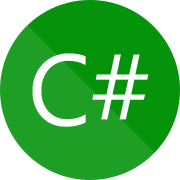

<br><br><br><br>

{: .align-center width="50%"}  

<br><br><br><br>


# C# 시작하기
- 개인적으로 C#을 공부해야 할 이유가 갑자기 생겼음
- python에 이제 좀 익숙지는 것 같았는데... 갑자기 C# 공부라니... 신난다!😁
{: .notice--success}


<br><br>


## C# 공부 시작
- C#(한국어: 시 샤프 또는 C 샵)는 **마이크로소프트에서 개발**한 `객체 지향 프로그래밍 언어`로, `닷넷 프레임워크`의 한 부분으로 만들어졌으며 나중에 ECMA (ECMA-334)와 ISO (ISO/IEC/23270)의 표준으로 자리잡았다. C++와 자바의 문법과 비슷한 문법을 가지고 있다.[위키백과 : C 샤프](https://ko.wikipedia.org/wiki/C_%EC%83%A4%ED%94%84)
- **마이크로소프트 공식문서를 통해서 C# 공부**하기
- [마이크로소프트 공식문서 : C# 설명서](https://learn.microsoft.com/ko-kr/dotnet/csharp/tour-of-csharp/)

<br>

### C# 언어 둘러보기

- C#은 `C 언어 제품군`에서 시작되었으며 `C, C++, Java 및 JavaScript` 프로그래머에게 가까운 언어가 될 수 있음
- C#은 `개체 지향 구성 요소 지향` 프로그래밍 언어
- C#의 대표적 기능
	- **가비지 수집** : 연결할 수 없는 사용되지 않는 개체가 차지하는 메모리를 자동으로 회수
	- **Nullable 형식** : 할당된 개체를 참조하지 않는 변수로부터 보호
	- **예외 처리** : 오류 검색 및 복구에 대한 구조적이고 확장 가능한 방법을 제공
	- **람다 식** : 함수형 프로그래밍 기술을 지원
	- **LINQ(언어 통합 쿼리) 구문** : 모든 소스의 데이터로 작업하기 위한 일반적인 패턴을 만듦
	- **비동기 작업에 대한 언어 지원** : 분산 시스템을 빌드하기 위한 구문을 제공
	- **통합 형식 시스템**
		- int 및 double과 같은 기본 형식을 포함하는 모든 C# 형식은 단일 루트 object에서 상속
		- 모든 형식은 일반 작업 집합을 공유
		- 모든 형식의 값을 일관된 방식으로 저장 및 전송하고 작업을 수행
	- 사용자 정의 참조 형식 및 값 형식을 모두 지원
	- 개체의 동적 할당 및 경량 구조체의 인라인 스토리지를 허용
	- 향상된 형식 안전성과 성능을 제공하는 제네릭 메서드 및 형식을 지원
	- 컬렉션 클래스의 구현자가 클라이언트 코드에 대한 사용자 지정 동작을 정의하는 데 사용할 수 있는 반복기를 제공
	- virtual 및 override 한정자, 메서드 오버로드 확인 규칙 및 명시적 인터페이스 멤버 선언에 대한 지원

<br>

### Hello World
#### VSCode에서 **Hello World** 출력하기
- “Hello, World” 는 모든 프로그래밍 언어의 전통적인 시작인 것 같다.
- 나는 `VSCode`를 주로 사용하기 때문에, VSCode로 실습할 것이다.
  - VSCode에서 실습을 진행할 폴더를 하나 만들다.(`mkdir C#`)
  - 터미널에서 실습 폴더로 이동(`cd C#`)하여 터미널에 `dotnet new console`라고 입력하면 기본 실습파일이 생성된다.(`.... Program.cs`)
  - 생성된 `Program.cs`파일 내용
	```cs
	// See https://aka.ms/new-console-template for more information
	Console.WriteLine("Hello, World!");
	```
  - 터미널에 `dotnet run`이라고 입력하면 `Hello, World`가 출력된다.(실행 위치 `./C#/`여야 함)
  - `Program.cs` 파일의 내용을 다음으로 변경
	```c#
	using System;

	class Hello
	{
		static void Main()
		{
			Console.WriteLine("Hello, World");
		}
	}
	```
  - 다시, 터미널에 `dotnet run`이라고 입력하면 똑같이 `Hello, World`가 출력된다.
  - 계속 터미널에 `dotnet run`으로 입력하면 힘드니깐 `F5`로 간단하게 출력하기 위하여 [여기 .NET SDK 7.0](https://dotnet.microsoft.com/ko-kr/download)을 다운받아 설치하자
  - 다시 VSCode를 재실행하여 `Ctrl+p` 눈러서 VSCode 검색창에서 `>.Net: Generate Assets for Build and Debug` 입력
  - `.vscode` 폴더가 생성 됨
  - 이제는 `Program.cs` 파일에서 `F5`를 누르면 `Hello, World`가 출력된다.

<br>

#### Hello World 프로그램 해석
- `System` 네임스페이스를 참조하는 `using` 지시문으로 시작
- 네임스페이스는 계층적으로 C# 프로그램 및 라이브러리를 구성하는 방법을 제공
- System 네임스페이스에는 많은 형식(예: 프로그램에 참조되는 Console 클래스) 및 많은 다른 네임스페이스(예: IO 및 Collections)가 포함
- using 지시문 때문에, 프로그램은 `Console.WriteLine`을 `System.Console.WriteLine`의 약식으로 사용할 수 있음
- `Main` 메서드는 `static` 한정자로 선언
- 관례상 `Main`이라는 정적 메서드가 **C# 프로그램의 진입점**으로 사용
- 프로그램의 출력은 System 네임스페이스에 있는 Console 클래스의 WriteLine 메서드에 의해 생성


<br><br>


### 오늘 배운 것은?
- C#에 대한 기본적인 개념과 사용법
- `VSCode`에서 C#를 실습하기 위한 환경
- **마이크로소프트 공식문서**를 통한 학습의 좋은점
{: .notice--success}

<br>

### 더 공부해야 할 것은?
- C#에서 `네임스페이스` 의미와 사용법
- `C#`와 `.NET`의 관계
- `C#의 연산자` 사용법
{: .notice--danger}


<br><br><br><br>
<center>
<h1>끝까지 읽어주셔서 감사합니다😉</h1>
</center>
<br><br><br><br>


