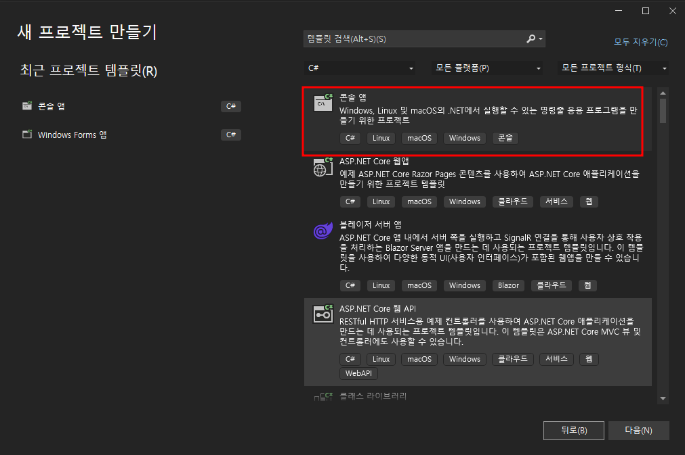

<br><br><br><br>


{: .align-center width="70%"}   


<br><br><br><br>


# Entity Framework Core  


<br><br><br><br>


## Entity Framework Core 소개
- Entity Framework는 SQL Database(온-프레미스 및 Azure), SQLite, MySQL, PostgreSQL 및 Azure Cosmos DB를 비롯한 **다양한 데이터베이스**에서 **.NET(C#)을 사용**하여 클린 이식 가능하고 **높은 수준의 데이터 액세스** 계층을 빌드할 수 있는 **최신 개체 관계 매퍼**입니다.
- **LINQ 쿼리, 변경 내용 추적, 업데이트 및 스키마 마이그레이션을 지원**합니다.


<br><br>


### EF Core ❓❗ EF6  
- EF Core(Entity Framework Core)
  - EF Core(Entity Framework Core)는 **.NET용 최신 개체 데이터베이스 매퍼**입니다. LINQ 쿼리, 변경 내용 추적, 업데이트 및 스키마 마이그레이션을 지원합니다.
  - EF Core는 데이터베이스 공급자 플러그 인 모델을 통해 SQL Server/Azure SQL Database, SQLite, Azure Cosmos DB, MySQL, PostgreSQL, 많은 추가 데이터베이스와 작동합니다.

- EF6(Entity Framework 6)
  - EF6(Entity Framework 6)은 .NET Framework용으로 디자인된 개체 관계형 매퍼이나 .NET Core를 지원합니다. **EF6은 안정적인 지원 제품이지만 더 이상 활발히 개발되고 있지 않습니다**.

- ✅ EF6는 더 이상 활발히 개발되지 않기 때문에 <mark>.NET용 최신 개체 데이터베이스 매퍼인 EF Core를 사용</mark>하도록 하겠습니다.


<br><br>


### 오늘 실습 할 내용
- Microsoft 홈페이지에는 Entity Framework를 공부할 수 있는 다양한 자료가 있습니다.
- 오늘은 [[Microsoft Learn : EF Core 시작]](https://learn.microsoft.com/ko-kr/ef/core/get-started/overview/first-app?tabs=netcore-cli)을 중심으로 실습하도록 하겠습니다.
- 실습 주제는 두 가지 입니다.
  - [**[새로운 데이터 베이스를 만들고 CRUD 구현]**](#entity-framework-core--새로운-데이터-베이스를-만들고-crud-구현)
  - [**[이미 만들어진 데이터 베이스에 CRUD 구현]**](#entity-framework-core--이미-만들어진-데이터-베이스에-crud-구현)
- 실습 환경
  > - Windows 10 Pro
  > - Microsoft Visual Studio Community 2022
  > - DBeaver 23.05


<br><br><br><br>


## Entity Framework Core : 새로운 데이터 베이스를 만들고 CRUD 구현

### 실습 프로젝트 만들기
- Visual Studio에서 간단하게 **콘솔 앱**을 만듧니다.

{: .align-center width="80%"}  

- 자유롭게 **프로젝트 이름, 위치, 솔루션 이름** 등을 정합니다.  

{: .align-center width="80%"}  

- 저는 다음과 같이 입력하였습니다.
  - 위치 : D:\CS_coding\CS_Study
  - 솔루션 이름 : EFCore_SQLite
  - 프로젝트 이름 : EFCore_First
  - 이렇게 입력하면 화면 하단에 아래와 같이 나타납니다.
    - {: .notice--primary}"D:\CS_coding\CS_Study\EFCore_SQLite"에 프로젝트이(가) 만들어집니다.
  - 이 위치를 작업폴더라고 생각하시면 되겠습니다.
  - 나중에 이 위치에 데이터베이스 파일을 만들 것이기 때문에 잘 기억해두시길 바랍니다.
    - {: .notice--warning}D:\CS_coding\CS_Study\EFCore_SQLite  
- 처음으로 만드는 프로그램이기 때문에 네임스페이스와 클래스를 직접 확인하기 위하여 **최상위문 사용 안 함**에 체크합니다.

{: .align-center width="80%"}  


<br><br>


### 필요한 패키지 설치
- 패키지 설치를 위하여 **NuGet 패키지 관리** 창을 엽니다.
  - 화면 오른쪽 `솔루션 탐색기`에서 프로젝트 이름(EFCore_First)을 우클릭하여 `NuGet 패키지 관리`를 클릭하면 **NuGet 패키지 관리** 창을 열 수 있습니다.

{: .align-center width="80%"}  

- `NuGet 패키지 관리` 창에서 **찾아보기**를 클릭 후 `Microsoft.EntityFrameworkCore.Tools` 라고 검색하면 나오는 첫번째 **Microsoft.EntityFrameworkCore.Tools 작성자: Microsoft, 231M개 다운로드**를 클릭하고, 오른쪽 **설치**를 클릭하여 패키지를 설치합니다.
  - 설치를 누르기 전에 `설명`을 간단히 살펴보시길 바랍니다.
  - 약관에 동의 후 설치를 완료합니다.

{: .align-center width="80%"}  

- 다음으로 `SQLite`를 사용하기 위하여 `NuGet 패키지 관리` 창에서 `Microsoft.EntityFrameworkCore.Sqlite`를 검색하여 마찬가지로 설치합니다.

{: .align-center width="80%"}  


<br><br>


### DbContext, Model 생성
- EFCore는 DbContext 클래스를 통하여 모델을 생성하고, CRUD를 구현합니다.
- Model은 데이터베이스의 테이블정보를 담고있는 클래스입니다.
- 실습 편의상 DbContext, Model를 하나의 파일로 만들겠습니다.
- 오른쪽 `솔루션 탐색기`에서 프로젝트이름(EFCore_First)을 우클릭하여 `추가` 클릭, `클래스`를 클릭합니다.

{: .align-center width="80%"}  

- 이름을 `Context_Model.cs`로 지정하고 `추가`를 클릭합니다.

{: .align-center width="80%"}  

- `Context_Model.cs`파일이 생성된 것을 확인하고, `Context_Model.cs` 창이 자동으로 열립니다.
  - 표시된 위치에 아래의 코드블럭을 삽입합니다.
  - 코드 삽입과 동시에 `using Microsoft.EntityFrameworkCore;` 네임스페이스가 자동으로 추가됩니다.

{: .align-center width="80%"}  

```cs
public class BloggingContext : DbContext
{
    public DbSet<Blog> Blogs { get; set; }
    public DbSet<Post> Posts { get; set; }

    public string DbPath { get; }

    public BloggingContext()
    {
        // path에 작업폴더 경로를 입력합니다.
        var path = "D:/CS_coding/CS_Study/EFCore_SQLite";
        DbPath = System.IO.Path.Join(path, "blogging.db");
    }

    protected override void OnConfiguring(DbContextOptionsBuilder options)
        => options.UseSqlite($"Data Source={DbPath}");
}

public class Blog
{
    public int BlogId { get; set; }
    public string Url { get; set; }

    public List<Post> Posts { get; } = new();
}

public class Post
{
    public int PostId { get; set; }
    public string Title { get; set; }
    public string Content { get; set; }

    public int BlogId { get; set; }
    public Blog Blog { get; set; }
}
```


<br><br>


### 데이터베이스 만들기
- 데이터베이스를 만들기 위하여 **페키지 관리자 콘솔**을 엽니다.

{: .align-center width="80%"}  

- 화면 아랫쪽에 **패키지 관리자 콘솔** 창에 `Add-Migration InitialCreate`를 입력하고 `엔터`를 누릅니다.

{: .align-center width="80%"}  

- Migration이 시작되고, `Build succeeded.`라는 반가운 메시지를 확인할 수 있습니다.(1)
- 오른쪽 솔루션 탐색기에서 `Migrations` 폴더가 생성된 것을 확인할 수 있습니다.(2)
- `Migrations`폴더에있는 `20230716053419_InitialCreate.cs` 창이 자동으로 열렸습니다.(3)

{: .align-center width="80%"}  

- `20230716053419_InitialCreate.cs` 파일을 간단히 살펴보면 `CreateTable`이라는 함수가 `Blogs`라는 이름의 테이블을 만든다는 것을 알 수 있습니다.
- `20230716053419_InitialCreate.cs` 파일을 실제로 실행하여 데이터베이스에 테이블을 만들기 위하여 **패키지 관리자 콘솔**에 `Update-Database`을 입력합니다.
  - `Build succeeded.`라는 반가운 메시지를 확인할 수 있고, 데이터베이스에 테이블이 생성되었습니다.

{: .align-center width="80%"}  

- 윈도우 탐색기에서 작업폴더에 `blogging.db`라는 SQLite DB가 생성된 것을 확인할 수 있습니다.

{: .align-center width="80%"}  


<br><br>


### CRUD 구현
- 간단하게 CRUD를 구현하기 위하여 `Program.cs`파일에서 `Console.WriteLine("Hello, World!")`를 삭제하고 아래의 코드를 삽입합니다.

{: .align-center width="90%"}  

```cs
using var db = new BloggingContext();

Console.WriteLine($"Database path: {db.DbPath}.");

// Create
Console.WriteLine("Inserting a new blog");
db.Add(new Blog { Url = "http://blogs.msdn.com/adonet" });
db.Add(new Blog { Url = "https://leeyeonjun85.github.io/" });
db.SaveChanges();

// Read
Console.WriteLine("Querying for a blog");
var blog = db.Blogs
    .OrderBy(b => b.BlogId)
    .First();

var blog_my = db.Blogs
    .Where(b => b.Url == "https://leeyeonjun85.github.io/").FirstOrDefault();

// Update
Console.WriteLine("Updating the blog and adding a post");
blog.Url = "https://devblogs.microsoft.com/dotnet";
blog.Posts.Add(
    new Post { Title = "Hello World", Content = "I wrote an app using EF Core!" });

var my_post1 = new Post { Title = "AI 부트캠프를 마치고…", Content = "코드스테이츠와 함께했던 AI 부트캠프 회고" };
var my_post2 = new Post { Title = "C# : Intro", Content = "C# 시작하기" };
blog_my!.Posts.AddRange(
    new Post[] { my_post1, my_post2 });
db.SaveChanges();

// Delete
Console.WriteLine("Delete the blog");
db.Remove(blog);
db.Remove(blog_my);
db.SaveChanges();
```

- CRUD 과정을 확인하기 위하여 `중단점`을 클릭하고 `F5` 를 눌러 디버깅과 함께 실행합니다.

{: .align-center width="80%"}  

- 디버깅이 실행되면 중단점을 지정한 곳에서 노란색 화살표가 멈춰있는 것을 확인할 수 있습니다.(1)
- 화면 아래에서 `db`안에있는 `DbPath`에서 `보기`를 클릭합니다.(2)
- 창이 열리면서 우리의 DB가 있는 위치가 정상적으로 출력되어 있는 것을 확인하고 Ctrl+C로 클립보드로 복사합니다.(3)
  - {: .notice--warning}D:/CS_coding/CS_Study/EFCore_SQLite/blogging.db  
  - 실습환경이 윈도우이기 때문에 슬래시를 모두 `/`로 통일해주면 마음이 편안합니다.😆  

{: .align-center width="90%"}  

- 데이터베이스를 시각적으로 확인하기 위하여 `DBeaver`를 실행하여 데이터베이스를 추가합니다.

{: .align-center width="80%"}  

- `Path`에 클립보드로 복사해놓은 `D:/CS_coding/CS_Study/EFCore_SQLite/blogging.db`를 입력하고 `완료`를 클릭합니다.
  - 슬래시 방향은 여기서는 크게 문제가 되지 않아요.😉

{: .align-center width="80%"}  

- `blogging.db` 더블클릭(1), `테이블` 더블클릭(2), `엔티티 관계도`를 클릭(3)하면 스키마를 확인할 수 있습니다.(4)
  - `테이블` 가운데 `Blogs`를 더블클릭하면 아직 아무런 데이터가 없는 것도 확인할 수 있습니다.

{: .align-center width="80%"}  

<br>

#### Create
- 다시 `Visual Studio`로 돌아와 노란 화살표가 그림과 같이 이동할 수 있도록 `F10`을 여러번 누릅니다.

{: .align-center width="80%"}  

- `DBeaver`로 가서 `Blogs`테이블을 더블클릭한 뒤 `F5`를 눌러 새로고침하면 오른쪽에서 데이터가 추가 된 것을 확인할 수 있습니다.
  - `Posts`테이블을 더블클릭하면 아직 아무런 데이터가 없음을 확인할 수 있습니다.

{: .align-center width="80%"}  

<br>

#### Read
- 다시 `Visual Studio`로 돌아와 노란 화살표가 그림과 같이 이동할 수 있도록 `F10`을 여러번 누릅니다.

{: .align-center width="80%"}  

- 화면 아래 `로컬` 탭에서 `blog`와 `blog_my` 가 불러와진 것을 확인할 수 있습니다.
  - 왼쪽 화살표를 클릭하여 `blog`의 내용을 확인할 수 있습니다.

{: .align-center width="80%"}  

<br>

#### Update
- 다시 `Visual Studio`로 돌아와 노란 화살표가 그림과 같이 이동할 수 있도록 `F10`을 여러번 누릅니다.

{: .align-center width="80%"}  

- `DBeaver`로 가서 `Blogs`테이블을 더블클릭한 뒤 `F5`를 눌러 새로고침하면 오른쪽에서 첫번째 데이터의 URL이 `http://blogs.msdn.com/adonet`에서 `https://devblogs.microsoft.com/dotnet`으로 변경된 것을 확인할 수 있습니다.
  - 또한 `Posts`테이블을 살펴보면 데이터가 추가된 것을 확인할 수 있습니다.

{: .align-center width="90%"}  

<br>

#### Delete
- 다시 `Visual Studio`로 돌아와 노란 화살표가 그림과 같이 이동할 수 있도록 `F10`을 여러번 누릅니다.

{: .align-center width="80%"}  

- `DBeaver`로 가서 `Blogs`테이블과 `Posts`테이블의 내용이 모두 삭제되었음을 확인합니다.
  - `Blogs`테이블과 `Posts`테이블이 서로 외래키로 연결되어있기 때문에 `Blogs`테이블의 내용을 삭제하면 연결된 `Posts`테이블의 내용도 함께 삭제됩니다.

{: .align-center width="80%"}  

- `Visual Studio`로 돌아와 `F5`를 눌러 디버깅을 마칩니다.


<br><br><br><br>


## Entity Framework Core : 이미 만들어진 데이터 베이스에 CRUD 구현

<br><br>


### 새로운 프로젝트 만들기
- 화면 오른쪽의 `솔루션 'EFCore SQLite' (1 프로젝트...`을 우클릭, `추가` 클릭, `새 프로젝트` 클릭하여 새로운 프로젝트를 만듧니다.

{: .align-center width="80%"}  

- 새로운 `콘솔 앱` 프로젝트를 만듧니다.

{: .align-center width="80%"}  

- 새로운 프로젝트인 `EFCore_FromDB`로 전환합니다.

{: .align-center width="80%"}  

- 패키지 설치를 간단하게 `패키지 관리자 콘솔`에 다음 명령어를 입력하여 설치할 수 있습니다.
  - `Install-Package Microsoft.EntityFrameworkCore.Tools`
  - `Install-Package Microsoft.EntityFrameworkCore.Sqlite`

{: .align-center width="80%"}  

- 설치된 패키지는 오른쪽 솔루션 탐색기에서 확인할 수 있습니다.

{: .align-center width="60%"}  


<br><br>


### 이미 만들어진 데이터 베이스에서 DbContext, Model 불러오기
- 이전 프로젝트에서 만든 데이터베이스에서 DbContext, Model을 불러오겠습니다.
- `패키지 관리자 콘솔`에 다음 명령어를 입력합니다.
  - 데이터베이스 경로를 입력할 때 자신의 데이터베이스 경로를 확인하여 입력해주세요
  - `Scaffold-DbContext "Data Source=D:/CS_coding/CS_Study/EFCore_SQLite/blogging.db;" Microsoft.EntityFrameworkCore.Sqlite -OutputDir Models`
- `패키지 관리자 콘솔`에 명령어를 입력하면 `Build succeeded.`라는 반가운 메시지를 확인할 수 있고(1), 오른쪽 `솔루션 탐색기`에서 `Models`라는 폴더와 파일들이 생성된 것을 확인할 수 있습니다(2). 또한 생성된 파일 가운데 `BloggingContext.cs`라는 파일이 자동으로 열렸습니다(3).
  - 첫번째 프로젝트에서 `Context_Model.cs`파일에 DbContext, Model 클래스를 모두 만들었지만, 두번째 프로젝트에서 이미 만들어진 데이터베이스에서 DbContext, Model을 불러오면 DbContext는 `BloggingContext.cs`라는 파일로, Model은 `Blog.cs`, `Post.cs`라는 각각의 파일로 자동으로 생성됩니다.

{: .align-center width="90%"}  


<br><br>


### CRUD 구현
- 두번째 프로젝트에서 CRUD 구현은 첫번째 프로젝트와 동일합니다.
- 두번째 프로젝트의 `Program.cs`파일에서 `Console.WriteLine("Hello, World!")`를 삭제하고 아래의 코드로 대체합니다.

```cs
using var db = new BloggingContext();

// Create
Console.WriteLine("Inserting a new blog");
db.Add(new Blog { Url = "http://blogs.msdn.com/adonet" });
db.Add(new Blog { Url = "https://leeyeonjun85.github.io/" });
db.SaveChanges();

// Read
Console.WriteLine("Querying for a blog");
var blog = db.Blogs
    .OrderBy(b => b.BlogId)
    .First();

var blog_my = db.Blogs
    .Where(b => b.Url == "https://leeyeonjun85.github.io/").FirstOrDefault();

// Update
Console.WriteLine("Updating the blog and adding a post");
blog.Url = "https://devblogs.microsoft.com/dotnet";
blog.Posts.Add(
    new Post { Title = "Hello World", Content = "I wrote an app using EF Core!" });

var my_post1 = new Post { Title = "AI 부트캠프를 마치고…", Content = "코드스테이츠와 함께했던 AI 부트캠프 회고" };
var my_post2 = new Post { Title = "C# : Intro", Content = "C# 시작하기" };
blog_my!.Posts.Add( my_post1 );
blog_my!.Posts.Add( my_post2 );
db.SaveChanges();

// Delete
Console.WriteLine("Delete the blog");
db.Remove(blog);
db.Remove(blog_my);
db.SaveChanges();
```

- `using var db = new BloggingContext();`에 중단점을 생성하여 `F5`를 눌러 디버깅을 실행한 후, `F10`을 적절히 눌러 노란 화살표를 이동시키면서 `DBeaver`로 데이터의 변화를 확인합니다.
- 코드가 데이터베이스로 반영되기 위해서는 `db.SaveChanges();`가 실행되어야하기 때문에 `DBeaver`에서 데이터 변화를 확인하기 위해서는 `db.SaveChanges();`이후에 확인하세요.


<br><br><br><br>
<center>
<h1>끝까지 읽어주셔서 감사합니다😉</h1>
</center>
<br><br><br><br>


