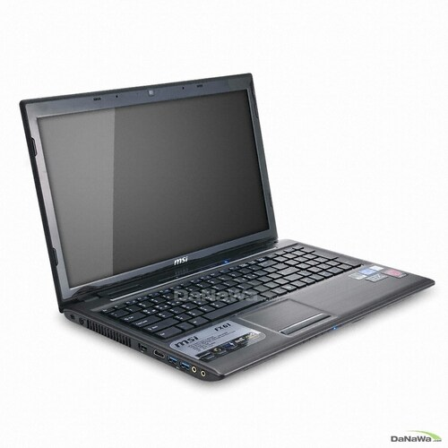
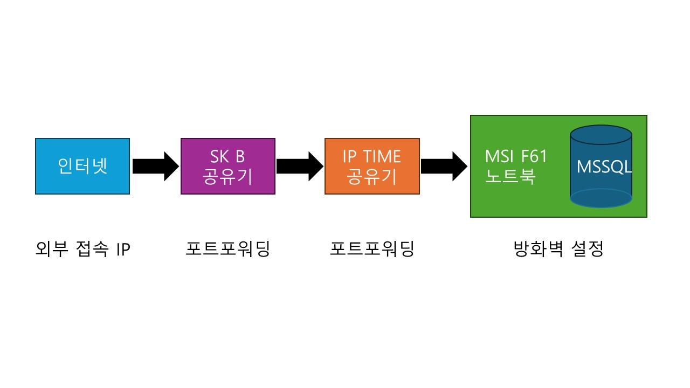
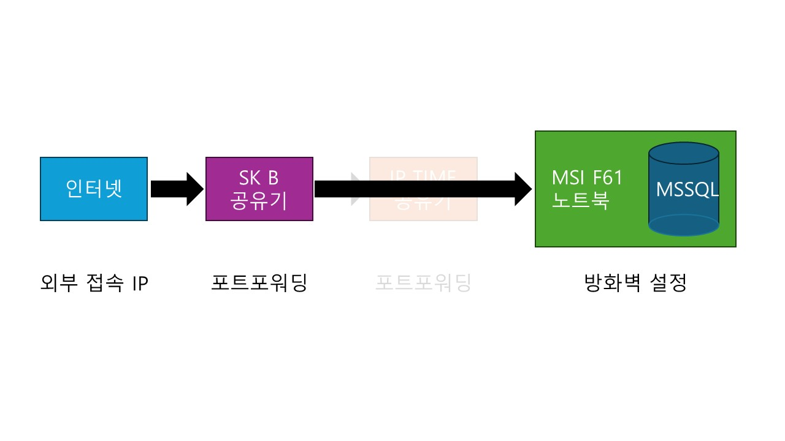

    

{: .align-center width="70%"}   

    

# 포트포워딩으로 MSSQL 외부접속 사용하기  
> SK 브로드밴드 공유기 외부접속  
> 포트포워딩  
> MSSQL  

    

## 시작

- 약 10년 전 게이밍 노트북을 구매하여 약 5~6년 전부터 사용안하던 랩탑 노트북이 하나 있음

{: .align-center width="50%"}  

- 이 노트북에 MSSQL을 설치하여 <mark>외부접속 가능한 나만의 RDB</mark>를 구성해보고 싶음

  

## 1차 시도
### 구성 계획
- 1차에선 실패했다...😫
- 기록을 위하여 1차 시도 과정을 남긴다

{: .align-center width="90%"}  

 

### MSI 노트북에 MSSQL 설치하기
- 대부분의 DB 서비스에는 개발자들을 위하여 로컬환경에 DB를 설치할 수 있는 서비스를 제공함
  - MSSQL Server Developer Edition, Oracle XE, MySQL Community 등
- 이번에는 MSSQL Server 2022 Developer Edition을 설치하기로 함
  - [공식 MS Server 페이지](https://www.microsoft.com/ko-kr/sql-server/sql-server-downloads)에서 개발자를 위한 Developer Edition 을 다운로드하여 설치
- Basic으로 선택하여 기본설정으로 설치
- SSMS(SQL Server Management Studio) 설치 : Install SSMS
- SSMS Windows Authentication 으로 접속
- 사용할 DB 생성
- 사용자 생성하여 DB에 연결

 

### MSI 노트북에서 방화벽 설정
- MSSQL 외부접속을 위한 인바운드 규칙 추가

 

### SK 브로드밴드 공유기
- 외부접속 IP 확인
- IP Time MAC 을 IP 고정
- IP Time 으로 연결되는 고정 IP로 포트포워딩

 

### IP TIME 공유기
- MSI 노트북 MAC 을 IP 고정
- MSI 노트북으로 연결되는 고정 IP로 포트포워딩

 

### 접속 테스트
- 외부접속 IP로 MSSQL 접속테스트 결과 실패...😫

  

## 2차 시도
### 구성 계획
- IP TIME 공유기를 거치지 않고, SK 브로드밴드 공유기 포트와 노트북을 직접연결하였다.

{: .align-center width="90%"} 

 

### MSI 노트북 설정 바꾸지 않음
- 중간에 IP TIME 공유기만 빠지기 때문에 MSI 노트북은 그대로 사용함

 

### SK 브로드밴드 공유기
- MSI 노트북 MAC을 IP 고정
- MSI 노트북으로 연결되는 고정 IP로 포트포워딩

 

### 접속 테스트
- 접속 성공🎊🎉
- 각종 SQL 테스트 결과 문제 없음👍

  

## 후기
- 중간에 IP TIME 공유기 끼워서 사용할 수 있는 방법 피드백 부탁드립니다👏
- Oracle XE도 설치해 보았는데, 다음에 포스팅해야 겠다~😊

    

<h1>끝까지 읽어주셔서 감사합니다😉</h1>

    

