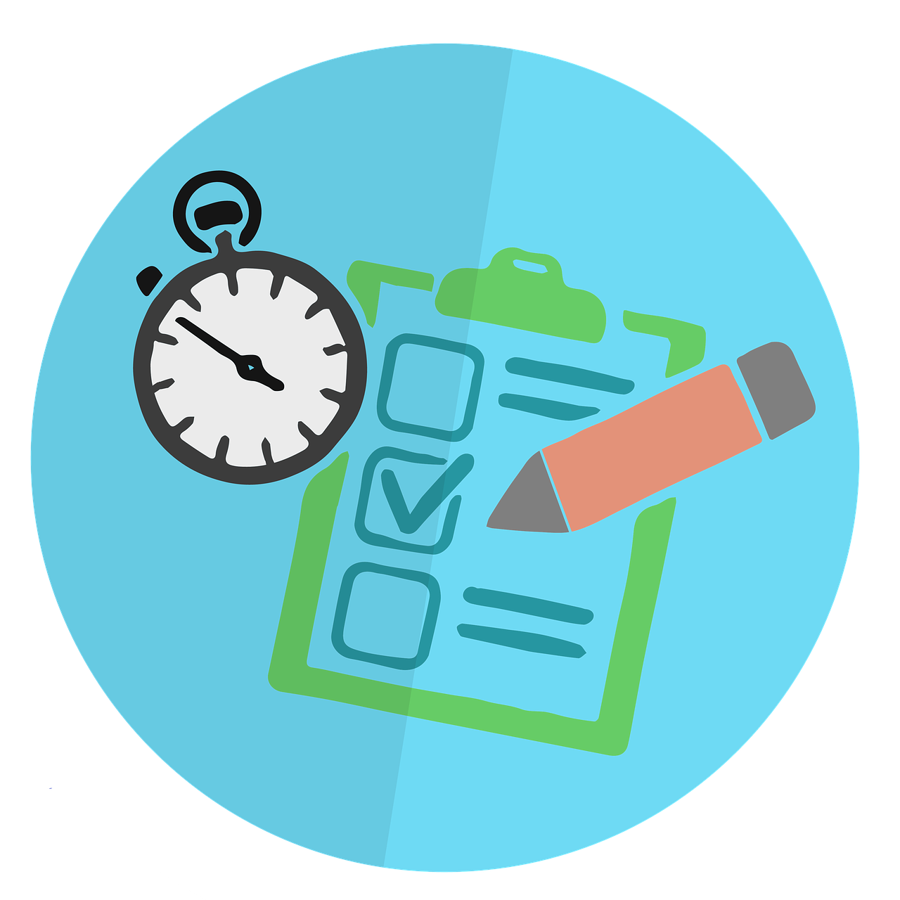
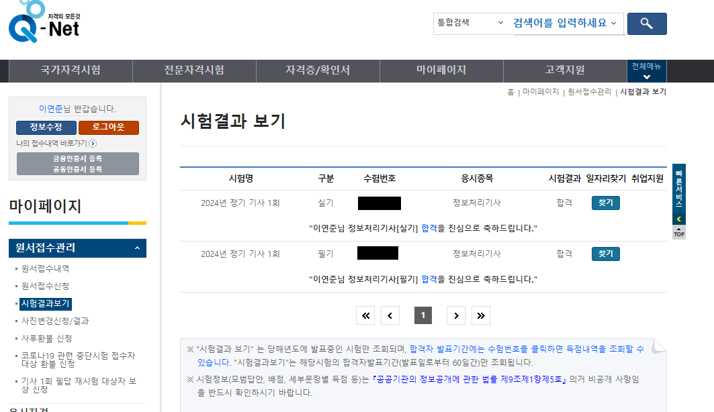

    

{: .align-center width="70%"}   

    

# 정보처리기사 시험준비  
> 정보처리기사 시험접수  
> 시험 과목  
> 주요항목  

    

## 시작

- 본격 개발자로 살아가기 위하여 정보처리기사 자격증을 취득하기로 함
- 돈이 없는 관계로 시험에 합격하면 수강료를 돌려받는 `해커스 0원 환급반`에서 강의를 준비하자

  

## 시험 일정

<table style="width : 80%; margin : auto;">
  <tbody style="width : 100%; display : table;">
    <tr style="border-bottom:3px solid gray; background-color:#88bb88; color:#000000;">
      <th style="width : 20%; text-align : center; font-size:1.2em;">구분</th>
      <th style="width : 40%; text-align : center; font-size:1.2em;">날짜</th>
      <th style="width : 40%; text-align : center; font-size:1.2em;">내용</th>
    </tr>
    <tr>
      <td style="text-align : center;">필기시험</td>
      <td style="text-align : center;">2024년 02월 19일(월)</td>
      <td> • 접수완료🚀   • 호서대학교   • 12시40분 </td>
    </tr>
    <tr>
      <td style="text-align : center;">필기시험 합격발표</td>
      <td style="text-align : center;">2024년 03월 13일(수)</td>
      <td>🎈</td>
    </tr>
    <tr>
      <td style="text-align : center;">실기원서접수(휴일제외)</td>
      <td style="text-align : center;">2024년 03월 26일(화)~29(금)</td>
      <td>✏️</td>
    </tr>
    <tr>
      <td style="text-align : center;">실기시험</td>
      <td style="text-align : center;">2024년 04월 27일(토)~5월 12일(일)</td>
      <td>👍</td>
    </tr>
    <tr>
      <td style="text-align : center;">최종합격자 발표일</td>
      <td style="text-align : center;">2024년 06월 18일(화)</td>
      <td>🎊</td>
    </tr>
  </tbody>
</table>

  

## 시험 정보
### 직무 분야
- 정보통신

### 중직무분야
- 정보기술

### 문제 수
- 100 문항 (20문항 × 5과목)

### 시험 과목
- 필기
1. 소프트웨어 설계  
2. 소프트웨어 개발  
3. 데이터베이스 구축  
4. 프로그래밍 언어 활용  
5. 정보시스템 구축 관리  
- 실기
  - 정보처리 실무

### 검정방법
- 필기 : 객관식 4지 택일형, 과목당 20문항(과목당 30분)
- 실기 : 필답형(2시간30분)

### 합격기준
- 필기 : 100점을 만점으로 하여 과목당 40점 이상, 전과목 평균 60점 이상
- 실기 : 100점을 만점으로 하여 60점 이상

  

## 과목 정보

### 소프트웨어 설계
1. 요구사항 확인
   1. 현행 시스템 분석
      >- 플랫폼 기능 분석  
      >- 플랫폼 성능 특성 분석  
      >- 운영체제 분석  
      >- 네트워크 분석  
      >- DBMS 분석  
      >- 비즈니스융합분석  
   2. 요구사항 확인
      >- 요구분석기법  
      >- UML  
      >- 애자일(Agile)  
   3. 분석모델 확인
      >- 모델링 기법  
      >- 분석자동화 도구  
      >- 요구사항 관리 도구  
2. 화면 설계
   1. UI 요구사항 확인
      >- UI 표준
      >- UI 지침
      >- 스토리보드
   2. UI 설계
      >- 감성공학
      >- UI 설계 도구
3. 애플리케이션 설계
   1. 공통 모듈 설계
      >- 설계 모델링
      >- 소프트웨어 아키텍처
      >- 재사용
      >- 모듈화
      >- 결합도
      >- 응집도
   2. 객체지향 설계
      >- 객체지향(OOP)
      >- 디자인패턴
4. 인터페이스 설계
   1. 인터페이스 요구사항 확인
      >- 내외부 인터페이스 요구사항
      >- 요구공학
   2. 인터페이스 대상 식별
      >- 시스템 아키텍처
      >- 인터페이스 시스템
   3. 인터페이스 상세 설계
      >- 내외부 송수신
      >- 데이터 명세화
      >- 오류 처리방안 명세화
      >- 인터페이스 설계
      >- 미들웨어 솔루션

  

### 소프트웨어 개발
1. 데이터 입출력 구현
   1. 자료구조
      >- 스택
      >- 큐
      >- 리스트 등
   2. 데이터 조작 프로시저 작성
      >- 프로시저
      >- 프로그램 디버깅
      >- 단위테스트 도구
   3. 데이터 조작 프로시저 최적화
      >- 쿼리(Query) 성능 측정
      >- 소스코드 인스펙션
2. 통합 구현
   1. 모듈 구현
      >- 단위모듈 구현
      >- 단위모듈 테스트
   2. 통합 구현 관리
      >- 협업도구
      >- IDE 도구
      >- 형상관리 도구
3. 제품소프트웨어 패키징
   1. 제품소프트웨어 패키징
      >- 애플리케이션 패키징
      >- 애플리케이션 배포 도구
      >- 애플리케이션 모니터링 도구
      >- DRM
   2. 제품소프트웨어 매뉴얼 작성
      >- 제품소프트웨어 매뉴얼 작성
      >- 국제 표준 제품 품질 특성
   3. 제품소프트웨어 버전관리
      >- 소프트웨어 버전관리 도구
      >- 빌드 자동화 도구
4. 애플리케이션 테스트 관리
   1. 애플리케이션 테스트케이스 설계
      >- 테스트 케이스
      >- 테스트 레벨
      >- 테스트 시나리오
      >- 테스트 지식 체계
   2. 애플리케이션 통합 테스트
      >- 결함관리 도구
      >- 테스트 자동화 도구
      >- 통합 테스트
   3. 애플리케이션 성능 개선
      >- 알고리즘
      >- 소스코드 품질분석 도구
      >- 코드 최적화
5. 인터페이스 구현
   1. 인터페이스 설계 확인
      >- 인터페이스 기능 확인
      >- 데이터 표준 확인
   2. 인터페이스 기능 구현
      >- 인터페이스 보안
      >- 소프트웨어 연계 테스트
   3. 인터페이스 구현 검증
      >- 설계 산출물
      >- 인터페이스 명세서

  

### 데이터베이스 구축
1. SQL 응용
   1. 절차형 SQL 작성
      >- 트리거
      >- 이벤트
      >- 사용자 정의 함수
      >- SQL 문법
   2. 응용 SQL 작성
      >- DML
      >- DCL
      >- 윈도우 함수
      >- 그룹 함수
      >- 오류 처리
2. SQL 활용
   1. 기본 SQL 작성
      >- DDL
      >- 관계형 데이터 모델
      >- 트랜잭션
      >- 테이블
      >- 데이터 사전
   2. 고급 SQL 작성
      >- 뷰
      >- 인덱스
      >- 집합 연산자
      >- 조인
      >- 서브쿼리
3. 논리 데이터베이스 설계
   1. 관계데이터베이스 모델
      >- 관계 데이터 모델
      >- 관계데이터언어(관계대수, 관계해석)
      >- 시스템카탈로그와 뷰
   2. 데이터모델링 및 설계
      >- 데이터모델 개념
      >- 개체-관계(E-R)모델
      >- 논리적 데이터모델링
      >- 데이터베이스 정규화
      >- 논리 데이터모델 품질검증
4. 물리 데이터베이스 설계
   1. 물리요소 조사 분석
      >- 스토리지
      >- 분산 데이터베이스
      >- 데이터베이스 이중화 구성
      >- 데이터베이스 암호화
      >- 접근제어
   2. 데이터베이스 물리속성 설계
      >- 파티셔닝
      >- 클러스터링
      >- 데이터베이스 백업
      >- 테이블 저장 사이징
      >- 데이터 지역화(locality)
   3. 물리 데이터베이스 모델링
      >- 데이터베이스 무결성
      >- 칼럼 속성
      >- 키 종류
      >- 반정규화
   4. 데이터베이스 반정규화
      >- 정규화
   5. 물리데이터 모델 품질검토
      >- 물리데이터 모델 품질 기준
      >- 물리 E-R 다이어그램
      >- CRUD 분석
      >- SQL 성능 튜닝
5. 데이터 전환
   1. 데이터 전환 기술
      >- 초기데이터 구축
      >- ETL(Extraction, Transformation, Loading)
      >- 파일 처리 기술
   2. 데이터 전환 수행
      >- 데이터 전환 수행 계획
      >- 체크리스트
      >- 데이터 검증
   3. 데이터 정제
      >- 데이터 정제
      >- 데이터 품질 분석
      >- 오류 데이터 측정

  

### 프로그래밍 언어 활용

1. 서버프로그램 구현
   1. 개발환경 구축
      >- 개발환경 구축
      >- 서버 개발 프레임워크
   2. 서버 프로그램 구현
      >- 보안 취약성 식별
      >- API
   3. 배치 프로그램 구현
      >- 배치 프로그램
2. 프로그래밍 언어 활용
   1. 기본문법 활용
    >- 데이터 타입
    >- 변수
    >- 연산자
   2. 언어특성 활용
    >- 절차적 프로그래밍 언어
    >- 객체지향 프로그래밍 언어
    >- 스크립트 언어
    >- 선언형 언어
   3. 라이브러리 활용
    >- 라이브러리
    >- 데이터 입출력
    >- 예외 처리
    >- 프로토타입
3. 응용 SW 기초 기술 활용
   1. 운영체제 기초 활용
    >- 운영체제 종류
    >- 메모리 관리
    >- 프로세스 스케쥴링
    >- 환경변수
    >- shell script
   2. 네트워크 기초 활용
    >- 인터넷 구성의 개념
    >- 네트워크 7 계층
    >- IP
    >- TCP/UDP
   3. 기본 개발환경 구축
    >- 웹서버
    >- DB서버
    >- 패키지

  

### 정보시스템 구축관리

1. 소프트웨어개발 방법론 활용
   1. 소프트웨어개발 방법론 선정
      >- 소프트웨어 생명주기 모델
      >- 소프트웨어 개발 방법론
      >- 요구공학 방법론
      >- 비용산정 모델
   2. 소프트웨어개발 방법론 테일러링
      >- 소프트웨어 개발 표준
      >- 테일러링 기준
      >- 소프트웨어 개발 프레임워크
2. IT프로젝트 정보시스템 구축관리
   1. 네트워크 구축 관리
      >- IT 신기술 및 네트워크 장비 트렌드 정보
      >- 네트워크 장비(라우터, 백본 스위치 등)
   2. SW 구축 관리
      >- IT 신기술 및 SW 개발 트렌드 정보
      >- SW개발보안 정책
   3. HW 구축 관리
      >- IT 신기술 및 서버장비 트렌드 정보
      >- 서버장비 운영(Secure-OS, 운영체제, NAS, DAS, SAN, 고가용성 등)
   4. DB 구축 관리
      >- IT 신기술 및 데이터베이스 기술 트렌드 정보
      >- 데이터베이스 관리기능
      >- 데이터베이스 표준화
3. 소프트웨어 개발 보안 구축
   1. SW개발 보안 설계
      >- Secure SDLC(Software Development Life Cycle)
      >- 입력데이터 검증 및 표현
      >- 보안기능(인증, 접근제어, 기밀성, 권한 관리 등)
      >- 에러처리
      >- 세션통제
   2. SW개발 보안 구현
      >- 암호 알고리즘
      >- 코드오류
      >- 캡슐화
      >- API 오용
4. 시스템 보안 구축
   1. 시스템 보안 설계
      >- 서비스 공격 유형
      >- 서버 인증 
      >- 서버 접근통제
      >- 보안 아키텍처
      >- 보안 Framework
   2. 시스템 보안 구현
      >- 로그 분석
      >- 보안 솔루션
      >- 취약점 분석

    

## 시험 결과

{: .align-center width="70%"} 

{: .align-center width="70%"} 

    

## 후기

### 개관
- 이미 작년부터 스마트팩토리 공급기업에서 일하면서 **MES 개발 실무자**로 일하고 있음
- 업무시간 외 쉬는시간에 틈틈이 공부하는것이 쉽지는 않음
- 하지만 실무를 수행하면서 공부를 병행하니 **실무를 수행하는데, 이론적 근거**가 생기는 것 같아서 도움이 많이 되었음
- 해커스에 합격인증으로 환급받았음

  

### 필기
- 2024년 2월 19일(월) 호서대학교 천안캠퍼스 1호관 3층
- CBT시험이라 시험 제출과 동시에 바로 결과 받음
- 소프트웨어설계 : 90 / 소프트웨어개발 : 75 / 데이터베이스구축 : 100 / 프로그래밍언어활용 : 75 / 정보시스템구축관리 : 80 / 평균 : 84
- 데이터베이스, 특히 SQL 부분은 모든 개발분야에서 폭넓게 사용되어서 확실하게 공부하려고 노력하였음
- 기본 강의를 **3회독**하고, **기출문제를 10개**정도 풀어보았음
- 기출문제를 풀어보면서 나왔던 점수와 필기시험 결과가 비슷하였음

  

### 실기
- 2024년 4월 27일(토) 선문대학교 아산캠퍼스 인문관
- 합격자 발표 6월 18일(화) : 최종 실시시험 점수 70점
- 필답형이기 때문에 시험지에 **검정색 볼펜**으로 주관식 답을 써야 함
- 수정테이프 사용가능
- C, JAVA, Python 에 대한 기본적인 문법에 대한 답을 구해야 함
- 나는 이미 C#과 Python에 익숙해져있었기 때문에, C와 JAVA의 다른 부분만 추가적으로 익혀서 코드문제는 쉽게 풀 수 있었음
- 다만 보안문제, 프로토콜 문제 등은 정확한 개념과 용어를 기술해야하기 때문에, **정확한 개념과 용어를 익히는 방식**으로 공부해야 함

  

### 그래서... 정보처리 기사 취득해야해? 말아야해?
- 정보처리기사 자격증을 취득한다고 했을 때, 적극적으로 취득을 독려하는 사람과, 정보처리기사 불필요하다고 핀잔을 주는 사람이 있음
- ~~가까이 할 사람과 멀리 할 사람을 구분할 수 있는 기회였음~~
- 물론, 정보처기 기사 자격증을 요구하는 회사는 많지 않음
- 하지만 나는 다음과 같은 이유로 정보처리 기사는 필요하다고 생각함
1. 정보처리 기사는 <mark>개발자가 익혀야할 최소한의 지식</mark>을 시험보는 것이고, 그에 대한 자격증임
2. 정보처리 기사 취득으로 이론적인 지식을 습득하면 **실무를 수행하는데 이론적 기반**으로 작용하여 자신있게 실무를 수행하며, 실무에 방향성을 잡을 수 있음
3. 정보처리 기사는 설계, 분석, 개발, 평가, 유지보수까지의 개발 대부분의 과정을 공부하는데, **새로운 실무 분야로 전환이 필요할 경우 보다 쉽게 적응**할 수 있음
4. 정보처리 기사는 **정보관리 기술사 자격증을 취득하기 위한 관문**역할을 할 수 있음

    

<h1>끝까지 읽어주셔서 감사합니다😉</h1>

    

