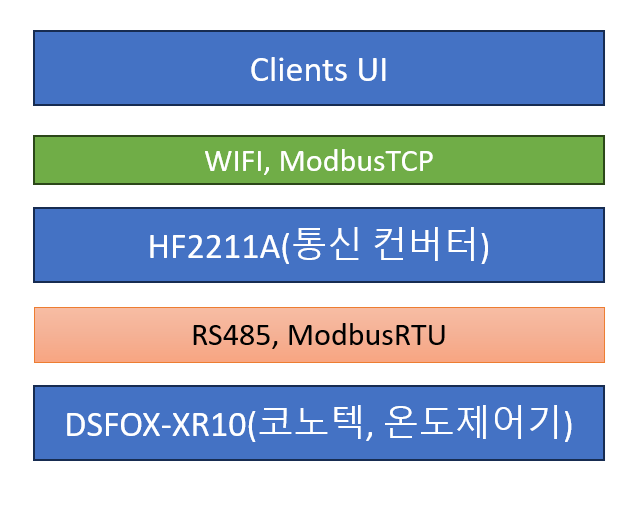
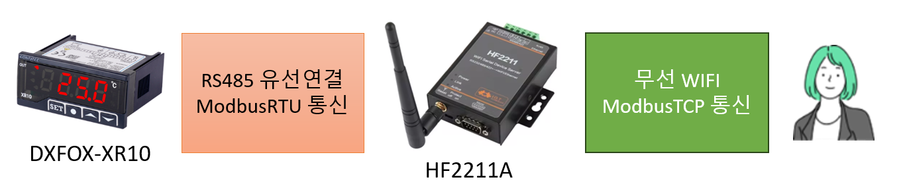

    

{: .align-center width="70%"}   

    

# MODBUS-TCP 통신으로 코노텍 온도조절기 제어하기  
> RS485 모드버스 통신으로 코노텍 온도조절기 제어하기  

    

## 개요
- 고객사에서 <mark>냉동창고 온도제어기를 실시간으로 조회, 제어 할 수 있는 솔루션</mark>을 요청하였음
- 시중에 판매되고있는 온도제어기 가운데, 성능과 가격을 비교하여 코노텍 온도제어기를 선택하였음

  

### 구성

{: .align-center width="70%"}   

- 코노텍 온도제어기 DXFOX-XR10는 RS485, Modbus RTU를 지원함
- 통신컨버터 HF2211A가 Modbus RTU를 Modbus TCP로 변환하여 무선와이파이 통신을 가능하게 함
- 온도제어기와 통신컨버터는 유선연결하고, 통신컨버터와 UI는 와이파이로 무선연결 함

{: .align-center width="95%"}   

  

### 준비
- 인터넷 구매로 온도제어기와 통신컨버터 구입
- 각각 매뉴얼 다운로드
- 각각 전원 연결

    

## 통신
### RS485 결선
- 시리얼 통신에서 자주 사용하는 통신 방식에는 RS232, RS422, RS485 등이 있음
- RS232는 1:1통신을 지원하지만, RS485는 N:N통신을 지원하여 약32개의 장치를 연결할 수 있음
- RS485의 연결방식은 전이중방식(4개 선 연결)과 반이중방식(2개 선 연결)이 있음
- 통신컨버터(HF2211A)는 전이중방식, 반이중방식을 지원하고, 온도제어기(DXFOX-XR10)는 반이중방식만 지원함
- 통신컨버터와 온도제어기의 RS485의 +, - 를 잘 보고, <mark>반이중방식</mark>으로 연결

  

### 온도제어기 프로토콜
- 온도제어기 통신 매뉴얼 참조하여 통신 프로토콜 분석  
- 필요한 기능은 두가지임  
> 기능 1. 현재 온도 읽어오기  
> 기능 2. 온도 설정 하기  
- 매뉴얼을 찾아보면 "현재온도"의 "읽기" 기능은 "Func 0x04 : Read Input Registers"기능의 "레지스터 30101", "주소 0064"라고 되어있음
- 매뉴얼을 찾아보면 "설정온도"의 "쓰기" 기능은 "Func 0x06 : Write Single Register"기능의 "레지스터 40003", "주소 0002"라고 되어있음
- `EasyModbusTCP.NET`을 활용하여 테스트

#### 이슈 1. "주소 0064"는 16진수
- "ILLEGAL DATA ADDRESS" 오류가 발생하는 경우 시작주소, 데이터 개수 범위가 맞지 않는 경우임
- 매뉴얼에 `주소 0064`라고 나온 것은 16진수로 표현된 것이어서, 10진수로 변환하면 100이 됨
- 데이터 요청시 10진수 100으로 요청하니 해결됨

#### 이슈 2. "레지스터 30101"는 시작주소
- "레지스터 30101"는 시작주소를 나타나내는데, 사용시 시작주소가 0부터 시작이면 100으로, 1부터 시작이면 101로 기입해야 함
- 나의 경우에는 시작주소가 0부터 시작되도록 코딩을 하였기 때문에 시작주소를 100으로 요청하였음

  

### 현재 온도 가져오기
#### 요청 프레임

| Function Code   | Start Address High  | Start Address Low | Data Length High  | Data Length Low   |
| :---------------| :------------------ | :-----------------| :-----------------| :-----------------|
| 0X04            | 0X00                | 0X64              | 0X00              | 0X01              |

- 현재온도를 읽어오는 것은 "Func 0x04 : Read Input Registers" 기능의 "주소 0064"에서 1byte의 데이터를 읽어오면 됨

 

#### 응답 프레임

| Function Code   | Data Length         | Data        High  | Data        Low   |
| :---------------| :------------------ | :-----------------| :-----------------|
| 0X04            | 0X02                | 0X01              | 0X12              |

- 응답프레임에서 0X01 0X12 이라는 16진수 값을 10진수로 변환하면 274임
- 온도조절기 설정이 Int로 되어있어서 정수로 나오는 것인데, 실재 현재온도는 27.4℃ 임

  

### 온도 설정하기
#### 요청 프레임 : 설정 온도를 1.2℃로 설정하기

| Function Code   | Start Address High  | Start Address Low | Data Length High  | Data Length Low   |
| :---------------| :------------------ | :-----------------| :-----------------| :-----------------|
| 0X06            | 0X00                | 0X02              | 0X00              | 0X0C              |

- 16진수 0X0C 는 10진수로 12임

 

#### 응답 프레임

| Function Code   | Start Address High  | Start Address Low | Data Length High  | Data Length Low   |
| :---------------| :------------------ | :-----------------| :-----------------| :-----------------|
| 0X06            | 0X00                | 0X02              | 0X00              | 0X0C              |

- 요청에 성공하면 요청프레임을 그대로 돌려받음

#### 요청 프레임 : 설정 온도를 -11.5℃로 설정하기

| Function Code   | Start Address High  | Start Address Low | Data Length High  | Data Length Low   |
| :---------------| :------------------ | :-----------------| :-----------------| :-----------------|
| 0X06            | 0X00                | 0X02              | 0XFF              | 0X8D              |

- 16진수 0XFF 0X8D는 10진수로 65421임
- 최대값 65536에서 -115이기 때문에 이렇게 표시하는 것 같음

 

#### 응답 프레임

| Function Code   | Start Address High  | Start Address Low | Data Length High  | Data Length Low   |
| :---------------| :------------------ | :-----------------| :-----------------| :-----------------|
| 0X06            | 0X00                | 0X02              | 0XFF              | 0X8D              |

- 요청에 성공하면 요청프레임을 그대로 돌려받음

    

## 후기
- 아직은 낯설지만, Modbus 프로토콜은 **전세계 표준**이기 때문에 익숙해지면 도움이 많이 될 것 같음
- ModbusRTU를 ModbusTCP로 바꿔주는 컨버터가 <mark>무선와이파이를 지원</mark>해서 매우 유용함
- 메모리 주소를 참조할 때 **16진수와 10진수**를 잘 변환해야하고, **메모리 주소가 0부터 시작인지 1부터 시작인지**도 잘 확인해야 함

    

## 참고자료
- [비톤 코노텍 온도조절기 전문몰](http://www.beecontrol.co.kr/shop/main/index.php)
- [HI-FLYING](http://www.hi-flying.com/hf2211a)
- [MODBUS-TCP란](http://comfilewiki.co.kr/ko/doku.php?id=tcpport:modbus-tcp_%ED%94%84%EB%A1%9C%ED%86%A0%EC%BD%9C%EC%9D%B4%EB%9E%80:index)

    

<h1>끝까지 읽어주셔서 감사합니다😉</h1>

    

