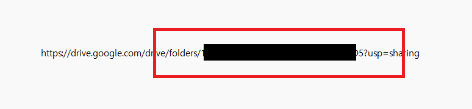
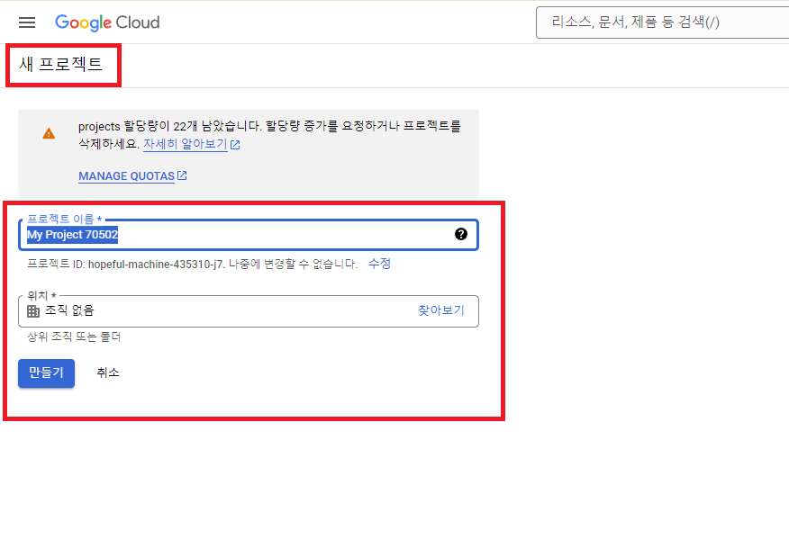
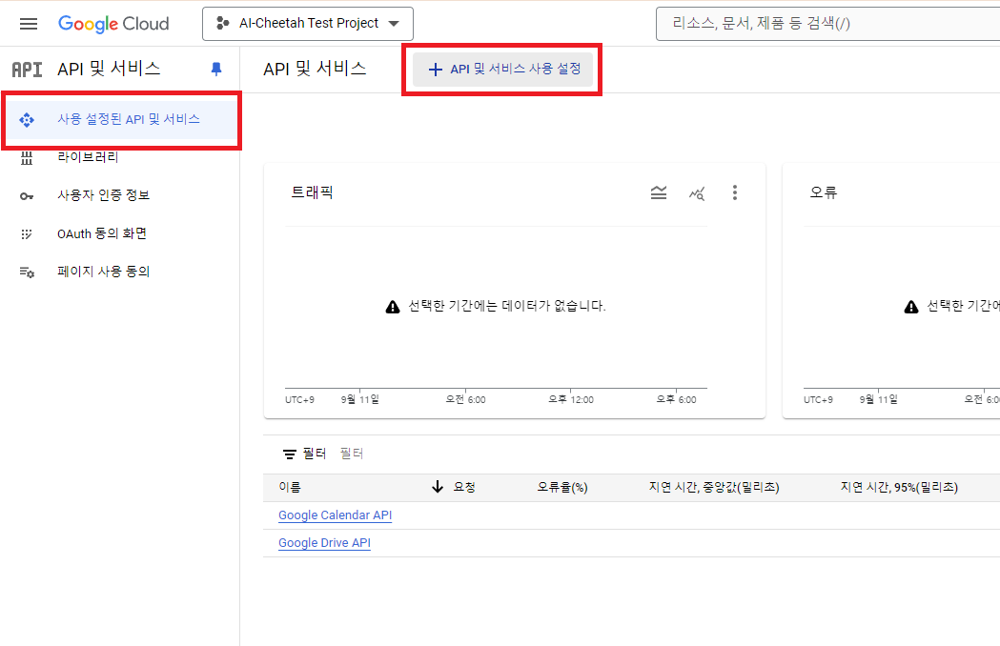
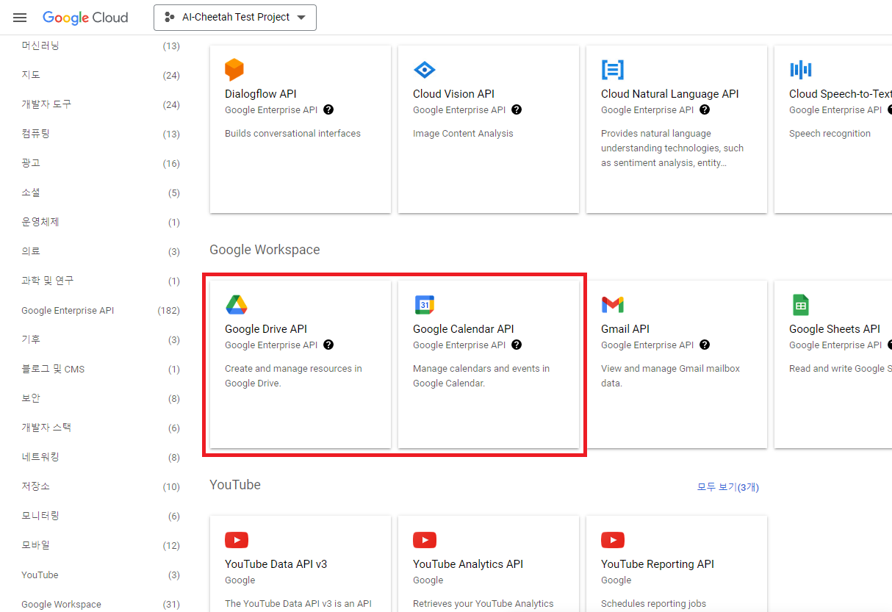
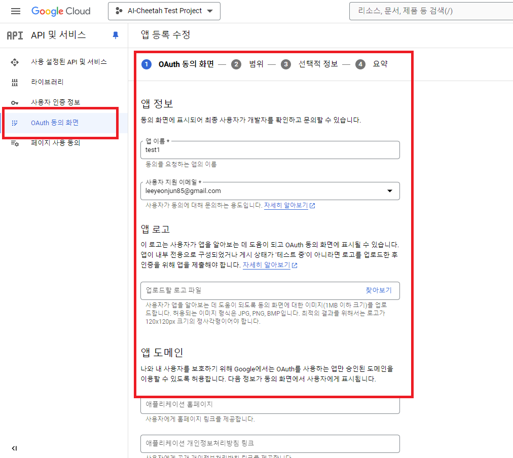
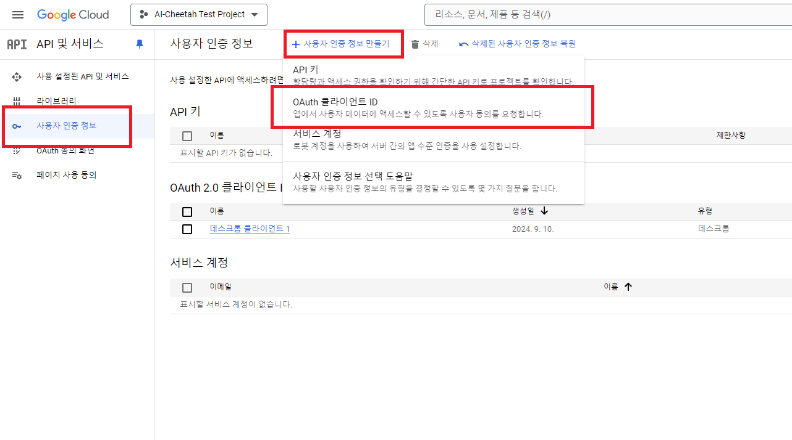
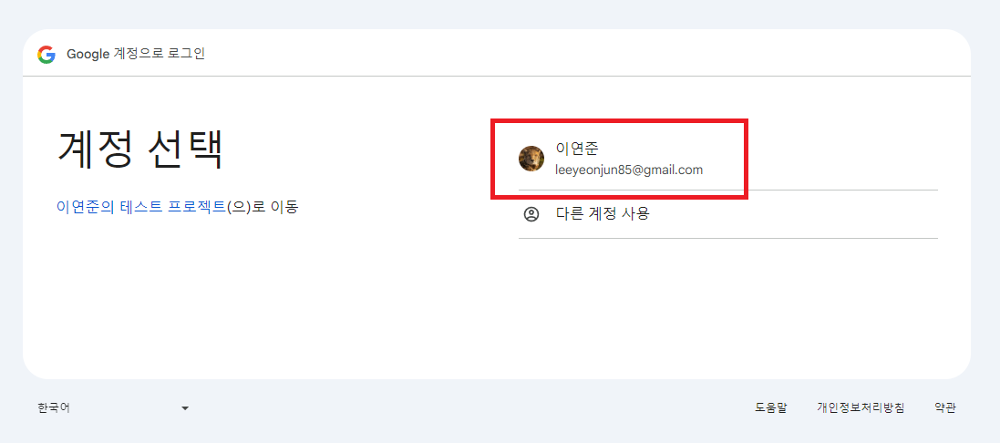

<br><br><br><br>


{: .align-center width="70%"}   


<br><br><br><br>


# Google API  
> 구글API 활용하여 구글 캘린더, 구글 드라이브 연동하기  


<br><br><br><br>


## 개요
- 고객사에서 회사에서 사용중인 MES에 <mark>구글 캘린더 기능을 통합</mark>하여 사용할 수 있도록 요청하였음
- **C#**에서 **구글 캘린더**를 불러오고, 새로운 이벤트를 생성하는 **테스트 프로그램**을 만든자
- 추가적으로, 구글 캘린더에 첨부파일을 추가하기 위하여 **구글 드라이브**도 함께 활용하자


<br><br> 


### 구성

{: .align-center width="80%"}   

- 사용자가 구글 캘린더를 조회, 추가, 삭제 할 수 있는 **테스트 UI 프로그램**은 간단하게 C# Winform(.NET 8.0) 으로 만들자
- C#으로 구글API를 사용하려면 `Google.Apis` 패키지가 필요
- 누겟으로 `Google.Apis.Calendar.v3`, `Google.Apis.Drive.v3`를 설치
- `캘린더 ID 저장` > `드라이브 폴더 ID 저장` > `구글 API 설정` > `테스트 UI 프로그램 작성`


<br><br><br><br>


## 준비
- 구글 캘린더에 이벤트가 등록될 때 **첨부파일은 구글 드라이브의 파일이 URL로 연동**되는 방식임
- 그래서 테스트에 사용할 **구글 캘린더**와 **구글 드라이브 폴더**를 만들자

### 캘린더 만들기
- 어떠한 캘린더에 이벤트를 등록할지, 캘린더를 특정하기 위한 캘린더의 ID를 얻자

- `새 캘린더 만들기`를 클릭하여 새로운 캘린더를 만들자

{: .align-center width="80%"} 

- 캘린더 설정 > 캘린더 통합 > <mark>캘린더 ID</mark> 를 저장

{: .align-center width="80%"} 


<br><br>


### 구글드라이브 폴더 만들기
- 캘린더에 이벤트를 등록할 때 추가할 첨부파일이 저장될 구글드라이브의 폴더 ID를 얻자

- 구글드라이브 > 새폴더 생성 > 공유 > <mark>링크복사</mark>
{: .align-center width="80%"} 

- 폴더ID는 `drive/folders/`와 `?usp=sharing` 사이의 문자들임

{: .align-center width="80%"}


<br><br><br><br>


## 구글 API 클라이언트 설정
- 구글에서 API를 사용하기 위하여 몇가지 설정이 필요함
1. 구글 클라우드 API 프로젝트 생성
2. API 사용 설정 `Google Calendar API`, `Google Drive API`
3. OAuth 동의화면 설정
4. OAuth 클라이언트ID 설정


### 구글 클라우드 API 프로젝트 생성
- 구글 클라우드 API를 만들자
- [구글 클라우드 API 대시보드 바로가기(https://console.cloud.google.com/apis)](https://console.cloud.google.com/apis)

{: .align-center width="80%"}


<br><br>


### API 사용 설정
- API 및 서비스 사용 설정
{: .align-center width="80%"}

- `Google Calendar API`, `Google Drive API` 사용 설정

{: .align-center width="80%"}


<br><br>


### OAuth 동의화면 설정

{: .align-center width="80%"}


<br><br>


### OAuth 클라이언트ID 설정
- `OAuth 클라이언트ID`를 생성하여 <mark>클라이언트 ID</mark>와 <mark>클라이언트 보안 비밀번호</mark>를 저장
- 나는 <mark>JSON 파일</mark>을 다운 받아서 사용할 것임

{: .align-center width="80%"}


<br><br><br><br>


## 테스트 UI 프로그램
- Visual Studio에서 Winform 프로젝트 생성(현시점 최신 .NET 8.0)
- 누겟에서 `Google.Apis.Calendar.v3`, `Google.Apis.Drive.v3` 설치

### 로그인 구현
- 구글 API 로그인은 `OAuth 2.0`을 사용
- `OAuth 2.0`은 `Google.Apis.Calendar.v3` 패키지에 포함된 `Google.Apis.Auth.OAuth2`를 사용함
- `OAuth 2.0`에 대한 자세한 내용은 [https://cloud.google.com/docs/authentication](https://cloud.google.com/docs/authentication) 참조

#### Get Credential

```cs
private UserCredential GetCredential(string jsonPath, string userName = "AI Cheetah")
{
    try
    {
        // OAuth 2.0에 필요한 비밀키는 json에 포함되어있음
        // json은 "https://console.cloud.google.com/apis"에서 다운로드
        using var stream = new FileStream(jsonPath, FileMode.Open, FileAccess.Read);
        UserCredential CRED = GoogleWebAuthorizationBroker.AuthorizeAsync(
            GoogleClientSecrets.Load(stream).Secrets,
            [
                CalendarService.Scope.Calendar,
            DriveService.Scope.Drive
            ],
            userName,
            CancellationToken.None).Result;

        return CRED;
    }
    catch (Exception exce)
    {
        Console.WriteLine(exce.Message);
        throw;
    }
}
```

#### Get Calendar Service
- 구글 캘린더 관련 명령에 필요

```cs
private CalendarService GetCalendarService(UserCredential credentail, string applicationName)
{
    try
    {
        var SERV = new CalendarService(new BaseClientService.Initializer
        {
            HttpClientInitializer = credentail,
            ApplicationName = applicationName,
        });

        return SERV;
    }
    catch (Exception exce)
    {
        Console.WriteLine(exce.Message);
        throw;
    }
}
```

#### Get Drive Service
- 구글 드라이브 관련 명령에 필요

```cs
private DriveService GetDriveService(UserCredential credentail, string applicationName)
{
    try
    {
        var SERV = new DriveService(new BaseClientService.Initializer
        {
            HttpClientInitializer = credentail,
            ApplicationName = applicationName,
        });

        return SERV;
    }
    catch (Exception exce)
    {
        Console.WriteLine(exce.Message);
        throw;
    }
}
```

- 위의 코드를 구현하여 로그인하면 다음과 같은 권한 확인 페이지가 나옴

{: .align-center width="80%"}


### 이벤트 삽입
#### Insert Event
- 첨부파일이 있는 경우, 구글 드라이브에 첨부파일을 먼저 업로드하고, 업로드 된 구글 드라이브의 파일 URL을 캘린더에 참조함

```cs
public Event InsertEvent(string calendarID, string title, string description, string strDate, string filePath, string parentPath = "", string conctentType = "image/jpeg", string colorID = "7")
{
    try
    {
        // 로컬변수 선언
        var listAttachments = new List<EventAttachment>();

        // 첨부파일이 있으면 드라이브에 먼저 첨부 파일을 업로드
        if (string.IsNullOrEmpty(filePath))
        {
            // 구글 드라이브에 파일 업로드
            Google.Apis.Drive.v3.Data.File fileInfo = InsertFile(parentPath, filePath, conctentType);

            listAttachments.Add(new EventAttachment()
            {
                FileId = fileInfo.Id,
                FileUrl = fileInfo.WebViewLink,
                IconLink = fileInfo.IconLink,
                MimeType = fileInfo.MimeType,
                Title = fileInfo.Name,
            });

        }

        // 캘린더에 이벤트 입력
        Event newEvent = new Event()
        {
            Summary = title,
            Description = description,
            ColorId = colorID,
            Start = new EventDateTime()
            {
                Date = strDate,
                TimeZone = "Asia/Seoul",
            },
            End = new EventDateTime()
            {
                Date = strDate,
                TimeZone = "Asia/Seoul",
            }
        };

        // 첨부파일이 있었으면, 첨부파일 정보 추가
        if (string.IsNullOrEmpty(filePath))
            newEvent.Attachments = listAttachments;

        // 이벤트 입력자 생성
        EventsResource.InsertRequest requester = CLDR.Events.Insert(newEvent, calendarID);

        // 첨부파일이 있으면, 첨부파일 정보 활성화
        if (string.IsNullOrEmpty(filePath))
            requester.SupportsAttachments = true;

        // 이벤트 입력 수행
        Event createdEvent = requester.Execute();

        return createdEvent;
    }
    catch (Exception exce)
    {
        Console.WriteLine(exce.Message);
        throw;
    }
}
```

#### Insert File

```cs
private Google.Apis.Drive.v3.Data.File InsertFile(string parentPath, string filePath, string conctentType)
{
    try
    {
        FilesResource.CreateMediaUpload uploader;
        IUploadProgress progress;
        var fileMetadata = new Google.Apis.Drive.v3.Data.File
        {
            Name = Path.GetFileName(filePath),
            Parents = [parentPath],
        };

        using (var stream = new FileStream(filePath, FileMode.Open))
        {
            uploader = DRIV.Files.Create(fileMetadata, stream, conctentType);
            uploader.Fields = "id,name,webViewLink,webContentLink,thumbnailLink,mimeType,iconLink";
            progress = uploader.Upload();
        }

        if (progress.Status != UploadStatus.Completed)
        {
            return null;
        }

        Google.Apis.Drive.v3.Data.File fileInfo = uploader.ResponseBody;

        return fileInfo;
    }
    catch (Exception exce)
    {
        Console.WriteLine(exce.Message);
        return null;
    }
}
```

- 수정과 삭제도 비슷한 방식으로 구현함


<br><br><br><br>


## 후기
- 구글에서 **다양한 API**를 제공하는데, 잘 활용하면 다양하게 적용할 수 있을 것 같음
- 업무 프로그램(ERP, MES)과 구글API를 **연동**하면 편리하게 이용할 수 있음
- 요즘 API는 파이썬이 대세인것 같음...


<br><br><br><br>


## 참고자료
- [Google Cloud](https://console.cloud.google.com/)


<br><br><br><br>
<center>
<h1>끝까지 읽어주셔서 감사합니다😉</h1>
</center>
<br><br><br><br>


