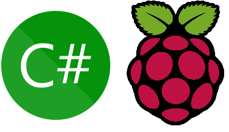

<br><br><br><br>


{: .align-center width="70%"}

<br><br><br><br>


# RaspberryPi by C# .NET  
> C# .NET으로 라즈베리파이 사용하기  
> C# `Hello World` 콘솔 프로그램을 라즈베리파이에서 실행하기  


<br><br><br><br>


## 개요
- 각종 센서 데이터를 수집하고 데이터베이스로 전송할 때 미니컴퓨터를 사용하곤 했는데, 가성비가 좋은 라즈베리를 사용해보자  
- 라즈베리에서 .NET 프로젝트를 실행하기 위한 방법을 알아보고, 간단히 `Hello World` 프로젝트를 실행해 보자  
- 자체 포함 앱 배포(Self Contained) 방식과 프레임워크 종속 앱 배포(Framework Dependent) 방식을 비교하자  


### 테스트 프로젝트 `Hello World`  
- Visual Studio에서 콘솔 프로젝트 생성  
- .NET 7.0으로 생성  
  - 현 시점에서 **리눅스 지원 최신 버전이 .NET 7.0**  
- `Program.cs` 파일 수정  
```cs
static void Main(string[] args)
{
    Console.WriteLine($"Hello, World!");

    foreach (var arg in args)
    {
        Console.WriteLine($"Hello, {arg}!");
    }
}
```


### 자체 포함 앱 배포(Self Contained)  
- <mark>라즈베리에 .NET SDK 설치 필요 없음</mark>  
- 게시 파일에 .NET SDK를 포함하는 방식이어서 <mark>게시된 파일이 큼</mark>  
- 가장 기초적인 `Hellow World` 프로젝트가 무려 70mb가 넘음!  

#### Visual Studio에서 배포하는 방법  
- 게시 프로필 요약에서 편집을 선택하고 설정 탭을 선택  
- 배포 모드 > 자체 포함  
- 대상 런타임 > linux-arm64  

#### CLI로 배포하는 방법  
- 인수 `--runtime linux-arm64`, `--self-contained` 사용  
```bash
dotnet publish --runtime linux-arm64 --self-contained
```

#### 배포한 프로젝트를 파즈베리파이로 복사  
- 파일질라를 이용하여 복사해도 되지만, 여기서는 CLI를 이용하여 복사하였음  
```bash
scp -P 22 -r `
    D:/게시된폴더명/publish/ `
    leeyeonjun-pi@192.168.0.123:/home/leeyeonjun-pi/publish/
```

#### 라즈베리에서 테스트  
- 라즈베리에 SSH접속하여 테스트를 수행하자  
```bash
# 라즈베리에 SSH접속
ssh leeyeonjun@192.168.0.123 -p 22
# 폴더 이동 / 실행 권한 부여 / 실행
cd ~/publish && chmod +x RaspberryTest && ./RaspberryTest 연준 채은
```
- Result  
```cmd
Hello, World!
Hello, 연준!
Hello, 채은!
```


### 프레임워크 종속 앱 배포(Framework Dependent)  
- <mark>라즈베리에 .NET SDK 설치해야 함</mark>  
- 게시 파일에 프로젝트 DLL만 포함되고, .NET SDK는 라즈베리에 직접 설치하기 때문에, <mark>게시파일이 작음</mark>  
- 게시된 `Hellow World` 프로젝트가 500kb도 안됨  

#### 라즈베리에 .NET SDK 설치  
- 라즈베리에 최신 버전의 .NET SDK를 설치하자
```bash
# 라즈베리에 SSH접속
ssh leeyeonjun@192.168.0.123 -p 22
# .NET SDK 최신버전 설치
curl -sSL https://dot.net/v1/dotnet-install.sh | bash /dev/stdin --channel STS
# 환경변수 추가
echo 'export DOTNET_ROOT=$HOME/.dotnet' >> ~/.bashrc
echo 'export PATH=$PATH:$HOME/.dotnet' >> ~/.bashrc
source ~/.bashrc
# 설치된 .NET SDK 버전 확인
dotnet --version
# 7.0.410
```

#### Visual Studio에서 배포하는 방법  
- 게시 프로필 요약에서 편집을 선택하고 설정 탭을 선택  
- 배포 모드 > 프레임워크 종속  
- 대상 런타임 > 이식 가능  

#### CLI로 배포하는 방법  
- 추가 인수 필요없음  
```bash
dotnet publish
```

#### 배포한 프로젝트를 파즈베리파이로 복사  
- 윈도우에 내장된 scp(secure copy)를 사용하여 로컬에 게시한 프로젝트를 라즈베리로 전송하자  
```bash
scp -P 22 -r `
    D:/게시된폴더명/publish/ `
    leeyeonjun-pi@192.168.0.123:/home/leeyeonjun-pi/publish/
```

### 라즈베리에서 테스트  
- 로컬에서 빌드한 dll파일을 직접 실행  
```bash
# 폴더 이동 / 실행
cd ~/publish && dotnet RaspberryTest.dll 연준 채은
```

- Result  
```cmd
Hello, World!
Hello, 연준!
Hello, 채은!
```


## 후기  
- 회사에서 주로 C#을 이용하여 개발하기 때문에 <mark>회사에서 사용하는 C# 라이브러리를 활용</mark>할 수 있을것 같음
- 라즈베리에서 C, Python등으로 테스트하던 각종 센서(온습도, 초음파 등)를 **C#으로 테스트** 해보자


<br><br><br><br>


## 참고자료
- [ARM 단일 보드 컴퓨터에 .NET 앱 배포](https://learn.microsoft.com/ko-kr/dotnet/iot/deployment)


<br><br><br><br>
<center>
<h1>끝까지 읽어주셔서 감사합니다😉</h1>
</center>
<br><br><br><br>


