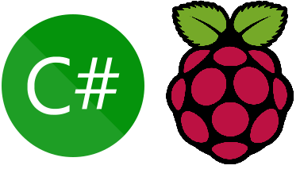
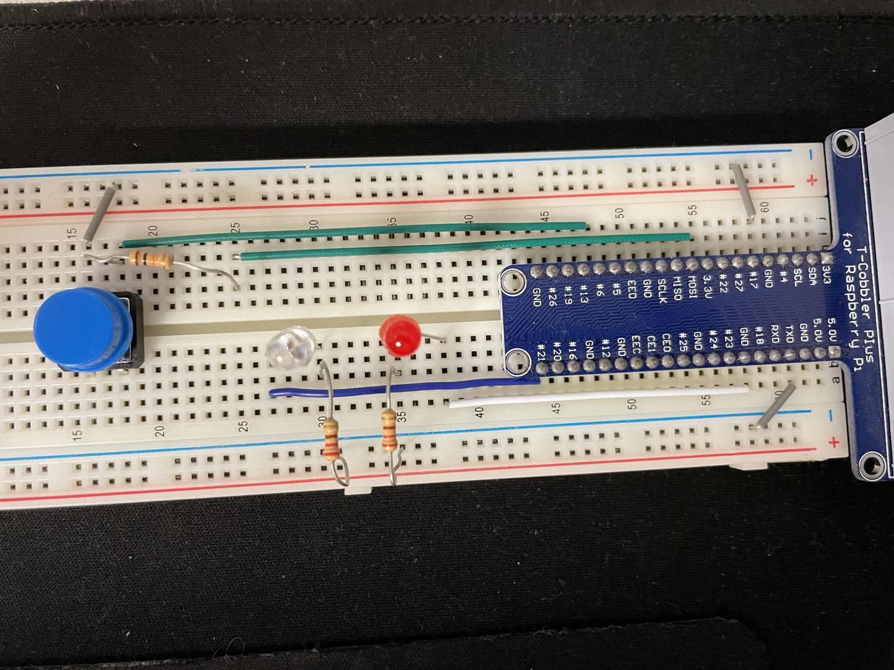

<br><br><br><br>


{: .align-center width="70%"}

<br><br><br><br>


# PinMode Input & Output
> C# .NET, 라즈베리파이에서 핀입력과 핀출력을 사용하기
> 핀출력으로 LED, 핀입력으로 Button 사용하기  


<br><br><br><br>


## 개요
- 라즈베리파이의 GPIO핀을 입력모드와 출력모드로 사용해보자  
- Button을 누르는 입력 신호를 받아서, LED를 출력하자


### 회로 구성

{: .align-center width="80%"}

- 빨간LED : #18, 220ohm, 작동중 표시용
- 하얀LED : #21, 220ohm, 버튼 누를 때 점등용
- 버튼 : #6, 10Kohm, 플로팅을 방지하기 위하여 풀업저항 연결


### 테스트 프로젝트 `Button-LED`  
- Visual Studio에서 콘솔 프로젝트 생성  
- .NET 7.0으로 생성  
  - 현 시점에서 **리눅스 지원 최신 버전이 .NET 7.0**  
- GPIO핀을 사용하기 위하여 패키지 설치
  - 패키지 관리자아에서 `Install-Package System.Device.Gpio`
  - 또는 누겟에서 패키지 설치
- `Program.cs` 파일 수정  

```cs
static void Main(string[] args)
{
    try
    {
        Console.WriteLine("Hello, World!");

        // 핀 번호를 인자로 받는 경우 핀 번호 할당
        if (args.Length > 0)
            pinLED_Red = Convert.ToInt32(args[0]);
        if (args.Length > 1)
            pinLED_White = Convert.ToInt32(args[1]);
        if (args.Length > 2)
            pinBTN = Convert.ToInt32(args[2]);

        // 핀 설정
        gpoLED_Red = controller.OpenPin(pinLED_Red, PinMode.Output);
        gpoLED_White = controller.OpenPin(pinLED_White, PinMode.Output);
        gpoBTN = controller.OpenPin(pinBTN, PinMode.InputPullUp);

        // 흰색LED는 불이 꺼지도록 한다.
        gpoLED_White.Write(PinValue.Low);

        // 버튼핀의 값이 바꼈을 때의 이벤트
        gpoBTN.ValueChanged += gpio​Pin_ValueChanged;

        // 작동상태를 표시하기 위하여 빨간LED는 깜빡인다.
        while (true)
        {
            gpoLED_Red.Write(((ledOn) ? PinValue.High : PinValue.Low));
            Thread.Sleep(500);
            ledOn = !ledOn;
        }
    }
    catch (Exception e)
    {
        Console.WriteLine(e);
        Console.WriteLine(e.Message);
        throw;
    }
}
```

- LED로 연결된 핀은 `PinMode.Output`으로 설정
- Button으로 연결된 핀은 `PinMode.InputPullUp`으로 설정
- 버튼핀의 값이 바꼈을 때의 이벤트

```cs
private static void gpioPin_ValueChanged(object sender, PinValueChangedEventArgs args)
{
    switch (args.ChangeType)
    {
        case PinEventTypes.None:
            Console.WriteLine("Type is None");
            break;
        case PinEventTypes.Rising:
            Console.WriteLine("Type is Rising");
            gpoLED_White?.Write(PinValue.Low);
            break;
        case PinEventTypes.Falling:
            Console.WriteLine("Type is Falling");
            gpoLED_White?.Write(PinValue.High);
            break;
        default:
            break;
    }
}
```

- 버튼이 Rising일 때(▲), LED를 Low로(전원 미인가)
- 버튼이 Falling일 때(▼), LED를 High로(전원 인가)


### 라즈베리파이에 배포 후 테스트 실행
- 라즈베리파이에 C# .NET 배포하는 방법은 이전 글 [RaspberryPi by C# .NET](https://leeyeonjun85.github.io/dev%20log/RaspberryPi-by-C-.NET/) 참조

{: .align-center width="80%"}

```cmd
Hello, World!
Type is Rising
Type is Falling
Type is Rising
Type is Falling
```


## 후기  
- 처음 시도했을 때는 풀업저항 없이 연결했더니 플로팅상태가 발생하여, `Type is Rising`, `Type is Falling`이 무한반복하는 상태가 됬음
- 그래서 플로팅에 대하여 공부하고, <mark>풀업저항과 풀다운저항을 사용해야 플로팅을 방지</mark>할 수 있음을 알게 됨📌
  - 전기적인 특성🔍 때문에 풀업방식이 자주 사용됨
- 풀업저항을 연결한 후 플로팅 상태 없이 정상 작동함
- 풀다운저항도 시도해봐야겠음✏️
- LED에 연결된 저항을 **100ohm, 220ohm, 330ohm 모두 테스트해 보았는데 정상작동**함
- 저항이 낮으면 LED가 약간 더 밝아지는 것 같음❓


<br><br><br><br>


## 참고자료
- [ARM 단일 보드 컴퓨터에 .NET 앱 배포](https://learn.microsoft.com/ko-kr/dotnet/iot/deployment)


<br><br><br><br>
<center>
<h1>끝까지 읽어주셔서 감사합니다😉</h1>
</center>
<br><br><br><br>


