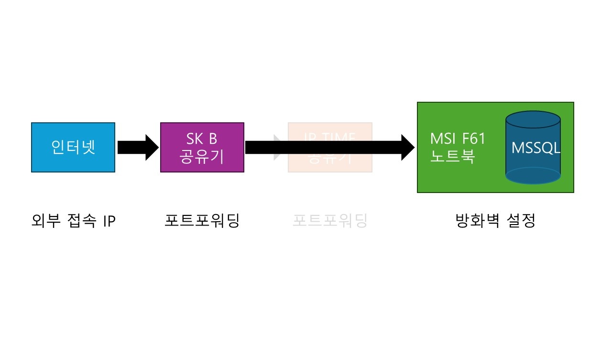

    

{: .align-center width="70%"}   

    

# 정보처리기사 시험준비  
> 정보처리시사 시험접수  
> 시험 과목  
> 주요항목  

    

## 시작

- 본격 개발자로 살아가기 위하여 정보처리기사 자격증을 취득하기로 함
- 돈이 없는 관계로 

<table style="width : 80%; margin : auto;">
  <tbody style="width : 100%; display : table;">
    <tr style="border-bottom : 3px solid gray; background-color : #88bb88;">
      <th style="width : 40%; text-align : center;">날짜</th>
      <th style="width : 60%; text-align : center;">내용</th>
    </tr>
    <tr>
      <td style="width : 40%; text-align : center;">5/15 (월)</td>
      <td> • 프로젝트 START🚀   • 팀 첫만남 : 팀장선출   • 주제선정 : AI 소프트웨어 업그레이드 프로젝트   • GitHub 환경 구축 </td>
    </tr>
    <tr>
      <td style="width : 40%; text-align : center;">5/16 (화)</td>
      <td> • 레거시코드 분석   • EDA   • 웹페이지 초안 작성 </td>
    </tr>
    <tr>
      <td style="width : 40%; text-align : center;">5/17 (수)</td>
      <td> • 레거시코드 분석   • EDA   • 오피스 아워 </td>
    </tr>
    <tr>
      <td style="width : 40%; text-align : center;">5/18 (목)</td>
      <td> • 레거시코드 분석   • EDA   • DL Modeling   • 팀커피챗 </td>
    </tr>
    <tr>
      <td style="width : 40%; text-align : center;">5/19 (금)</td>
      <td> • EDA   • DL Modeling </td>
    </tr>
    <tr>
      <td style="width : 40%; text-align : center;">5/20 (토)</td>
      <td> • DL Modeling </td>
    </tr>
    <tr>
      <td style="width : 40%; text-align : center;">5/21 (일)</td>
      <td> • DL Modeling </td>
    </tr>
    <tr>
      <td style="width : 40%; text-align : center;">5/22 (월)</td>
      <td> • DL Modeling   • 모델1 완성   • PPT 초안작성 </td>
    </tr>
    <tr>
      <td style="width : 40%; text-align : center;">5/23 (화)</td>
      <td> • DL Modeling   • 모델2 완성   • 오피스 아워 </td>
    </tr>
    <tr>
      <td style="width : 40%; text-align : center;">5/24 (수)</td>
      <td> • DL Modeling   • 모델3 완성   • 발표자료 작성 </td>
    </tr>
    <tr>
      <td style="width : 40%; text-align : center;">5/25 (목)</td>
      <td> • 발표자료 녹화   • 최종 제출🚩</td>
    </tr>
    <tr>
      <td style="width : 40%; text-align : center;">5/26 (금)</td>
      <td> • 피드백   • 프로젝트 수정 및 보완</td>
    </tr>
  </tbody>
</table>

  

## 1차 시도
### 구성 계획
- 1차에선 실패했다...😫
- 기록을 위하여 1차 시도 과정을 남긴다

{: .align-center width="90%"}  

 

### MSI 노트북에 MSSQL 설치하기
- 대부분의 DB 서비스 제공업체는 개발자들을 위하여 로컬환경에 DB를 설치할 수 있는 서비스를 제공함
  - MSSQL Server Developer Edition, Oracle XE, MySQL Community 등
- 이번에는 MSSQL Server 2022 Developer Edition을 설치하기로 함
  - [공식 MS Server 페이지](https://www.microsoft.com/ko-kr/sql-server/sql-server-downloads)에서 개발자를 위한 Developer Edition 을 다운로드하여 설치
- Basic으로 선택하여 기본설정으로 설치
- SSMS(SQL Server Management Studio) 설치 : Install SSMS
- SSMS 에서 Windows Authentication 으로 접속
- MSSQL에서 사용할 테스트용 DB 생성
- 사용자 생성하여 DB에 연결

 

### MSI 노트북에서 방화벽 설정
- MSSQL 외부접속을 위한 인바운드 규칙 추가

 

### SK 브로드밴드 공유기
- 외부접속 IP 확인
- IP Time MAC 을 IP 고정
- IP Time 으로 연결되는 고정 IP로 포트포워딩

 

### IP TIME 공유기
- MSI 노트북 MAC 을 IP 고정
- MSI 노트북으로 연결되는 고정 IP로 포트포워딩

 

### 접속 테스트
- 외부접속 IP로 MSSQL 접속테스트 결과 실패...😫

  

## 2차 시도
### 구성 계획
- IP TIME 공유기를 거치지 않고, SK 브로드밴드 공유기 포트와 노트북을 직접연결하였다.

{: .align-center width="90%"} 

 

### MSI 노트북 설정 바꾸지 않음
- 중간에 IP TIME 공유기만 빠지기 때문에 MSI 노트북은 그대로 사용함

 

### SK 브로드밴드 공유기
- MSI 노트북 MAC을 IP 고정
- MSI 노트북으로 연결되는 고정 IP로 포트포워딩

 

### 접속 테스트
- 접속 성공🎊🎉
- 각종 SQL 테스트 결과 문제 없음👍

  

## 후기
- 중간에 IP TIME 공유기 끼워서 사용할 수 있는 방법 피드백 부탁드립니다👏
- Oracle XE도 설치해 보았는데, 다음에 포스팅해야 겠다~😊

    

<h1>끝까지 읽어주셔서 감사합니다😉</h1>

    

