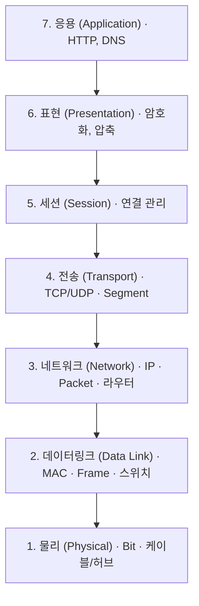

> **한줄 정의**: OSI 7계층은 ISO가 제정한 **개방형 시스템 상호접속(Open Systems Interconnection) 참조모델**로, 이기종 시스템 간 통신 기능을 **7개 계층**으로 나누어 표준화한 개념 모델이다.
> **두문자 (1→7계층)**: **물·데·네·전·세·표·응** (물리-데이터링크-네트워크-전송-세션-표현-응용)

 

# 1. 개요

## 정의
- ISO(국제표준화기구)가 제정한 통신 참조모델 (ISO/IEC 7498-1)
- 네트워크 통신 과정을 **7개의 독립적 계층**으로 분할하여, 각 계층이 하위 계층의 서비스를 이용해 상위 계층에 서비스를 제공

## 등장 배경 / 필요성
- **이기종 시스템 간 상호운용성** 확보 — 서로 다른 제조사·OS 장비 간 통신 표준 필요
- **계층화(Layering)의 이점** — 기능 모듈화로 특정 계층 변경 시 타 계층 영향 최소화, 개발·유지보수·장애 진단 용이
- 네트워크 기술 발전을 위한 **공통 표준 기반** 마련

 

# 2. 개념도

 

# 3. 계층별 기능

| 계층 | 이름 | 핵심 기능 | 데이터 단위(PDU) | 대표 프로토콜 / 장비 |
|:---:|---|---|:---:|---|
| 7 | 응용(Application) | 사용자·응용 서비스 인터페이스 | Data | HTTP, FTP, SMTP, DNS |
| 6 | 표현(Presentation) | 데이터 표현·암호화·압축 | Data | TLS/SSL, JPEG, ASCII |
| 5 | 세션(Session) | 세션 연결·유지·동기화 | Data | RPC, NetBIOS |
| 4 | 전송(Transport) | 종단 간 신뢰성, 흐름·오류 제어 | Segment | TCP, UDP |
| 3 | 네트워크(Network) | 논리주소(IP), 경로설정(라우팅) | Packet | IP, ICMP / 라우터 |
| 2 | 데이터링크(Data Link) | 인접 노드 전송, 물리주소(MAC), 오류검출 | Frame | Ethernet, PPP / 스위치 |
| 1 | 물리(Physical) | 비트 단위 전기·광 신호 전송 | Bit | 케이블, 허브, 리피터 |

- **캡슐화(Encapsulation)**: 송신 시 상위 계층 데이터에 각 계층이 헤더를 덧붙여 하위로 전달하고, 수신 측은 역순으로 역캡슐화한다.

 

# 4. OSI vs TCP/IP 비교

| 구분 | OSI 7계층 | TCP/IP 4계층 |
|---|---|---|
| 성격 | 개념적 **참조모델** | 실제 구현·인터넷 표준 |
| 계층 수 | 7 | 4 |
| 상위 | 응용 / 표현 / 세션 | 응용(Application) |
| 전송 | 전송 | 전송(Transport) |
| 네트워크 | 네트워크 | 인터넷(Internet) |
| 하위 | 데이터링크 / 물리 | 네트워크 액세스(Network Access) |
| 활용 | 교육·장애 진단 기준 | 실제 통신에 사용 |

 

# 5. 활용 사례 / 고려사항
- **계층별 보안 대응**: L7 WAF, L3 IPSec, L2 포트 보안 등 — 공격·방어를 계층 관점으로 분석
- **장애 진단**: 물리 계층부터 상위로 점검(Bottom-up)하면 원인을 계층 단위로 격리 가능
- 실무 통신은 TCP/IP로 동작하지만, OSI는 **공통 언어·참조 기준**으로 여전히 유효

 

# 6. 참고자료
- ISO/IEC 7498-1, *Information technology — Open Systems Interconnection — Basic Reference Model*
