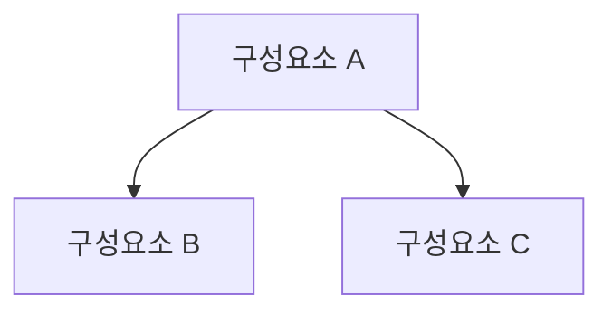

---
# ┌─────────────────────────────────────────────────────────────────┐
# │ 사용법: 이 파일을 _posts/ 로 복사 → 파일명 `YYYY-MM-DD-개념명.md` │
# │  categories 는 아래 20개 슬러그 중 하나만 (한글 아닌 영문!)         │
# │  sw-eng · pm · itsm · database · network · os · security · cloud  │
# │  devops · architecture · ai-bigdata · isp-ea · governance · mis   │
# │  audit · telecom · quality · law · ict-trend · pe-common          │
# └─────────────────────────────────────────────────────────────────┘
title: "개념명 (영문 표기)"
excerpt: "한 줄 요약 — 답안 첫 문장으로 쓸 정의"
categories:
  - security          # ← 도메인 슬러그 1개
tags:
  - PEIM
  - 보안              # ← 중간그룹/교차주제 (예: 인증, 암호, 네트워크보안)
use_math: true
toc: true
toc_label: "목차"
toc_sticky: true
last_modified_at: 2026-01-01
---

> **한줄 정의**: (암기용 핵심 정의 1~2문장)
> **두문자/암기**: (예: 기·무·가 = 기밀성·무결성·가용성)

 

# 1. 개요

## 정의
-

## 등장 배경 / 필요성
-

 

# 2. 개념도

 

# 3. 구성 요소 / 특징

| 구분 | 항목 | 설명 |
|------|------|------|
|      |      |      |

 

# 4. 장단점 / 비교

| 구분 | 내용 |
|------|------|
| 장점 |      |
| 단점 |      |

 

# 5. 활용 사례 / 고려사항
-

 

# 6. 참고자료
-
